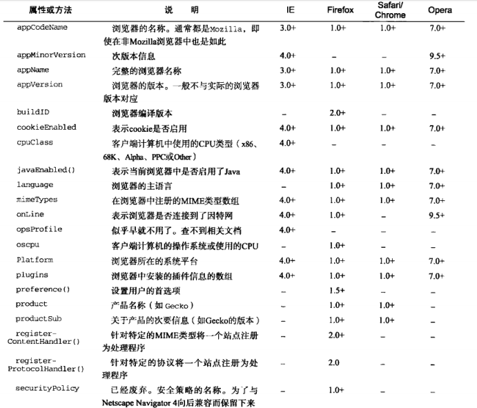
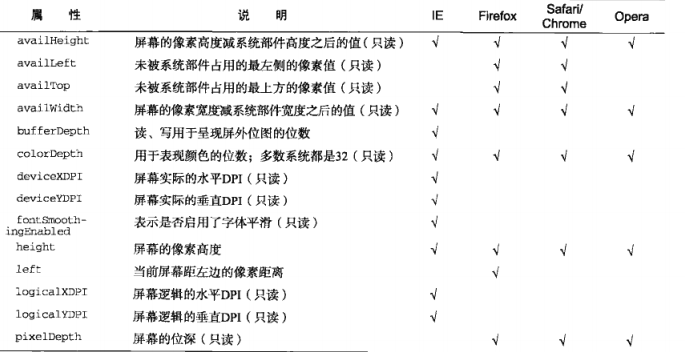
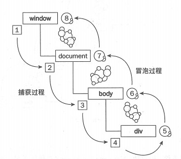

# 课程目标

- 浏览器内置JS对象详解
- 浏览器事件模型详解
- 浏览器请求相关内容详解

# 知识要点

## 常见浏览器 JS 对象 常见 API 及用法

源文档：https://segmentfault.com/a/1190000014212576

### 什么是浏览器对象模型

BOM ：Browser Object Model（浏览器对象模型）,浏览器模型提供了独立于内容的、可以与浏览器窗口进行滑动的对象结构，就是浏览器提供的 API
其主要对象有：
1. window 对象——BOM 的核心，是 js 访问浏览器的接口，也是 ES 规定的 Global 对象
2. location 对象：提供当前窗口中的加载的文档有关的信息和一些导航功能。既是 window 对象属 性，也是 document 的对象属性
3. navigation 对象：获取浏览器的系统信息
4. screen 对象：用来表示浏览器窗口外部的显示器的信息等
5. history 对象：保存用户上网的历史信息

### Window 对象

windows 对象是整个浏览器对象模型的核心，其扮演着既是接口又是全局对象的角色

| 属性            | 说明                                                         |
| --------------- | ------------------------------------------------------------ |
| `alert()`       | 系统警告对话框，接收字符串参数并显示                         |
| `confirm()`     | 系统确认对话框，可提供确认或取消两种事件                     |
| `prompt()`      | 提示对话框，可对用户展示确认、取消事件外，还可提供文本域     |
| `open()`        | 可导航至特定的 url，又可打开一个新的浏览器窗口`window.open(要加载的url, 窗口目标, 一个特定字符串, 一个新页面是否取代浏览器历史记录中当前加载页面的布尔值)` |
| `onerror()`     | 事件处理程序，当未捕获的异常传播到调用栈上时就会调用它，并把错误消息输出到浏览器的 JavaScript 控制上。`window.onerror(描述错误的一条消息, 字符串--存放引发错误的JavaScript代码所在的文档url, 文档中发生错误的行数)` |
| `setTimeout()`  | 超时调用——在指定的时间过后执行代码`window.setTimeout(function(){...}, 毫秒)` |
| `setInterval()` | 间歇调用——每隔指定的时间就执行一次`window.setInterval(function(){...}, 毫秒)` |

- 窗口位置

  | 属性          | 说明                                   | 兼容性                   |
  | ------------- | -------------------------------------- | ------------------------ |
  | `screenLeft`  | 窗口相对于屏幕`左边`的位置             | 适用于IE、Safari、Chrome |
  | `screenTop`   | 窗口相对于屏幕`上边`的位置             | 适用于IE、Safari、Chrome |
  | `screenX`     | 窗口相对于屏幕`左边`的位置             | 适用于Firefox            |
  | `screenY`     | 窗口相对于屏幕`上边`的位置             | 适用于Firefox            |
  | `moveBy(x,y)` | 接收的是在水平和垂直方向上移动的像素数 | 全兼容                   |
  | `moveTo(x,y)` | 接收的是新位置的x和y坐标值             | 全兼容                   |

- 窗口大小

  | 属性                       | 说明                                                         |
  | -------------------------- | ------------------------------------------------------------ |
  | `innerWidth` `innerHeight` | **IE9+、Safari、Firefox、Opera:** 该容器中页面视图区的大小 **Chrome:** 返回视口大小 **移动设备：** 返回可见视口（即屏幕上可见页面区域的大小） **移动IE浏览器：** 不支持该属性,当移动IE浏览器将布局视口的信息保存至`document.body.clientWidth`与`document.body.clientHeight`中 |
  | `outerWidth` `outerHeight` | **IE9+、Safari、Firefox:** 返回浏览器窗口本身的尺寸 **Opera:** 返回页面视图容器的大小 **Chrome:** 返回视口大小 |
  | `resizeTo(width, height)`  | 接收浏览器窗口的新宽度与新高度                               |
  | `resizeBy(width, height)`  | 接收新窗口与原窗口的宽度与高度之差                           |

- 定时器

### Location 对象

提供当前窗口中的加载的文档有关的信息和一些导航功能。既是 window 对象属性，也是 document 的对象属性

| 属性名     | 例子                                                         | 说明                               |
| ---------- | ------------------------------------------------------------ | ---------------------------------- |
| `hash`     | " #host "                                                    | 返回 url 中的 hash（#后字符>=0）   |
| `host`     | " juejin.im:80 "                                             | 服务器名称+端口（如果有）          |
| `hostname` | " juejin.im "                                                | 只含服务器名称                     |
| `href`     | " [https://juejin.im/book/5a7bfe...](https://link.segmentfault.com/?enc=lY8w9IfdisUDrCIeN0joRQ%3D%3D.1L7JF6xrNrN1HDsjRMuBHdogwb21uLVGRFWh1FOJ8%2FuKT2QsO03ekU4uH3DpFCPc) " | 当前加载页面的完整的 url           |
| `pathname` | " /book/5a7bfe595188257a7349b52a "                           | 返回 url 的的目录和（或）文件名    |
| `port`     | " 8080 "                                                     | url 的端口号，如果不存在则返回空   |
| `protocol` | " https: (or [http:)](http://)/) "                           | 页面使用的协议                     |
| `search`   | " ?name=aha&age=20 "                                         | 返回 url 的查询字符串， 以问号开头 |

### Navigation 对象

navigation 接口表示用户代理的状态和标识，允许脚本查询它和注册自己进行一些活动



### Screen 对象



### History 对象

history 对象保存着用户上网的历史记录，从窗口被打开的那一刻算起，history 对象是用窗口的浏览历史用文档和文档状态列表的形式表示

| 属性        | 说明                                                         |
| ----------- | ------------------------------------------------------------ |
| `go()`      | 1、以在用户的历史记录中任意跳转，`go(n)`表示前进 n 页， `go(-n)`表示后退 n 页(n>0) 2、`go()`可以传递字符串参数，浏览器历史中如果有这条 url 则实现跳转至包含该字符串的第一个位置，否则什么也不做 |
| `back()`    | 后退一页                                                     |
| `forword()` | 前进一页                                                     |
| `length`    | 保存历史记录的数量，可用于检测当前页面是否是用户历史记录的第一页`（history.length === 0）` |

## 详解浏览器事件捕获，冒泡

浏览器事件模型中的过程主要分为三个阶段：捕获阶段、目标阶段、冒泡阶段。



### 事件监听

浏览器事件监听捕获顺序从外到内

```ts
addEventListener(eventName, function, true)
```

浏览器事件监听冒泡顺序从内到外 **（默认）**

```ts
addEventListener(eventName, function, false)
```

先捕获再冒泡（有些老版本浏览器是声明顺序执行）

### 兼容性

attachEvent——兼容：IE7、IE8； 不支持第三个参数来控制在哪个阶段发生，默认是绑定在冒泡阶段

addEventListener——兼容：firefox、chrome、IE、safari、opera；

### target 和 currentTarget

target 是触发事件的元素（当前点击的元素）

currentTarget 是当前元素（绑定事件监听的元素）

### 阻止事件传播

- e.stopPropagation()

大家经常听到的可能是阻止冒泡，实际上这个方法不只能阻止冒泡，还能阻止捕获阶段的传播。

- e.stopImmediatePropagation() 

如果有多个相同类型事件的事件监听函数绑定到同一个元素，当该类型的事件触发时，它们会按照被添加的顺序执行。如果其中某个监听函数执行了 event.stopImmediatePropagation() 方法，则当前元素剩下的监听函数将不会被执行。

### 阻止默认行为

- e.preventDefault()

e.preventDefault()可以阻止事件的默认行为发生，默认行为是指：点击a标签就转跳到其他页面、拖拽一个图片到浏览器会自动打开、点击表单的提交按钮会提交表单等等，因为有的时候我们并不希望发生这些事情，所以需要阻止默认行为

### 实现一个事件

```js
class BomEvent {
    constructor(element) {
        this.element = element;
    }
    
    addEvent({type, handler}) {
        if (this.element.addEventListener) {
            this.element.addEventListener(type, handler, false);
        } else if (this.element.attachEvent) {
            this.element.addachEvent(`on${type}`, handler)
        } else {
            this.element[`on${type}`] = handler;
        }
    }
    
    removeEvent({type, handler}) {
        if (this.element.removeEventListener) {
            this.element.removeEventListener({type, handler, false})
        } else if (this.element.detachEvent) {
            this.element.detachEvent(`on${type}`, handler)
        } else {
            this.element[`on${type}`] = null;
        }
    }
}

// 阻止事件 (主要是事件冒泡，因为IE不支持事件捕获)
function stopPropagation(ev) {
    if (ev.stopPropagation) {
        ev.stopPropagation(); // 标准w3c
    } else {
        ev.cancelBubble = true; // IE
    }
}
// 取消事件的默认行为
function preventDefault(event) {
    if (event.preventDefault) {
        event.preventDefault(); // 标准w3c
    } else {
        event.returnValue = false; // IE
    }
}
```

## ajax 及 fetch API 详解

1. XMLHTTPRequest

  ```js
  let xhr = new XMLHttpRequest();
  xhr.open('GET', 'http://domain/service');
  
  // request state change event
  xhr.onreadystatechange = function () {
      // request completed?
      if (xhr.readyState !== 4) return;
  
      if (xhr.status === 200) {
          // request successful - show response
          console.log(xhr.responseText);
      } else {
          // request error
          console.log('HTTP error', xhr.status, xhr.statusText);
      }
  };
  
  // xhr.timeout = 3000; // 3 seconds
  // xhr.ontimeout = () => console.log('timeout', xhr.responseURL);
  
  // progress事件可以报告长时间运行的文件上传
  // xhr.upload.onprogress = p => {
  //     console.log(Math.round((p.loaded / p.total) * 100) + '%');
  // }
  
  // start request
  xhr.send();
  ```

2. fetch

   ```js
   fetch(
           'http://domain/service', {
               method: 'GET'
           }
       )
       .then(response => response.json())
       .then(json => console.log(json))
       .catch(error => console.error('error:', error));
   ```

- 默认不带cookie

  ```js
  // 默认不带cookie
  fetch(
      'http://domain/service', {
          method: 'GET',
          credentials: 'same-origin'
      }
  )
  ```

- 错误不会reject

  ```js
  // 错误不会reject
  // HTTP错误（例如404 Page Not Found 或 500 Internal Server Error）不会导致Fetch返回的Promise标记为reject；.catch()也不会被执行。
  // 想要精确的判断 fetch是否成功，需要包含 promise resolved 的情况，此时再判断 response.ok是不是为 true
  fetch(
          'http://domain/service', {
              method: 'GET'
          }
      )
      .then(response => {
          if (response.ok) {
              return response.json();
          }
          throw new Error('Network response was not ok.');
      })
      .then(json => console.log(json))
      .catch(error => console.error('error:', error));
  ```

- 不支持超时设置

  ```js
  // 不支持直接设置超时, 可以用promise
  function fetchTimeout(url, init, timeout = 3000) {
      return new Promise((resolve, reject) => {
          fetch(url, init)
              .then(resolve)
              .catch(reject);
          setTimeout(reject, timeout);
      })
  }
  ```

- 需要借用AbortController中止fetch

  ```js
  // 中止fetch
  const controller = new AbortController();
  
  fetch(
          'http://domain/service', {
              method: 'GET',
              signal: controller.signal
          })
      .then(response => response.json())
      .then(json => console.log(json))
      .catch(error => console.error('Error:', error));
  
  controller.abort();
  ```

### 请求头

:method: GET

:path: /solar-comment/api/comment/tutor-primary-activity/senior-recommend/users/self?tagSource=&_productId=351&_appId=0

:scheme: https

accept: application/json, text/plain, **/**

accept-encoding: gzip, deflate, br

cache-control: no-cache

cookie: deviceId=c122305d338525616baea870cc76dd5b; abSeed=843447469b71b0978db580220c952c10; userid=172270653; persistent=3411agNdImBJd8GjTW6bWT9Vg0U2yoaka3Lp8sSCiv9B6MDvr27fL4o50ha+Pfuhi1y4/Gg8aRN3FEP+VV4jWA==; sid=5530384168693043754; sess=QvrAQ0Cq+EcDQQPTer2XHlv4fhIRaW/YCb/e4pz/I+vzKp85mI2ukPUBIuGweXj5sq8HhuYQtf03DxK4dphwkOyBKovyUyC5I8t9exQw6Aw=

origin: https://m.yuanfudao.biz

referer: https://m.yuanfudao.biz/primary/market/senior-recommend/reserve

user-agent: Mozilla/5.0 (iPhone; CPU iPhone OS 13_2_3 like Mac OS X) AppleWebKit/605.1.15 (KHTML, like Gecko) Version/13.0.3 Mobile/15E148 Safari/604.1

**为什么常见的 cdn 域名和业务域名不一样？**

1. 安全问题
2. cdn request header 会携带cookie
3. 并发请求数（http 1.0）（http 2.0 有多路复用，没有这个问题）

### responseheader

access-control-allow-credentials: true

access-control-allow-origin: https://m.yuanfudao.biz

content-encoding: gzip

content-type: application/json;charset=UTF-8

date: Thu, 06 Aug 2020 08:15:05 GMT

set-cookie: sess=QvrAQ0Cq+EcDQQPTer2XHlv4fhIRaW/YCb/e4pz/I+uSfZtum4dPp9q4HJL5o+GWuDXHXQLQF2JrIgwzZPaZHWal4qYZy/cfW0Sle/fyB/w=;domain=.yuanfudao.biz;path=/;HttpOnly

set-cookie: userid=172270653;domain=.yuanfudao.biz;path=/;HttpOnly

status: 200

### status

200 get 成功

201 post 成功

301 永久重定向

302 临时重定向

304 协商缓存 服务器文件未修改

400 客户端请求有语法错误，不能被服务器识别

403 服务器受到请求，但是拒绝提供服务，可能是跨域

404 请求的资源不存在

405 请求的method不允许

500 服务器发生不可预期的错误

### 面试题

**针对单页 index.html 文件，如果要做缓存的话，适合做什么缓存？**

一般不做缓存，如果要，协商缓存，不能用强缓存

### 实现一个ajax

```js
interface IOptions {
    url: string;
    type?: string;
    data: any;
    timeout?: number;
}

function formatUrl(json) {
    let dataArr = [];
    json.t = Math.random();
    for (let key in json) {
        dataArr.push(`${key}=${encodeURIComponent(json[key])}`)
    }
    return dataArr.join('&');
}

export function ajax(options: IOptions) {
    return new Promise((resolve, reject) => {
        if (!options.url) return;

        options.type = options.type || 'GET';
        options.data = options.data || {};
        options.timeout = options.timeout || 10000;
    
        let dataToUrlstr = formatUrl(options.data);
        let timer;
    
        // 1.创建
        let xhr;
        if ((window as any).XMLHttpRequest) {
            xhr = new XMLHttpRequest();
        } else {
            xhr = new ActiveXObject('Microsoft.XMLHTTP');
        }
    
        if (options.type.toUpperCase() === 'GET') {
            // 2.连接
            xhr.open('get', `${options.url}?${dataToUrlstr}`, true);
            // 3.发送
            xhr.send();
        } else if (options.type.toUpperCase() === 'POST') {
            // 2.连接
            xhr.open('post', options.url, true);
            xhr.setRequestHeader('ContentType', 'application/x-www-form-urlencoded');
            // 3.发送
            xhr.send(options.data);
        }
    
        // 4.接收
        xhr.onreadystatechange = () => {
            if (xhr.readyState === 4) {
                clearTimeout(timer);
                if (xhr.status >= 200 && xhr.status < 300 || xhr.status === 304) {
                    resolve(xhr.responseText);
                } else {
                    reject(xhr.status);
                }
            }
        }
    
        if (options.timeout) {
            timer = setTimeout(() => {
                xhr.abort();
                reject('超时');
            }, options.timeout)
        }

        // xhr.timeout = options.timeout;
        // xhr.ontimeout = () => {
        //     reject('超时');
        // }
    });
}
```

# 补充知识点

## console.log  API

| Format Specifier | Description                                                  |
| ---------------- | ------------------------------------------------------------ |
| `%s`             | Formats the value as a `string`.                             |
| `%d` or `%i`     | Formats the value as an `integer`.                           |
| `%f`             | Formats the value as a `floating point value`.               |
| `%o`             | Formats the value as an expandable `DOM element `(as in the Elements panel). |
| `%O`             | Formats the value as an expandable `JavaScript` object.      |
| `%c`             | Formats the output string according to `CSS styles` you provide |

