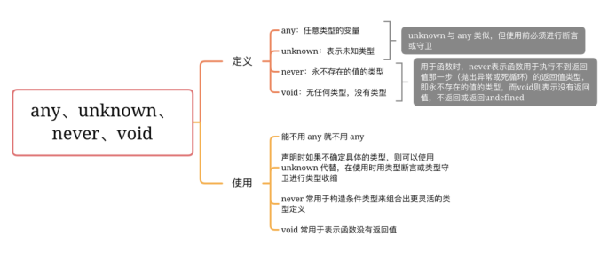
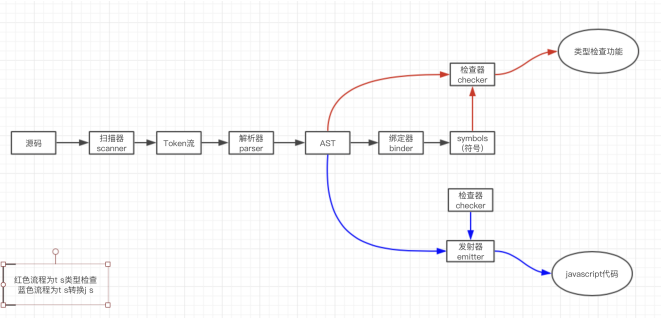

# 课程目标

- TS & JS
- 掌握TS基础使用
- 了解TS编译原理

# 知识要点

## TS & JS

TypeScript 是 JavaScript 的一个超集，支持ECMAScript 6 标准


TS目前不能直接使用在浏览器中

## TS基础使用

### 基本概念

类型注解：TypeScript里的类型注解是一种轻量级的为函数或变量添加约束的方式。

### 基本类型

`布尔值`、`数字`、`字符串`、`数组`、`元祖`、`枚举`

```ts
let a1 = 1; // let a1: number = 1;
let b1 = "string"; // let b1: string = 'string';
let c1 = true; // let c1: boolean = true;
```

Any Void Null 和 Undefined Never Object



类型系统：类型检查器为程序分配类型时使⽤的⼀系列规则。 

- 接⼝(interface) 可以描述⼀个对象或者函数 

  ```ts
  // 约束对象
  interface User {
      name: string
      age?: number
      readonly id: number
  }
  function printUser(user: User): void{
      console.log(user.name, ':', user.age);
  }
  const user1: User = {
      name: '小刘',
      age: 23,
  };
  printUser(user1);
  ```

  ```ts
  // 约束函数
  interface UserFun {
      (name: string, age: number): void;
  }
  const myFunction: UserFun = (name, age)=>{
      console.log('SetUser');
      console.log(name, ':', age);
  }
  myFunction('1', 2);
  ```

- 类(class) 

  public static private protected

- 函数

- 泛型 

  ```ts
  function aaa<T>(arg: T): T {   
      return arg;
  }
  ```

- 枚举 

  ```ts
  // 数字枚举的声明可以分为两大类，带有初始化器和不带初始化器
  // 01-不带初始化器，枚举成员默认从 0 开始，依次递增；
  enum NumEnum1 { one, two }
  console.log(NumEnum1.one) // => 0
  console.log(NumEnum1.two) // => 1
  // 02-带有初始化器，这种又可以分为两种：
  // 02-01-使用初始化器并指定初始化的常数，
  // 未使用初始化器的成员取值是在上一个成员的基础上 +1；
  enum NumEnum2 {
    one = 10,
    two,
    three = 20,
    four
  }
  console.log(NumEnum2.two)  // => 11
  console.log(NumEnum2.four) // => 21
  // 02-02-使用初始化器并且初始化值是对已经声明的枚举的枚举成员的引用
  enum NumEnum3 {
    one = NumEnum2.four,
    two
  }
  console.log(NumEnum3.one) // => 21
  console.log(NumEnum3.two) // => 22
  
  enum NumEnum {
      one = 'the one',
      two = 'the one',
      // three,
  }
  ```

- 迭代器和⽣成器 

  迭代器：iterators(): Iterator，可迭代

  生成器：Generator函数，与迭代器搭配使用

- 装饰器 

  对**属性**和**方法**作一定处理

  ```ts
  class A {
      @testAA // 属性的装饰器
      public aa;
  
      @testAbc() // 方法的装饰器
      method(){
          testAbc();        
      }
  
  }
  ```

- 继承 多态 重载 重写 

  继承：子类继承父类方法

  多态：父类的方法在两个子类中实现不同

  重载：名称一样，参数有差别

  重写：名称一样，参数一样，重新实现

  ```ts
  // 父类 Animal
  class Animal {
      public name: string;
      constructor(name: string) {
          this.name = name;
      }
  	// 定义一个方法，具体不做实现，子类自己实现
      eat() {
          console.log('function: eat');
      }
      // 带有字符串类型参数的函数  
      drink(a:string): void;    
  
      // 带有数字类型参数的函数
      drink(a:string, b:number): string;    
  
      // 函数定义
      drink(a?: any, b?:any): any {    
          if (typeof b =='number') {
              console.log(`${this.name}喝${a}${b}瓶。`);
          } else {
              console.log(`${this.name}喝${a}`);
          }
             
      }
  }
  
  // 子类 Dog
  class Dog  extends Animal {
      constructor(name: string) {
          super(name);
      }
      // 自行实现父类定义的 eat 方法
      eat() {
          console.log(`${this.name}吃肉。`);
      }
  }
  
  // 子类 Cat
  class Cat extends Animal {
      constructor(name: string) {
          super(name);
      }
      // 自行实现父类定义的 eat 方法
      eat() {
          console.log(`${this.name}吃鱼。`);
      }
  }
  
  var d = new Dog('小狗');
  d.eat();  // 小狗吃肉。
  var c = new Cat('小猫');
  c.eat();  // 小猫吃鱼。
  c.drink('水'); 
  c.drink('饮料', 3); 
  ```

- 抽象类 & 抽象⽅法

  ```ts
  abstract class Parent {
      abstract B(){}
  }
  class son extends Parent {
      B(){
          console.log(1232)
      }
  }
  ```

## TS的编译原理

Scanner 扫描仪 Parser 解析器 Binder 绑定器 Checker 检查器 Emitter 发射器



Scanner & Parser

> sourceCode ~~ 扫描仪 -> token流 ~~ 解析器 -> AST

