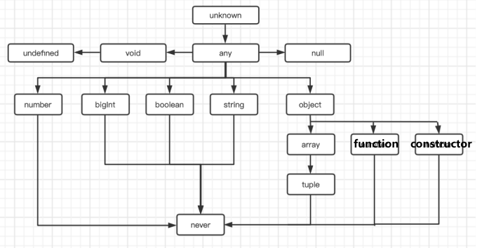

# 课程目标

- TS实战及面试题

# 知识要点

## 面试题

### 1、类型推论 & 可赋值性

**Q：什么是类型推论？**

A：没有给定指定类型时，ts自动标注类型

**Q：以下代码ts推论出的类型是什么？**

```ts
let a = 1024; // number
let b = '1024'; // string
const c = 'apple'; // 'apple'
let d = [true, false, true]; // boolean[]
let e = { name: 'apple'}; // { name: string }
let f = null; // any
```

**Q：以下是否可互相赋值？**

```ts
let aa = 1024;
let aa1: number = 1024;
aa = aa1; // 可
aa1 = aa; // 可

let bb: string = 'bb';
let bb1: string | number = 'bb1';
bb = bb1; // 可
bb1 = bb; // 可
bb1 = 2; // 可
bb = bb1; // 不可

let i: 3 = 3;
i = 4; // 不可

let j = [1,2,3];
j.push(4); // 可
j.push('5'); // 不可
```



可赋值性：数组，布尔，数字，对象，函数，类、字符串，字⾯量类型，满⾜以下任⼀条件时，A类型可以赋值给B类型

（1）A是B的⼦类型 

（2）A是any类型 

规则2是规则1的例外

### 2、类型断言

手动指定一个值的类型，可能出现运行时的错误

```ts
function formatInput(input: string): string {
     return input.slice(0, 10);
}
function getUserInput(): string | number {
     return 'test';
}
let input = getUserInput();
formatInput(input as string); // 方法一：as
formatInput(<string>input); // 方法二：<>
```

### 3、type 和 interface 的异同

interface侧重于描述数据结构，type（类型别名）侧重于描述类型

```ts
type age = number;
type dataType = number | string ;
type Method = 'GET' | 'POST' | 'PUT' | 'DELETE';
type User = {
     name: string
     age: number
}
interface User1 extends User {
     age: number;
}
const user1:User1 = {
     name: 'John',
     age: 12
}
```

#### 相同点

a.都可以描述一个对象或者函数

```ts
// interface
interface User {
     name: string;
     age: number;
}
interface SetUser {
     (name: string, age: number): void;
}

// type
type User = {
     name: string;
     age: number;
}
type SetUser = (name: string, age: number): void;
```

b.interface和type都可以拓展，interface可以extends type，type也可以extends interface，效果差不多，语法不同

```ts
// interface extends interface
interface Name {
     name: string;
}
interface User extends Name {
     age: number;
}

// type extends type
type Name = {
     name: string;
}
type User = Name & { age: number }

// interface extends type
type Name = {
     name: string;
}
interface User extends Name {
     age: number;
}

// type extends interface
interface Name {
     name: string;
}
type User = Name & {
     age: number;
}
```

#### 不同点

a.type可以⽤于其它类型 （联合类型、元组类型、基本类型（原始值）），interface不⽀持

```ts
type PartialPointX = { x: number };
type PartialPointY = { y: number };
// union(联合)
type PartialPoint = PartialPointX | PartialPointY;
// tuple(元祖)
type Data = [PartialPointX, PartialPointY];
// primitive(原始值)
type Name = Number;
// typeof的返回值
let div = document.createElement('div');
type B = typeof div;
```

b.interface可以多次定义并被视为合并所有声明成员，type不⽀持

```ts
interface Point {
     x: number;
}
interface Point {
     y: number;
}
const point: Point = { x: 1, y: 2 };

interface User {
     name: string;
     age: number;
}
interface User {
     sex: string;
}
// User接⼝为：
{
     name: string;
     age: number;
     sex: string;
}
```

c.type能使⽤**in**关键字⽣成映射类型，但interface不⾏

```ts
type Keys = 'firstname' | 'surname';
type DudeType = {
     [key in Keys]: string;
};
const test: DudeType = {
     firstname: 'Pawel',
     surname: 'Grzybek',
};
```
**Q：以下哪些会报错？**

```ts
type Options = {
     baseURL: string
     cacheSize?: number
     env?: 'prod' | 'dev'
}
class API {
     constructor(options: Options){}
}


new API({
     baseURL: 'http://myapi.site.com',
     env: 'prod'
}) // 编译通过

new API({
     baseURL: 'http://myapi.site.com',
     badEnv: 'prod'
}) // 编译报错：badEnv是多余属性

new API({
     baseURL: 'http://myapi.site.com',
     badEnv: 'prod'
} as Options) // 编译通过（断言方法）

let badOptions = {
     baseURL: 'http://myapi.site.com',
     badEnv: 'prod'
}
new API(badOptions) // 编译通过：把对象赋值给了⼀个变量之后，ts 就不会做“多余属性”的检查了

let options: Options = {
     baseURL: 'http://myapi.site.com',
     badEnv: 'prod'
} // 编译报错：badEnv是多余属性
new API(badOptions)
```

### 4、装饰器问题

|            | 类装饰器     | 方法装饰器                                                   | 访问器装饰器                                                 | 方法参数装饰器                                               | 属性装饰器                                                   |
| ---------- | :----------- | ------------------------------------------------------------ | ------------------------------------------------------------ | ------------------------------------------------------------ | ------------------------------------------------------------ |
| 装饰器参数 | 类的构造函数 | 1、对于静态成员是类的构造函数，对于实例成员是类的原型对象。<br />2、成员的名字。<br />3、成员的属性描述符。 | 1、对于静态成员是类的构造函数，对于实例成员是类的原型对象。<br />2、成员的名字。<br />3、成员的属性描述符。 | 1、对于静态成员是类的构造函数，对于实例成员是类的原型对象。<br />2、参数的名字。<br />3、参数在函数参数列表中的索引。 | 1、对于静态成员是类的构造函数，对于实例成员是类的原型对象。<br />2、成员的名字。 |

执行顺序：

a、有多个参数装饰器时：从最后⼀个参数依次向前执⾏ 

b、⽅法和⽅法参数中参数装饰器先执⾏

c、类装饰器总是最后执⾏

d、⽅法和属性装饰器，谁在前⾯谁先执⾏。因为参数属于⽅法⼀部分，所以参数会⼀直紧紧挨着⽅法执⾏

### 5、接口类型

属性类接⼝

```ts
interface LabelledValue {
    size?: number;
    label: string;
}

function printLabel(labelledObj: LabelledValue) {
	console.log(labelledObj.label);
}

let myObj = {size: 10, label: "Size 10 Object"};
printLabel(myObj);
```

```ts
interface Point {
	readonly x: number;
	readonly y: number;
}

let p1: Point = { x: 10, y: 20 };
p1.x = 5; // error!
```

函数类接⼝ 

```ts
interface SearchFunc {
	(source: string, subString: string): boolean;
}
```

可索引接⼝ 

```ts
interface StringArray {
	[index: number]: string;
}

let myArray: StringArray;
myArray = ["Bob", "Fred"];

let myStr: string = myArray[0];
```

类类型接⼝ 

```ts
interface ClockInterface {
    currentTime: Date;
    setTime(d: Date);
}

class Clock implements ClockInterface {
    currentTime: Date;
    setTime(d: Date) {
        this.currentTime = d;
    }
    constructor(h: number, m: number) { }
}
// 接口描述了类的公共部分，而不是公共和私有两部分。 它不会帮你检查类是否具有某些私有成员。
```

扩展接⼝

参考文献：[官方文档](https://www.tslang.cn/docs/handbook/interfaces.html)

## 实战

### 1、axios 封装

```ts
type Method = 'GET' | 'POST' | 'PUT' | 'DELETE'
type ResponseType = 'arraybuffer' | 'blob' | 'document' | 'json' | 'text' | 'stream'

interface AxiosRequest {
    baseURL?: string;
    url: string;
    data?: any;
    params?: any;
    method?: Method;
    headers?: any;
    timeout?: number;
    responseType?: ResponseType;
}

interface CustomResponse {
    readonly status: boolean;
    readonly message: string;
    data: any;
    origin?: any;
}


import axios, { AxiosRequestConfig } from 'axios';

// 定义接口
interface PendingType {
    url?: string;
    method?: Method;
    params: any;
    data: any;
    cancel: Function;
}

// 取消重复请求
const pending: Array<PendingType> = [];
const CancelToken = axios.CancelToken;

// axios 实例
const instance = axios.create({
    timeout: 10000,
    responseType: 'json'
});

// 移除重复请求
const removePending = (config: AxiosRequestConfig) => {
    for (const key in pending) {
        const item: number = +key;
        const list: PendingType = pending[key];
        // 当前请求在数组中存在时执行函数体
        if (list.url === config.url && list.method === config.method && JSON.stringify(list.params) === JSON.stringify(config.params) && JSON.stringify(list.data) === JSON.stringify(config.data)) {
            // 执行取消操作
            list.cancel('操作太频繁，请稍后再试');
            // 从数组中移除记录
            pending.splice(item, 1);
        }
    }
};

// 添加请求拦截器
instance.interceptors.request.use(
    (request:any) => {
        // TODO: handle loading
        
        removePending(request);
        request.cancelToken = new CancelToken((c) => {
            pending.push({ 
                url: request.url, 
                method: request.method, 
                params: request.params, 
                data: request.data, 
                cancel: c 
            });
        });
        return request;
    },
    (error: any) => {
        return Promise.reject(error);
    }
);

// 添加响应拦截器
instance.interceptors.response.use(
    (response: any) => {
        removePending(response.config);

        const errorCode = response?.data?.errorCode;
        switch (errorCode) {
            case '401':
                // 根据errorCode，对业务做异常处理(和后端约定)
                break;
            default:
                break;
        }

        return response;
    },
    (error: any) => {
        const response = error.response;

        // 根据返回的http状态码做不同的处理
        switch (response?.status) {
            case 401:
                // token失效
                break;
            case 403:
                // 没有权限
                break;
            case 500:
                // 服务端错误
                break;
            case 503:
                // 服务端错误
                break;
            default:
                break;
        }

        return Promise.reject(response || {message: error.message});
    }
);

class BaseHttp {
    // 外部传入的baseUrl
    protected baseURL: string = process.env.VUE_APP_BaseURL as string;
    // 自定义header头
    protected headers: object = {
        ContentType: 'application/json;charset=UTF-8'
    }

    private apiAxios({ 
        baseURL = this.baseURL, 
        headers = this.headers, 
        method, 
        url, 
        data, 
        params, 
        responseType 
    }: AxiosRequest): Promise<CustomResponse> {

        return new Promise((resolve, reject) => {
            instance({
                baseURL,
                headers,
                method,
                url,
                params,
                data,
                responseType
            }).then((res: any) => {
                // 200:服务端业务处理正常结束
                if (res.status === 200) {
                    // TODO 正常返回
                    resolve(res.data);
                } else {
                    resolve({ 
                        status: false, 
                        message: res.data?.errorMessage || (url + '请求失败'), 
                        data: null 
                    });
                }
            }).catch((err: any) => {
                const message = err?.data?.errorMessage || err?.message || (url + '请求失败');
                // eslint-disable-next-line
                reject({ status: false, message, data: null});
            });
        });
    }

    /**
     * GET类型的网络请求
     */
    protected getReq({ 
        baseURL, 
        headers, 
        url, 
        data, 
        params, 
        responseType 
    }: AxiosRequest) {
        return this.apiAxios({ 
            baseURL, 
            headers, 
            method: 'GET', 
            url, 
            data, 
            params, 
            responseType 
        });
    }

    /**
     * POST类型的网络请求
     */
    protected postReq({ baseURL, headers, url, data, params, responseType }: AxiosRequest) {
        return this.apiAxios({ baseURL, headers, method: 'POST', url, data, params, responseType });
    }

    /**
     * PUT类型的网络请求
     */
    protected putReq({ baseURL, headers, url, data, params, responseType }: AxiosRequest) {
        return this.apiAxios({ baseURL, headers, method: 'PUT', url, data, params, responseType });
    }

    /**
     * DELETE类型的网络请求
     */
    protected deleteReq({ baseURL, headers, url, data, params, responseType }: AxiosRequest) {
        return this.apiAxios({ baseURL, headers, method: 'DELETE', url, data, params, responseType });
    }
}
```

### 2、TS装饰器


```ts
// 类装饰器
function Log(target:any) {
    console.log(target);
    console.log("in log decorator");
}

@Log
class A {
    constructor(){
        console.log("constructor")
    }
}
new A();

// 输出：
// [Function: A]
// in log decorator
// constructor

// 生成js文件：
var __decorate = (this && this.__decorate) || function (decorators, target, key, desc) {
    var c = arguments.length, r = c < 3 ? target : desc === null ? desc = Object.getOwnPropertyDescriptor(target, key) : desc, d;
    if (typeof Reflect === "object" && typeof Reflect.decorate === "function") r = Reflect.decorate(decorators, target, key, desc);
    else for (var i = decorators.length - 1; i >= 0; i--) if (d = decorators[i]) r = (c < 3 ? d(r) : c > 3 ? d(target, key, r) : d(target, key)) || r;
    return c > 3 && r && Object.defineProperty(target, key, r), r;
};
// 类装饰器
function Log(target) {
    console.log(target);
    console.log("in log decorator");
}
var A = /** @class */ (function () {
    function A() {
        console.log("constructor");
    }
    A = __decorate([
        Log
    ], A);
    return A;
}());
new A();
```

```ts
// 方法装饰器
function GET(url: string) {
    console.log('entry GET decorator');
    return function (target:any, methodName: string, descriptor: PropertyDescriptor) {
        console.log('entry GET decorator function');
        !target.$Meta && (target.$Meta = {});
        target.$Meta[methodName] = url;
    }
}

class HelloService {
    constructor() {
        console.log("constructor")
    }
    @GET("xx")
    getUser() {
        console.log('getUser function called');
    }
}
new HelloService().getUser();
console.log((<any>HelloService).$Meta);
console.log((new HelloService() as any).$Meta);

// 输出：
// entry GET decorator
// entry GET decorator function
// constructor
// getUser function called
// undefined
// constructor
// { getUser: 'xx' }

// 生成js文件：
var __decorate = (this && this.__decorate) || function (decorators, target, key, desc) {
    var c = arguments.length, r = c < 3 ? target : desc === null ? desc = Object.getOwnPropertyDescriptor(target, key) : desc, d;
    if (typeof Reflect === "object" && typeof Reflect.decorate === "function") r = Reflect.decorate(decorators, target, key, desc);
    else for (var i = decorators.length - 1; i >= 0; i--) if (d = decorators[i]) r = (c < 3 ? d(r) : c > 3 ? d(target, key, r) : d(target, key)) || r;
    return c > 3 && r && Object.defineProperty(target, key, r), r;
};
// 方法装饰器
function GET(url) {
    console.log('entry GET decorator');
    return function (target, methodName, descriptor) {
        console.log('entry GET decorator function');
        !target.$Meta && (target.$Meta = {});
        target.$Meta[methodName] = url;
    };
}
var HelloService = /** @class */ (function () {
    function HelloService() {
        console.log("constructor");
    }
    HelloService.prototype.getUser = function () {
        console.log('getUser function called');
    };
    __decorate([
        GET("xx")
    ], HelloService.prototype, "getUser");
    return HelloService;
}());
new HelloService().getUser();
console.log(HelloService.$Meta);
console.log(new HelloService().$Meta);
```

```ts
// 方法参数装饰器
function PathParam(paramName: string) {
    return function (target:any, methodName: string, paramIndex: number) {
        !target.$Meta && (target.$Meta = {});
        target.$Meta[paramIndex] = paramName;
    }
}

class HelloService {
    constructor() { }
    getUser( @PathParam("userId") userId: string) { }
}

console.log((<any>HelloService).prototype.$Meta); // {'0':'userId'}

// 生成js文件：
var __decorate = (this && this.__decorate) || function (decorators, target, key, desc) {
    var c = arguments.length, r = c < 3 ? target : desc === null ? desc = Object.getOwnPropertyDescriptor(target, key) : desc, d;
    if (typeof Reflect === "object" && typeof Reflect.decorate === "function") r = Reflect.decorate(decorators, target, key, desc);
    else for (var i = decorators.length - 1; i >= 0; i--) if (d = decorators[i]) r = (c < 3 ? d(r) : c > 3 ? d(target, key, r) : d(target, key)) || r;
    return c > 3 && r && Object.defineProperty(target, key, r), r;
};
var __param = (this && this.__param) || function (paramIndex, decorator) {
    return function (target, key) { decorator(target, key, paramIndex); }
// 方法参数装饰器
function PathParam(paramName) {
    return function (target, methodName, paramIndex) {
        !target.$Meta && (target.$Meta = {});
        target.$Meta[paramIndex] = paramName;
    };
}
var HelloService = /** @class */ (function () {
    function HelloService() {
    }
    HelloService.prototype.getUser = function (userId) { };
    __decorate([
        __param(0, PathParam("userId"))
    ], HelloService.prototype, "getUser");
    return HelloService;
}());
console.log(HelloService.prototype.$Meta); // {'0':'userId'}
```

```ts
// 定义类装饰器
function logClass(params: string) {
    return function (target: any) {
      console.log(target);
      console.log(params);
    }
  }
  
// 定义属性装饰器
function logProperty(params: any) {
	// target--->类的原型对象；attr--->传入的参数url
    return function (target: any, attr: any) {
        console.log(target, attr);

        target[attr] = params
    }
}
  
@logClass('xxxx')
class HttpClient {
    @logProperty('http://www.baidu.com')
    public url: any | undefined;
    constructor() {

    }
    getUrl() {
        console.log(this.url);
    }
}
  
console.log(new HttpClient().getUrl())

// 输出：
// { getUrl: [Function (anonymous)] } url
// [Function: HttpClient]
// xxxx
// http://www.baidu.com
// undefined

// 生成js文件：
var __decorate = (this && this.__decorate) || function (decorators, target, key, desc) {
    var c = arguments.length, r = c < 3 ? target : desc === null ? desc = Object.getOwnPropertyDescriptor(target, key) : desc, d;
    if (typeof Reflect === "object" && typeof Reflect.decorate === "function") r = Reflect.decorate(decorators, target, key, desc);
    else for (var i = decorators.length - 1; i >= 0; i--) if (d = decorators[i]) r = (c < 3 ? d(r) : c > 3 ? d(target, key, r) : d(target, key)) || r;
    return c > 3 && r && Object.defineProperty(target, key, r), r;
};
// 定义类装饰器
function logClass(params) {
    return function (target) {
        console.log(target);
        console.log(params);
    };
}
// 定义属性装饰器
function logProperty(params) {
    // target--->类的原型对象；attr--->传入的参数url
    return function (target, attr) {
        console.log(target, attr);
        target[attr] = params;
    };
}
var HttpClient = /** @class */ (function () {
    function HttpClient() {
    }
    HttpClient.prototype.getUrl = function () {
        console.log(this.url);
    };
    __decorate([
        logProperty('http://www.baidu.com')
    ], HttpClient.prototype, "url");
    HttpClient = __decorate([
        logClass('xxxx')
    ], HttpClient);
    return HttpClient;
}());
console.log(new HttpClient().getUrl());
```

# 补充知识点

## tsconfig.json

```json
{
    "compilerOptions": {
        "target": "es6",            // 目标语言的版本
        "module": "commonjs",       // 指定生成代码的模板标准
        "noImplicitAny": true,      // 不允许隐式的 any 类型
        "removeComments": true,     // 删除注释
        "preserveConstEnums": true, // 保留 const 和 enum 声明
        "sourceMap": true,          // 生成目录文件的sourceMap文件
        "outDir": "dist",
        "experimentalDecorators": true, // 装饰器
        "strict": true	// 严格模式（null和undefined不能给指定类型赋值）
    },
    "include": [    // 指定待编译文件
        "./"
    ]
}
```

