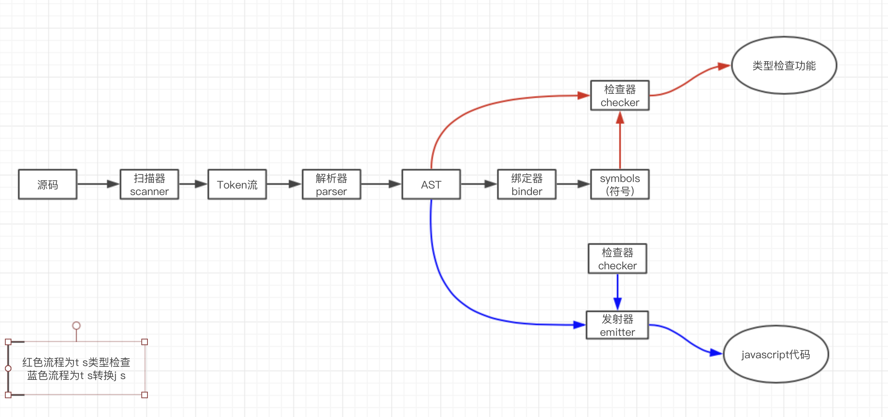
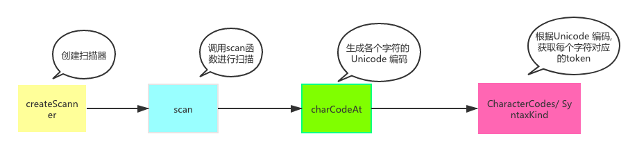
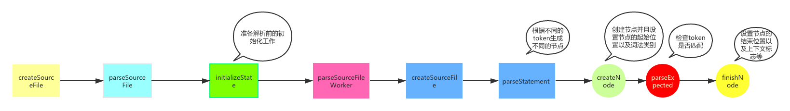
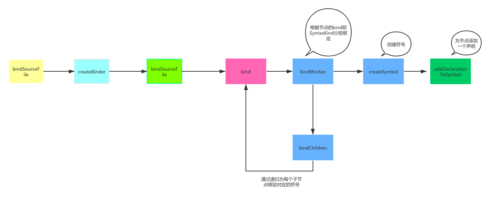
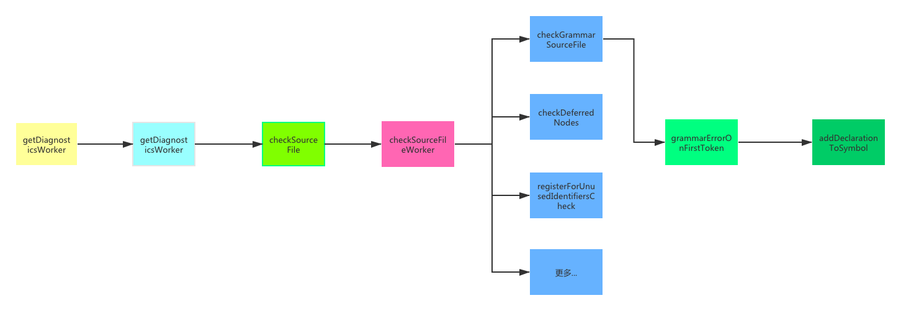
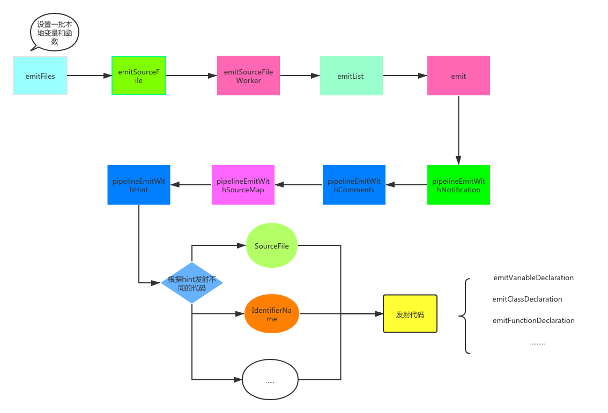

# 课程目标

- TS基础知识
- TS常见面试题及实战
- 了解TS原理

# 知识要点

## 基础知识

基础类型: number string boolean array object undefined void

1. enum: 枚举

2. type, interface

3. 联合类型 | (联合类型一次只能一种类型)

4. 交叉类型 & (交叉类型每次都是多个类型的合并类型)

5. typeof

typeof 操作符可以用来获取一个变量声明或对象的类型。

```ts
function toArray(x: number): Array<number> {
  return [x];
}

type Func = typeof toArray; // -> (x: number) => number[]
```

6. keyof 

keyof 操作符可以用来一个对象中的所有 key 值：

```ts
interface Person {
    name: string;
    age: number;
}

type K1 = keyof Person; // "name" | "age"
```

7. in

in 用来遍历枚举类型：

```ts
type Keys = "a" | "b" | "c"

type Obj =  {
  [p in Keys]: any
} // -> { a: any, b: any, c: any }

```

8. extends 

有时候我们定义的泛型不想过于灵活或者说想继承某些类等，可以通过 extends 关键字添加泛型约束。

```ts
interface ILengthwise {
  length: number;
}

function loggingIdentity<T extends ILengthwise>(arg: T): T {
  console.log(arg.length);
  return arg;
}

loggingIdentity(3);	// error
loggingIdentity({length: 10, value: 3});
```

9.  Paritial

Partial<T> 的作用就是将某个类型里的属性全部变为可选项 ?。

10. Reuqired

Required<T> 的作用就是将某个类型里的属性全部变为必选项。

11. Readonly 

Readonly<T> 的作用是将某个类型所有属性变为只读属性，也就意味着这些属性不能被重新赋值。

12. Record 

Record<K extends keyof any, T> 的作用是将 K 中所有的属性的值转化为 T 类型。

```ts
interface PageInfo {
  title: string;
}

type Page = "home" | "about" | "contact";

const x: Record<Page, PageInfo> = {
  about: { title: "about" },
  contact: { title: "contact" },
  home: { title: "home" }
};
```

13.  Exclude

Exclude<T, U> 的作用是将某个类型中属于另一个的类型移除掉。

```ts
type T0 = Exclude<"a" | "b" | "c", "a">; // "b" | "c"
type T1 = Exclude<"a" | "b" | "c", "a" | "b">; // "c"
```

14.  Extract

Extract<T, U> 的作用是从 T 中提取出 U。

```ts
type T0 = Extract<"a" | "b" | "c", "a" | "f">; // "a"
type T1 = Extract<string | number | (() => void), Function>; // () => void

```
## 面试题及实战

1. 你觉得使用ts的好处是什么?

   1.1 TypeScript是JavaScript的加强版，它给JavaScript添加了可选的静态类型和基于类的面向对象编程，它拓展了JavaScript的语法。所以ts的功能比js只多不少。
   1.2 Typescript 是纯面向对象的编程语言，包含类和接口的概念。
   1.3 TS 在开发时就能给出编译错误， 而 JS 错误则需要在运行时才能暴露。
   1.4 作为强类型语言，你可以明确知道数据的类型。代码可读性极强，几乎每个人都能理解。
   1.5 ts中有很多很方便的特性, 比如可选链。

2. type 和 interface的异同

   重点：用interface描述数据结构，用type描述类型

   2.1 都可以描述一个对象或者函数
   
   ```ts
   interface User {
     name: string
     age: number
   }
   
   interface SetUser {
     (name: string, age: number): void;
   }
   
   type User = {
     name: string
     age: number
   };
   
   type SetUser = (name: string, age: number)=> void;
   ```
   
   2.2 都允许拓展（extends）
   
   interface 和 type 都可以拓展，并且两者并不是相互独立的，也就是说 interface 可以 extends type, type 也可以 extends interface 。 虽然效果差不多，但是两者语法不同。
   
   ```ts
   // interface extends interface
   interface Name { 
     name: string; 
   }
   interface User extends Name { 
     age: number; 
   }
   
   // type extends type
   type Name = { 
     name: string; 
   }
   type User = Name & { age: number  };
   
   // interface extends type
   type Name = { 
     name: string; 
   }
   interface User extends Name { 
     age: number; 
   }
   
   // type extends interface
   interface Name { 
     name: string; 
   }
   type User = Name & { 
     age: number; 
   }
   ```
   
   2.3 只有type可以做的
   
   type 可以声明基本类型别名，联合类型，元组等类型
   
   ```ts
   // 基本类型别名
   type Name = string
   
   // 联合类型
   interface Dog {
       wong();
   }
   interface Cat {
       miao();
   }
   
   type Pet = Dog | Cat
   
   // 具体定义数组每个位置的类型
   type PetList = [Dog, Pet]
   
   // 当你想获取一个变量的类型时，使用 typeof
   let div = document.createElement('div');
   type B = typeof div
   ```
   
3. 如何基于一个已有类型, 扩展出一个大部分内容相似, 但是有部分区别的类型?

   首先可以通过Pick和Omit

   ```ts
   interface Test {
       name: string;
       sex: number;
       height: string;
   }
   
   type Sex = Pick<Test, 'sex'>;
   
   const a: Sex = { sex: 1 };
   
   type WithoutSex = Omit<Test, 'sex'>;
   
   const b: WithoutSex = { name: '1111', height: 'sss' };
   ```

   比如Partial, Required

   再者可以通过泛型

4. 什么是泛型, 泛型的具体使用?

   泛型是指在定义函数、接口或类的时候，不预先指定具体的类型，使用时再去指定类型的一种特性。

   可以把泛型理解为代表类型的参数

   ```ts
   interface Test<T = any> {
       userId: T;
   }
   
   type TestA = Test<string>;
   type TestB = Test<number>;
   
   const a: TestA = {
       userId: '111',
   };
   
   const b: TestB = {
       userId: 2222,
   };
   ```

6. 写一个缓存的装饰器

   ```ts
   const cacheMap = new Map();
   
   export function EnableCache(target: any, name: string, descriptor: PropertyDescriptor) {
       const val = descriptor.value;
       descriptor.value = async function(...args: any) {
           const cacheKey = name + JSON.stringify(args);
           if (!cacheMap.get(cacheKey)) {
               const cacheValue = Promise.resolve(val.apply(this, args)).catch((_) => cacheMap.set(cacheKey, null));
               cacheMap.set(cacheKey, cacheValue);
           }
           return cacheMap.get(cacheKey);
       };
       return descriptor;
   }
   ```

7. 实现一个路由跳转 通过ts约束参数的routeHelper

   ```ts
   import { Dictionary } from 'vue-router/types/router';
   import Router, { RoutePath } from '../router';
   
   export type BaseRouteType = Dictionary<string>;
   
   export interface IndexParam extends BaseRouteType {
       name: string;
   }
   
   export interface AboutPageParam extends BaseRouteType {
       testName: string;
   }
   
   export interface UserPageParam extends BaseRouteType {
       userId: string;
   }
   
   export interface ParamsMap {
       [RoutePath.Index]: IndexParam;
       [RoutePath.About]: AboutPageParam;
       [RoutePath.User]: UserPageParam;
   }
   
   
   export class RouterHelper {
       public static replace<T extends RoutePath>(routePath: T, params: ParamsMap[T]) {
           Router.replace({
               path: routePath,
               query: params,
           });
       }
   
       public static push<T extends RoutePath>(routePath: T, params: ParamsMap[T]) {
           Router.push({
               path: routePath,
               query: params,
           });
       }
   }
   ```

8. 实现一个基于ts和事件模式的countdown基础类

   ```ts
   import { EventEmitter } from 'eventemitter3';
   
   export interface RemainTimeData {
       /** 天数 */
       days: number;
       /**
        * 小时数
        */
       hours: number;
       /**
        * 分钟数
        */
       minutes: number;
       /**
        * 秒数
        */
       seconds: number;
       /**
        * 毫秒数
        */
       count: number;
   }
   
   export type CountdownCallback = (remainTimeData: RemainTimeData, remainTime: number) => void;
   
   enum CountdownStatus {
       running,
       paused,
       stoped,
   }
   
   export enum CountdownEventName {
       START = 'start',
       STOP = 'stop',
       RUNNING = 'running',
   }
   
   interface CountdownEventMap {
       [CountdownEventName.START]: [];
       [CountdownEventName.STOP]: [];
       [CountdownEventName.RUNNING]: [RemainTimeData, number];
   }
   
   export function fillZero(num: number) {
       return `0${num}`.slice(-2);
   }
   
   export class Countdown extends EventEmitter<CountdownEventMap> {
       private static COUNT_IN_MILLISECOND: number = 1 * 100;
       private static SECOND_IN_MILLISECOND: number = 10 * Countdown.COUNT_IN_MILLISECOND;
       private static MINUTE_IN_MILLISECOND: number = 60 * Countdown.SECOND_IN_MILLISECOND;
       private static HOUR_IN_MILLISECOND: number = 60 * Countdown.MINUTE_IN_MILLISECOND;
       private static DAY_IN_MILLISECOND: number = 24 * Countdown.HOUR_IN_MILLISECOND;
   
       private endTime: number;
       private remainTime: number = 0;
       private status: CountdownStatus = CountdownStatus.stoped;
       private step: number;
   
       constructor(endTime: number, step: number = 1e3) {
           super();
   
           this.endTime = endTime;
           this.step = step;
   
           this.start();
       }
   
       public start() {
           this.emit(CountdownEventName.START);
   
           this.status = CountdownStatus.running;
           this.countdown();
       }
   
       public stop() {
           this.emit(CountdownEventName.STOP);
   
           this.status = CountdownStatus.stoped;
       }
   
       private countdown() {
           if (this.status !== CountdownStatus.running) {
               return;
           }
   
           this.remainTime = Math.max(this.endTime - Date.now(), 0);
   
           this.emit(CountdownEventName.RUNNING, this.parseRemainTime(this.remainTime), this.remainTime);
   
           if (this.remainTime > 0) {
               setTimeout(() => this.countdown(), this.step);
           } else {
               this.stop();
           }
       }
   
       private parseRemainTime(remainTime: number): RemainTimeData {
           let time = remainTime;
   
           const days = Math.floor(time / Countdown.DAY_IN_MILLISECOND);
           time = time % Countdown.DAY_IN_MILLISECOND;
   
           const hours = Math.floor(time / Countdown.HOUR_IN_MILLISECOND);
           time = time % Countdown.HOUR_IN_MILLISECOND;
   
           const minutes = Math.floor(time / Countdown.MINUTE_IN_MILLISECOND);
           time = time % Countdown.MINUTE_IN_MILLISECOND;
   
           const seconds = Math.floor(time / Countdown.SECOND_IN_MILLISECOND);
           time = time % Countdown.SECOND_IN_MILLISECOND;
   
           const count = Math.floor(time / Countdown.COUNT_IN_MILLISECOND);
   
           return {
               days,
               hours,
               minutes,
               seconds,
               count,
           };
       }
   }
   ```
## 原理 

1. Scanner 扫描器 (scanner.ts)

    扫描器的作用就是将源代码生成token流
    

2. Parser 解析器 (parser.ts)

    

3. Binder 绑定器 (binder.ts)



符号将 AST 中的声明节点与其它声明连接到相同的实体上。符号是语义系统的基本构造块。

```js
function Symbol(flags: SymbolFlags, name: string) {
    this.flags = flags;
    this.name = name;
    this.declarations = undefined;
}
```

SymbolFlags 符号标志是个标志枚举，用于识别额外的符号类别（例如：变量作用域标志 FunctionScopedVariable 或 BlockScopedVariable 等）.

4. Checker 检查器 (checker.ts)



根据我们生成AST节点的声明起始节点位置，对传进来的字符串做位置类型语法等的校验与异常的抛出。


5. Emitter 发射器 (emitter.ts)



TypeScript 编译器提供了两个发射器:

emitter.ts: 它是 TS -> JavaScript 的发射器
declarationEmitter.ts: 用于为 TypeScript 源文件（.ts） 创建声明文件

