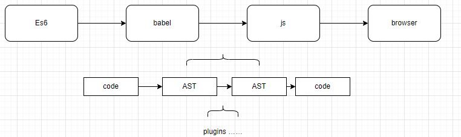
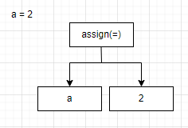
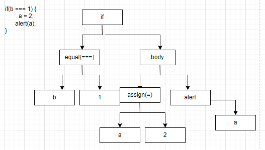
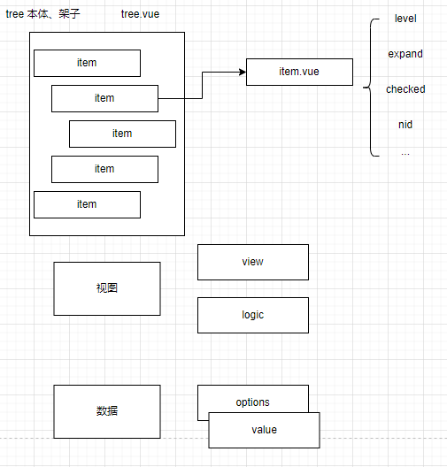
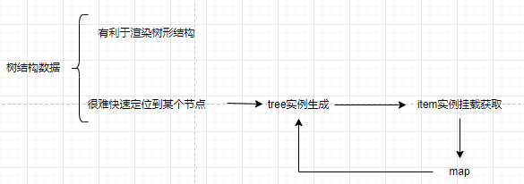

# 课程目标

- babel了解与使用
- 实现一个tree

# 知识要点

## babel

解决旧浏览器不兼容新语法的问题。



### js解析原理

编译器解析：抽象成一棵树

```js
a = 2
```



> 从外到内，从运算符到两边

```js
if (b === 1) {
    a = 2;
    alert(a);
}
```



1. token：令牌流
2. 词法分析 语法分析

## 实现一个tree

### 设计





### 代码

tree.vue

```vue
<script>
import item from './item';
import refs from './refs.js'
// tree 所有根逻辑
let count = 0;
export default {
  name: 'tree',

  props: {
    // 树形结构
    options: {
      type: Array,
      default: function() {
        return [];
      }
    },
    // 选中节点
    value: Array
  },
  data () {
    let name = `v_tree_` + ++count;
    return {
      name
    }
  },

  // 同步实例状态
  created () {
    // 初始化
    let name = this.name;
    refs.init({
      name
    }, this)
  },
  destroy () {
    let name = this.name;
    refs.destroy(name);
  },
  components: {
    item
  },

  render (h) {
    return (
      <div class="tree">
        <div>我是tree</div>
        <ul class="vue-tree">
          {
            this.options.map((itemData, index) => {
              return (
                <item option={itemData}
                  name={this.name}
                  key={`${this.name}${itemData['value']}${index}}`}
                ></item>
              )
            })
          }
        </ul>
      </div>
    )
  }
}
</script>
```

item.vue

```vue
<script>
import refs from './refs';
// tree-item 用以维护所有树节点内容逻辑
let count = 0;
export default {
    name: 'item',
    props: {
        option: Object,
        name: String
    },
    data() {
        let cid = this.cid || (`item` + ++count);
        return {
            level: (this.$parent.level || 0) + 1,
            cid,
            indent: 1,
            expand: false,
            checked: false
        }
    },
    computed: {
        // 是否有子节点
        isFolder() {
            return !!this.option['children'];
        }
    },
    mounted() {
        let name = this.name;
        
        refs.set(name, this);
        this.setDefault();
    },
    methods: {
        handleClickExpand() {
            this.expand = !this.expand;
        },
        handleClickItem() {
            this.checked = !this.checked;
        },
        setDefault() {
            let tree = refs.get(this.name);
            let _value = tree.value;

            if (_value.indexOf(this.option['value']) > -1) {
                this.checked = true;
            }
        }
    },
    render(h) {
        return (
            <li class={[
                'tree_item',
                this.checked && 'is-checked'
                ]}>
                {/*展开箭头*/}
                <div class={['arrow', this.expand ? 'expand' : '']} style={{display: this.isFolder ? 'block' : 'none'}}
                    onClick={this.handleClickExpand}
                ></div>
                {/*展示标题*/}
                <a class={['v-tree__title']} 
                    style={{paddingLeft: this.level !== 0 && (`${this.level * this.indent}px`)}}
                    onClick={this.handleClickItem}>
                    { this.option['text'] }
                </a>
                {/*嵌套*/}
                {
                    this.isFolder && 
                    <ul class="vue-tree__folder" style={{display: this.expand ? 'block' : 'none'}}>
                        {
                            this.option['children'].map((itemData, index) => {
                                return (
                                    <item option={itemData}
                                        name={this.name}
                                        key={`${this.name}${itemData['value']}${index}}`}
                                    ></item>
                                )
                            })
                        }
                    </ul>
                }
            </li>
        )
    }
}
</script>

<style scoped>
    li {
        position: relative;
    }
    .v-tree__title {
        margin: 5px;
    }
    .arrow {
        position: absolute;
        width: 5px;
        height: 5px;
        left: -10px;
        top: 10px;
        border-top: 1px solid gray;
        border-left: 1px solid gray;
        transform: rotate(-135deg);
    }
    .expand {
        transform: rotate(45deg);
    }
    .is-checked {
        color: blue;
    }
    ul, li {
        list-style: none;
    }
</style>
```

refs.js

```js
// 整棵树的抽象
class Ref {
    constructor(opts, tree) {
        let name = this.name = opts.name;
        this.tree = tree;
        this.refs = {};
        refs[name] = this;
    }

    // 获取方法
    get(cid) {
        return cid ? this.$refs[cid] : this.tree;
    }

    // 挂载方法
    set(vm) {
        let cid = vm.cid;
        this.refs[cid] = vm;
    }
}

// 一整棵树
let refs = {};

// 初始化工厂生产实例
let init = function(opts, tree) {
    let name = opts.name;
    if (!refs[name]) {
        return new Ref(opts, tree);
    }
    return refs[name];
}

// 销毁实例
let destroy = function(name) {
    refs[name] && delete refs[name];
}

// 获取
let get = function(name, cid) {
    return refs[name] && refs[name].get(cid);
}

// 设置
let set = function(name, vm) {
    refs[name] && refs[name].set(vm);
}

export default {
    init,
    destroy,
    get,
    set
}
```


