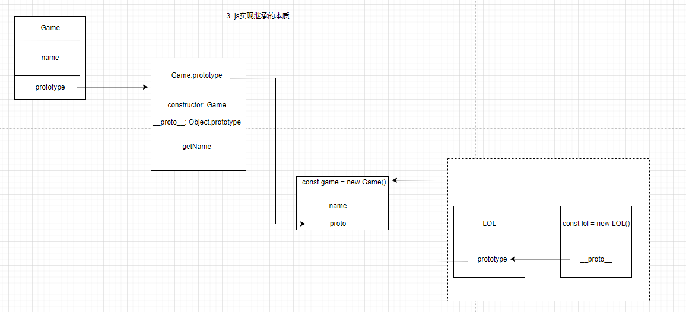

# 课程目标

* JS面向对象编程
* 原型及原型链
* 继承（原型继承、构造函数继承、组合继承）

# 知识要点

## 面向对象
### 对象是什么？为什么要面向对象？
> 特点： 面向对象 —— 逻辑迁移更加灵活、代码复用性高、高度的模块化

#### 对象的理解
* 对象是对于单个物体的简单抽象
* 对象是一个容器，封装了属性 & 方法
  * 属性：对象的状态
  * 方法：对象的行为

```js
// 简单对象
const Course = {
    teacher: '云隐',
    leader: '小可',
    startCourse: function(name) {
        return `开始${name}课`;
    }
}

// 函数对象
function Course() {
    this.teacher = '云隐';
    this.leader = '小可';
    this.startCourse = function(name) {
        return `开始${name}课`;
    }
}
```

### 构造函数 - 生成对象
* 需要一个模板 - 表征了一类物体的共同特征， 从而生成对象
* 类即对象模板
* js其实本质上并不是基于类，而是基于构造函数 + 原型链
* constructor + prototype

```js
function Course(teacher) {
    this.teacher = teacher;
    this.leader = '小可';
    this.startCourse = function(name) {
        return `开始${name}课`;
    }
}
const course = new Course('云隐');
```

**Course 本质就是构造函数**

* 1. 函数体内使用的this，指向所要生成的实例
* 2. 生成对象用new来进行实例化
* 3. 可以做初始化传参


#### 追问：如果构造函数不初始化，可以使用吗？ - 无法使用
#### 追问：如果项目中需要使用，通常（不被外界感知）如何解决？
```js
function Course() {
    const _isClass = this instanceof Course;
    if (!_isClass) {
        return new Course();
    }

    this.teacher = '云隐';
    this.leader = '小可';
    this.startCourse = function(name) {
        return `开始${name}课`;
    }
}
// 使用方
const course = Course();
```
* 启发：如果编写底层的api代码时，尽量做到不需要让外部感知内部类型

#### 引发思考: new是什么 / new的原理 / new时候做了些什么
```js
function Course() {};
const course = new Course();
```
* 1. 创建了一个空对象，作为返回的对象实例
* 2. 将生成空对象的原型对象指向了构造函数的prototype属性
* 3. 将当前实例对象赋给了内部this
* 4. 执行构造函数的初始化代码

#### 追问：实例属性影响 - 独立
```js
function Course(teacher, leader) {
    this.teacher = teacher;
    this.leader = leader;
}
const course1 = new Course('云隐', '小可');
const course2 = new Course('云隐', '部部');

course2.leader = 'aaa'; // 不影响其他实例
```

#### constructor 是什么？
```js
function Course(teacher, leader) {
    this.teacher = teacher;
    this.leader = leader;
}
const course = new Course('云隐', '小可');
```
* 1. 每个对象在创建时，会自动拥有一个构造函数属性constructor
* 2. constructor继承自原型对象，指向了构造函数的引用

#### 追问：使用构造函数 没有问题么 / 会有什么性能上的问题?
```js
function Course(name) {
    this.teacher = '云隐';
    this.leader = '小可';
    this.startCourse = function(name) {
        return `开始${name}课`;
    }
}

const course1 = new Course('es6');
const course2 = new Course('OOP');
// 构造函数中的方法，会存在于每一个生成的实例里，重复的挂载其实是会导致资源浪费
```

### 原型对象
```js
function Course() {};	// 本身是Course.prototype的constructor，也是course1.__proto__的constructor
const course1 = new Course();
const course2 = new Course();
```
* 1. 构造函数： 用来初始化创建对象的函数 - Course

  * 自动给构造函数赋予一个属性prototype，该属性等于实例对象的原型对象

* 2. 实例对象：course1是实例对象，根据原型对象创建出来的实例

  * 每个对象中都有一个\__proto__
  * 每个实例对象都有一个constructor
  * constructor有继承而来，并指向当前的构造函数

* 3. 原型对象：Course.prototype
```js
function Course() {};
Course.prototype.teacher = '云隐';
const course1 = new Course();
const course2 = new Course();

// 对上篇原型对象做优化
function Course() {
    this.teacher = '云隐';
    this.leader = '小可';
}

// 方法挂载于prototype上，解决每个实例中的方法重复挂载的问题
Course.prototype.startCourse = function(name) {
    return `开始${name}课`;
}

const course1 = new Course('es6');
const course2 = new Course('OOP');
```
## 继承（js如何实现继承）
#### 在原型对象的所有属性和方法，都能被实例所共享
```js
// Game类
function Game() {
    this.name = 'lol'
}
Game.prototype.getName = function() {
    return this.name;
}
// LOL类
function LOL() {}
LOL.prototype = new Game();
LOL.prototype.constructor = LOL;
const game = new LOL();
// 本质：重写原型对象方式，将父对象的属性方法，作为子对象原型对象的属性和方法
```

#### 追问：原型链继承有什么缺点
```js
function Game() {
    this.name = 'lol';
    this.skin = ['s'];
}
Game.prototype.getName = function() {
    return this.name;
}

// LOL类
function LOL() {}
LOL.prototype = new Game();
LOL.prototype.constructor = LOL;
const game1 = new LOL();
const game2 = new LOL();
game1.skin.push('ss'); // game2.skin => ['s', 'ss']
```
* 1. 父类属性一旦赋值给子类的原型属性，此时属性属于子类的共享属性了
* 2. 实例化子类时，无法向父类做传参

#### 解决方法：构造函数继承
**经典继承：在子类构造函数内部调用父类构造函数**

```js
function Game(arg) {
    this.name = 'lol';
    this.skin = ['s'];
}
Game.prototype.getName = function() {
    return this.name;
}

// LOL类
function LOL(arg) {
    Game.call(this, arg);
}

const game3 = new LOL('arg');
// 解决了共享属性的问题 + 子向父传参问题
```

#### 追问：原型链上的共享方法无法被读取继承，如何解决？
**解决方案：组合继承**

```js
function Game(arg) {
    this.name = 'lol';
    this.skin = ['s'];
}
Game.prototype.getName = function() {
    return this.name;
}

// LOL类
function LOL(arg) {
    Game.call(this, arg);
}
LOL.prototype = new Game();
LOL.prototype.constructor = LOL;

const game3 = new LOL();
```

#### 追问：组合继承就没有缺点么？问题在于：无论何种场景，都会调用两次父类构造函数。
* 1. 初始化子类原型时
* 2. 子类调用函数内部call父类的时候

**解决方案： 寄生组合继承**

```js
function Game(arg) {
    this.name = 'lol';
    this.skin = ['s'];
}
Game.prototype.getName = function() {
    return this.name;
}

// LOL类
function LOL(arg) {
    Game.call(this, arg);
}
LOL.prototype = Object.create(Game.prototype);
LOL.prototype.constructor = LOL;
```

#### 提高： 看起来完美解决了继承，但是如何实现多重继承？
```js
function Game(arg) {
    this.name = 'lol';
    this.skin = ['s'];
}
Game.prototype.getName = function() {
    return this.name;
}

function Store() {
    this.shop = 'steam';
}
Store.prototype.getPlatform = function() {
    return this.shop;
}

function LOL(arg) {
    Game.call(this, arg);
    Store.call(this, arg);
}
LOL.prototype = Object.create(Game.prototype);
// LOL.prototype = Object.create(Store.prototype);
Object.assign(LOL.prototype, Store.prototype);
LOL.prototype.constructor = LOL;
// LOL继承两类
const game3 = new LOL();
```
# 补充知识点




