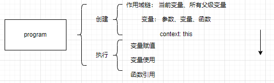
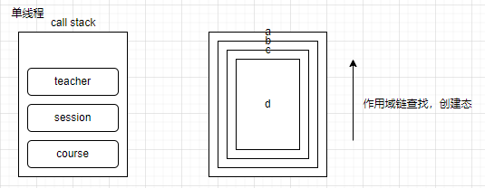
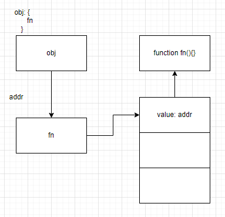

# 课程目标

- 作用域
- this上下文context
- 闭包

# 知识要点



## 作用域链
* 面试题：
```js
let a = 'global';
console.log(a);

function course() {
    let b = 'zhaowa';
    console.log(b);

    session();
    function session() {
        let c = 'this';
        console.log(c);

        teacher();
        function teacher() {
            let d = 'yy';
            console.log(d);

            console.log('test1', b);
        }
    }
}
console.log('test2', b);·// Uncaught ReferenceError: b is not defined （报错导致不再往下执行）
course();·// global -> zhaowa -> this -> yy -> test1 zhaowa （上一行报错行不存在时）

if(true) {
    let e = 111;
    console.log(e);·// 111
}
console.log('test3', e)·// Uncaught ReferenceError: e is not defined
```



* 1. 对于作用域链我们直接通过创建态来定位作用域链
* 2. 手动取消全局，使用块级作用域

## this 上下文context
* 我家门前有条河，门前的河上有座桥，河里有群鸭。
* 我家门前有条河，「这河」有座桥，「这河」里有群鸭。

* this是在执行时动态读取上下文决定的，而不是创建时

### 函数直接调用中 - this 指向的是window => 函数表达式、匿名函数、嵌套函数
```js
function foo() {
    console.log('函数内部this', this);
}

foo();	// 函数内部this Window
```

### 隐式绑定 - this的指向是调用堆栈的上一级 => 对象、数组等引用关系逻辑
```js
function fn() {
    console.log('隐式绑定', this.a);
}
const obj = {
    a: 1,
    fn
}

obj.fn = fn;
obj.fn();	// 隐式绑定 1
```


* 面试题：

```js
const foo = {
    bar: 10,
    fn: function() {
        console.log(this.bar);
        console.log(this);
    }
}
// 取出
let fn1 = foo.fn;
// 执行
fn1();	// undefined -> Window

// 追问1， 如何改变指向
const o1 = {
    text: 'o1',
    fn: function() {
        // 直接使用上下文 - 传统分活
        return this.text;
    }
}

const o2 = {
    text: 'o2',
    fn: function() {
        // 呼叫领导执行 - 部门协作
        return o1.fn();
    }
}

const o3 = {
    text: 'o3',
    fn: function() {
        // 直接内部构造 - 公共人
        let fn = o1.fn;
        return fn();
    }
}

console.log('o1fn', o1.fn());	// o1
console.log('o2fn', o2.fn());	// o1
console.log('o3fn', o3.fn());	// undefined
```
* 1. 在执行函数时，函数被上一级调用，上下文指向上一级
* 2. or直接变成公共函数，指向window

#### 追问：现在我要将console.log('o2fn', o2.fn())的结果是o2
```js
// 1. 人为干涉，改变this - bind/call/apply
// 2. 不许改变this
const o1 = {
    text: 'o1',
    fn: function() {
        return this.text;
    }
}

const o2 = {
    text: 'o2',
    fn: o1.fn
}

console.log('o2fn', o2.fn());
// this指向最后调用他的对象，在fn执行时，o1.fn抢过来挂载在自己o2fn上即可
```

### 显式绑定（bind | apply | call）
```js
function foo() {
    console.log('函数内部this', this);
}
foo();

// 使用
foo.call({a: 1});
foo.apply({a: 1});

const bindFoo = foo.bind({a: 1});
bindFoo();
```

#### 追问： call、apply、bind的区别
* 1. call < = > apply 传参不同 依次传入/数组传入
* 2. bind 直接返回不同（返回未执行的函数）

### new - this指向的是new之后得到的实例
```js
class Course {
    constructor(name) {
        this.name = name;
        console.log('构造函数中的this:', this);
    }

    test() {
        console.log('类方法中的this:', this);
    }
}

const course = new Course('this');
course.test();
```

#### 追问：类中异步方法，this有区别吗
```js
class Course {
    constructor(name) {
        this.name = name;
        console.log('构造函数中的this:', this);
    }

    test() {
        console.log('类方法中的this:', this);
    }
    asyncTest() {
        console.log('异步方法外:', this);
        setTimeout(function() {
            console.log('异步方法内:', this);	// Window
        }, 100)
    }
}

const course = new Course('this');
course.test();
course.asyncTest();
```
* 1. 执行setTimeout时，匿名方法执行时，效果和全局执行函数效果相同
* 2. 再追问，如何解决：箭头函数

### bind的原理 / 手写bind
* 原理或者手写类题目，解题思路
* 1. 说明原理，写下注释
* 2. 根据注释，补齐代码
```js
function sum(a, b, c) {
    console.log('sum', this);
    return a + b + c;
}
// 1. 需求：手写bind => bind位置（挂在那里） => Function.prototype
Function.prototype.newBind = function() {
    // 2. bind是什么? 
    const _this = this;
    const args = Array.prototype.slice.call(arguments);
    // args特点，第一项是新的this，第二项~最后一项函数传参
    const newThis = args.shift();

    // a. 返回一个函数
    return function() {
        // b. 返回原函数执行结果 c. 传参不变
        return _this.apply(newThis, args);
    }
}

Function.prototype.newApply = function(context) {
    // 边缘检测
    // 函数检测
    if (typeof this !== 'function') {
        throw new TypeError('Error');
    }
    // 参数检测
    context = context || window;

    // 挂载执行函数
    context.fn = this;

    // 执行执行函数
    let result = arguments[1]
        ? context.fn(...arguments[1])
        : context.fn();

    // 销毁临时挂载
    delete context.fn;
    return result;
}
```

## 聊完作用域、上下文，如何突破作用域束缚
### 闭包：一个函数和他周围状态的引用捆绑在一起的组合

#### 函数作为返回值的场景
```js
function mail() {
    let content = '信';
    return function() {
        console.log(content);
    }
}
const envelop = mail();
envelop();	// 信
```
* 函数外部获取到了函数作用域内的变量值

#### 函数作为参数的时候
```js
// 单一职责
let content;
// 通用存储
function envelop(fn) {
    content = 1;

    fn();
}

// 业务逻辑
function mail() {
    console.log(content);
}

envelop(mail);
```

#### 函数嵌套
```js
let counter = 0;

function outerFn() {
    function innerFn() {
        counter++;
        console.log(counter);
        // ...
    }
    return innerFn;
}
outerFn()();
```

#### 事件处理（异步执行）的闭包
```js
let lis = document.getElementsByTagName('li');

for(var i = 0; i < lis.length; i++) {
    (function(i) {
        lis[i].onclick = function() {
            console.log(i);
        }
    })(i);
}
```

### 追问：
#### 立即执行嵌套
```js
(function immediateA(a) {
    return (function immediateB(b) {
        console.log(a); // 0
    })(1);
})(0);
```

#### 当立即执行遇上块级作用域
```js
let count = 0;

(function immediate() {
    if(count === 0) {
        let count = 1;

        console.log(count);	// 1
    }
    console.log(count);	// 0
})();
```

#### 拆分执行 - 关注
```js
function createIncrement() {
    let count = 0;
    
    function increment() {
        count++;
    }

    let message = `count is ${count}`;

    function log() {
        console.log(message);
    }

    return [increment, log];
}
const [increment, log] = createIncrement();

increment();
increment();
increment();
log();	// count is 0 (message定义的时候就确定了当时的count，后)
```

#### 实现私有变量
```js
function createStack() {
    return {
        items: [],
        push(item) {
            this.item.push(item);
        }
    }
}

const stack = {
    items: [],
    push: function() {}
}

function createStack() {
    const items = [];
    return {
        push(item) {
            items.push(item);
        }
    }
}
// Vuex store
```

