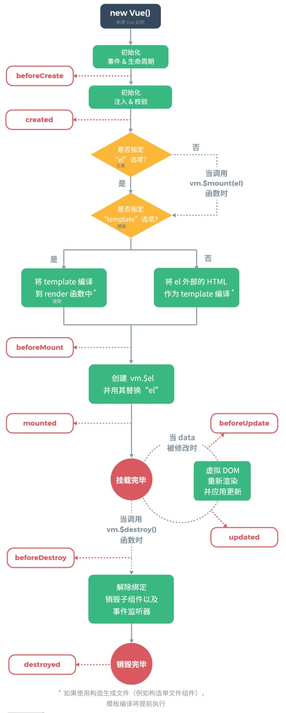

# 课程目标

- vue.js 简介
- vue.js 模板及指令
- vue.js 事件/数据绑定
- vue.js 组件化

# 知识要点

## vue.js 简介

vue 是⼀个响应式的前端视图层框架。 

响应式：我们在编写模版代码时，仅需要关注数据的变化即可，数据变化 UI 即可随之变化，有联动的 感觉。 

视图层：类似于我们之前接触的其他前端模版⼀样，它仅仅只是 UI 层⾯的内容。 

框架：库提供要由其⽗代码调⽤的功能，⽽框架则定义整个应⽤程序设计。开发⼈员不调⽤框架；⽽是 调⽤框架。相反，框架以某种特定⽅式调⽤和使⽤代码。

## vue.js 的 hello world

我们可以通过这种形式，写两个简单 demo。

```vue
<div id="app">
	<p>Message is: {{ message }}</p>
</div>
<script>
	var app = new Vue({
		el: '#app',
		data: {
			message: 'hello world'
		}
	});
</script>
```

另⼀个例⼦，将 input 中的数据⼜能随时随地渲染到其他绑定到 DOM 元素上。

```vue
<div id="app">
	<input v-on:input="onInput" v-bind:value="message">
	<p>Message is: {{ message }}</p>
</div>
<script>
	var app = new Vue({
		el: '#app',
		data: {
			message: 'hello world'
		},
		methods: {
			onInput(e) {
				this.message = e.target.value;
			}
		}
	});
</script>
```

## vue.js 引入

我们可以通过多种⽅式引⼊ vue ，这⾥来详细的进⾏对⽐： 

1. 直接引⽤ vue.js ，适合⼩型项⽬或部分使⽤ vue 
   1. 引⽤全部 vue.js，运⾏时编译及渲染 
   2. 引⽤部分 vue.js，仅引⼊渲染部分 
2. 使⽤ vue-cli ⼯程化启动整体 vue 项⽬

## vue.js 细节

### 模板中的{{}}

`{{}}` 内部接受⼀个表达式，这⾥我们要区分⼀下表达式和语句间的区别。

### 标签中的新属性

- v-bind：我们能将 data 中的值绑定到当前属性中，可简写为 : 
- v-on：能够绑定实例中配置的事件，可简写为 @ 
- v-for：列表级别渲染，迭代渲染所有⼦元素 
- v-if/v-else/v-show：控制⼦元素视图显隐 
- v-model：应⽤于表单，创建与元素的双向绑定 
- v-html：将最终值的结果渲染为 html 
- v-text：等同于直接在⽂本处使⽤ `{{xx}}`

### 计算属性

⼤部分时候，我们在模版也就是 html 中写表达式会让模版变得复杂，所以我们可以通过计算属性来简 化我们的模版。 

但⼤多数时候，我们也可以通过定义⽅法的形式来直接在表达式内调⽤函数。不过计算属性也可以模拟 出使⽤参数的形式。

### vue.js 组件

上⾯示例中的 `new Vue` 实例化之后，在具体的元素上实例化了根节点。对于框架⽽⾔，⼀般都会给⽤ 户提供⼀种复⽤的⽅式，⽽在 vue 中，我们可以通过定义组件的⽅式，来实现模版的复⽤来减少代码。

```js
Vue.component('hello-world', {
	data: function () {
		return {
			message: 'hello world'
		}
	},
	template: '<p>{{message}}</p>'
});
new Vue({ el: '#app' })
```

```html
<div>
	<hello-world></hello-world>
</div>
```

**区分有状态组件与⽆状态组件**

⼤部分时候，我们需要区分⼀些具有副作⽤的组件，例如某些组件我们需要发送 ajax 请求之后渲染⼀些 数据，这时候我们就需要将这部分数据内容进⾏⼀个区分，推荐做法将 UI 部分渲染于⼦组件中，做⼀ 个只通过传⼊数据渲染的⽆状态组件，⽽在有副作⽤组件中维护所有的数据。

### 生命周期

实例化了 Vue 之后，随着内部逻辑的推进，慢慢的 Vue 会对应执⾏配置的部分⽅法，这部分⽅法名是提 前约定好的，按照官⽹的图为：



其中只有`beforeCreate`和`created`两个生命周期函数会在服务端渲染vue组件时用到。