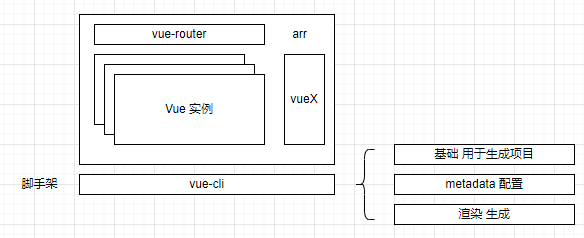
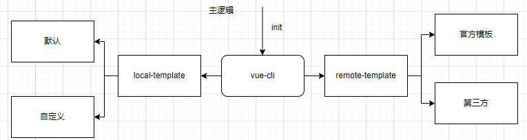
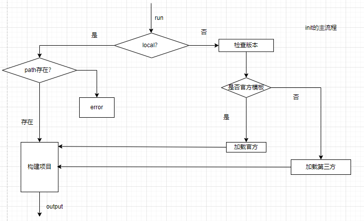
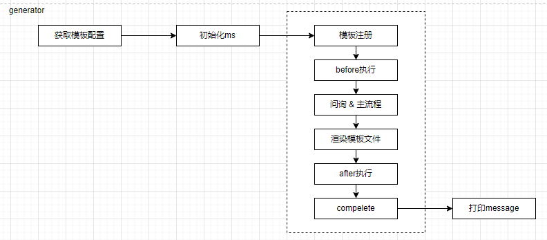
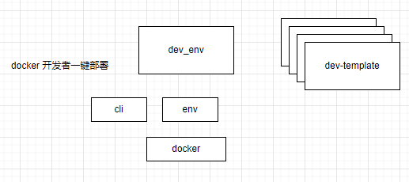
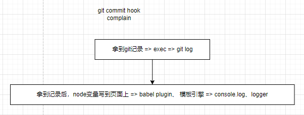

# 课程目标

- vue-cli 原理及用法完全掌握
- vue-cli 源码解析

# 知识要点

vue-cli是一个脚手架: https://github.com/vuejs/vue-cli



```bash
vue init webpack zhaowa-project
```

## 主逻辑流程



vue的几个指令

```js
// bin/vue
const program = require('commander')

program
  .version(require('../package').version)
  .usage('<command> [options]')
  .command('init', 'generate a new project from a template')
  .command('list', 'list available official templates')
  .command('build', 'prototype a new project')
  .command('create', '(for v3 warning only)')

program.parse(process.argv)
```

## init的主流程



```js
// bin/vue-init
// 下载远程仓库
const download = require('download-git-repo')
// 命令行处理工具
const program = require('commander')
// 路径检测
const exists = require('fs').existsSync
const path = require('path')
const ora = require('ora')
// 用户根目录
const home = require('user-home')
// 波浪符路径转换
const tildify = require('tildify')
const chalk = require('chalk')
// 命令行与开发者交流的工具
const inquirer = require('inquirer')
const rm = require('rimraf').sync
// 日志打印
const logger = require('../lib/logger')

// 内部自定义方法
const generate = require('../lib/generate')
const checkVersion = require('../lib/check-version')
const warnings = require('../lib/warnings')
const localPath = require('../lib/local-path')

const isLocalPath = localPath.isLocalPath
const getTemplatePath = localPath.getTemplatePath

/**
 * Usage.
 */

// 配置commander使用方法
program
  .usage('<template-name> [project-name]')
  .option('-c, --clone', 'use git clone')
  .option('--offline', 'use cached template')

/**
 * Help.
 */

program.on('--help', () => {
  console.log('  Examples:')
  console.log()
  console.log(chalk.gray('    # create a new project with an official template'))
  console.log('    $ vue init webpack my-project')
  console.log()
  console.log(chalk.gray('    # create a new project straight from a github template'))
  console.log('    $ vue init username/repo my-project')
  console.log()
})

/**
 * Help.
 */

function help () {
  program.parse(process.argv)
  if (program.args.length < 1) return program.help()
}
help()

/**
 * Settings.
 */
// 模板名称
let template = program.args[0]
const hasSlash = template.indexOf('/') > -1
// 项目构建目录名
const rawName = program.args[1]
const inPlace = !rawName || rawName === '.'
const name = inPlace ? path.relative('../', process.cwd()) : rawName
const to = path.resolve(rawName || '.')
const clone = program.clone || false

// 模板加载地址
const tmp = path.join(home, '.vue-templates', template.replace(/[\/:]/g, '-'))
if (program.offline) {
  console.log(`> Use cached template at ${chalk.yellow(tildify(tmp))}`)
  template = tmp
}

/**
 * Padding.
 */

console.log()
process.on('exit', () => {
  console.log()
})

// 是否为当前目录下构建 or 存在当前路径
if (inPlace || exists(to)) {
  inquirer.prompt([{
    type: 'confirm',
    message: inPlace
      ? 'Generate project in current directory?'
      : 'Target directory exists. Continue?',
    name: 'ok'
  }]).then(answers => {
    if (answers.ok) {
      run()
    }
  }).catch(logger.fatal)
} else {
  run()
}

/**
 * Check, download and generate the project.
 */

// init定义主函数
function run () {
  // check if template is local
  // 是否走本地模板
  if (isLocalPath(template)) {
    // 获取文件路径
    // ~/.vue-template
    const templatePath = getTemplatePath(template)
    if (exists(templatePath)) {
      // 开始生成框架
      generate(name, templatePath, to, err => {
        if (err) logger.fatal(err)
        console.log()
        logger.success('Generated "%s".', name)
      })
    } else {
      logger.fatal('Local template "%s" not found.', template)
    }
  } else {
    // 检查版本号
    checkVersion(() => {
      // 官方 or 第三方
      if (!hasSlash) {
        // use official templates
        const officialTemplate = 'vuejs-templates/' + template
        if (template.indexOf('#') !== -1) {
          // 先下载 后生成
          downloadAndGenerate(officialTemplate)
        } else {
          if (template.indexOf('-2.0') !== -1) {
            warnings.v2SuffixTemplatesDeprecated(template, inPlace ? '' : name)
            return
          }

          // warnings.v2BranchIsNowDefault(template, inPlace ? '' : name)
          downloadAndGenerate(officialTemplate)
        }
      } else {
        downloadAndGenerate(template)
      }
    })
  }
}

/**
 * Download a generate from a template repo.
 *
 * @param {String} template
 */

function downloadAndGenerate (template) {
  const spinner = ora('downloading template')
  spinner.start()
  // Remove if local template exists
  if (exists(tmp)) rm(tmp)
  // 下载
  download(template, tmp, { clone }, err => {
    spinner.stop()
    if (err) logger.fatal('Failed to download repo ' + template + ': ' + err.message.trim())
    // 生成
    generate(name, tmp, to, err => {
      if (err) logger.fatal(err)
      console.log()
      logger.success('Generated "%s".', name)
    })
  })
}
```

commander: https://github.com/tj/commander.js  -写工具类函数常用

## 自定义方法generate



```js
// lib/generate.js
const chalk = require('chalk')
// 静态网页生成
const Metalsmith = require('metalsmith')
// 模板引擎
const Handlebars = require('handlebars')
const async = require('async')
// 模板引擎解析渲染器
const render = require('consolidate').handlebars.render
const path = require('path')
// 多个条件匹配
const multimatch = require('multimatch')
const getOptions = require('./options')
const ask = require('./ask')
const filter = require('./filter')
const logger = require('./logger')

// register handlebars helper
Handlebars.registerHelper('if_eq', function (a, b, opts) {
  return a === b
    ? opts.fn(this)
    : opts.inverse(this)
})

Handlebars.registerHelper('unless_eq', function (a, b, opts) {
  return a === b
    ? opts.inverse(this)
    : opts.fn(this)
})

/**
 * Generate a template given a `src` and `dest`.
 *
 * @param {String} name
 * @param {String} src
 * @param {String} dest
 * @param {Function} done
 */

module.exports = function generate (name, src, dest, done) {
  // 读取配置项入口
  const opts = getOptions(name, src)
  console.log('getOptions', opts)
  // metalsmith初始化
  const metalsmith = Metalsmith(path.join(src, 'template'))

  // 配置项合并
  const data = Object.assign(metalsmith.metadata(), {
    destDirName: name,
    inPlace: dest === process.cwd(),
    noEscape: true
  })

  // 配置对象
  opts.helpers && Object.keys(opts.helpers).map(key => {
    Handlebars.registerHelper(key, opts.helpers[key])
  })

  const helpers = { chalk, logger }

  // 调用before钩子
  if (opts.metalsmith && typeof opts.metalsmith.before === 'function') {
    opts.metalsmith.before(metalsmith, opts, helpers)
    console.log('metalsmith before')
  }

  // 询问
  metalsmith.use(askQuestions(opts.prompts))
    // 配置过滤
    .use(filterFiles(opts.filters))
    .use(renderTemplateFiles(opts.skipInterpolation))


  // 直接执行（ms为函数，直接执行）
  // 有after配置的 执行after钩子
  if (typeof opts.metalsmith === 'function') {
    opts.metalsmith(metalsmith, opts, helpers)
    console.log('metalsmith exec')
  } else if (opts.metalsmith && typeof opts.metalsmith.after === 'function') {
    opts.metalsmith.after(metalsmith, opts, helpers)
    console.log('metalsmith after')
  }

  metalsmith.clean(false)
    .source('.') // start from template root instead of `./src` which is Metalsmith's default for `source`
    .destination(dest)
    .build((err, files) => {
      done(err)
      // 结尾后执行complete回调
      if (typeof opts.complete === 'function') {
        const helpers = { chalk, logger, files }
        opts.complete(data, helpers)
        console.log('metalsmith complete')
      } else {
        // 有completeMessage 完成调用logMessage
        logMessage(opts.completeMessage, data)
      }
    })

  return data
}

/**
 * Create a middleware for asking questions.
 *
 * @param {Object} prompts
 * @return {Function}
 */

// 用户交互入口
function askQuestions (prompts) {
  return (files, metalsmith, done) => {
    // 自定义函数
    ask(prompts, metalsmith.metadata(), done)
  }
}

/**
 * Create a middleware for filtering files.
 *
 * @param {Object} filters
 * @return {Function}
 */

function filterFiles (filters) {
  return (files, metalsmith, done) => {
    // 过滤自定义函数
    filter(files, filters, metalsmith.metadata(), done)
  }
}

/**
 * Template in place plugin.
 *
 * @param {Object} files
 * @param {Metalsmith} metalsmith
 * @param {Function} done
 */

function renderTemplateFiles (skipInterpolation) {
  // 确保传入数组
  skipInterpolation = typeof skipInterpolation === 'string'
    ? [skipInterpolation]
    : skipInterpolation
  return (files, metalsmith, done) => {
    const keys = Object.keys(files)
    const metalsmithMetadata = metalsmith.metadata()
    async.each(keys, (file, next) => {
      // 进入异步处理每个文件
      // skipInterpolation - 要跳过的文件
      // skipping files with skipInterpolation option
      if (skipInterpolation && multimatch([file], skipInterpolation, { dot: true }).length) {
        return next()
      }
      // 内容字符串
      const str = files[file].contents.toString()
      // do not attempt to render files that do not have mustaches
      if (!/{{([^{}]+)}}/g.test(str)) {
        return next()
      }

      // 渲染文件
      render(str, metalsmithMetadata, (err, res) => {
        if (err) {
          err.message = `[${file}] ${err.message}`
          return next(err)
        }
        files[file].contents = new Buffer(res)
        next()
      })
    }, done)
  }
}

/**
 * Display template complete message.
 *
 * @param {String} message
 * @param {Object} data
 */

function logMessage (message, data) {
  if (!message) return
  render(message, data, (err, res) => {
    if (err) {
      console.error('\n   Error when rendering template complete message: ' + err.message.trim())
    } else {
      console.log('\n' + res.split(/\r?\n/g).map(line => '   ' + line).join('\n'))
    }
  })
}
```

metalsmith: https://github.com/metalsmith/metalsmith

```js
// lib/options.js
const path = require('path')
// 读取元数据参数
const metadata = require('read-metadata')
const exists = require('fs').existsSync
// 获取本地git配置
const getGitUser = require('./git-user')
// npm包校验器
const validateName = require('validate-npm-package-name')

/**
 * Read prompts metadata.
 *
 * @param {String} dir
 * @return {Object}
 */

// 获取元配置文件 => name设置校验 => 和本地git作者信息做合并

module.exports = function options (name, dir) {
  const opts = getMetadata(dir)

  setDefault(opts, 'name', name)
  setValidateName(opts)

  const author = getGitUser()
  if (author) {
    setDefault(opts, 'author', author)
  }

  return opts
}

/**
 * Gets the metadata from either a meta.json or meta.js file.
 *
 * @param  {String} dir
 * @return {Object}
 */

function getMetadata (dir) {
  const json = path.join(dir, 'meta.json')
  const js = path.join(dir, 'meta.js')
  let opts = {}

  if (exists(json)) {
    opts = metadata.sync(json)
  } else if (exists(js)) {
    const req = require(path.resolve(js))
    if (req !== Object(req)) {
      throw new Error('meta.js needs to expose an object')
    }
    opts = req
  }

  return opts
}

/**
 * Set the default value for a prompt question
 *
 * @param {Object} opts
 * @param {String} key
 * @param {String} val
 */

function setDefault (opts, key, val) {
  if (opts.schema) {
    opts.prompts = opts.schema
    delete opts.schema
  }
  const prompts = opts.prompts || (opts.prompts = {})
  if (!prompts[key] || typeof prompts[key] !== 'object') {
    prompts[key] = {
      'type': 'string',
      'default': val
    }
  } else {
    prompts[key]['default'] = val
  }
}

function setValidateName (opts) {
  const name = opts.prompts.name
  const customValidate = name.validate
  name.validate = name => {
    const its = validateName(name)
    if (!its.validForNewPackages) {
      const errors = (its.errors || []).concat(its.warnings || [])
      return 'Sorry, ' + errors.join(' and ') + '.'
    }
    if (typeof customValidate === 'function') return customValidate(name)
    return true
  }
}
```

```js
// lib/ask.js
const async = require('async')
const inquirer = require('inquirer')
const Metalsmith = require('metalsmith')
const evaluate = require('./eval')

// Support types from prompt-for which was used before
const promptMapping = {
  string: 'input',
  boolean: 'confirm'
}

/**
 * Ask questions, return results.
 *
 * @param {Object} prompts
 * @param {Object} data
 * @param {Function} done
 */
// meta.json meta.js prompts
// data - Metalsmith.metadata()
// done - next流程
module.exports = function ask (prompts, data, done) {
  async.eachSeries(Object.keys(prompts), (key, next) => {
    prompt(data, key, prompts[key], next)
  }, done)
}

/**
 * Inquirer prompt wrapper.
 *
 * @param {Object} data
 * @param {String} key
 * @param {Object} prompt
 * @param {Function} done
 */

function prompt (data, key, prompt, done) {
  // skip prompts whose when condition is not met
  if (prompt.when && !evaluate(prompt.when, data)) {
    return done()
  }
  
  // 赋予默认值
  let promptDefault = prompt.default
  if (typeof prompt.default === 'function') {
    promptDefault = function () {
      return prompt.default.bind(this)(data)
    }
  }

  inquirer.prompt([{
    type: promptMapping[prompt.type] || prompt.type,
    name: key,
    message: prompt.message || prompt.label || key,
    default: promptDefault,
    choices: prompt.choices || [],
    validate: prompt.validate || (() => true)
  }]).then(answers => {
    // 根据答案类型拼接数据
    if (Array.isArray(answers[key])) {
      data[key] = {}
      answers[key].forEach(multiChoiceAnswer => {
        data[key][multiChoiceAnswer] = true
      })
    } else if (typeof answers[key] === 'string') {
      data[key] = answers[key].replace(/"/g, '\\"')
    } else {
      data[key] = answers[key]
    }
    done()
  }).catch(done)
}
```

inquirer：https://github.com/SBoudrias/inquirer.js

```js
// lib/filter.js
const match = require('minimatch')
const evaluate = require('./eval')

// 经过ask获取用户需求之后 => metadata => 过滤掉不需要的模板文件

// files 模板内所有文件
// filters - 配置中的filters字段
// metadata
// done => next

module.exports = (files, filters, data, done) => {
  if (!filters) {
    return done()
  }
  const fileNames = Object.keys(files)
  Object.keys(filters).forEach(glob => {
    fileNames.forEach(file => {
      // 匹配文件名
      if (match(file, glob, { dot: true })) {
        const condition = filters[glob]
        // condition表达式不成立就删除文件
        if (!evaluate(condition, data)) {
          delete files[file]
        }
      }
    })
  })
  done()
}
```

```js
// lib/logger.js
const chalk = require('chalk')
const format = require('util').format

// 统一打印管理器

/**
 * Prefix.
 */

const prefix = '   vue-cli'
const sep = chalk.gray('·')

/**
 * Log a `message` to the console.
 *
 * @param {String} message
 */

exports.log = function (...args) {
  const msg = format.apply(format, args)
  console.log(chalk.white(prefix), sep, msg)
}

/**
 * Log an error `message` to the console and exit.
 *
 * @param {String} message
 */

exports.fatal = function (...args) {
  if (args[0] instanceof Error) args[0] = args[0].message.trim()
  const msg = format.apply(format, args)
  console.error(chalk.red(prefix), sep, msg)
  process.exit(1)
}

/**
 * Log a success `message` to the console and exit.
 *
 * @param {String} message
 */

exports.success = function (...args) {
  const msg = format.apply(format, args)
  console.log(chalk.white(prefix), sep, msg)
}
```

```js
// lib/check-version.js
const request = require('request')
const semver = require('semver')
const chalk = require('chalk')
const packageConfig = require('../package.json')

// 检查node版本号（直接block） => 检查vue-cli版本（提示）

module.exports = done => {
  // Ensure minimum supported node version is used
  if (!semver.satisfies(process.version, packageConfig.engines.node)) {
    return console.log(chalk.red(
      '  You must upgrade node to >=' + packageConfig.engines.node + '.x to use vue-cli'
    ))
  }

  request({
    url: 'https://registry.npmjs.org/vue-cli',
    timeout: 1000
  }, (err, res, body) => {
    if (!err && res.statusCode === 200) {
      const latestVersion = JSON.parse(body)['dist-tags'].latest
      const localVersion = packageConfig.version
      if (semver.lt(localVersion, latestVersion)) {
        console.log(chalk.yellow('  A newer version of vue-cli is available.'))
        console.log()
        console.log('  latest:    ' + chalk.green(latestVersion))
        console.log('  installed: ' + chalk.red(localVersion))
        console.log()
      }
    }
    done()
  })
}
```

```js
// lib/eval.js
const chalk = require('chalk')

/**
 * Evaluate an expression in meta.json in the context of
 * prompt answers data.
 */
// 传入可执行函数
module.exports = function evaluate (exp, data) {
  /* eslint-disable no-new-func */
  const fn = new Function('data', 'with (data) { return ' + exp + '}')
  try {
    return fn(data)
  } catch (e) {
    console.error(chalk.red('Error when evaluating filter condition: ' + exp))
  }
}
```

```js
// lib/git-user.js
const exec = require('child_process').execSync
// 对于用户git信息的收集
module.exports = () => {
  let name
  let email

  try {
    name = exec('git config --get user.name')
    email = exec('git config --get user.email')
  } catch (e) {}

  name = name && JSON.stringify(name.toString().trim()).slice(1, -1)
  email = email && (' <' + email.toString().trim() + '>')
  return (name || '') + (email || '')
}
```

```js
// lib/local-path.js
const path = require('path')

module.exports = {
  isLocalPath (templatePath) {
    return /^[./]|(^[a-zA-Z]:)/.test(templatePath)
  },

  getTemplatePath (templatePath) {
    return path.isAbsolute(templatePath)
      ? templatePath
      : path.normalize(path.join(process.cwd(), templatePath))
  }
}
```

```js
// lib/warnings.js
const chalk = require('chalk')

module.exports = {
  // 官方目前默认2.0 故不用强制定义-2.0
  v2SuffixTemplatesDeprecated (template, name) {
    const initCommand = 'vue init ' + template.replace('-2.0', '') + ' ' + name

    console.log(chalk.red('  This template is deprecated, as the original template now uses Vue 2.0 by default.'))
    console.log()
    console.log(chalk.yellow('  Please use this command instead: ') + chalk.green(initCommand))
    console.log()
  },
  // 提示默认2.0模板
  v2BranchIsNowDefault (template, name) {
    const vue1InitCommand = 'vue init ' + template + '#1.0' + ' ' + name

    console.log(chalk.green('  This will install Vue 2.x version of the template.'))
    console.log()
    console.log(chalk.yellow('  For Vue 1.x use: ') + chalk.green(vue1InitCommand))
    console.log()
  }
}
```

# 补充知识点

## docker开发者一键部署

远端有很多开发模板dev-template，docker有一个存储镜像，能快速建立dev_env环境，需要有自己服务的脚手架cli，生成自己的环境env（env是建立在docker里的，模板是从远端的标准模板哪来的），快速建立开发环境。



## git记录写到页面上

