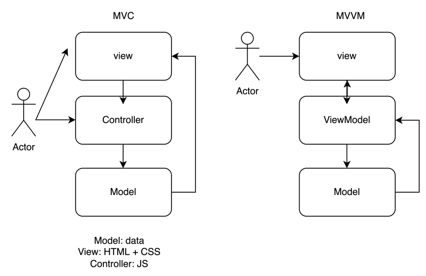
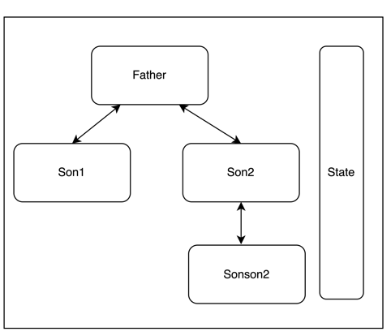
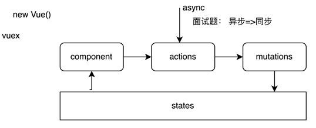
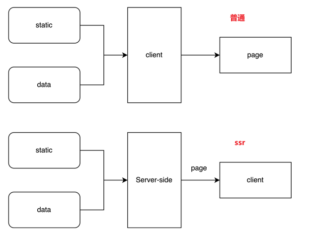

# 课程目标

- 前端状态管理出现的意义及解决的问题
- vuex 介绍及深入使用
- vue.js 服务端渲染介绍

# 知识要点

## MVC和MVVM框架



**面试题：MVVM的理解**

1. 区别：抛弃了对dom的严格感知，无需对流程的过程化操作
2. 实现：写法上、代码可维护

## vuex

**面试题：vue的组件传值-兄弟节点**

1. 通过父节点
2. eventBus
3. provide inject
4. vuex



总线机制（单例实现-全局只能有一个）



**面试题：为何要兜一圈**

为了满足异步响应

**面试题：异步转同步**

```vue
<script>
    export default {
        methods: {
            asyncFunc() {
                return new Promise(resolve => {
                    setTimeout(() => {
                        resolve(true)
                        console.log('async 4000');
                        this.$store.dispatch('setNodeInfo', {
                          name: 'async 4000'
                        })
                    }, 4000)
                })
            },
            asyncFunc2() {
                return new Promise(resolve => {
                    setTimeout(() => {
                        resolve(true)
                        console.log('async 5000');
                        this.$store.dispatch('setNodeInfo', {
                          name: 'async 5000'
                        })
                    }, 5000)
                })
            }
        },
        async mounted() {
            // promise解决
            this.asyncFunc().then(() => {
                console.log('mounted')
            })

            // es语法
            await this.asyncFunc()
            console.log('mounted')

            // 追问-多个异步
            // 全部 & 竞争
            Promise.all([this.asyncFunc(), this.asyncFunc2()]).then(() => {
                console.log('all done')
            })
            Promise.race([this.asyncFunc(), this.asyncFunc2()]).then(() => {
                console.log('all done')
            })

            // 多个异步依赖执行
            await this.asyncFunc()
            await this.asyncFunc2()

            // co库 - 简单实现 - 迭代器模式
            // koa
            const pipeLine = [this.asyncFunc, this.asyncFunc2]

            setIterator(pipeLine)

            // next() - function* + yield - 生成器
            function* setGenerator(pipeLine) {
                for(const fn of pipeLine) {
                    yield fn()
                }
            }

            // 配置迭代器 - main
            function setIterator(pipeLine) {
                const generator = setGenerator(pipeline)

                GFC(generator)
            }

            // 流水线 - 区分异步同步，依次执行
            function GFC(gen) {
                const item = gen.next()

                if (item.done) {
                    return item.value
                }

                const { value, done } = item
                if (value instanceof Promise) {
                    value.then(e => GFC(gen))
                }
                else {
                    GFC(gen)
                }
            }
        }
    }
</script>
```

### vuex使用

```js
import Vue from 'vue'
import App from './App.vue'
import store from './store'

Vue.config.productionTip = false

new Vue({
    render: h => h(App),
    store
}).$mount('#app')
```

```js
// store/index.js
import Vue from 'vue'
import Vuex from 'vuex'

// 1. use上
Vue.use(Vuex)

// 2. 创建store实例
const store = new Vuex.Store({
    actions: {
        setNodeInfo({ commit }, info) {
            // 可以做异步处理
            commit('SET_NODE_INFO', {
                info
            })
        }
    },
    mutations: {
        SET_NODE_INFO(state, { info }) {
            state.nodeInfo = info
        }
    },
    state: {
        nodeInfo: {
            name: '-',
            age: 0,
            words: 'hello world'
        }
    }
})

export default store;
```

```vue
<!-- App.vue -->
<script>
    // import { mapState } from 'vuex'
    
    export default {
        name: 'App',
        data () {
            return {
                nodeInfo: {
            		name: '-',
            		age: 0,
            		words: 'hello world'
                }
            }
        },
        computed: {
            // 辅助函数
            // ...mapState(['nodeInfo']),
            // ...mapState({
            //   nodeInfo: state => state.nodeInfo
            // }),
            localNodeInfo () {
                // 取值
                return this.$store.state.nodeInfo
            }
        },
        mounted () {
            // 赋值
            this.$store.dispatch('setNodeInfo', this.nodeInfo)
        }
    }
</script>
```

### vuex源码

```js
// 1、挂载
// use时候的开始
export function install (_Vue) {
    // 校验vue已经被挂载，却传入和Vue相同 => 已经use过了
    if (Vue && _Vue === Vue) {
        if (__DEV__) {
            console.error(
                '[vuex] already installed. Vue.use(Vuex) should be called only once.'
            )
        }
        return
    }
    Vue = _Vue
    // 开始主流程 做混入操作
    applyMixin(Vue)
}
```

vuex3 基于 mixin

vuex4 基于 provide

```js
// applyMixin
export default function (Vue) {
    const version = Number(Vue.version.split('.')[0])
    // 兼容下老版本 面试官：vuex什么时候进行的初始化 - beforeCreate
    if (version >= 2) {
        Vue.mixin({ beforeCreate: vuexInit })
    } else {
        // override init and inject vuex init procedure
        // for 1.x backwards compatibility.
        const _init = Vue.prototype._init
        Vue.prototype._init = function (options = {}) {
            options.init = options.init
                ? [vuexInit].concat(options.init)
            : vuexInit
            _init.call(this, options)
        }
    }

    /**
    * Vuex init hook, injected into each instances init hooks list.
    */
    // vuex 初始化操作
    function vuexInit () {
        const options = this.$options
        // store injection
        // store 注入到每个实例中
        if (options.store) {
            this.$store = typeof options.store === 'function'
                ? options.store()
            : options.store
        } else if (options.parent && options.parent.$store) {
            this.$store = options.parent.$store
        }
    }
}
```

```js
// 实例对象的描述
export class Store {
    constructor (options = {}) {
        // Auto install if it is not done yet and `window` has `Vue`.   
        // To allow users to avoid auto-installation in some cases,
        // this code should be placed here. See #731
        // cdn直接引用的方式，可以自动install
        if (!Vue && typeof window !== 'undefined' && window.Vue) {
            install(window.Vue)
        }

        if (__DEV__) {
            // 面试题： vuex自己定义了告警，为啥不用console.assert? - throw Error
            assert(Vue, `must call Vue.use(Vuex) before creating a store instance.`)
            assert(typeof Promise !== 'undefined', `vuex requires a Promise polyfill in this browser.`)
            // 必须要用new操作符调用Store
            assert(this instanceof Store, `store must be called with the new operator.`)
        }

        // 参数初始化
        const {
            plugins = [],
            strict = false
        } = options

        // store internal state
        this._committing = false
        this._actions = Object.create(null)
        this._actionSubscribers = []
        this._mutations = Object.create(null)
        // 用来存储用户定义getters - 响应式
        this._wrappedGetters = Object.create(null)
        this._modules = new ModuleCollection(options)
        this._modulesNamespaceMap = Object.create(null)
        this._subscribers = []
        // 响应式$watch
        this._watcherVM = new Vue()
        this._makeLocalGettersCache = Object.create(null)

        // bind commit and dispatch to self
        // 写单例core，可以参考 确认this是当前store的实例
        const store = this
        const { dispatch, commit } = this
        this.dispatch = function boundDispatch (type, payload) {
            return dispatch.call(store, type, payload)
        }
        this.commit = function boundCommit (type, payload, options) {
            return commit.call(store, type, payload, options)
        }

        // strict mode
        this.strict = strict

        const state = this._modules.root.state

        // init root module.
        // this also recursively registers all sub-modules
        // and collects all module getters inside this._wrappedGetters
        installModule(this, state, [], this._modules.root)

        // initialize the store vm, which is responsible for the reactivity
        // (also registers _wrappedGetters as computed properties)
        resetStoreVM(this, state)

        // apply plugins
        plugins.forEach(plugin => plugin(this))
        
        const useDevtools = options.devtools !== undefined ? options.devtools : Vue.config.devtools
        if (useDevtools) {
            devtoolPlugin(this)
        }
    }

    get state () {
        return this._vm._data.$$state
    }

    set state (v) {
        if (__DEV__) {
            assert(false, `use store.replaceState() to explicit replace store state.`)
        }
    }

    commit (_type, _payload, _options) {
        // check object-style commit
        const {
            type,
            payload,
            options
        } = unifyObjectStyle(_type, _payload, _options)

        const mutation = { type, payload }
        const entry = this._mutations[type]
        if (!entry) {
            if (__DEV__) {
                console.error(`[vuex] unknown mutation type: ${type}`)
            }
            return
        }
        this._withCommit(() => {
            entry.forEach(function commitIterator (handler) {
                handler(payload)
            })
        })

        this._subscribers
            .slice() // shallow copy to prevent iterator invalidation if subscriber synchronously calls unsubscribe
            .forEach(sub => sub(mutation, this.state))

        if (
            __DEV__ &&
            options && options.silent
        ) {
            console.warn(
                `[vuex] mutation type: ${type}. Silent option has been removed. ` +
                'Use the filter functionality in the vue-devtools'
            )
        }
    }

    dispatch (_type, _payload) {
        // check object-style dispatch
        const {
            type,
            payload
        } = unifyObjectStyle(_type, _payload)

        const action = { type, payload }
        const entry = this._actions[type]
        if (!entry) {
            if (__DEV__) {
                console.error(`[vuex] unknown action type: ${type}`)
            }
            return
        }

        try {
            this._actionSubscribers
                .slice() // shallow copy to prevent iterator invalidation if subscriber synchronously calls unsubscribe
                .filter(sub => sub.before)
                .forEach(sub => sub.before(action, this.state))
        } catch (e) {
            if (__DEV__) {
                console.warn(`[vuex] error in before action subscribers: `)
                console.error(e)
            }
        }

        const result = entry.length > 1
        ? Promise.all(entry.map(handler => handler(payload)))
        : entry[0](payload)

        return new Promise((resolve, reject) => {
            result.then(res => {
                try {
                    this._actionSubscribers
                        .filter(sub => sub.after)
                        .forEach(sub => sub.after(action, this.state))
                } catch (e) {
                    if (__DEV__) {
                        console.warn(`[vuex] error in after action subscribers: `)
                        console.error(e)
                    }
                }
                resolve(res)
            }, error => {
                try {
                    this._actionSubscribers
                        .filter(sub => sub.error)
                        .forEach(sub => sub.error(action, this.state, error))
                } catch (e) {
                    if (__DEV__) {
                        console.warn(`[vuex] error in error action subscribers: `)
                        console.error(e)
                    }
                }
                reject(error)
            })
        })
    }

    subscribe (fn, options) {
        return genericSubscribe(fn, this._subscribers, options)
    }

    subscribeAction (fn, options) {
        const subs = typeof fn === 'function' ? { before: fn } : fn
        return genericSubscribe(subs, this._actionSubscribers, options)
    }

    watch (getter, cb, options) {
        if (__DEV__) {
            assert(typeof getter === 'function', `store.watch only accepts a function.`)
        }
        return this._watcherVM.$watch(() => getter(this.state, this.getters), cb, options)
    }

    replaceState (state) {
        this._withCommit(() => {
            this._vm._data.$$state = state
        })
    }

    registerModule (path, rawModule, options = {}) {
        if (typeof path === 'string') path = [path]
        
        if (__DEV__) {
            assert(Array.isArray(path), `module path must be a string or an Array.`)
            assert(path.length > 0, 'cannot register the root module by using registerModule.')
        }

        this._modules.register(path, rawModule)
        installModule(this, this.state, path, this._modules.get(path), options.preserveState)
        // reset store to update getters...
        resetStoreVM(this, this.state)
    }

    unregisterModule (path) {
        if (typeof path === 'string') path = [path]

        if (__DEV__) {
            assert(Array.isArray(path), `module path must be a string or an Array.`)
        }

        this._modules.unregister(path)
        this._withCommit(() => {
            const parentState = getNestedState(this.state, path.slice(0, -1))
            Vue.delete(parentState, path[path.length - 1])
        })
        resetStore(this)
    }

    hasModule (path) {
        if (typeof path === 'string') path = [path]
        
        if (__DEV__) {
            assert(Array.isArray(path), `module path must be a string or an Array.`)
        }

        return this._modules.isRegistered(path)
    }

    hotUpdate (newOptions) {
        this._modules.update(newOptions)
        resetStore(this, true)
    }

    _withCommit (fn) {
        const committing = this._committing
        this._committing = true
        fn()
        this._committing = committing
    }
}
```

**面试题：Object.create(null) 和 {}区别 => 原型链**

Object.create(null).\__proto__ 为undefined

({}).\__proto__ 是Object.prototype

```js
function installModule (store, rootState, path, module, hot) {
    const isRoot = !path.length
    const namespace = store._modules.getNamespace(path)

    // register in namespace map
    if (module.namespaced) {
        if (store._modulesNamespaceMap[namespace] && __DEV__) {
            console.error(`[vuex] duplicate namespace ${namespace} for the namespaced module ${path.join('/')}`)
        }
        store._modulesNamespaceMap[namespace] = module
    }

    // set state
    if (!isRoot && !hot) {
        const parentState = getNestedState(rootState, path.slice(0, -1))
        const moduleName = path[path.length - 1]
        store._withCommit(() => {
            if (__DEV__) {
                if (moduleName in parentState) {
                    console.warn(
                        `[vuex] state field "${moduleName}" was overridden by a module with the same name at "${path.join('.')}"`
                    )
                }
            }
            Vue.set(parentState, moduleName, module.state)
        })
    }

    const local = module.context = makeLocalContext(store, namespace, path)

    module.forEachMutation((mutation, key) => {
        const namespacedType = namespace + key
        registerMutation(store, namespacedType, mutation, local)
    })

    module.forEachAction((action, key) => {
        const type = action.root ? key : namespace + key
        const handler = action.handler || action
        registerAction(store, type, handler, local)
    })

    module.forEachGetter((getter, key) => {
        const namespacedType = namespace + key
        registerGetter(store, namespacedType, getter, local)
    })

    module.forEachChild((child, key) => {
        installModule(store, rootState, path.concat(key), child, hot)
    })
}

function resetStoreVM (store, state, hot) {
    const oldVm = store._vm

    // bind store public getters
    store.getters = {}
    // reset local getters cache
    store._makeLocalGettersCache = Object.create(null)
    const wrappedGetters = store._wrappedGetters
    const computed = {}
    // 面试高频出现
    forEachValue(wrappedGetters, (fn, key) => {
        // use computed to leverage its lazy-caching mechanism
        // direct inline function use will lead to closure preserving oldVm.
        // using partial to return function with only arguments preserved in closure environment.
        computed[key] = partial(fn, store)
        // 遍历地将所有getters桥接上store，并配置成computed属性
        Object.defineProperty(store.getters, key, {
            get: () => store._vm[key],
            enumerable: true // for local getters
        })
    })

    // use a Vue instance to store the state tree
    // suppress warnings just in case the user has added
    // some funky global mixins
    const silent = Vue.config.silent
    Vue.config.silent = true
    // 利用vue的能力，做响应式
    store._vm = new Vue({
        data: {
            $$state: state
        },
        computed
    })
    Vue.config.silent = silent

    // enable strict mode for new vm
    if (store.strict) {
        enableStrictMode(store)
    }

    // 销毁
    if (oldVm) {
        if (hot) {
            // dispatch changes in all subscribed watchers
            // to force getter re-evaluation for hot reloading.
            store._withCommit(() => {
                oldVm._data.$$state = null
            })
        }
        Vue.nextTick(() => oldVm.$destroy())
    }
}
```

## ssr



优点：首屏、SEO

缺点：server压力大

### 建立server服务

```bash
npm i vue-server-renderer express -D
```

```js
// node 服务
// 0. 加载依赖
const express = require('express')
const Vue = require('vue')

const app = express()
const renderer = require('vue-server-renderer').createRenderer()

// 渲染器渲染page得到html内容
// 1. page
const page = new Vue({
    template: '<div>hello, ssr</div>'
})

// 2. 传递接口
app.get('/', async(req, res) => {
    try {
        const html = await renderer.renderToString(page)
        res.send(html)
    } catch (error) {
        res.status(500).send('server inner error')
    }
})

// 3. 启动监听服务
app.listen(3000, () => {
    console.log('server start')
})
```

路由：

```js
import Vue from 'vue'
import App from './App.vue'
import createRouter from './router'

export default function createApp() {
    const router = createRouter()
    const app = new Vue({
        router,
        render: h => h(App)
    })

    return { app, router }
}
```

```js
// router/index.js
import Vue from 'vue'
import Router from 'vue-router'
import HelloWorld from '../components/HelloWorld.vue'

Vue.use(Router)

// 普通
// export default new Router({
//     routers: [{
//         path: '/',
//         name: 'Hello world',
//         component: HelloWorld
//     }]
// })

// ssr
export default function createRouter() {
    return new Router({
        routers: [{
            path: '/',
            name: 'Hello world',
            component: HelloWorld
        }]
    })
}
```

**面试题：为什么不导出一个router实例**

用户的每个请求都要创建一个实例

