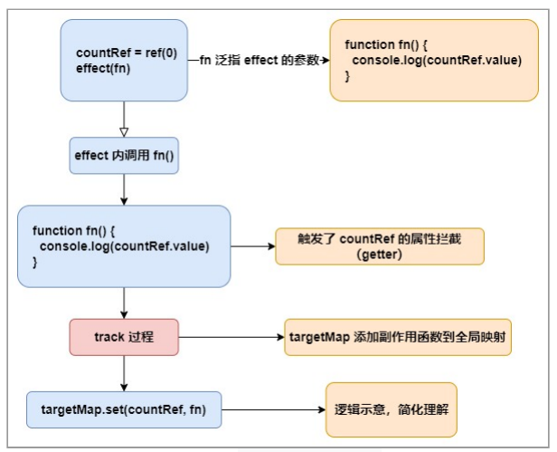
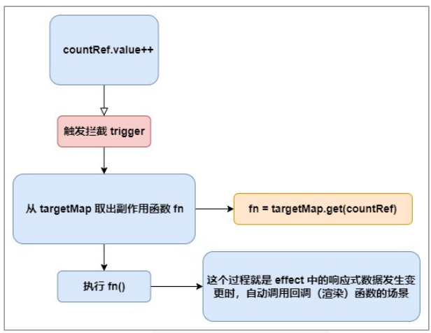

# 课程目标

- vue.js 核心源码解读与解析

# 知识要点

## vue3 核心源码解析

### 核心概念

​		我们已经知道，vue3 的数据响应与劫持是基于现代浏览器所支持的代理对象 Proxy 实现的，我们以下面的代码为主线，对 vue3 源码部分进行了解。

```js
const initData = { value: 1 };
const proxy = new Proxy(
    initData, // 被代理对象
    { // handler 
        get(target, key) {
            // 进行 track
            return target[key];
        },
        set(target, key, value) {
            // 进行 trigger
            return Reflect.set(target, key, value);
        }
    });
// proxy 即直接我们代码中直接访问与修改的对象，
// 也可称为响应式数据（reactive/ref）
```

### 几个关键的函数

​		在 `handler` 部分（ `new Proxy` 的第⼆个参数），有两个过程分别为取值和赋值，我们在取值和赋值中间分别插⼊劫持的方法，即 `track` 和 `trigger` ——依赖的跟踪和副作用的触发。 因此引出下面几个概念/方法：

* track：收集依赖
* trigger：触发副作用函数
* effect：副作用函数
* reactive/ref：基于普通对象创建代理对象的方法
* watch
* computed
* …

​		当然了，源码中的 api 远远不止上⾯列出的几个，不过剩余的部分 api 往往也是基于核心 api 的封装，所以只 要了解这些核心的函数，我们再去阅读 vue3 的源码将会如⻁添翼。

### 从用法开始

```js
// 截取 setup 部分
import { ref, reactive, effect, computed } from 'vue'
export default {
    ...
    setup(props, context) {
    	const countRef = ref(0)
        const number = reactive({ num: 1 })
        effect(() => {
            console.log(countRef.value)
        })
		const increment= () => {
            countRef.value++
        }
        const result = computed(() => number.num ** 2)
        return { countRef, number, result, increment }
	}
}
```

​		用两张图表示的话：



（图一：组件初始化，执行setup）

​		其中，targetMap 是全局声明的 Map，作用是缓存响应式对象及其更新时执行的方法的映射。那么在异步修改 countRef 时，例如点击事件执行 increment ⽅法，可用下图描述整个过程（注意这个过程并不是在 setup 内发生，因为 setup 只执行⼀次）：



（图二：数据变化，执行上⼀步追踪的副作用函数）

​		我们先记住这两条主线，然后对源码进行验证。

### 初始化阶段（源码基于 vue^3.0.4）

#### 创建代理数据

```js
const countRef = ref(0)
const number = reactive({ num: 1 })
```

​		在 reactivity 包中，我们打开 reactivity.esm-browser.js ⽂件（其他不同模块类型的文件类似），找到 ref 函 数。

```js
function ref(value) {
    return createRef(value, false);
}
```

​		顺藤摸瓜：

```js
function createRef(rawValue, shallow) {
    if (isRef(rawValue)) {
        return rawValue;
    }
    return new RefImpl(rawValue, shallow);
}
```

RefImpl：

```js
class RefImpl {
    constructor(value, _shallow) {
        this._shallow = _shallow;
        this.dep = undefined;
        this.__v_isRef = true;
        this._rawValue = _shallow ? value : toRaw(value);
        this._value = _shallow ? value : convert(value);
    }
    get value() {
        trackRefValue(this); // 重点在这⼉，取值时依赖收集
        return this._value;
    }
    set value(newVal) {
        newVal = this._shallow ? newVal : toRaw(newVal);
        if (hasChanged(newVal, this._rawValue)) {
            this._rawValue = newVal;
            this._value = this._shallow ? newVal : convert(newVal);
            triggerRefValue(this, newVal); // 改值时触发更新
        }
    }
}
```

​		看注释的地⽅，这不就是课件开头所说的 track 与 trigger 吗？只不过 ref 是通过类的 get/set 实现的，而且也解开了⼀个谜团——ref 创建的包装值，需要我们通过 .value 的 形式来访问。基于同样的思路，我们学习 reactive ⽅法。

```js
function reactive(target) {
    // if trying to observe a readonly proxy, return the readonly version.
    if (target && target["__v_isReadonly" /* IS_READONLY */ ]) {
        return target;
    }
    return createReactiveObject(
        target,
        false,
        mutableHandlers,
        mutableCollectionHandlers,
        reactiveMap
    );
}
```

​		可⻅ `createReactiveObject` ⽅法是主要逻辑，而且创建浅层响应的方法 `shallowReactive` ，只读方法 `readonly` 等等都用到该函数，找到它：

```js
function createReactiveObject(target, isReadonly, baseHandlers, collectionHandlers,
proxyMap) {
    // 省略部分逻辑
    const existingProxy = proxyMap.get(target);
    if (existingProxy) {
        return existingProxy;
    }
    // 省略部分逻辑
    const proxy = new Proxy(
        target, targetType === 2 /* COLLECTION */ ?
        collectionHandlers : baseHandlers
    );
    proxyMap.set(target, proxy);
    return proxy;
}
```

​		这里能看到，target: { num: 1 } 在此处被代理。如果之前已经被代理过（ `proxyMap` 中有缓存），则直接返回，否则缓存起来并返回。reactive ⽅法使用了 Proxy 来实现代理。

#### 数据追踪

​		按照图⼀顺序，副作用 `effect` 执行，并调用回调方法 fn，由于 fn 内部访问了 `countRef` 的 value 属性

```js
effect(() => {
    console.log(countRef.value)
})

```

​		即这里触发了类 `RefImpl` 定义的 `get` ⽅法：

```js
get value() {
    trackRefValue(this);
    return this._value;
}
...
// 这⾥有条件地使⽤ trackEffects 维护着 ref 实例属性 dep 与
// 活跃中的 effect 的映射，说⼈话就是：包装的数据在第⼀次被 effect 内
// 函数 fn 访问的时候，包装对象顺便把这个函数 fn 也给存了下来。
function trackRefValue(ref) {
    if (isTracking()) {
        ref = toRaw(ref);
        if (!ref.dep) {
            ref.dep = createDep();
        }
        {
            trackEffects(ref.dep, {
                target: ref,
                type: "get" /* GET */ ,
                key: 'value'
            });
        }
    }
}
// activeEffect 是全局变量，在执行 effect 时会指向⼀个包含了 fn 的实例。
// 换句话说，此处 dep.add(activeEffect)
// 等效于 ref.dep.add(wrapper(fn))，wrapper 是过程的简化
function trackEffects(dep) {
    // 省略部分代码
    if (shouldTrack) {
        dep.add(activeEffect); // 这⾥做个标记，记作 coordinate1
        activeEffect.deps.push(dep);
    }
}
```

​		至此，一个最简单的初始化阶段就结束了。

### 状态更新阶段

​		对于图二，以 ref 创建的数据源为例， `countRef.value++` 从下面开始

```js
class RefImpl {
    ...
    set value(newVal) {
        ...
        if (hasChanged(newVal, this._rawValue)) {
            this._rawValue = newVal;
            this._value = this._shallow ? newVal : convert(newVal);
            triggerRefValue(this, newVal); // 改值时触发更新
        }
    }
}
// triggerRefValue
function triggerRefValue(ref, newVal) {
    ref = toRaw(ref);
    if (ref.dep) { // 回到上⾯标记的地⽅ coordinate1
        triggerEffects(ref.dep, {
            target: ref,
            type: "set" /* SET */ ,
            key: 'value',
            newValue: newVal
        });
    }
}
```

​		标记的位置证明包装值 `ref(0)` 通过 dep 对未来要执行的 fn 是存在引⽤关系的，而 `triggerEffect` 方法就根据这个存在的关系，⼀旦 set 时就触发它！

​		triggerEffects

```js
function triggerEffects(dep, debuggerEventExtraInfo) {
    // spread into array for stabilization
    for (const effect of isArray(dep) ? dep : [...dep]) {
        if (effect !== activeEffect || effect.allowRecurse) {
            if (effect.onTrigger) {
                effect.onTrigger(extend({ effect }, debuggerEventExtraInfo));
            }
            if (effect.scheduler) {
                effect.scheduler(); // 这是 fn 在微任务队列中执行的地⽅
            } else {
                effect.run(); // 这是 fn 同步执行的地⽅
            }
        }
    }
}
```

​		我们缕清主线后，再稍微关注⼀下 effect 的逻辑，就能把 scheduler， run 与 fn 联系起来了：

```js
function effect(fn, options) {
    ...
    // setup 函数中的 effect 执行时实例化⼀次，引⽤了 fn
    const _effect = new ReactiveEffect(fn);
    ...
    if (!options || !options.lazy) {
        _effect.run(); // 内部会调⽤ fn
        // 所以怎么跳过第⼀次执行的 fn 不⽤多说了吧
    }
    const runner = _effect.run.bind(_effect);
    runner.effect = _effect;
    return runner;
}

// ReactiveEffect
const effectStack = [];

class ReactiveEffect {
    constructor(fn, scheduler = null, scope) {
        // scheduler 在 computed 函数中会⽤到
        this.fn = fn;
        this.scheduler = scheduler;
        this.active = true;
        this.deps = [];
        recordEffectScope(this, scope);
    }
    run() {
        if (!this.active) {
            return this.fn();
        }
        if (!effectStack.includes(this)) { // 全局未缓存过本实例时
            try {
                effectStack.push((activeEffect = this)); // 重点关注 activeEffect ！
                enableTracking();
                trackOpBit = 1 << ++effectTrackDepth;
                if (effectTrackDepth <= maxMarkerBits) {
                    initDepMarkers(this);
                } else {
                    cleanupEffect(this);
                }
                return this.fn();
            } finally {
                if (effectTrackDepth <= maxMarkerBits) {
                    finalizeDepMarkers(this);
                }
                trackOpBit = 1 << --effectTrackDepth;
                resetTracking();
                effectStack.pop();
                const n = effectStack.length;
                activeEffect = n > 0 ? effectStack[n - 1] : undefined;
            }
        }
    }
}
```

​		上⾯的 ref ⽅法创建数据与更新的⼀整套流程，其实 `reactive` 创建的数据，也有类似的逻辑，区别就在于 `Proxy` 的 `handler` 部分：

```js
const proxy = new Proxy(
    target,
    targetType === 2 /* COLLECTION */ ? collectionHandlers : baseHandlers
);
```

​		以 `baseHandlers` 为例（这⾥是形参），找到实参 `mutableHandlers` ，

```js
const mutableHandlers = { get, set, ... };
// 我们可以断定，这⾥的 get/set 就是进行 track 和 trigger 的地⽅。找到它
const get = /*#__PURE__*/ createGetter();

function createGetter(isReadonly = false, shallow = false) {
    return function get(target, key, receiver) {
        ...
        if (!isReadonly && targetIsArray && hasOwn(arrayInstrumentations, key)) {
            // arrayInstrumentations 内也有 track，不再展示，关注主线
            return Reflect.get(arrayInstrumentations, key, receiver);
        }
        ...
        if (!isReadonly) {
            track(target, "get" /* GET */ , key); // 出现了与 ref 拦截⼀样的逻辑
        }
        ...
    }
}
// track
function track(target, type, key) {
    if (!isTracking()) {
        return;
    }
    let depsMap = targetMap.get(target); // 全局缓存
    if (!depsMap) {
        targetMap.set(target, (depsMap = new Map()));
    }
    let dep = depsMap.get(key);
    if (!dep) {
        depsMap.set(key, (dep = createDep()));
    }
    const eventInfo = { effect: activeEffect, target, type, key };
    trackEffects(dep, eventInfo); // 与 trackRefValue 殊途同归，略
}
```

​		看 set

```js
const set = /*#__PURE__*/ createSetter();

function createSetter(shallow = false) {
    return function set(target, key, value, receiver) {
        let oldValue = target[key];
        ...
        if (target === toRaw(receiver)) {
            if (!hadKey) {
                trigger(target, "add" /* ADD */ , key, value); // 与 ref 的 trigger ⼀样了
            } else if (hasChanged(value, oldValue)) {
                trigger(target, "set" /* SET */ , key, value, oldValue);
            }
        }
        return result;
    };
}
// trigger
function trigger(target, type, key, newValue, oldValue, oldTarget) {
    ...
    if (deps.length === 1) {
        if (deps[0]) {
            // 与 triggerRefValue 殊途同归，略
            triggerEffects(deps[0], eventInfo);
        }
    } else {
        const effects = [];
        for (const dep of deps) {
            if (dep) {
                effects.push(...dep);
            }
        }
        triggerEffects(createDep(effects), eventInfo);
    }
}
```

​		其实 `watch` ⽅法，也是基于 `effect` 做的封装，不再赘述。源码分析部分最关键的是， 根据核心原理，抓住⼀条主线，先忽略细节（细节也是作者无数次迭代才逐渐丰富的，不要苛求⼀步到位），等我们对框架的熟悉程 度进⼀步加深的时候，再逐步甚⾄逐行学习。

