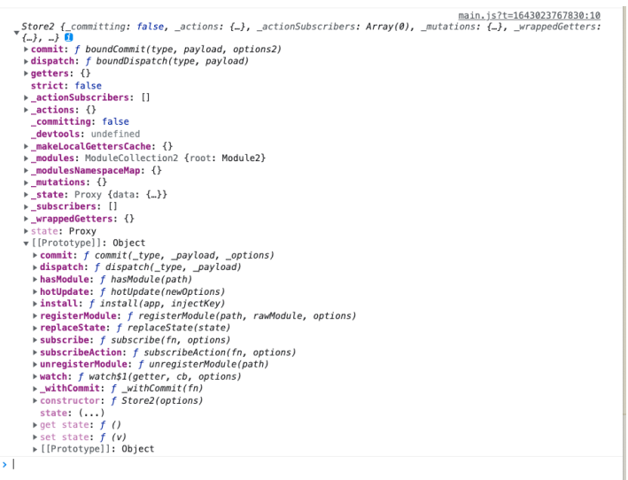
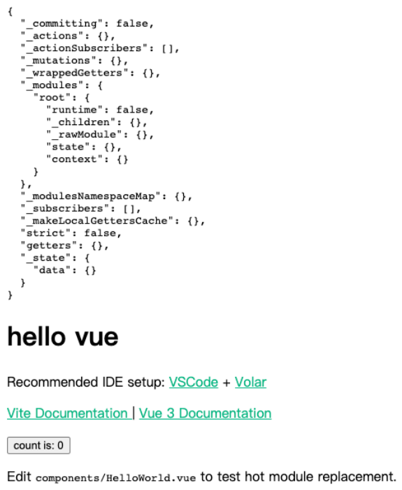
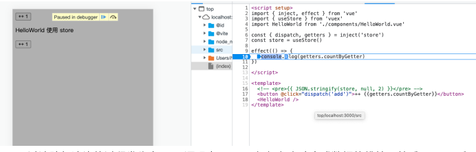

# 课程目标

- vuex 核心源码解读与解析

# 知识要点

## vuex4核心源码解析

### 核心概念

​		vuex 是⼀个专为 vue.js 应用程序开发的状态管理模式 + 库。它采用集中式存储管理应用的所有组件的状态，并以相应的规则保证状态以⼀种可预测的方式发⽣变化。与 vuex 4 相匹配的版本是 vue 3。学习本文需要⼀些前置技能，默认读者已熟练掌握了 vue2 + vuex 的基础用法，以及对 vue3 有过初步的了解。本文目的在于对 vuex 的源码原理进行深入研究，达到对其运用自如的目标，同时对状态管理库的设计有基本的认识。

### 安装运行环境

```bash
yarn create vite vue3-vuex4<项⽬名，⾃定义>
cd vue3-vuex4
yarn // 安装 node_modules
yarn add vuex@next // 安装 vuex
yarn dev // 启动项⽬并访问 localhost:3000
```

​		本文讲解的版本 vue^3.2.25, vuex^4.0.2

### 从用法开始

#### createStore 不传参数

​		在 vue3 中使用 vuex，入口代码如下（main.js）：

```js
import { createApp } from 'vue'
import { createStore } from 'vuex'
import App from './App.vue'

const app = createApp(App);
const store = createStore({})

app.use(store);
console.log(store)
app.mount('#app')

```

查看 store 如下：



​		我们知道，app.use 注册插件（vue2 则为 Vue.use）时，会自动调用参数的 install 方法（例如 vue-router），定位到 node_modules/vuex/dist/vuex.esm-bundler.js 文件，找到 install 定义的位置：

```js
var storeKey = 'store'
...
Store.prototype.install = function install (app, injectKey) {
    app.provide(injectKey || storeKey, this);
    app.config.globalProperties.$store = this;
    // 下⾯的逻辑是开发环境启用开发⼯具的，核心代码是上⾯这两行
    var useDevtools = this._devtools !== undefined
    	? this._devtools
    	: (process.env.NODE_ENV !== 'production') || __VUE_PROD_DEVTOOLS__;
    
    if (useDevtools) {
        addDevtools(app, this);
    }
};
```

​		跨组件传递状态的方法中，有 provide/inject 组合因此下⾯的代码可以访问到 store：

```vue
// App.vue 文件修改
<script setup>
    import { inject } from 'vue'
	import HelloWorld from './components/HelloWorld.vue'

	const store = inject('store')
</script>

<template>
	<pre>{{ JSON.stringify(store, null, 2) }}</pre>
	<HelloWorld msg="hello vue" />
</template>
```

呈现结果：



​		⽽ app.config.globalProperties.$store 将 vue 组件实例的原型上（全局）挂载了 $store，所以在 vue2 组件常见以下写法：

```js
this.$store.commit(...);
this.$store.dispatch(...);

// 当然，template 中直接写成下⾯这样也是可以的，因为实例 this 在模板内是省略的

// import { inject } from 'vue'
// const store = inject('store')

{{ JSON.stringify($store, null, 2) }}
```

#### createStore 加⼊参数

```js
// main.js
...

const app = createApp(App);
const store = createStore({
    state: {
        count: 1
    },
    mutations: {
        ADD(state, payload) {
            state.count += payload
        }
    },
    actions: {
        add(context) {
            context.commit('ADD', 1)
        }
    },
    getters: {
        countByGetter: state => state.count
    },
    modules: {}
})

app.use(store);
console.log(store)
app.mount('#app')
```

修改 App.vue：

```vue
<script setup>
    import { inject } from 'vue'

const { dispatch, getters } = inject('store')
</script>

<template>
	<pre>{{ JSON.stringify($store, null, 2) }}</pre>
	<button @click="dispatch('add')">{{getters.countByGetter}}</button>
</template>
```

当然在类组件（尤其是 vue2 中）使用 vuex 辅助函数的话应该不少同学应该更熟悉：

```vue
// 改造 HelloWorld.vue 组件
<script>
    import { mapGetters, mapActions } from 'vuex'

	export default {
    	computed: {
        	...mapGetters(['countByGetter'])
    	},
    	methods: {
        	...mapActions(['add'])
    	}
	}
</script>

<template>
	<p>HelloWorld 使用 store</p>
	<button @click="add">++ {{countByGetter}}</button>
</template>
```

这样 App.vue 引⼊ HelloWorld.vue 就能看到⼀样的变化了。

### 核心源码分析

​		为便于分析，我们将 vuex 的核心源码分 3 部分解读，每部分将结合具体的业务代码进行展开（源码文件 node_modules/vuex/dist/vuex.esm-bundler.js）。

#### 1. 创建 store

```js
var Store = function Store (options) {
    ...
    // 这部分就是前文控制台打印的诸多属性
    this._committing = false;
    this._actions = Object.create(null);
    this._actionSubscribers = [];
    this._mutations = Object.create(null);
    this._wrappedGetters = Object.create(null);
    this._modules = new ModuleCollection(options); // store._modules 持有参数转换的各种信息
    this._modulesNamespaceMap = Object.create(null);
    this._subscribers = [];
    this._makeLocalGettersCache = Object.create(null);
    this._devtools = devtools;
    ...
    var store = this;
    var ref = this;
    var dispatch = ref.dispatch;
    var commit = ref.commit;
    this.dispatch = function boundDispatch (type, payload) {
        return dispatch.call(store, type, payload)
    };
    this.commit = function boundCommit (type, payload, options) {
        return commit.call(store, type, payload, options)
    };
    // dispatch 和 commit 将原型上的同名方法重写，⽬的就是保证
    // 当解构 commit/dispatch 时，this 指向依旧为 store 实例。
    var state = this._modules.root.state;
    
    installModule(this, state, [], this._modules.root); // -----------特别关注
    resetStoreState(this, state); // -----------特别关注
    ...
}
```

​		可见 ModuleCollection 及末尾的 installModule 和 resetStoreState 是需要关注的方法。

* ModuleCollection 将参数 options 进行转换，本质是对 options 对象的包装与扩充，扩充结果作为 store._modules 的值。

```js
// ModuleCollection
var ModuleCollection = function ModuleCollection (rawRootModule) {
    // rawRootModule 就是 createStore 的参数，由此，
    // 我们查找 ModuleCollection.prototype.register 方法
    this.register([], rawRootModule, false);
};
...
// 务必按照编号顺序理解 -----------(0)
ModuleCollection.prototype.register = function register (path, rawModule, runtime) {
    var this$1$1 = this;
    if ( runtime === void 0 ) runtime = true;
    ...
    
    var newModule = new Module(rawModule, runtime);
    if (path.length === 0) { // 模块是全局模块，挂在 root 属性下 -----------(1)
        this.root = newModule;
    } else { // 命名空间下的⼦模块，根据路径关系被⽗模块所引用 -----------(3)
        var parent = this.get(path.slice(0, -1));
        parent.addChild(path[path.length - 1], newModule);
        // -----------(4) ⼦模块最终在这⾥执行结束，根据 13、15 行，所有的模块均为 Module 实例
    }
    
    // rawModule 就是 createStore 的参数，如果定义了 modules 配置，就会对⼦模块
    // ⼀⼀注册，但 register 第⼀个参数不再是空数组，⼦模块会挂载对应的命名空间下
    if (rawModule.modules) { // -----------(2)
        forEachValue(rawModule.modules, function (rawChildModule, key) {
            this$1$1.register(path.concat(key), rawChildModule, runtime);
        });
    }
};
```

​		因为 Module 类的实现（下⾯的代码）我们知道（rawModule 是 createStore 的参数 options），Module 的实例通过 _rawModule 引用着最初的 options。结论就是，register 方法执行以后，ModuleCollection 实例引用 root（15行）module，root module 通过 addChild（18 行）将后 代⼦模块的实例递归引用（在 _children 属性下）。

```js
var Module = function Module (rawModule, runtime) {
    ...
    this._children = Object.create(null);
    this._rawModule = rawModule;
    ...
};
```

​		启用 modules 配置（为便于理解模块化，这⾥直接使用与 root ⼀样的参数）验证上⾯的结果：

```js
const moduleRoot = {
    state: {
        count: 1
    },
    mutations: {
        ADD(state, payload) {
            state.count += payload
        }
    },
    actions: {
        add(context) {
            context.commit('ADD', 1)
        }
    },
    getters: {
        countByGetter: state => state.count
    },
};

const moduleA = {
    namespaced: true,
    state: {
        ...moduleRoot.state
    },
    mutations: {
        ...moduleRoot.mutations
    },
    actions: {
        ...moduleRoot.actions
    },
    getters: {
        ...moduleRoot.getters
    }
};
const moduleB = const moduleA = {
    namespaced: true,
    state: {
        ...moduleRoot.state
    },
    mutations: {
        ...moduleRoot.mutations
    },
    actions: {
        ...moduleRoot.actions
    },
    getters: {
        ...moduleRoot.getters
    }
};

const store = createStore({
    ...moduleRoot,
    modules: {
        moduleA,
        moduleB
    }
})
console.log(store)
```

​		我们可以得到 store：

```js
{
    ...
    "_mutations": {
        "ADD": [Function],
        "moduleA/ADD": [Function],
        "moduleB/ADD": [Function]
    },
    _modules: {
        root: {
            context: {},
            runtime: false,
            state: {count: 1, moduleA: {…}, moduleB: {…}},
            _children: [{ // moduleA: 
                runtime: false, _children: {…}, _rawModule: {…}, state: {…}, context: {…}
            }, { // moduleB
                runtime: false, _children: {…}, _rawModule: {…}, state: {…}, context: {…}
            }],
            _rawModule: {state: {…}, mutations: {…}, actions: {…}, getters: {…}, modules: {…}}
        }
    },
    "getters": {
        "countByGetter": 1,
        "moduleA/countByGetter": 1,
        "moduleB/countByGetter": 1
    },
    "_actions": {
        "add": [Function],
        "moduleA/add": [Function],
        "moduleB/add": [Function]
    },
}
```

​		moduleA、moduleB 与 store._modules.root 格式⼀样，都是 Module 的实例。由上述结构可 见，createStore 就是按照 options 的结构⽣成 modules 树（含 state），根据命名空间，把所有 module 的 getters、actions、mutations 集中在 store 实例的根属性上。这意味着如果没有配置命名 空间，这些属性将变成全局模块的属性，很容易出现同名冲突。

* installModule 的作用就是把 state、actions、mutations、getters 分别注册到相应的模块名称下

```js
function installModule (store, rootState, path, module, hot) {
    var isRoot = !path.length;
    var namespace = store._modules.getNamespace(path);
    if (module.namespaced) { // 模块指定命名空间时，会保存在 _modulesNamespaceMap 下
        store._modulesNamespaceMap[namespace] = module;
    }
    // state 的注册
    if (!isRoot && !hot) { // 初始化的⼦模块执行，状态会按照空间缓存在上层 state 下，见上 12 行
        var parentState = getNestedState(rootState, path.slice(0, -1));
        var moduleName = path[path.length - 1];
        store._withCommit(function () {
            parentState[moduleName] = module.state;
        });
    }
    
    var local = module.context = makeLocalContext(store, namespace, path);
    // 注册 mutations，效果见上方第 3~6 行
    module.forEachMutation(function (mutation, key) {
        var namespacedType = namespace + key;
        registerMutation(store, namespacedType, mutation, local);
    });
    // 注册 actions，效果与见上方第 25~28 行
    module.forEachAction(function (action, key) {
        var type = action.root ? key : namespace + key;
        var handler = action.handler || action;
        registerAction(store, type, handler, local);
    });
    // 注册 getters，上方 20~23 行
    module.forEachGetter(function (getter, key) {
        var namespacedType = namespace + key;
        registerGetter(store, namespacedType, getter, local);
    });
    // 遍历当前模块存在下级列表，进行递归注册，这次因为 path 参数"加⻓"了，所以会有第 8 行的逻辑
    module.forEachChild(function (child, key) {
        installModule(store, rootState, path.concat(key), child, hot);
    });
}
```

* resetStoreState 将树状结构的 state，统⼀使用 reactive 代理后，挂载 store._state 下，这样未来对 state 的更新，将具有被追踪的能⼒。resetStoreState 除了初始化会调用，重置 store 时以及动态注册模块时都会用 到。

```js
function resetStoreState (store, state, hot) {
    var oldState = store._state;
    ...
    store._state = reactive({
        data: state
    });
    ...
}
```

#### 2. store 分发

​		根据前文，store._modules.root.context 的输出结构如下：

```js
{
    "commit": Function,
    "dispatch": Function,
    "getters": Object,
    "state": {
        "count": 1,
        "moduleA": {"count": 1},
        "moduleB": {"count": 1}
    },
    "_children": [moduleA, moduleB]
}
```

​		如果给你⼀个这样的对象，让你实现⼀个函数，可以通过参数返回 state 中的不同部分，这个函数 就是 mapState，你会怎么做？⽐如这样：

```js
/* 
* 假如 path 是⼀个字符串数组，根据 mapState 的用法，
* 其返回值应当形如 { computedPropA(){}, computedPropB(){}, ... }
* 例如 mapState(['x', 'y'])
* 返回值 { x() { return context.state.x; }, y() { return context.state.y} }
* 可以像下⾯这样(先忽略命名空间)
*/
// round 1
function mapState(path) {
    return path.reduce((prev, key) => ({
        ...prev,
        [key]() {
            return context.state[key]
        }
    }), {});
}
// round 2 加上命名空间
function mapState(namespace, path) {
    return path.reduce((prev, key) => ({
        ...prev,
        [key]() {
            return context.state[namespace][key]
        }
    }), {});
}
// round 3 参数类型扩展，允许 key-value 形态
function mapState(namespace, states) {
    const path = normalizeMap(states) // 转化⼀下参数类型
    return path.reduce((prev, key) => ({
        ...prev,
        [key]() {
            return context.state[namespace][key]
        }
    }), {});
}
// round 4 context 作为上下文，直接从组件实例中取
function mapState(namespace, states) {
    const path = normalizeMap(states)
    return path.reduce((prev, key) => ({
        ...prev,
        [key]() {
            const state = this.$store.state; // 还记得最开始 install 时的 provide 吗
            return state[namespace][key]
        }
    }), {});
}
// round 5 上⾯要么取的全局空间的状态，要么取命名空间的状态，都要的话怎么办？加⼊函数！
function mapState(namespace, states) {
    const path = normalizeMap(states)
    return path.reduce((prev, key) => ({
        ...prev,
        [key]() {
            const state = this.$store.state;
            const getters = this.$store.getters;
            return typeof key === 'function' ? key(state, getters) : state[namespace][key]
        }
    }), {});
}
// 真实的使用场景 1：默认全局空间使用 state
computed: {
    ...mapState({
        a: (state, getters) => state.moduleA.count,
        globalCount: (state, getters) => state.count
    })
}
// 真实的使用场景 2：
computed: {
    ...mapState('moduleA', ['count']) // 模块 A 的数据
}
// 真实的使用场景 3：
computed: { // 带命名空间访问 this['moduleB/count']，略丑
    ...mapState(['moduleA/count', 'moduleB/count'])
}
// 真实的使用场景 4：同 2，但可以重命名
computed: {
    ...mapState('moduleB', {
        countB: state => state.count
    })
}
// 真实的使用场景 5：提前固定命名空间
import { createNamespacedHelpers } from 'vuex'
const { mapState } = createNamespacedHelpers('moduleA')

computed: {
    // 下⾯的参数 state 就是 context.state.moduleA 了
    ...mapState({
        countA: state => state.count
    })
},
```

​		有了以上的基础，源码理解起来便十分顺畅了：

```js
var mapState = normalizeNamespace(function (namespace, states) {
    var res = {};
    normalizeMap(states).forEach(function (ref) {
        var key = ref.key;
        var val = ref.val;
        
        res[key] = function mappedState () {
            var state = this.$store.state;
            var getters = this.$store.getters;
            if (namespace) {
                var module = getModuleByNamespace(this.$store, 'mapState', namespace);
                if (!module) {
                    return
                }
                state = module.context.state;
                getters = module.context.getters;
            }
            return typeof val === 'function'
                ? val.call(this, state, getters)
            	: state[val]
        };
        // mark vuex getter for devtools
        res[key].vuex = true
    });
    return res
});
```

​		同理，mapActions，mapMutations，mapGetters 不再赘述。

#### 3. state 变更引发副作用和视图更新

​		上文已经提到过 resetStoreState 方法，源码有这样的⼀段逻辑十分重要：

```js
import { inject, reactive, watch } from 'vue'
...
function resetStore (store, hot) {
    ...
    store._state = reactive({
        data: state
    });
}
```

​		如果像下⾯这样写就会发现触发 store.state 的变更将不能引发⻚⾯的更新：

```js
store._state = {
    data: state
};
```

​		reactive 的逻辑在学习 vue3 部分可以了解到，它对⼀个对象的访问进行了深度代理，所以当执行 this.$store.commit => mutations => state.count++ 时，track 了 count 属性的副作用函数、render 函数（template 编译结果），将会重新调用。eg：

```vue
// App.vue
effect(() => {
	console.log(getters.countByGetter)
})
<template>
	<!-- <pre>{{ JSON.stringify(store, null, 2) }}</pre> -->
	<button @click="dispatch('add')">++ {{getters.countByGetter}}</button>
	<HelloWorld />
</template>
```

​		按钮的点击更改了 store.state.count，计算值 store.getters.countByGetter 初次使用时已经被追踪了（effect 和 render 两处），所以点击导致的状态变化，将引发 effect 的回调、render 的重新执行，断点如下：



​		不过追踪与渲染的过程发⽣在 vue 源码中，vuex 仅仅负责响应式数据的维护。熟悉 vuex4 后，可以更进⼀步地学习 Pinia，即 vuex5。

# 补充知识点