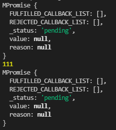

# 课程目标

- 学习PromiseA+规范
- 实现一个es6版本的Promise

# 知识要点

## PromiseA+规范

官方文档：https://promisesaplus.com/

### 术语

1. promise，是一个有then方法的对象或者是函数，行为遵循本规范
2. thenable，是一个有then方法的对象或者是函数
3. value，是promise状态成功时的值，也就是**resolve**的参数，包括各种数据类型（number/boolean/undefined/promise）
4. reason，是promise状态失败时的值，也就是**reject**的参数，表示各种拒绝的原因
5. exception 是一个使用throw抛出的异常值

### 规范

#### Promise States

有三种状态，注意流转关系：

1. pending

   1.1 初始的状态, 可改变.
   1.2 一个promise在resolve或者reject前都处于这个状态。
   1.3 可以通过 resolve -> fulfilled 状态;
   1.4 可以通过 reject -> rejected 状态;

2. fulfilled

   2.1 最终态, 不可变.
   2.2 一个promise被resolve后会变成这个状态.
   2.3 必须拥有一个value值

3. rejected

   3.1 最终态, 不可变.
   3.2 一个promise被reject后会变成这个状态
   3.3 必须拥有一个reason

状态流转：

pending -> resolve(value) -> fulfilled
pending -> reject(reason) -> rejected

#### then

promise应该提供一个then方法, 用来访问最终的结果, 无论是value还是reason

```js
promise.then(onFulfilled, onRejected)
```

1. 参数要求

   1.1 onFulfilled 必须是函数类型, 如果不是函数, 应该被**忽略**
   1.2 onRejected 必须是函数类型, 如果不是函数, 应该被**忽略**

2. onFulfilled 特性

   2.1 在promise变成 fulfilled 时，应该调用 onFulfilled，参数是value
   2.2 在promise变成 fulfilled 之前，不应该被调用.
   2.3 只能被调用一次(所以在实现的时候需要一个变量来限制执行次数)

3. onRejected 特性

   3.1 在promise变成 rejected 时，应该调用 onRejected，参数是reason
   3.2 在promise变成 rejected 之前，不应该被调用.
   3.3 只能被调用一次(所以在实现的时候需要一个变量来限制执行次数)

4. onFulfilled 和 onRejected 应该是微任务

   这里用queueMicrotask来实现微任务的调用

5. then方法可以被调用多次

   ```js
   const promise = new Promise();
   
   promise.then(cb1, cb2);
   promise.then(cb1, cb2);
   promise.then(cb1, cb2);
   promise.then(cb1, cb2);
   ```

   5.1 promise状态变成 fulfilled 后，所有的 onFulfilled 回调都需要按照then的顺序执行，也就是按照注册顺序执行(所以在实现的时候需要一个数组来存放多个onFulfilled的回调)
   5.2 promise状态变成 rejected 后，所有的 onRejected 回调都需要按照then的顺序执行，也就是按照注册顺序执行(所以在实现的时候需要一个数组来存放多个onRejected的回调)

6. 返回值

   then 应该返回一个promise，是一个新的promise

   ```js
   const promise1 = new Promise();
   
   promise2 = promise1.then(onFulfilled, onRejected);
   ```

   6.1 onFulfilled 或 onRejected 执行的结果为x，调用 resolvePromise
   6.2 如果 onFulfilled 或者 onRejected 执行时抛出异常e, promise2需要被reject
   6.3 如果 onFulfilled 不是一个函数，promise2 以promise1的value 触发fulfilled
   6.4 如果 onRejected 不是一个函数，promise2 以promise1的reason 触发rejected

7. resolvePromise

   ```js
   resolvePromise(promise2, x, resolve, reject)
   ```

    7.1 如果 promise2 和 x 相等，那么 reject TypeError
    7.2 如果 x 是一个 promsie
            如果x是pending态，那么promise必须要在pending，直到 x 变成 fulfilled or rejected
            如果 x 被 fulfilled，fulfill promise with the same value
            如果 x 被 rejected，reject promise with the same reason
    7.3 如果 x 是一个 object 或者 是一个 function
        let then = x.then.
        如果 x.then 这步出错，那么 reject promise with e as the reason
        如果 then 是一个函数，then.call(x, resolvePromiseFn, rejectPromise)
            resolvePromiseFn 的 入参是 y, 执行 resolvePromise(promise2, y, resolve, reject)
            rejectPromise 的 入参是 r，reject promise with r
            如果 resolvePromise 和 rejectPromise 都调用了，那么第一个调用优先，后面的调用忽略
            如果调用then抛出异常e 
                如果 resolvePromise 或 rejectPromise 已经被调用，那么忽略
                则，reject promise with e as the reason
        如果 then 不是一个function. fulfill promise with x

## 实现一个Promise

1. 初始化class

```js
class MPromise {
    constructor() {}
}
```

2. 定义三种状态类型

```js
const PENDING = 'pending';
const FULFILLED = 'fulfilled';
const REJECTED = 'rejected';
```

3. 设置初始状态

```js
class MPromise {
    constructor() {
        // 初始状态为pending
        this.status = PENDING;
        this.value = null;
        this.reason = null;
    }
}
```

4. resolve / reject
   1. 更改status，pending -> fulfilled/rejected
   2. 入参value/reason


```js
class MPromise {
    constructor() {
        // 初始状态为pending
        this.status = PENDING;
        this.value = null;
        this.reason = null;
    }

    resolve(value) {
        if (this.status === PENDING) {
            this.value = value;
            this.status = FULFILLED;
        }
    }

    reject(reason) {
        if (this.status === PENDING) {
            this.reason = reason;
            this.status = REJECTED;
        }
    }
}
```

5. promise构造函数的入参
   1. 入参是一个函数，接受两个参数，resolve，reject
   2. new Promise的时候，就要执行这个函数并且有任何错误都要被reject出去


```js
class MPromise {
    constructor(fn) {
        // 初始状态为pending
        this.status = PENDING;
        this.value = null;
        this.reason = null;

        try {
            fn(this.resolve.bind(this), this.reject.bind(this))
        } catch (e) {
            this.reject(e)
        }
    }

    resolve(value) {
        if (this.status === PENDING) {
            this.value = value;
            this.status = FULFILLED
        }
    }

    reject(season) {
        if (this.status === PENDING) {
            this.season = reason
            this.status = REJECTED
        }
    }
}
```

6. 实现关键的then方法

    1. then接收两个参数，onFulfilled 和 onRejected

    ```js
    then(onFulfilled, onRejected) {}
    ```

    2. 检查并处理参数，之前提到的如果不是function就忽略，这个忽略指的是原样返回value或者reason

    ```js
    isFunction(param) {
        return typeof param === 'function';
    }

    then(onFulfilled, onRejected) {
        const realOnFulfilled = this.isFunction(onFulfilled) ? onFulfilled : (value) => {
            return value
        }
        const realOnRejected = this.isFunction(onRejected) ? onRejected : (reason) => {
            throw reason;
        };
    }
    ```
    3. then的返回值整体是一个promise，所以先用promise来包裹一下（后续实现）

    ```js
    then(onFulfilled, onRejected) {
        const realOnFulfilled = this.isFunction(onFulfilled) ? onFulfilled : (value) => {
            return value
        }
        const realOnRejected = this.isFunction(onRejected) ? onRejected : (reason) => {
            throw reason;
        };
        const promise2 = new MPromise((resolve, reject) => {})
        return promise2
    }

    ```
    4. 根据当前promise的状态, 调用不同的函数

    ```js
    then(onFulfilled, onRejected) {
        const realOnFulfilled = this.isFunction(onFulfilled) ? onFulfilled : (value) => {
            return value
        }
        const realOnRejected = this.isFunction(onRejected) ? onRejected : (reason) => {
            throw reason;
        };
        const promise2 = new MPromise((resolve, reject) => {
            switch (this.status) {
                case FULFILLED: {
                    realOnFulfilled()
                    break;
                }
                case REJECTED: {
                    realOnRejected()
                    break;
                }
            }
        })
        return promise2

    }
    ```

    5. 为实现异步，需要一个状态的监听机制，当状态变成fulfilled或者rejected后，再去执行callback

        1. 新建两个数组来分别存储成功和失败的回调，调用then的时候，如果还是pending就存入数组

        ```js
        FULFILLED_CALLBACK_LIST = [];
        REJECTED_CALLBACK_LIST = [];
        
        then(onFulfilled, onRejected) {
        const realOnFulfilled = this.isFunction(onFulfilled) ? onFulfilled : (value) => {
            return value
        }
        const realOnRejected = this.isFunction(onRejected) ? onRejected : (reason) => {
            throw reason;
        };
        const promise2 = new MPromise((resolve, reject) => {
            switch (this.status) {
                case FULFILLED: {
                    realOnFulfilled()
                    break;
                }
                case REJECTED: {
                    realOnRejected()
                    break;
                }
                case PENDING: {
                    this.FULFILLED_CALLBACK_LIST.push(realOnFulfilled)
                    this.REJECTED_CALLBACK_LIST.push(realOnRejected)
                }
            }
        })
        return promise2
        
        }
        ```

        2. 在status发生变化的时候执行所有的回调

        ```js
        _status = PENDING;
        
        get status() {
            return this._status;
        }
        
        set status(newStatus) {
            this._status = newStatus;
            switch (newStatus) {
                case FULFILLED: {
                    this.FULFILLED_CALLBACK_LIST.forEach(callback => {
                        callback(this.value);
                    });
                    break;
                }
                case REJECTED: {
                    this.REJECTED_CALLBACK_LIST.forEach(callback => {
                        callback(this.reason);
                    });
                    break;
                }
            }
        }
        ```

7. then的返回值
   上面只是简单说了下 then的返回值是一个Promise，接下来具体讲一下返回promise的value和reason是什么

    1. 如果 onFulfilled 或者 onRejected 抛出一个异常 e ，则 promise2 必须拒绝执行，并返回拒因 e。(这样的话, 我们就需要手动catch代码，遇到报错就reject)

    ```js
    then(onFulfilled, onRejected) {
        const realOnFulfilled = this.isFunction(onFulfilled) ? onFulfilled : (value) => {
            return value
        }
        const realOnRejected = this.isFunction(onRejected) ? onRejected : (reason) => {
            throw reason;
        };
        const promise2 = new MPromise((resolve, reject) => {
            const fulfilledMicrotask = () => {
                try {
                    realOnFulfilled(this.value);
                } catch (e) {
                    reject(e)
                }
            };
            const rejectedMicrotask = () => {
                try {
                    realOnRejected(this.reason);
                } catch (e) {
                    reject(e);
                }
            }
   
            switch (this.status) {
                case FULFILLED: {
                    fulfilledMicrotask()
                    break;
                }
                case REJECTED: {
                    rejectedMicrotask()
                    break;
                }
                case PENDING: {
                    this.FULFILLED_CALLBACK_LIST.push(fulfilledMicrotask)
                    this.REJECTED_CALLBACK_LIST.push(rejectedMicrotask)
                }
            }
        })
        return promise2
    }
    ```

    7.2 如果 onFulfilled 不是函数且 promise1 成功执行， promise2 必须成功执行并返回相同的值
   
    7.3 如果 onRejected 不是函数且 promise1 拒绝执行， promise2 必须拒绝执行并返回相同的据因

    需要注意的是，如果promise1的onRejected执行成功了，promise2应该被resolve

    这里咱们其实已经在参数检查的时候做过了, 也就是这段代码

    ```js
    const realOnFulfilled = this.isFunction(onFulfilled) ? onFulfilled : (value) => {
        return value
    }
    const realOnRejected = this.isFunction(onRejected) ? onRejected : (reason) => {
        throw reason;
    };
    ```

    7.4 如果 onFulfilled 或者 onRejected 返回一个值 x ，则运行resolvePromise方法

    ```js
    then(onFulfilled, onRejected) {
        const realOnFulfilled = this.isFunction(onFulfilled) ? onFulfilled : (value) => {
            return value
        }
        const realOnRejected = this.isFunction(onRejected) ? onRejected : (reason) => {
            throw reason;
        };
        const promise2 = new MPromise((resolve, reject) => {
            const fulfilledMicrotask = () => {
                try {
                    const x = realOnFulfilled(this.value);
                    this.resolvePromise(promise2, x, resolve, reject);
                } catch (e) {
                    reject(e)
                }
            };
            const rejectedMicrotask = () => {
                try {
                    const x = realOnRejected(this.reason);
                    this.resolvePromise(promise2, x, resolve, reject);
                } catch (e) {
                    reject(e);
                }
            }
   
            switch (this.status) {
                case FULFILLED: {
                    fulfilledMicrotask()
                    break;
                }
                case REJECTED: {
                    rejectedMicrotask()
                    break;
                }
                case PENDING: {
                    this.FULFILLED_CALLBACK_LIST.push(fulfilledMicrotask)
                    this.REJECTED_CALLBACK_LIST.push(rejectedMicrotask)
                }
            }
        })
        return promise2
    }
    ```

8. resolvePromise

```js
resolvePromise(promise2, x, resolve, reject) {
    // 如果 newPromise 和 x 指向同一对象，以 TypeError 为据因拒绝执行 newPromise
    // 这是为了防止死循环
    if (promise2 === x) {
        return reject(new TypeError('The promise and the return value are the same'));
    }

    if (x instanceof MPromise) {
        // 如果 x 为 Promise ，则使 newPromise 接受 x 的状态
        // 也就是继续执行x，如果执行的时候拿到一个y，还要继续解析y
        queueMicrotask(() => {
            x.then((y) => {
                this.resolvePromise(promise2, y, resolve, reject);
            }, reject);
        })
    } else if (typeof x === 'object' || this.isFunction(x)) {
        // 如果 x 为对象或者函数
        if (x === null) {
            // null也会被判断为对象
            return resolve(x);
        }

        let then = null;

        try {
            // 把 x.then 赋值给 then 
            then = x.then;
        } catch (error) {
            // 如果取 x.then 的值时抛出错误 e ，则以 e 为据因拒绝 promise
            return reject(error);
        }

        // 如果 then 是函数
        if (this.isFunction(then)) {
            let called = false;
            // 将 x 作为函数的作用域 this 调用
            // 传递两个回调函数作为参数，第一个参数叫做 resolvePromise ，第二个参数叫做 rejectPromise
            try {
                then.call(
                    x,
                    // 如果 resolvePromise 以值 y 为参数被调用，则运行 resolvePromise
                    (y) => {
                        // 需要有一个变量called来保证只调用一次.
                        if (called) return;
                        called = true;
                        this.resolvePromise(promise2, y, resolve, reject);
                    },
                    // 如果 rejectPromise 以据因 r 为参数被调用，则以据因 r 拒绝 promise
                    (r) => {
                        if (called) return;
                        called = true;
                        reject(r);
                    });
            } catch (error) {
                // 如果调用 then 方法抛出了异常 e：
                if (called) return;

                // 否则以 e 为据因拒绝 promise
                reject(error);
            }
        } else {
            // 如果 then 不是函数，以 x 为参数执行 promise
            resolve(x);
        }
    } else {
        // 如果 x 不为对象或者函数，以 x 为参数执行 promise
        resolve(x);
    }
}
```

9. onFulfilled 和 onRejected 是微任务

    可以用queueMicrotask包裹执行函数

```js
const fulfilledMicrotask = () => {
    queueMicrotask(() => {
        try {
            const x = realOnFulfilled(this.value);
            this.resolvePromise(promise2, x, resolve, reject);
        } catch (e) {
            reject(e)
        }
    })
};
const rejectedMicrotask = () => {
    queueMicrotask(() => {
        try {
            const x = realOnRejected(this.reason);
            this.resolvePromise(promise2, x, resolve, reject);
        } catch (e) {
            reject(e);
        }
    })
}
```

10. 简单写点代码测试一下

```js
const test = new MPromise((resolve, reject) => {
    setTimeout(() => {
        resolve(111);
    }, 1000);
}).then(console.log);

console.log(test);

setTimeout(() => {
    console.log(test);
}, 2000)

// 输出如下图
```



11. catch方法

```js
catch (onRejected) {
    return this.then(null, onRejected);
}
```

12. promise.resolve

    将现有对象转为Promise对象，如果 Promise.resolve 方法的参数，不是具有 then 方法的对象（又称 thenable 对象），则返回一个新的 Promise 对象，且它的状态为fulfilled。
    注意这是一个静态方法，因为是通过Promise.resolve调用的，而不是通过实例去调用的

```js
static resolve(value) {
    if (value instanceof MPromise) {
        return value;
    }

    return new MPromise((resolve) => {
        resolve(value);
    });
}
```

13. promise.reject

    返回一个新的Promise实例，该实例的状态为rejected。Promise.reject方法的参数reason，会被传递给实例的回调函数。

```js
static reject(reason) {
    return new MPromise((resolve, reject) => {
        reject(reason);
    });
}
```

14. promise.race

    `const p = Promise.race([p1, p2, p3]);`

    该方法是将多个 Promise 实例，包装成一个新的 Promise 实例。
    只要p1、p2、p3之中有一个实例率先改变状态，p的状态就跟着改变。那个率先改变的 Promise 实例的返回值，就传递给p的回调函数。

```js
static race(promiseList) {
    return new MPromise((resolve, reject) => {
        const length = promiseList.length;

        if (length === 0) {
            return resolve();
        } else {
            for (let i = 0; i < length; i++) {
                MPromise.resolve(promiseList[i]).then(
                    (value) => {
                        return resolve(value);
                    },
                    (reason) => {
                        return reject(reason);
                    });
            }
        }
    });

}
```

​		写段测试代码

```js
const test = new MPromise((resolve, reject) => {
    setTimeout(() => {
        resolve(111);
    }, 1000);
});

const test2 = new MPromise((resolve, reject) => {
    setTimeout(() => {
        resolve(222);
    }, 2000);
});

const test3 = new MPromise((resolve, reject) => {
    setTimeout(() => {
        resolve(333);
    }, 3000);
});

MPromise.race([test, test2, test3]).then(console.log); // 输出：111
```


# 补充知识点

## Generator 和 Async 简介

### 迭代器 Iterator

迭代器Iterator 是 ES6 引入的一种新的遍历机制，同时也是一种特殊对象，它具有一些专门为迭代过程设计的专有接口。

每个迭代器对象都有一个next()方法，每次调用都返回一个当前结果对象。当前结果对象中有两个属性：

1. value：当前属性的值

2. done：用于判断是否遍历结束，当没有更多可返回的数据时，返回true

每调用一次next()方法，都会返回下一个可用的值，直到遍历结束。

### 生成器 Generator

生成器是一种返回迭代器的函数，通过function关键字后的星号(*)来表示，函数中会用到新的关键字yield。星号可以紧挨着function关键字，也可以在中间添加一个空格.

```js
function* generator() {
    const list = [1, 2, 3];
    for (let i of list) {
        yield i;
    }
}

let g = generator();

console.log(g.next()); // {value: 1, done: false}
console.log(g.next()); // {value: 2, done: false}
console.log(g.next()); // {value: 3, done: false}
console.log(g.next()); // {value: undefined, done: true}
```

#### 特性

1. 每当执行完一条yield语句后函数就会自动停止执行, 直到再次调用next();
2. yield关键字只可在生成器内部使用，在其他地方使用会导致程序抛出错误;
3. 可以通过函数表达式来创建生成器, 但是不能使用箭头函数
    `let generator = function *(){}`


### Async 和 Await

怎么封装一个函数, 能够让generator自动执行到完毕? 

```js
function longTimeFn(time) {
    return new Promise(resolve => {
        setTimeout(() => {
            resolve(time);
        }, time);
    })
};

function asyncFunc(generator) {
    const iterator = generator(); // 接下来要执行next
    // data为第一次执行之后的返回结果，用于传给第二次执行
    const next = (data) => {
        const {
            value,
            done
        } = iterator.next(data); // 第二次执行，并接收第一次的请求结果 value 和 done

        if (done) return; // 执行完毕, 直接返回
        // 第一次执行next时，yield返回的 promise实例 赋值给了 value
        value.then(data => {
            next(data); // 当第一次value 执行完毕且成功时，执行下一步(并把第一次的结果传递下一步)
        });
    }
    next();
};

asyncFunc(function* () {
    let data = yield longTimeFn(1000);
    console.log(data);
    data = yield longTimeFn(2000);
    console.log(data);
    return data;
})
```
## promise输出顺序问题

```js
Promise.resolve()
    .then(async () => {
        console.log(0);
        setTimeout(() => {
            console.log('宏任务');
        }, 0);
        return Promise.resolve(4);
    })
    .then((res) => {
        console.log(res);
    });

Promise.resolve().then(() => {
        console.log(1);
    })
    .then(() => {
        console.log(2);
    })
    .then(() => {
        console.log(3);
    })
    .then(() => {
        console.log(5);
    })
    .then(() => {
        console.log(6);
    })
    .then(() => {
        console.log(7);
    })
// 输出：0 1 2 3 4 5 6 7 宏任务
```

