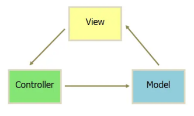
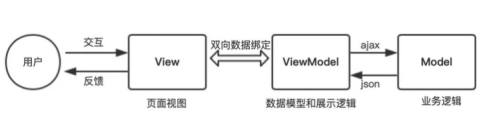
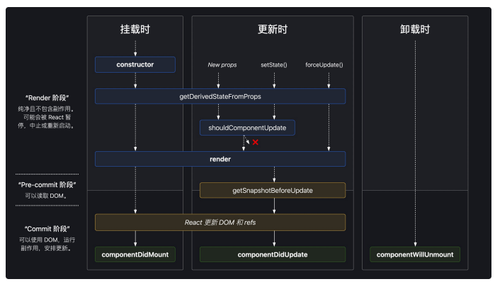

# 课程目标

* 入门React，了解常规用法
* 掌握面试中React的基础问题
* 掌握React学习路线

# 知识要点

## React简介

> React是一个**声明式**，高效且灵活的用于构建用户界面的JavaScript库。使用React可以将一些简短、独立的代码片段组合成复杂的UI界面，这些代码片段被称作**”组件“**。

ui = render(data) -> 单向数据流

* MVC



```js
var myapp = {}; // 创建这个应⽤对象

// model
myapp.Model = function() {
    var val = 0;
    
    this.add = function(v) {
        if (val < 100) val += v;
    };
    
    this.sub = function(v) {
        if (val > 0) val -= v;
    };
    
    this.getVal = function() {
        return val;
    };
    
    ／* 观察者模式 *／
    var self = this,
        views = [];
    
    this.register = function(view) {
        views.push(view);
    };
    
    this.notify = function() {
        for(var i = 0; i < views.length; i++) {
            views[i].render(self);
        }
    };
};

// view
myapp.View = function(controller) {
    var $num = $('#num'),
        $incBtn = $('#increase'),
        $decBtn = $('#decrease');
    
    this.render = function(model) {
        $num.text(model.getVal() + 'rmb');
    };
    
    /* 绑定事件 */
    $incBtn.click(controller.increase);
    $decBtn.click(controller.decrease);
};

// controller
myapp.Controller = function() {
    var model = null,
        view = null;
    
    this.init = function() {
        /* 初始化Model和View */
        model = new myapp.Model();
        view = new myapp.View(this);
        
        /* View向Model注册，当Model更新就会去通知View啦 */
        model.register(view);
        model.notify();
    };
    
    /* 让Model更新数值并通知View更新视图 */
    this.increase = function() {
        model.add(1);
        model.notify();
    };
    this.decrease = function() {
        model.sub(1);
        model.notify();
    };
};

// init
(function() {
    var controller = new myapp.Controller();
    controller.init();
})();
```

* MVVM



```js
// model
var data = {
    val: 0
};

// view
<div id="myapp">
    <div>
        <span>{{ val }}rmb</span>
    </div>
    <div>
        <button v-on:click="sub(1)">-</button>
        <button v-on:click="add(1)">+</button>
    </div>
</div>

// controller
new Vue({
    el: '#myapp',
    data: data,
    methods: {
        add(v) {
            if(this.val < 100) {
                this.val += v;
            }
        },
        sub(v) {
            if(this.val > 0) {
                this.val -= v;
            }
        }
    }
});

// Vue是不是MVVM？React呢？
// 严格来讲都不是
// React：ui = render (data) 单向数据流
// Vue:   ref 直接操作DOM，跳过了ViewModel
```

## JSX模板语法

JSX称为JS的语法扩展，将UI与逻辑层耦合在组件里，用{}标识

因为JSX语法上更接近JS而不是HTML，所以使用camelCase（小驼峰命名）来定义属性的名称；JSX里的class变成了className，而tabindex则变为tabIndex

### JSX支持表达式

支持JS表达式，变量，方法名

```jsx
// 变量
const name = 'Josh Perez';
const element = <h1>Hello, {name}</h1>;

function formatName(user) {
    return user.firstName + ' ' + user.lastName;
}

// ⽅法
const user = {
    firstName: 'Harper',
    lastName: 'Perez'
};

const element = (
    <h1>
    	Hello, {formatName(user)}!
    </h1>
);

function getGreeting(user) {
    if (user) {
        return <h1>Hello, {formatName(user)}!</h1>;
    }
    return <h1>Hello, Stranger.</h1>;
}
```

### JSX指定属性

```jsx
const element = </img>;

// 注意：JSX⽀持防注⼊(防⽌XSS攻击)
const title = response.potentiallyMaliciousInput;  // 此时只是字符串
// 直接使⽤是安全的： const element = <h1>{title}</h1>;

// React 如何预防XSS

// 反射型 XSS
// https://xxx.com/search?query=userInput
// 服务器在对此 URL 的响应中回显提供的搜索词：query=123
<p>您搜索的是: 123</p>
// https://xxx.com/search?query=
<p>您搜索的是: </p>
// 如果有⽤户请求攻击者的 URL ，则攻击者提供的脚本将在⽤户的浏览器中执⾏。
  
// 存储型 XSS，存储到目标数据库
// 评论输入，所有访问用户都能看到了
<textarea>
    
</textarea>
  
// 部分源码
for (index = match.index; index < str.length; index++) {
	switch (str.charCodeAt(index)) {
    	case 34: // "
      		escape = '&quot;';
      		break;
    	case 38: // &
      		escape = '&amp;';
      		break;
    	case 39: // '
      		escape = '&#x27;';
      		break;
    	case 60: // <
      		escape = '&lt;';
      		break;
    	case 62: // >
      		escape = '&gt;';
      		break;
        default:
      		continue;
    }
}
                                    
// ⼀段恶意代码

// React 在渲染到浏览器前进⾏的转义，可以看到对浏览器有特殊含义的字符都被转义了，恶意代码在渲染到 HTML 前都被转成了字符串 &lt;img src=&quot;empty.png&quot; onerror
=&quot;alert(&#x27;xss&#x27;)&quot;&gt;
  
// JSX
const element = (
    <h1 className="greeting">
        Hello, world!
    </h1>
);
  
// 通过 babel 编译后的代码
const element = React.createElement(
    'h1',
    {className: 'greeting'},
    'Hello, world!'
);
  
// React.createElement() ⽅法返回的 ReactElement
const element = {
	$$typeof: Symbol('react.element'),
	type: 'h1',
	key: null,
	props: {
		children: 'Hello, world!',
        className: 'greeting'  
    }
	...
}
    
// 如何模拟⼀个Children会如何？
const storedData = `{
    "ref": null,
    "type": "body",
    "props": {
        "dangerouslySetInnerHTML": {
            "__html":""
       }
   }
}`;
// 转成 JSON
const parsedData = JSON.parse(storedData);
// 将数据渲染到⻚⾯
render () {
    return <span> {parsedData} </span>;
}
  
// $$typeof 是⽤来标记⼀个ReactElement的，JSON化后Symbol会丢失，React会报错
```

### JSX表示对象

```jsx
const element = (
    <h1 className="greeting">
        Hello, world!
    </h1>
);

// 等同于React.createElement
const element = React.createElement(
    'h1',
    {className: 'greeting'},
    'Hello, world!'
);

const element = {
    type: 'h1',
    props: {
        className: 'greeting',
        children: 'Hello, world!'
    }
};

```

### 将JSX渲染为DOM

```jsx
// 使⽤ReactDOM.render
const element = <h1>Hello, world</h1>;
ReactDOM.render(element, document.getElementById('root'));

// render只能代表当前时刻的状态
// 更新元素 只能再次 ReactDOM.render
function tick() {
    const element = (
        <div>
            <h1>Hello, world!</h1>
            <h2>It is {new Date().toLocaleTimeString()}.</h2>
        </div>
    );
    ReactDOM.render(element, document.getElementById('root'));
}

setInterval(tick, 1000); // 不建议多次render
```

### JSX转JS

JSX可以当做语法糖，可以在babel官网中尝试，https://babeljs.io/repl

可以使用官网提供的create-react-a npm run eject 来看babelrc中的配置，主要使用https://www.babeljs.cn/docs/babel-preset-react

```js
// 安装babel 及react 的依赖
// npm install core-js @babel/core @babel/preset-env @babel/preset-react @babel/register babel-loader @babel/plugin-transform-runtime --save-dev

// .babelrc
{
    "presets" : [
        "@babel/preset-env" ,
        "@babel/preset-es2015",
        "@babel/preset-react"
   ],
    "plugins" : [
        "@babel/plugin-transform-runtime"
   ]
}
```

## props & state

> 组件，从概念上类似于JavaScript函数。它接受任意的入参（即“props”），并返回用于描述页面展示内容的React元素

### 组件

* 函数式组件
* Class类组件

```jsx
function Welcome(props) {
    return <h1>Hello, {props.name}</h1>;
}

class Welcome extends React.Component {
    render() {
        return <h1>Hello, {this.props.name}</h1>;
    }
}
```

#### 渲染组件

```jsx
function Welcome(props) {
    return <h1>Hello, {props.name}</h1>;
}

const element = <Welcome name="Sara" />;
ReactDOM.render(
    element,
    document.getElementById('root')
);

// ⾃定义组件使⽤⼤写字⺟开头
import React from 'react';

// 正确！组件需要以⼤写字⺟开头：
function Hello(props) {
    // 正确！ 这种 <div> 的使⽤是合法的，因为 div 是⼀个有效的 HTML 标签：
    return <div>Hello {props.toWhat}</div>;
}

function HelloWorld() {
    // 正确！React 知道 <Hello /> 是⼀个组件，因为它是⼤写字⺟开头的：
    return <Hello toWhat="World" />;
}
```

#### 组件的组合与拆分

```jsx
// ⻚⾯内多次引⽤
<div>
    <Welcome name="Sara" />
    <Welcome name="Cahal" />
    <Welcome name="Edite" />
</div>

function Comment(props) {
    return (
        <div className="Comment">
            <div className="UserInfo">
                
                <div className="UserInfo-name">
                    {props.author.name}
                </div>
            </div>
            <div className="Comment-text">
                {props.text}
            </div>
            <div className="Comment-date">
                {formatDate(props.date)}
            </div>
        </div>
    );
}

// 拆分后为
function Comment(props) {
    return (
        <div className="Comment">
            <UserInfo user={props.author} />
            <div className="Comment-text">
                {props.text}
            </div>
            <div className="Comment-date">
                {formatDate(props.date)}
            </div>
        </div>
    );
}
```

### props

```jsx
// 所有 React 组件都必须像纯函数⼀样保护它们的 props 不被更改。
// 错误，要像纯函数⼀样幂等
function withdraw(account, amount) {
  account.total -= amount;
}
```

### state

```jsx
// 使⽤props形式
function Clock(props) {
    return (
        <div>
            <h1>Hello, world!</h1>
            <h2>It is {props.date.toLocaleTimeString()}.</h2>
        </div>
    );
}

function tick() {
    ReactDOM.render(
        <Clock date={new Date()} />,
        document.getElementById('root')
    );
}

setInterval(tick, 1000);

// 如何避免多次React.DOM render？
// 引⽤⽣命周期，根组件保留⼀个
class Clock extends React.Component {
    constructor(props) {
        super(props);
        this.state = {date: new Date()};
    }
    
    componentDidMount() {
        this.timerID = setInterval(
            () => this.tick(),
            1000
        );
    }
    
    componentWillUnmount() {
        clearInterval(this.timerID);
    }
    
    tick() {
        this.setState({
            date: new Date()
        });
    }
    
    render() {
        return (
            <div>
                <h1>Hello, world!</h1>
                <h2>It is {this.state.date.toLocaleTimeString()}.</h2>
            </div>
        );
    }
}

ReactDOM.render(
    <Clock />,
    document.getElementById('root')
);
```

```jsx
// 1. setState
// 构造函数是唯⼀可以给state赋值的地⽅
this.setState({comment: 'Hello'});

// 2. state更新可能是异步的
// Wrong
this.setState({
    counter: this.state.counter + this.props.increment,
});
// Correct
this.setState(function(state, props) {
    return {
        counter: state.counter + props.increment
    };
});

// 3. state更新会合并
constructor(props) {
    super(props);
    this.state = {
        posts: [],
        comments: []
    };
}

componentDidMount() {
    fetchPosts().then(response => {
        // 相当于{post: response.posts, ...otherState}
        this.setState({
            posts: response.posts
        });
    });
    
    fetchComments().then(response => {
        this.setState({
            comments: response.comments
        });
    });
}

// 4. 单向数据流
// state 只在当前的组件里生效，属于组件内的属性，重复实例化相同的组件，内部的内存地址也是不⼀样的；例如Clock中计时器都是独⽴的
```

```jsx
// setState 异步
// 异步目的：batch 处理，性能优化
// 1. 合成事件
class App extends Component {
    
    state = { val: 0 }
    
    increment = () => {
        this.setState({ val: this.state.val + 1 })
        console.log(this.state.val) // 输出的是更新前的val --> 0
    }    
    
    render() {
        return (
            <div onClick={this.increment}>
                {`Counter is: ${this.state.val}`}
            </div>
        )
    }
}

// 2. ⽣命周期
class App extends Component {
    
    state = { val: 0 }
    
    componentDidMount() {
        this.setState({ val: this.state.val + 1 })
        console.log(this.state.val) // 输出的还是更新前的值 --> 0
    }
    
    render() {
        return (
            <div>
                {`Counter is: ${this.state.val}`}
            </div>
        )
    }
}

// 3. 原⽣事件
class App extends Component {
    
    state = { val: 0 }
    
    changeValue = () => {
        this.setState({ val: this.state.val + 1 })
        console.log(this.state.val) // 输出的是更新后的值 --> 1
    }
    
    componentDidMount() {
        document.body.addEventListener('click', this.changeValue, false)
    }
    
    render() {
        return (
            <div>
                {`Counter is: ${this.state.val}`}
            </div>
        )
    }
}

// 4. setTimeout
class App extends Component {
    
    state = { val: 0 }
    
    componentDidMount() {
        setTimeout(_ => {
            this.setState({ val: this.state.val + 1 })
            console.log(this.state.val) // 输出更新后的值 --> 1
        }, 0)
    }
    
    render() {
        return (
            <div>
                {`Counter is: ${this.state.val}`}
            </div>
        )
    }
}

// 5. 批处理
class App extends Component {
    
    state = { val: 0 }
    
    batchUpdates = () => {
        this.setState({ val: this.state.val + 1 })
        this.setState({ val: this.state.val + 1 })
        this.setState({ val: this.state.val + 1 })
    }
    
    render() {
        return (
            <div onClick={this.batchUpdates}>
                {`Counter is ${this.state.val}`} // 1
            </div>
        )
    }
}
```

1. setState只在合成事件和生命周期中是“异步”的，在原生事件和setTimeout中都是同步的。
2. setState的“异步”并不是说内部由异步代码实现，其实本身执行的过程和代码都是同步的，只是合成事件和钩子函数的调用顺序在更新之前，导致在合成事件和钩子函数中没法立马拿到更新后的值，形式了所谓的“异步”，当然可以通过第二个参数setState(partialState, callback)中的callback拿到更新后的结果。
3. setState的批量更新优化也是建立在“异步”（合成事件、钩子函数）之上的，在原生事件和setTimeout中不会批量更新，在“异步”中如果对同一个值进行多次setState，setState的批量更新策略会对其进行覆盖，取最后一次的执行，如果是同时setState多个不同的值，在更新时会对其进行合并批量更新。

## 生命周期



### render

是class组合必需的方法

获取最新的props和state

在不修改组件state的情况下，每次调用时都返回相同的结果

### constructor

如果不初始化state或不进行方法绑定，则不需要为React组件实现构造函数。

* 通过给this.stae赋值对象来初始化内部state
* 为事件处理函数绑定实例

```jsx
constructor(props) {
    super(props);
    // 不要在这⾥调⽤ this.setState()
    this.state = { counter: 0 };
    this.handleClick = this.handleClick.bind(this);
}

// 1. 不要调⽤ setState()
// 2. 避免将 props 的值复制给 state
this.state = { color: props.color }; // wrong
```

### componentDidMount

会在组件挂载后（插入DOM树中）立即调用

依赖于DOM节点的初始化应该放在这里，如需通过网络请求获取数据；

可以在此生命周期里加setState，但发生在浏览器更新屏幕之前，会导致性能问题；

有更新在render阶段的constructor中initState，但有更新可以在此方法时setState

### componentDidUpdate

```jsx
componentDidUpdate(prevProps, prevState, snapshot)
```

会在更新后会被立即调用。首次渲染不会执行此方法。

```jsx
componentDidUpdate(prevProps) {
    // 典型⽤法（不要忘记⽐较 props）：加条件判断，不然死循环
    if (this.props.userID !== prevProps.userID) {
        this.fetchData(this.props.userID);
    }
}
// 如果组件实现了 getSnapshotBeforeUpdate() ⽣命周期，则它的返回值将作为 componentDidUpdate() 的第三个参数 “snapshot” 参数传递。否则此参数将为 undefined。
```

如果shouldComponentUpdate()返回值为false，则不会调用componentDidUpdate()。

### componentWillUnmount

componentWillUnmount()会在组件卸载及销毁之前直接调用。例如，清除timer，取消网络请求；

componentWillUnmount()中不应调用setState()，因为该组件将永远不会重新渲染；

### shouldComponentUpate

（不常用）

```jsx
shouldComponentUpdate(nextProps, nextState)
```

根据shouldComponentUpdate()的返回值，判断React直接的输出是否受当前state或props更改的影响。默认行为是state每次发生变化组件都会重新渲染。

作为性能优化使用，返回false可以跳过re-render

shouldComponentUpdate()返回false，不会调用UNSAFE_componentWillUpdate()，render()和componentDidUpdate()。

### getDerivedStateFromProps

（不常用）

是为了取代componentWillReceiveProps和componentWillUpdate设置的

根据props的变化改变state，它应返回一个对象来更新state，如果返回null则不更新任何内容

* 在使用此生命周期时，要注意把传入的prop值和之前传入的prop进行比较；
* 因为这个生命周期是静态方法，同时要保持它是纯函数，不要产生副作用；

```jsx
static getDerivedStateFromProps(nextProps, prevState) {
    const {type} = nextProps;
    // 当传⼊的type发⽣变化的时候，更新state
    if (type !== prevState.type) {
        return {
            type,
       };
   }
    // 否则，对于state不进⾏任何操作
    return null;
}

Class ColorPicker extends React.Component {
    state = {
        color: '#000000'
   }
    static getDerivedStateFromProps (props, state) {
        if (props.color !== state.color) {
            return {
                color: props.color
           }
       }
        return null
   }
    ... // 选择颜⾊⽅法
    render () {
        .... // 显示颜⾊和选择颜⾊操作，setState({color: XXX})
   }
}

Class ColorPicker extends React.Component {
    state = {
        color: '#000000',
        prevPropColor: '' // setState 和 forceUpdate也会触发此⽣命周期，会覆盖
   }
    static getDerivedStateFromProps (props, state) {
        if (props.color !== state.prevPropColor) {
            return {
                color: props.color,
                prevPropColor: props.color
           }
       }
        return null
   }
    ... // 选择颜⾊⽅法
        render () {
        .... // 显示颜⾊和选择颜⾊操作
   }
}
```

### getSnapshotBeforeUpdate

（不常用）

```jsx
getSnapshotBeforeUpdate(prevProps, prevState)
```

getSapshotBeforeUpdate()在最近一次渲染输出（提交到DOM节点）之前调用；

此生命周期方法的任何返回值将作为参数传递给componentDidUpdate()。

```jsx
class ScrollingList extends React.Component {
    constructor(props) {
        super(props);
        this.listRef = React.createRef();
    }
    
    getSnapshotBeforeUpdate(prevProps, prevState) {
        // 我们是否在 list 中添加新的 items ？
        // 捕获滚动••位置以便我们稍后调整滚动位置。
        if (prevProps.list.length < this.props.list.length) {
            const list = this.listRef.current;
            return list.scrollHeight - list.scrollTop;
        }
        return null;
    }
    
    componentDidUpdate(prevProps, prevState, snapshot) {
        // 如果我们 snapshot 有值，说明我们刚刚添加了新的 items，
        // 调整滚动位置使得这些新 items 不会将旧的 items 推出视图。
        //（这⾥的 snapshot 是 getSnapshotBeforeUpdate 的返回值）
        if (snapshot !== null) {
            const list = this.listRef.current;
            list.scrollTop = list.scrollHeight - snapshot;
        }
    }
    
    render() {
        return (
            <div ref={this.listRef}>{/* ...contents... */}</div>
        );
    }
}
```

### static getDerivedStateFromError

（不常用）

配合Error boundaries使用

此生命周期会在后代组件抛出错误后被调用。它将抛出的错误作为参数，并返回一个值以更新state

### componentDidCatch

（不常用）

componentDidCatch()会在“提交”阶段被调用，因此允许执行副作用。它应该用于记录错误之类的情况

```jsx
componentDidCatch(error, info)

class ErrorBoundary extends React.Component {
    constructor(props) {
        super(props);
        this.state = { hasError: false };
    }
    
    static getDerivedStateFromError(error) {
        // 更新 state 使下⼀次渲染可以显示降级 UI
        return { hasError: true };
    }
    
    componentDidCatch(error, info) {
        // "组件堆栈" 例⼦:
        //   in ComponentThatThrows (created by App)
        //   in ErrorBoundary (created by App)
        //   in div (created by App)
        //   in App
        logComponentStackToMyService(info.componentStack);
    }
    
    render() {
        if (this.state.hasError) {
            // 你可以渲染任何⾃定义的降级 UI
            return <h1>Something went wrong.</h1>;
        }
        return this.props.children;
    }
}
```

### UNSAFE_componentWillMount

（不建议使用）

UNSAFE_componentWillMount()在挂载之前被调用；

它在render()之前调用，因此在此方法中同步调用setState()不会生效；

需要的话用componentDidMount替代。

### UNSAFE_componentWillReceiveProps

（不建议使用）

UNSAFE_componentWillReceiveProps()会在已挂载的组件接收新的props之前被调用；

如果你需要更新状态以响应pro更改（例如，重置它），你可以比较this.props和nextProps并在此方法中使用this.setState()执行state转换。

### UNSAFE_componentWillUpdate

（不建议使用）

* 当组件收到新的props或state时，会在渲染之前调用UNSAFE_componentWillUpdate()；
* 使用此作为在更新发生之前执行准备更新的机会；
* 初始渲染不会调用此方法；

如果shouldComponentUpdate()返回false，则不会调用UNSAFE_componentWillUpdate()；

## 事件处理

### 语法格式

1. 在JSX元素上添加事件，通过on*EventType这种内联方式添加，命名采用小驼峰式（camelCase）的形式，而不是纯小写（原生HTML中对DOM元素绑定事件，事件类型是小写的）；
2. 无需调用addEventListener进行事件监听，也无需考虑兼容性，React已经封装好了一些事件类型属性；
3. 使用JSX语法试你需要传入一个函数作为事件处理函数，而不是一个字符串；
4. 不能通过返回false的方式阻止默认行为。你必须显式地使用preventDefault

```jsx
// DOM
<button onclick="activateLasers()">
    Activate Lasers
</button>

// React
<button onClick={activateLasers}>
    Activate Lasers
</button>

// JS
<form onsubmit="console.log('You clicked submit.'); return false">
    <button type="submit">Submit</button>
</form>

// React
⼀般不需要使⽤ addEventListener 为已创建的 DOM 元素添加监听器；
function Form() {
    function handleSubmit(e) {
        e.preventDefault();
        console.log('You clicked submit.');
    }
    
    return (
        <form onSubmit={handleSubmit}>
            <button type="submit">Submit</button>
        </form>
    );
}
```

```jsx
class Toggle extends React.Component {
    constructor(props) {
        super(props);
        this.state = {isToggleOn: true};
        
        // 为了在回调中使⽤ `this`，这个绑定是必不可少的
        this.handleClick = this.handleClick.bind(this);
    }
    
    handleClick() {
        this.setState(prevState => ({
            isToggleOn: !prevState.isToggleOn
        }));
    }
    
    render() {
        return (
            // class 的⽅法默认不会绑定 this。如果没有绑定 this.handleClick 并把它传入了 onClick，
            // this 的值为 undefined。
            <button onClick={this.handleClick}>
                {this.state.isToggleOn ? 'ON' : 'OFF'}
            </button>
        );
    }
}

ReactDOM.render(
    <Toggle />,
    document.getElementById('root')
);

// 为什么要绑定this
function createElement(dom, params) {
    var domObj = document.createElement(dom);
    domObj.onclick = params.onclick;
    domObj.innerHTML = params.conent;
    return domObj
}
// createElement 的onClick函数是绑定到domObj上的，如果this不显式绑定，不会绑定到Toggle上
// 不显式使⽤bind
// 1.  public class fields 语法
class LoggingButton extends React.Component {
    // 此语法确保 `handleClick` 内的 `this` 已被绑定。
    // 注意: 这是 *实验性* 语法。
    handleClick = () => {
        console.log('this is:', this);
    }
    
    render() {
        return (
            <button onClick={this.handleClick}>
                Click me
            </button>
        );
    }
}

// 2. 箭头函数，问题： 每次render都会创建不同的回调函数，如果该回调函数作为props传⼊⼦组件，每次⼦组件都要re-render
class LoggingButton extends React.Component {
    handleClick() {
        console.log('this is:', this);
    }
    render() {
        // 此语法确保 `handleClick` 内的 `this` 已被绑定。
        return (
            <button onClick={() => this.handleClick()}>
                //  <button onClick={this.handleClick().bind(this)}>
                Click me
			</button>
		);
	}
}
                
// 3. createReactClass代替
```

### 接收参数

1. 事件对象e会被作为第二个参数传递；
2. 通过箭头函数的方式，事件对象必须显式地进行传递；
3. 通过Function.prototype.bind的方式，事件对象以及更多的参数将会被隐式地进行传递；

```jsx
<button onClick={(e) => this.deleteRow(id, e)}>Delete Row</button>
<button onClick={this.deleteRow.bind(this, id)}>Delete Row</button>
```

## 条件渲染

### if else渲染

```jsx
class LoginControl extends React.Component {
    constructor(props) {
        super(props);
        this.handleLoginClick = this.handleLoginClick.bind(this);
        this.handleLogoutClick = this.handleLogoutClick.bind(this);
        this.state = {isLoggedIn: false};
    }
    
    handleLoginClick() {
        this.setState({isLoggedIn: true});
    }
    
    handleLogoutClick() {
        this.setState({isLoggedIn: false});
    }
    
    render() {
        const isLoggedIn = this.state.isLoggedIn;
        let button;
        if (isLoggedIn) {
            button = <LogoutButton onClick={this.handleLogoutClick} />;
        } else {
            button = <LoginButton onClick={this.handleLoginClick} />;
        }
        
        return (
            <div>
                <Greeting isLoggedIn={isLoggedIn} />
                {button}
            </div>
        );
    }
}

ReactDOM.render(
    <LoginControl />,
    document.getElementById('root')
);
```

### 与运算符&&

```jsx
function Mailbox(props) {
    const unreadMessages = props.unreadMessages;
    return (
        <div>
            <h1>Hello!</h1>
            {unreadMessages.length > 0 &&
                <h2>
                 You have {unreadMessages.length} unread messages.
             </h2>
            }
        </div>
    );
}

const messages = ['React', 'Re: React', 'Re:Re: React'];
ReactDOM.render(
    <Mailbox unreadMessages={messages} />,
    document.getElementById('root')
);

// 返回false的表达式，会跳过元素，但会返回该表达式
render() {
    const count = 0;
    return (
        <div>
            { count && <h1>Messages: {count}</h1>}
        </div>
    );
}
```

### 三元运算符

```jsx
render() {
    const isLoggedIn = this.state.isLoggedIn;
    return (
        <div>
            {isLoggedIn
                ? <LogoutButton onClick={this.handleLogoutClick} />
                : <LoginButton onClick={this.handleLoginClick} />
            }
        </div>
    );
}
```

### 如何阻止组件渲染

```jsx
function WarningBanner(props) {
    if (!props.warn) {
        return null;
    }
    
    return (
        <div className="warning">
            Warning!
        </div>
    );
}

class Page extends React.Component {
    constructor(props) {
        super(props);
        this.state = {showWarning: true};
        this.handleToggleClick = this.handleToggleClick.bind(this);
    }
    
    handleToggleClick() {
        this.setState(state => ({
            showWarning: !state.showWarning
        }));
    }
    
    render() {
        return (
            <div>
                <WarningBanner warn={this.state.showWarning} />
                <button onClick={this.handleToggleClick}>
                    {this.state.showWarning ? 'Hide' : 'Show'}
                </button>
            </div>
        );
    }
}

ReactDOM.render(
    <Page />,
    document.getElementById('root')
);
```

## 列表

```jsx
function NumberList(props) {
    const numbers = props.numbers;
    const listItems = numbers.map((number) =>
		<li key={number.toString()}>
			{number}
		</li>
	);
    
    return (
        <ul>{listItems}</ul>
    );
}

const numbers = [1, 2, 3, 4, 5];
ReactDOM.render(
    <NumberList numbers={numbers} />,
    document.getElementById('root')
);
// 若没有key，会warning a key should be provided for list items
// key可以帮助react diff，最好不⽤index作为key，会导致性能变差；
// 如果不指定显式的 key 值，默认使⽤索引⽤作为列表项⽬的 key 值；
```

### key注意点

```jsx
// key要保留在map的遍历元素上

// demo1
function ListItem(props) {
    // 正确！这⾥不需要指定 key：
    return <li>{props.value}</li>;
}

function NumberList(props) {
    const numbers = props.numbers;
    const listItems = numbers.map((number) =>
		// 正确！key 应该在数组的上下⽂中被指定
		<ListItem key={number.toString()} value={number} />
	);    
    return (
        <ul>
            {listItems}
        </ul>
    );
}

const numbers = [1, 2, 3, 4, 5];
ReactDOM.render(
    <NumberList numbers={numbers} />,
    document.getElementById('root')
);

// demo2
function Blog(props) {
    const sidebar = (
        <ul>
            {props.posts.map((post) =>
				<li key={post.id}>
					{post.title}
				</li>
			)}
		</ul>
	);  
    const content = props.posts.map((post) =>
		<div key={post.id}>
			<h3>{post.title}</h3>
			<p>{post.content}</p>
		</div>
	);
    return (
        <div>
            {sidebar}
            <hr />
            {content}
        </div>
    );
}

const posts = [
    {id: 1, title: 'Hello World', content: 'Welcome to learning React!'},
    {id: 2, title: 'Installation', content: 'You can install React from npm.'}
];
ReactDOM.render(
    <Blog posts={posts} />,
    document.getElementById('root')
);

// demo3
function NumberList(props) {
    const numbers = props.numbers;
    return (
        <ul>
            {numbers.map((number) =>
				<ListItem key={number.toString()}
                    value={number} />
			)}
        </ul>
    );
}
```

