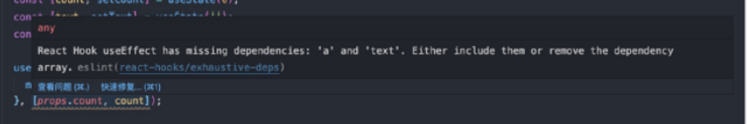
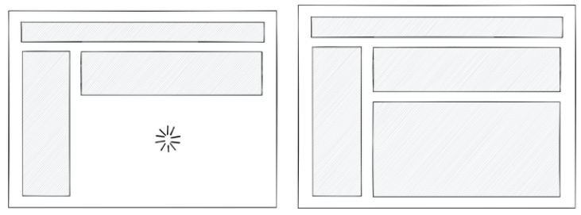
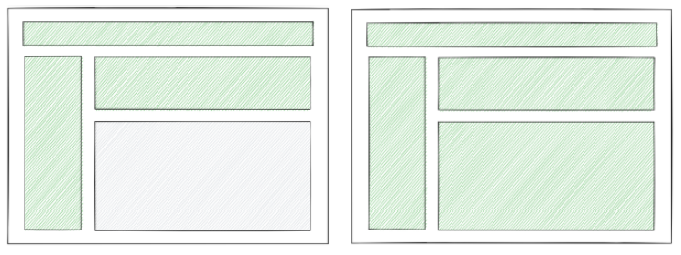
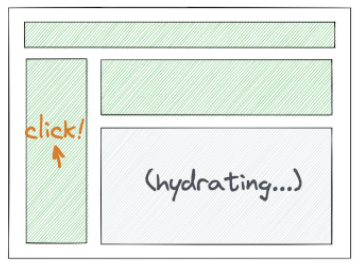

# 课程目标

P6：

* 会用React写项目，较熟练使用React配套技术栈，有一定实际开发经验
* 能够针对复杂的业务场景指定出较为规范的逻辑架构

P6+P7：

* 基于实际开发场景，搭建配套脚手架，能够基于当前实际开发场景优化架构设计，制定团队规范
* 对前沿技术有足够的敏感度，保证项目的可扩展性与健壮性
* 精通一个框架的底层设计，熟悉多个框架的实际设计及对比

其他目标：

* 深入了解React技术栈相关的知识点，知道React生态中发展现状，能够对面试所提的问题举一反三

# 知识要点

## 高阶组件用法及封装

高阶组件（HOC）是React中用于复用组件逻辑的一种高级技巧。HOC自身不是React API的一部分，它是一种基于React的组合特性而形成的设计模式。

简单点说，就是组件作为参数，返回值也是组件的函数，它是纯函数，不会修改传入的组件，也不会使用继承来复制其行为。相反，HOC通过将组件包装在容器组件中来组成新组件。HOC是纯函数，没有副作用。

### 使用HOC的原因

1. 抽取重复代码，实现组件复用：相同功能组件复用
2. 条件渲染，控制组件的渲染逻辑（渲染劫持）：权限控制
3. 捕获/劫持被处理组件的生命周期，常见场景：组件渲染性能追踪、日志打点

### HOC实现方式

#### 属性代理

使用组合的方式，将组件包装在容器上，依赖父子组件的生命周期关系来

1. 返回stateless的函数组件
2. 返回class组件

* 操作props

```jsx
// 可以通过属性代理，拦截⽗组件传递过来的porps并进⾏处理。

// 返回⼀个⽆状态的函数组件
function HOC(WrappedComponent) {
    const newProps = { type: 'HOC' };
    return props => <WrappedComponent {...props} {...newProps}/>;
}

// 返回⼀个有状态的 class 组件
function HOC(WrappedComponent) {
    return class extends React.Component {
        render() {
            const newProps = { type: 'HOC' };
            return <WrappedComponent {...this.props} {...newProps}/>;
        }
    };
}
```

* 抽象state

```jsx
// 通过属性代理⽆法直接操作原组件的state，可以通过props和cb抽象state
function HOC(WrappedComponent) {
    return class extends React.Component {
        constructor(props) {
            super(props);
            this.state = {
                name: '',
            };
            this.onChange = this.onChange.bind(this);
        }
    
        onChange = (event) => {
            this.setState({
                name: event.target.value,
            })
        }
    
        render() {
            const newProps = {
                name: {
                    value: this.state.name,
                    onChange: this.onChange,
                },
            };
            return <WrappedComponent {...this.props} {...newProps} />;
        }
    };
}

// 使⽤
@HOC
class Example extends Component {
    render() {
        return <input name="name" {...this.props.name} />;
    }
}
```

* 通过props实现条件渲染

```jsx
// 通过props来控制是否渲染及传⼊数据
import * as React from 'react';

function HOC (WrappedComponent) {
    return (props) => (
        <div>
        	{
            	props.isShow ? (
            		<WrappedComponent
            			{...props}
        			/>
     			) : <div>暂⽆数据</div>
        	}
		</div>
	);
}

export default HOC;
```

* 其他元素wrapper传入组件

```jsx
function withBackgroundColor(WrappedComponent) {
    return class extends React.Component {
        render() {
            return (
                <div style={{ backgroundColor: '#ccc' }}>
                    <WrappedComponent {...this.props} {...newProps} />
                </div>
            );
        }
    };
}
```

#### 反向继承

使用一个函数接受一个组件作为参数传入，并返回一个继承了该传入组件的类组件，且在返回组件的render()方法中返回super.render()方法

```jsx
const HOC = (WrappedComponent) => {
    return class extends WrappedComponent {
        render() {
            return super.render();
        }
    }
}
```

1. 允许HOC通过this访问到原组件，可以直接读取和操作原组件的state/ref等；
2. 可以通过super.render()获取传入组件的render，可以有选择的渲染劫持；
3. 劫持原组件生命周期方法。

```jsx
function HOC(WrappedComponent){
    const didMount = WrappedComponent.prototype.componentDidMount;
  
    // 继承了传入组件
    return class HOC extends WrappedComponent {
        async componentDidMount() {
            // 劫持 WrappedComponent 组件的⽣命周期
            if (didMount) {
                await didMount.apply(this);
            }
            ...
        }         

        render() {
            //使⽤ super 调⽤传入组件的 render ⽅法
            return super.render();
        }
    }
}
```

* 读取/操作原组件的state

```jsx
function HOC(WrappedComponent) {
    const didMount = WrappedComponent.prototype.componentDidMount;
    // 继承了传⼊组件
    return class HOC extends WrappedComponent {
        async componentDidMount() {
            if (didMount) {
                await didMount.apply(this);
            }
            // 将 state 中的 number 值修改成 2
            this.setState({ number: 2 });
        }
      
        render() {
            //使⽤ super 调⽤传⼊组件的 render ⽅法
            return super.render();
        }
    }
}
```

* 条件渲染

```jsx
const HOC = (WrappedComponent) =>
	class extends WrappedComponent {
        render() {
            if (this.props.isRender) {
                return super.render();
            } else {
                return <div>暂⽆数据</div>;
            }
        }
    }
```

* 修改react树

```jsx
// 修改返回render结果
function HigherOrderComponent(WrappedComponent) {
    return class extends WrappedComponent {
        render() {
            const tree = super.render();
            const newProps = {};
            if (tree && tree.type === 'input') {
                newProps.value = 'something here';
            }
            const props = {
                ...tree.props,
                ...newProps,
            };
            const newTree = React.cloneElement(tree, props, tree.props.children);
            return newTree;
        }
    };
}
```

### 属性代理和反向继承对比

1. 属性代理：从“组合”角度出发，有利于从外部操作wrappedComp，可以操作props，或者在wrappedComp外加一些拦截器（如条件渲染等）；
2. 反向继承：从“继承”角度出发，从内部操作wrappedComp，可以操作组件内部的state，生命周期和render等，功能更加强大。

### 举个栗子

* 页面复用（属性代理）

```jsx
// views/PageA.js
import React from 'react';
import fetchMovieListByType from '../lib/utils';
import MovieList from '../components/MovieList';

class PageA extends React.Component {
    state = {
        movieList: [],
    }
    /* ... */
    async componentDidMount() {
        const movieList = await fetchMovieListByType('comedy');
        this.setState({
            movieList,
        });
    }
  
    render() {
        return <MovieList data={this.state.movieList} emptyTips="暂⽆喜剧"/>
    }
}
export default PageA;


// views/PageB.js
import React from 'react';
import fetchMovieListByType from '../lib/utils';
import MovieList from '../components/MovieList';

class PageB extends React.Component {
    state = {
        movieList: [],
    }
    // ...
    async componentDidMount() {
        const movieList = await fetchMovieListByType('action');
        this.setState({
            movieList,
        });
    }
    render() {
        return <MovieList data={this.state.movieList} emptyTips="暂⽆动作⽚"/>
    }
}
export default PageB;


// 冗余代码过多
// HOC
import React from 'react';
const withFetchingHOC = (WrappedComponent, fetchingMethod, defaultProps)
	=> {
        return class extends React.Component {
            async componentDidMount() {
                const data = await fetchingMethod();
                this.setState({
                    data,
                });
            }
    
            render() {
                return (
                    <WrappedComponent
                        data={this.state.data}
                        {...defaultProps}
                        {...this.props}
                    />
                );
            }
        }
    }

// 使⽤：
// views/PageA.js
import React from 'react';
import withFetchingHOC from '../hoc/withFetchingHOC';
import fetchMovieListByType from '../lib/utils';
import MovieList from '../components/MovieList';

const defaultProps = {emptyTips: '暂⽆喜剧'}

export default withFetchingHOC(MovieList, fetchMovieListByType('comedy'), defaultProps);

// views/PageB.js
import React from 'react';
import withFetchingHOC from '../hoc/withFetchingHOC';
import fetchMovieListByType from '../lib/utils';
import MovieList from '../components/MovieList';

const defaultProps = {emptyTips: '暂⽆动作⽚'}

export default withFetchingHOC(MovieList, fetchMovieListByType('action'), defaultProps);;

// views/PageOthers.js
import React from 'react';
import withFetchingHOC from '../hoc/withFetchingHOC';
import fetchMovieListByType from '../lib/utils';
import MovieList from '../components/MovieList';
const defaultProps = {...}
export default withFetchingHOC(MovieList, fetchMovieListByType('someother-type'), defaultProps);
```

更符合里氏代换原则（Liskov Substitution Principle LSP），任何基类可以出现的地方，子类一定可以出现。LSP是继承复用的基石，只有当衍生类可以替换掉基类，软件单位的功能不受到影响时，基类才能真正被复用，而衍生类也能够在基类的基础上增加新的行为。

* 权限控制（属性代理）

```jsx
import React from 'react';
import { whiteListAuth } from '../lib/utils'; // 鉴权⽅法

function AuthWrapper(WrappedComponent) {
    return class AuthWrappedComponent extends React.Component {
        constructor(props) {
            super(props);
            this.state = {
                permissionDenied: -1,
            };
        }
        
        async componentDidMount() {
            try {
                await whiteListAuth(); // 请求鉴权接⼝
                this.setState({
                    permissionDenied: 0,
                });
            } catch (err) {
                this.setState({
                    permissionDenied: 1,
                });
            }
        }
    
        render() {
            if (this.state.permissionDenied === -1) {
                return null; // 鉴权接⼝请求未完成
            }
            if (this.state.permissionDenied) {
                return <div>功能即将上线，敬请期待~</div>;
            }
            return <WrappedComponent {...this.props} />;
        }
    }
}

export default AuthWrapper;
```

* 组件渲染性能（反向继承）

如何计算一个组件render期间的渲染耗时？

```jsx
import React from 'react';
// Home 组件
class Home extends React.Component {
    render () {
        return (<h1>Hello World.</h1>);
    }
}

// HOC
function withTiming (WrappedComponent) {
    let start, end;
    return class extends WrappedComponent {
        constructor (props) {
            super(props);
            start = 0;
            end = 0;
        }
        componentWillMount () {
            if (super.componentWillMount) {
                super.componentWillMount();
            }
            start = +Date.now();
        }
        componentDidMount () {
            if (super.componentDidMount) {
                super.componentDidMount();
            }
            end = +Date.now();
            console.error(`${WrappedComponent.name} 组件渲染时间为 ${end - start}ms`);
        }
        render () {
            return super.render();
        }
    };
}

export default withTiming(Home);
```

## Hooks详解

> Hooks是React16.8以后新增的钩子API；
>
> 目的：增加代码的可复用性，逻辑性，弥补无状态组件没有生命周期，没有数据管理状态state的缺陷。

为什么要使用Hooks？

1. 开发友好，可扩展性强，抽离公共的方法或组件，Hooks使你在无需修改组件结构的情况下复用状态逻辑；
2. 函数式编程，将组件中相互关联的部分根据业务逻辑拆分成更小的函数；
3. class更多作为语法糖，没有稳定的提案，且在开发过程中会出现不必要的优化点，Hooks无需学习复杂的函数式或响应式编程技术。

### 常见Hooks

#### useState

```jsx
const [number, setNumber] = useState(0);
```

1. setState支持stateless组件有自己的state；
2. 入参：具体值或一个函数；
3. 返回值：数组，第一项是state值，第二项负责派发数据更新，组件渲染；

注意：setState会让组件重新执行，所以一般需要配合useMemo或useCallback。

```jsx
const DemoState = (props) => {
    /* number为此时state读取值 ，setNumber为派发更新的函数 */
    const [number, setNumber] = useState(0) /* 0为初始值 */
    return (
        <div>
            <span>{ number }</span>
            <button onClick={() => {
				setNumber(number + 1)
				console.log(number) /* 这⾥的number是不能够即使改变的，返回0 */
			}}/>
        </div>
    )
}
// 当更新函数之后，state的值是不能即时改变的，只有当下⼀次上下⽂执⾏的时候，state值才随之改变

——————————————————————————————————————————

const a = 1
const DemoState = (props) => {
    /* useState 第⼀个参数如果是函数 则处理复杂的逻辑，返回值为初始值 */
    let [number, setNumber] = useState(() => {
        // number
        return a === 1 ? 1 : 2
    }) /* 1为初始值 */
    return (
        <div>
            <span>{ number }</span>
            <button onClick={ ()=>setNumber(number+1) } ></button>
        </div>
    )
}
```

#### useEffect

1. 使用条件：当组件init、dom render完成、操作dom、请求数据（如componentDidMount）等；
2. 不限制条件，组件每次更新都会触发useEffect-->componentDidUpdate与componentWillreceiveprops；
3. useEffect第一个参数为处理事件，第二个参数接收数组，为限定条件，当数组变化时触发事件，为[]只在组件初始化时触发；
4. useEffect第一个参数有返回时，一般用来消除副作用（如去除定时器、事件绑定等）。

```jsx
/* 模拟数据交互 */
function getUserInfo(a)
	return new Promise((resolve) => {
        setTimeout(() => {
            resolve({
                name:a,
                age:16,
            })
        },500)
    })
}

const Demo = ({ a }) => {
    const [ userMessage , setUserMessage ] = useState({})
    const [number, setNumber] = useState(0)
  
    const div= useRef()
  
    const handleResize = () => {}
    
    useEffect(() => {
        getUserInfo(a).then(res => {
            setUserMessage(res)
        })
        console.log(div.current) /* div */
        window.addEventListener('resize', handleResize)
        /*
        只有当props->a和state->number改变的时候 ,useEffect副作⽤函数重新执⾏ ，
        如果此时数组为空[]，证明函数只有在初始化的时候执⾏⼀次相当于componentDidMount
        */
    },[ a ,number ])
    
    return (
        <div ref={div} >
            <span>{ userMessage.name }</span>
            <span>{ userMessage.age }</span>
            <div onClick={ ()=> setNumber(1) } >{ number }</div>
        </div>
    )
}

————————————————————————————————————————————————

const Demo = ({ a }) => {
    const handleResize =() => {}
    useEffect(() => {
        const timer = setInterval(() => console.log(666), 1000)
        window.addEventListener('resize', handleResize)
      
        /* 此函数⽤于清除副作⽤ */
        return function() {
            clearInterval(timer)
            window.removeEventListener('resize', handleResize)
        }
    },[ a ])
    return (<div></div>)
}
```

注意：useEffect无法直接使用async await。

```jsx
// Bad
useEffect(async () => {
    /* 请求数据 */
    const res = await getUserInfo(payload)
},[ a ,number ])

————————————————————————————————————————————————

useEffect(() => {
    // declare the async data fetching function
    const fetchData = async () => {
        const data = await fetch('https://xxx.com');
        const json = await data.json();
        return json;
    }
    
    // call the function
    const result = fetchData()
    	.catch(console.error);
    
    // ❌ ⽆效
    setData(result);
}, [])

// 改进版
useEffect(() => {
    const fetchData = async () => {
        const data = await fetch('https://xxx.com');
        const json = await response.json();
        setData(json);
    }
    
    // call the function
    fetchData()
    	// make sure to catch any error
   		.catch(console.error);;
}, [])
```

#### useLayoutEffect

渲染更新之前的useEffect

useEffect：组件更新挂载完成 -> 浏览器dom绘制完成 -> 执行useEffect回调；

useLayoutEffect：组件更新挂载完成 -> 执行useLayoutEffect回调 -> 浏览器dom绘制完成。

渲染组件

1. useEffect：闪动；
2. useLayoutEffect：卡顿。

```jsx
const DemoUseLayoutEffect = () => {
    const target = useRef()
    useLayoutEffect(() => {
        /*我们需要在dom绘制之前，移动dom到制定位置*/
        const { x ,y } = getPositon() /* 获取要移动的 x,y坐标 */
        animate(target.current,{ x,y })
    }, []);
    return (
        <div >
            <span ref={ target } className="animate"></span>
        </div>
    )
}
```

#### useRef

用来获取元素、缓存数据；

入参可以作为初始值

```jsx
// 获取元素
const DemoUseRef = () => {
    const dom= useRef(null)
    const handerSubmit = () => {
        /* <div >表单组件</div> dom 节点 */
        console.log(dom.current)
    }
    return <div>
        <div ref={dom} >表单组件</div>
        <button onClick={()=>handerSubmit()} >提交</button>
    </div>
}

// 缓存数据，⼩技巧
// 不同于useState，useRef改变值不会使comp re-render
const currenRef = useRef(InitialData)
currenRef.current = newValue
```

#### useContext

用来获取父级组件传递过来的context值，这个当前值就是最近的父级组件Provider的value；

从parent comp获取ctx方式：

1. useContext(Context)；
2. Context.Consumer。

```jsx
/* ⽤useContext⽅式 */
const DemoContext = () => {
    const value = useContext(Context);
    /* my name is aaa */
    return <div> my name is { value.name }</div>
}

/* ⽤Context.Consumer ⽅式 */
const DemoContext1 = () => {
    return <Context.Consumer>
        {/* my name is aaa */}
        { (value)=> <div> my name is { value.name }</div> }
    </Context.Consumer>
}

export default () => {
    return <div>
        <Context.Provider value={{ name:'aaa' }} >
            <DemoContext />
            <DemoContext1 />
        </Context.Provider>
    </div>
}
```

#### useReducer

入参：

1. 第一个为函数，可以视为reducer，包括state和action，返回值为根据action的不同而改变后的state；
2. 第二个为state的初始值。

出参：

1. 第一个更新后的state值；
2. 第二个是派发更新的dispatch函数；执行dispatch会导致组件re-render；（另一个是useState）

```jsx
const DemoUseReducer = () => {
    /* number为更新后的state值, dispatchNumbner 为当前的派发函数 */
    const [ number , dispatchNumbner ] = useReducer((state, action) => {
        const { payload , name } = action
        /* return的值为新的state */
        switch(name) {
            case 'a':
                return state + 1
            case 'b':
                return state - 1
            case 'c':
                return payload 
        }
        return state
    }, 0)
    return <div>
        当前值：{ number }
        { /* 派发更新 */ }
        <button onClick={()=>dispatchNumbner({ name: 'a' })} >增加</button>
        <button onClick={()=>dispatchNumbner({ name: 'b' })} >减少</button>
        <button onClick={()=>dispatchNumbner({ name: 'c' , payload:666 })}>赋值</button>
        { /* 把dispatch 和 state 传递给⼦组件 */ }
        <MyChildren  dispatch={ dispatchNumbner } State={{ number }} />
    </div>
}

```

业务中经常将useReducer+useContext代替Redux

#### useMemo

用来根据useMemo的第二个参数deps（数组）判定是否满足当前的限定条件来决定是否执行第一个cb

```jsx
// selectList 不更新时，不会重新渲染，减少不必要的循环渲染
useMemo(() => (
    <div>
        {
            selectList.map((i, v) => (
                <span
                    className={style.listSpan}
                    key={v}
                >
                    {i.patentName}
                </span>
            ))
        }
    </div>
), [selectList])

————————————————————————————————————————————————————

// listshow, cacheSelectList 不更新时，不会重新渲染⼦组件
useMemo(() => (
    <Modal
        width={'70%'}
        visible={listshow}
        footer={[
            <Button key="back" >取消</Button>,
            <Button
                key="submit"
                type="primary"
            >
                确定
            </Button>
        ]}
    >
        { /* 减少了PatentTable组件的渲染 */ }
        <PatentTable
            getList={getList}
            selectList={selectList}
            cacheSelectList={cacheSelectList}
            setCacheSelectList={setCacheSelectList}
        />
    </Modal>
 ), [listshow, cacheSelectList])

————————————————————————————————————————————————————

// 减少组件更新导致函数重新声明
const DemoUseMemo = () => {
    /* ⽤useMemo 包裹之后的log函数可以避免了每次组件更新再重新声明 ，可以限制上下⽂的执⾏ */
    const newLog = useMemo(() => {
        const log = () => {
            console.log(123)
        }
        return log
    }, [])
    return <div onClick={()=> newLog() } ></div>
}

————————————————————————————————————————————————————

// 如果没有加相关的更新条件，是获取不到更新之后的state的值的
const DemoUseMemo = () => {
    const [ number ,setNumber ] = useState(0)
    const newLog = useMemo(() => {
        const log = () => {
            /* 点击span之后 打印出来的number 不是实时更新的number值 */
            console.log(number)
        }
        return log
        /* [] 没有 number */  
    }, [])
    return <div>
        <div onClick={() => newLog()} >打印</div>
        <span onClick={ () => setNumber( number + 1 ) } >增加</span>
    </div>
}
```

#### useCallback

useMemo返回cb的运行结果；

useCallback返回cb的函数。

```jsx
import React, { useState, useCallback } from 'react'

function Button(props) {
    const { handleClick, children } = props;
    console.log('Button -> render');
    return (
        <button onClick={handleClick}>{children}</button>
    )
}

const MemoizedButton = React.memo(Button);

export default function Index() {
    const [clickCount, increaseCount] = useState(0);
    
    const handleClick = () => {
        console.log('handleClick');
        increaseCount(clickCount + 1);
    }
    
    return (
        <div>
            <p>{clickCount}</p>
            <MemoizedButton handleClick={handleClick}>Click</MemoizedButton>
        </div>
    )
}

// MemoizedButton还是重新渲染了
// Index组件state发⽣变化，导致组件重新渲染；
// 每次渲染导致重新创建内部函数handleClick ，
// 进⽽导致⼦组件Button也重新渲染。

import React, { useState, useCallback } from 'react'

function Button(props) {
    const { handleClick, children } = props;
    console.log('Button -> render');
    return (
        <button onClick={handleClick}>{children}</button>
    )
}

const MemoizedButton = React.memo(Button);

export default function Index() {
    const [clickCount, increaseCount] = useState(0);
    // 这⾥使⽤了`useCallback`
    const handleClick = useCallback(() => {
        console.log('handleClick');
        increaseCount(clickCount + 1);
    }, [])
    
    return (
        <div>
            <p>{clickCount}</p>
            <MemoizedButton handleClick={handleClick}>Click</MemoizedButton>
        </div>
    )
}
```

### Hooks实战

#### 所有依赖都必须放在依赖数组中么？

> useEffect中，默认有个共识：useEffect中使用到外部变量，都应该放到第二个数组参数中。

```jsx
// 当props.count 和 count 变化时，上报数据
function Demo(props) {
    const [count, setCount] = useState(0);
    const [text, setText] = useState('');
    const [a, setA] = useState('');
  
    useEffect(() => {
        monitor(props.count, count, text, a);
    }, [props.count, count]);
  
    return (
        <div>
            <button
                onClick={() => setCount(count => count + 1)}
            >
                click
            </button>
            <input value={text} onChange={e => setText(e.target.value)} />
            <input value={a} onChange={e => setA(e.target.value)} />
        </div>
    )
}
```

此时，text和a变量没有放在deps数组中



如果把text和a也引入deps中，当text和a改变时，也触发了函数执行

Solution：

1. 不要使用eslint-plugin-react-hooks插件，或者可以选择性忽略该插件的警告；
2. 只有一种情况，需要把变量放到deps数组中，那就是当该变量变化时，需要触发useEffect函数执行。而不是因为useEffect中用到了这个变量！

#### 尽量不要用useCallback

> 1. useCallback大部分场景没有提升性能
> 2. useCallback让代码可读性变差

```jsx
// Example 1
const someFunc = useCallback(()=> {
    doSomething();
}, []);
return <ExpensiveComponent func={someFunc} />

const ExpensiveComponent = ({ func }) => {
    return (
        <div onClick={func}>
            hello
        </div>
    )
}

// 必须⽤React.memo wrapper 住⼦组件，才能避免在参数不变的情况下，不重复渲染
// 所以⼀般项⽬中不建议使⽤useCallback
const ExpensiveComponent = React.memo(({ func }) => {
    return (
        <div onClick={func}>
            hello
        </div>
    )
}
                                      
// Example 2
const someFuncA = useCallback((d, g, x, y) => {
    doSomething(a, b, c, d, g, x, y);
}, [a, b, c]);

const someFuncB = useCallback(() => {
    someFuncA(d, g, x, y);
}, [someFuncA, d, g, x, y]);

useEffect(() => {
    someFuncB();
}, [someFuncB]);

// 依赖层层传递，最终要找到哪些出发了useEffect执⾏，所以直接引⽤就好
const someFuncA = (d, g, x, y) => {
    doSomething(a, b, c, d, g, x, y);
};

const someFuncB = () => {
    someFuncA(d, g, x, y);
};

useEffect(() => {
    someFuncB();
}, [...]);
```

#### useMemo建议适当使用

> 在deps不变，且非简单的基础类型运算的情况下建议使用

```jsx
// 没有使⽤ useMemo
const memoizedValue = computeExpensiveValue(a, b);
// 使⽤ useMemo
const memoizedValue = useMemo(() => computeExpensiveValue(a, b), [a, b]);

// 如果没有使⽤ useMemo，computeExpensiveValue 会在每⼀次渲染的时候执⾏;
// 如果使⽤了 useMemo，只有在 a 和 b 变化时，才会执⾏⼀次
computeExpensiveValue。

const a = 1;
const b = 2;
const c = useMemo(()=> a + b, [a, b]);
const c = a + b; // 内存消耗少
```

#### useState的正确使用姿势

> 1. 能用其他状态计算出来就不用单独声明状态。一个state必须不能通过其它state/props直接计算出来，否则就不用定义state
> 2. 保证数据源唯一，在项目中同一个数据，保证只存储在一个地方
> 3. useState适当合并

```jsx
// Example 1
const SomeComponent = (props) => {
    const [source, setSource] = useState([
        {type: 'done', value: 1},
        {type: 'doing', value: 2},
    ])
    const [doneSource, setDoneSource] = useState([])
    const [doingSource, setDoingSource] = useState([])
    useEffect(() => {
        setDoingSource(source.filter(item => item.type === 'doing'))
        setDoneSource(source.filter(item => item.type === 'done'))
    }, [source])
    return (
        <div>
            .....
        </div>
    )
}

const SomeComponent = (props) => {
    const [source, setSource] = useState([
        {type: 'done', value: 1},
        {type: 'doing', value: 2},
    ])
    const doneSource = useMemo(()=> source.filter(item => item.type === 'done'), [source]);
    const doingSource = useMemo(()=> source.filter(item => item.type === 'doing'), [source]);
    return (
        <div>
            .....
        </div>
    )
}

// 避免props层层传递，在CR中很难看清楚

// Example 2
function SearchBox({ data }) {
    const [searchKey, setSearchKey] = useState(getQuery('key'));
    
    const handleSearchChange = e => {
        const key = e.target.value;
        setSearchKey(key);
        history.push(`/movie-list?key=${key}`);
    }
  
    return (
        <input
            value={searchKey}
            placeholder="Search..."
            onChange={handleSearchChange}
        />
    );
}

function SearchBox({ data }) {
    const searchKey = parse(localtion.search)?.key;
    
    const handleSearchChange = e => {
        const key = e.target.value;
        history.push(`/movie-list?key=${key}`);
    }
  
    return (
        <input
            value={searchKey}
            placeholder="Search..."
            onChange={handleSearchChange}
        />
    );
}

// url params 和 state重复了

// Example 3
const [firstName, setFirstName] = useState();
const [lastName, setLastName] = useState();
const [school, setSchool] = useState();
const [age, setAge] = useState();
const [address, setAddress] = useState();
const [weather, setWeather] = useState();
const [room, setRoom] = useState();

const [userInfo, setUserInfo] = useState({
    firstName,
    lastName,
    school,
    age,
    address
});
const [weather, setWeather] = useState();
const [room, setRoom] = useState();

// 更新⼀个时
setUserInfo(s => ({
  ...s,
  fristName,
}))
```

### 自定义Hooks

注意：自定义Hooks本质上还是实现一个函数，关键在于实现逻辑

一般实现效果如：

```jsx
const [ a[, b, c...] ] = useXXX(arg1[, arg2, ...])
```

#### setTitle hook

```jsx
import { useEffect } from 'react'

const useTitle = (title) => {
    useEffect(() => {
        document.title = title
    }, [])
    
    return
}

export default useTitle

const App = () => {
    useTitle('new title')
    return <div>home</div>
}
```

#### update hook

```jsx
import { useState } from 'react'

const useUpdate = () => {
    const [, setFlag] = useState()
    const update = () => {
        setFlag(Date.now())
    }
    return update
}

export default useUpdate

// 实际使⽤
const App = (props) => {
    // ...
    const update = useUpdate()
    return <div>
        {Date.now()}
        <div><button onClick={update}>update</button></div>
    </div>
}
```

#### useScroll hooks

```jsx
import { useState, useEffect } from 'react'

const useScroll = (scrollRef) => {
    const [pos, setPos] = useState([0,0])
    
    useEffect(() => {
        function handleScroll(e){
            setPos([scrollRef.current.scrollLeft, scrollRef.current.scrollTop])
        }
        scrollRef.current.addEventListener('scroll', handleScroll)
        return () => {
            scrollRef.current.removeEventListener('scroll', handleScroll)
        }
    }, [])
  
    return pos
}

export default useScroll

// ⽤法
import React, { useRef } from 'react'
import { useScroll } from 'hooks'

const Home = (props) => {
    const scrollRef = useRef(null)
    const [x, y] = useScroll(scrollRef)
    
    return <div>
        <div ref={scrollRef}>
            <div className="innerBox"></div>
        </div>
        <div>{ x }, { y }</div>
    </div>
}
```

### Hooks VS HOC

1. Hook最典型的就是取代掉生命周期中大多数的功能，可以把更相关的逻辑放在一起，而非零散在各个生命周期方法中；
2. 高阶组件可以将外部的属性功能到一个基础Component中，更多作为扩展能力的插件（如react-swipeable-views中的autoPlay高阶组件，通过注入状态化的props的方式对组件进行功能扩展，而不是直接将代码写在主库中）；
3. Hook的写法可以让代码更加紧凑，更适合做Controller或者需要内聚的相关逻辑，一般与目标组件内强依赖，HOC更强调对原先组件能力的扩展；
4. 目前Hook还处于相对早期阶段（React16.8.0才正式发布Hook稳定版本），一些第三方的库可能还暂时无法兼容Hook。

## 异步组件

随着项目的增长，代码包也会随之增长，尤其是在引入第三方的库的情况下，要避免因体积过大导致加载时间过长。

React16.6中，引入了React.lazy和React.Suspense两个API，再配合动态import()语法就可以实现组件代码打包分割和异步加载。

> 传统模式：渲染组件 -> 请求数据 -> 再渲染组件
>
> 异步模式：请求数据 -> 渲染组件

```jsx
import React, { lazy, Suspense } from 'react';
// lazy 和 Suspense 配套使⽤，react原⽣⽀持代码分割
const About = lazy(() => import(/* webpackChunkName: "about" */'./About'));
class App extends React.Component {
    render() {
        return (
            <div className="App">
                <h1>App</h1>
                <Suspense fallback={<div>loading</div>}>
                    <About />
                </Suspense>
            </div>
        );
    }
}
export default App;
```

### 前置基础

* 动态import

相对于静态import的`import XX from XXX`,动态import旨在运行时加载

```jsx
import('./test.js').then(test => {
    // ...
});
// 可⻅，是实现了Promsie规范的，回调函数为返回的模块
```

* 错误边界

React V16中引入，部分UI的JS错误不会导致整个应用奔溃；

错误边界是一种React组件，错误边界在渲染期间、生命周期方法和整个组件树的构造函数中捕获错误，且会渲染出备用UI而不是奔溃的组件。

```jsx
// comp ErrorBoundary
import React from 'react'

class ErrorBoundary extends React.Component {
    constructor(props) {
        super(props);
        this.state = { hasError: false };
    }
    static getDerivedStateFromError(error) {
        // 更新 state 使下⼀次渲染能够显示降级后的 UI
        return { hasError: true };
    }
    componentDidCatch(error, errorInfo) {
        // 你同样可以将错误⽇志上报给服务器
        console.log(error, errorInfo)
    }
    render() {
        if (this.state.hasError) {
            // 你可以⾃定义降级后的 UI 并渲染
            return <h1>Something went wrong.</h1>;
        }
        return this.props.children;
    }
}
export default ErrorBoundary

// comp App
import React, from 'react';
import ErrorBoundary from './ErrorBoundary'
class App extends React.Component {
    state = {
        count: 1
    }
    render() {
        const { count } = this.state
        if (count === 3) {
            throw new Error('I crashed!');
        }
        return (
            <ErrorBoundary>
                <h1>App</h1>
                <p>{count}</p>
                <button onClick={() => this.setState({ count: count + 1 })}>add</button>
            </ErrorBoundary>
        )
    }
}
export default App;
```

### 手写异步组件

Suspense组件需要等待异步组件加载完成再渲染异步组件的内容。

1. lazy wrapper住异步组件，React第一次加载组件的时候，异步组件会发起请求，并且抛出异常，终止渲染；
2. Suspense里有componentDidCatch生命周期函数，异步组件抛出异常会触发这个函数，然后改变状态使其渲染fallback参数传入的组件；
3. 异步组件的请求成功返回之后，Suspense组件再次改变状态使其渲染正常子组件（即异步组件）。

```jsx
// comp About
const About = lazy(() => new Promise(resolve => {
    setTimeout(() => {
        resolve({
            default: <div>component content</div>
        })
    }, 1000)
}))

// comp Suspense
import React from 'react'
class Suspense extends React.PureComponent {
    /**
    * isRender 异步组件是否就绪，可以渲染
    */
    state = {
        isRender: true
    }
    componentDidCatch(e) {
        this.setState({ isRender: false })
        e.promise.then(() => {
            /* 数据请求后，渲染真实组件 */
            this.setState({ isRender: true })
        })
    }
    render() {
        const { fallback, children } = this.props
        const { isRender } = this.state
        return isRender ? children : fallback
    }
}

export default Suspense

// comp lazy
import React, { useEffect } from 'react'
export function lazy(fn) {
    const fetcher = {
        status: 'pending',
        result: null,
        promise: null,
    }
    return function MyComponent() {
        const getDataPromise = fn()
        fetcher.promise = getDataPromise
        getDataPromise.then(res => {
            fetcher.status = 'resolved'
            fetcher.result = res.default
        })
        useEffect(() => {
            if (fetcher.status === 'pending') {
                throw fetcher
            }
        }, [])
        if (fetcher.status === 'resolved') {
            return fetcher.result
        }
        return null
    }
}

// 实现的效果与React⽀持内容保持⼀致
import React, {Suspese, lazy} from 'react'

const About= lazy(() => { import('../About') });

class App extends React.Component {
    render() {
        /**
        * 1. 使⽤ React.Lazy 和 import() 来引⼊组件
        * 2. 使⽤<React.Suspense></React.Suspense>来做异步组件的⽗组件，并使⽤fallback 来实现组件未加载完成时展示信息
        * 3. fallback 可以传⼊html，也可以⾃⾏封装⼀个统⼀的提示组件
        */
        return (
            <div>
                <Suspense
                    fallback={
                        <Loading />
                    }
                >
                    <About />
                </Suspense>
            </div>
        )
    }
}
export default ReactComp;
```

## React18新特性

2021.11.15React18升级到了beat版本，当前17.0.2

发布节奏：

* 库的Alpha版本：当天可用
* 公开的Beta版：至少几个月
* RC版本：至少在Beta版发布后的几周
* 正式版：至少在RC版本发布之后的几周

主要改动包括：

1. Automatic batching（自动批量更新）
2. startTransition
3. 支持React.lazy的SSR架构
4. Concurrent Mode（并发渲染、可选）

### Automatic batching

> 将多个状态更新合并成一个重新渲染以取得更好的性能的一种优化方式

- V18前

默认不batching的scene:

1. promise；
2. setTimeout；
3. 原生事件处理（native event handlers）。

```jsx
function App() {
    const [count, setCount] = useState(0);    
    const [flag, setFlag] = useState(false);
    
    function handleClick() {
        setCount(c => c + 1); // Does not re-render yet
        setFlag(f => !f); // Does not re-render yet
        // React will only re-render once at the end (that's batching!)
    }
    
    return (
        <div>
            <button onClick={handleClick}>Next</button>
            <h1 style={{ color: flag ? "blue" : "black" }}>{count}</h1>
        </div>
    );
}

————————————————————————————————————————————————

function App() {
    const [count, setCount] = useState(0);
    const [flag, setFlag] = useState(false);
    
    function handleClick() {
        fetchSomething().then(() => {
            // React 17 and earlier does NOT batch these because
            // they run *after* the event in a callback, not *during* it
            setCount(c => c + 1); // Causes a re-render
            setFlag(f => !f); // Causes a re-render
        });
    }
    
    return (
        <div>
            <button onClick={handleClick}>Next</button>
            <h1 style={{ color: flag ? "blue" : "black" }}>{count}</h1>
        </div>
    );
}
```

* V18

所有更新自动batching

```jsx
function App() {
    const [count, setCount] = useState(0);
    const [flag, setFlag] = useState(false);
    
    function handleClick() {
        fetchSomething().then(() => {
            // React 18 and later DOES batch these:
            setCount(c => c + 1);
            setFlag(f => !f);
            // React will only re-render once at the end (that's batching!)
        });
    }
    
    return (
        <div>
            <button onClick={handleClick}>Next</button>
            <h1 style={{ color: flag ? "blue" : "black" }}>{count}</h1>
        </div>
    );
}
```

若不想batching？

```jsx
import { flushSync } from 'react-dom'; // Note: react-dom, not react

function handleClick() {
    flushSync(() => {
        setCounter(c => c + 1);
    });
    // React has updated the DOM by now
    flushSync(() => {
        setFlag(f => !f);
    });
    // React has updated the DOM by now
}
```

batching对hooks及class的影响

```jsx
handleClick = () => {
    setTimeout(() => {
        this.setState(({ count }) => ({ count: count + 1 }));
        // V18前 { count: 1, flag: false }
        // V18中 { count: 0, flag: false }，除⾮使⽤flushSync
        console.log(this.state);
        this.setState(({ flag }) => ({ flag: !flag }));
    });
};

// 在⼀些react库中，如react-dom， unstable_batchedUpdates 实现类似功能
import { unstable_batchedUpdates } from 'react-dom';

unstable_batchedUpdates(() => {
    setCount(c => c + 1);
    setFlag(f => !f);
});
```

### startTransition

> 可以让我们的页面在多数据更新里保持响应。这个API通过标记某些更新为“transitions”，来提高用户交互

实际：可以让我们的页面在展示时时刻保持re-render

Example：我们更新input的value的同时用这个value去更新了一个有30000个item的list。然而这种多数据更新让页面无法及时响应，也让用户输入或者其他用户交互感觉很慢。

Solution：

```jsx
// 紧急的更新：展示⽤户的输⼊
setInputValue(e.target.value);

// ⾮紧急的更新：展示结果
setContent(e.target.value);
```

* V18前：update的优先级一样
* V18：支持优先级手动设置

```jsx
import { startTransition } from 'react';

// Urgent: Show what was typed
setInputValue(input);

// Mark any state updates inside as transitions
startTransition(() => {  
    // Transition: Show the results
    setSearchQuery(input);
});

// 等同于 先setInputValue(e.target.value) 后执⾏ setContent(e.target.value);
```

react中的update：

* Urgent updates: reflect direct interaction, like typing, clicking, pressing, and so on;
* Transition updates: transition the UI from one view to another.

*误区

1. 与setTimeout的区别

​		直接看起来结果类似：

```jsx
// debounce 和 throttle 经常使⽤
// Show what you typed
setInputValue(input);

// Show the results
setTimeout(() => {
    setSearchQuery(input);
}, 0);
```

​		区别：startTransition不会被放到下一次event loop，是同步立即执行的，这也就意味着，比timeout update更早，低端机体验明显

使用场景

1. slow rendering：re-render需要耗费大量的工作量；
2. slow network：需要较长时间等待response的情况。

### 支持React.lazy的SSR架构

SSR场景

react的SSR（server sside render）

1. server：获取数据；
2. server：组装返回带有HTML的接口；
3. client：加载JavaScript；
4. client：hydration，将客户端的JS与服务端的HTML结合；

* V18前：按序执行
* V18：支持拆解应用为独立但愿，不影响其他模块

正常加载界面：


不使用SSR界面，带个loading：


使用SSR：


hydration后：


SSR问题：

1. server：获取数据； --> 按序执行，必须在服务端返回所有HTML；
2. client：加载JavaScript； --> 必须JS加载完成；
3. client：hydration，将客户端的JS与服务端的HTML结合； --> hydrate后才能交互。

流式HTML&选择性hydrate

1. 流式HTML
2. client进行选择性的hydration：<Suspense>

```html
<Layout>
    <NavBar />
    <Sidebar />
    <RightPane>
        <Post />
        <Suspense fallback={<Spinner />}> // 假设HTML加载很慢，分批
            <Comments />
        </Suspense>
    </RightPane>
</Layout>

————————————————————————————————————————————————

// HTML返回过来在加载
<div hidden id="comments">
    <!-- Comments -->
    <p>First comment</p>
    <p>Second comment</p>
</div>
<script>
    // This implementation is slightly simplified
    document.getElementById('sections-spinner').replaceChildren(
        document.getElementById('comments')
    );
</script>
```



JS选择性加载

```jsx
import { lazy } from 'react';
const Comments = lazy(() => import('./Comments.js'));
// ...
<Suspense fallback={<Spinner />}>
    <Comments />
</Suspense>
```



hydration之前要求交互



记录操作行为，并优先执行Urgent comp 的hydration

### Concurrent Mode（并发模式）

Concurrent Mode（以下简称CM）

什么是CM和Suspense？

在2019年react conf提出了实验性的版本来支持CM和Suspense（可以理解为等待代码加载，且指定加载界面）

* CM：

  可以帮助应用保持响应，并根据用户的设备性能和网速进行适当的跳转；

  阻塞渲染：如UI update，需要先执行对应视图操作，如更新DOM。

solution：

​	a. debounce：输入完成后响应，输入时不会更新；

​	b. throttle：功率低场景卡顿。

可中断渲染（CM）：

​	a. CPU-bound update：（例如创建新的DOM节点和运行组件中的代码）：中断当前渲染，切换更高优先级；

​	b. IO-bound update：（例如从网络家族代码或数据）：response前先在内存进行渲染。

* suspense

  以声明的方式来“等待”任何内容，包括数据

```jsx
const resource = fetchProfileData();

function ProfilePage() {
    return (
        <Suspense fallback={<h1>Loading profile...</h1>}>
            <ProfileDetails />
            <Suspense fallback={<h1>Loading posts...</h1>}>
                <ProfileTimeline />
            </Suspense>
        </Suspense>
    );
}

function ProfileDetails() {
    // 尝试读取⽤户信息，尽管该数据可能尚未加载
    st user = resource.user.read();
    return <h1>{user.name}</h1>;
}

function ProfileTimeline() {
    // 尝试读取博⽂信息，尽管该部分数据可能尚未加载
    const posts = resource.posts.read();
    return (
        <ul>
            {posts.map(post => (
                <li key={post.id}>{post.text}</li>
            ))}
        </ul>
    );
}
```

*误区：Suspense不是一个数据请求的库，而是一个机制。这个机制是用来给数据请求库向React通信说明某个组件正在读取的数据当前仍不可用

* 什么不是suspense

  a. 不是数据获取方式；

  b. 不是一个可以直接用于数据获取的客户端；

  c. 它不使数据获取与视图层代码耦合。

* Suspense可以做什么

  a. 能让数据获取库与React紧密整合；

  b. 能让你有针对性地安排加载状态的展示；

  c. 能够消除race conditions

目前fetch data方式：

* Fetch-on-render（渲染之后获取数据，如：在useEffect中fetch）

```jsx
// 在函数组件中：
useEffect(() => {
    fetchSomething();
}, []);

// 或者，在 class 组件⾥：
componentDidMount() {
    fetchSomething();
}

————————————————————————————————————————————————

function ProfilePage() {
    const [user, setUser] = useState(null);
    
    useEffect(() => {
        fetchUser().then(u => setUser(u));
    }, []);
    
    if (user === null) {
        return <p>Loading profile...</p>;
    }
    return (
        <>
        	<h1>{user.name}</h1>
        	<ProfileTimeline />
        </>
    );
}

function ProfileTimeline() {
    const [posts, setPosts] = useState(null);
    
    useEffect(() => {
        fetchPosts().then(p => setPosts(p));
    }, []);
    
    if (posts === null) {
        return <h2>Loading posts...</h2>;
    }
    return (
        <ul>
            {posts.map(post => (
                <li key={post.id}>{post.text}</li>
            ))}
        </ul>
    );
}

// 结果：只有在fetch user 后才会fetch post，请求被串⾏发出
```

* Fetch-then-render（接收到全部数据之后渲染，如：不使用Suspense的Relay）

```jsx
function fetchProfileData() {
    return Promise.all([
        fetchUser(),
        fetchPosts()
    ]).then(([user, posts]) => {
        return {user, posts};
    })
}

————————————————————————————————————————————————

// 尽早开始获取数据
const promise = fetchProfileData();

function ProfilePage() {
    const [user, setUser] = useState(null);
    const [posts, setPosts] = useState(null);
    
    useEffect(() => {
        promise.then(data => {
            setUser(data.user);
            setPosts(data.posts);
        });
    }, []);
    
    if (user === null) {
        return <p>Loading profile...</p>;
    }
    return (
        <>
        	<h1>{user.name}</h1>
        	<ProfileTimeline posts={posts} />
        </>
    );
}

// ⼦组件不再触发数据请求
function ProfileTimeline({ posts }) {
    if (posts === null) {
        return <h2>Loading posts...</h2>;
    }
    return (
        <ul>
            {posts.map(post => (
                <li key={post.id}>{post.text}</li>
            ))}
        </ul>
    );
}

// fetch 完 user 和 post 后再render
```

* Render-as-you-fetch（获取数据之后渲染，如：使用了Suspense的Relay）

```jsx
// 同 Fetch-then-render 区别：
// fetch-then-render：  开始获取数据 -> 结束获取数据 -> 开始渲染
// render-as-you-fetch：开始获取数据 -> 开始渲染 -> 结束获取数据

————————————————————————————————————————————————

// 这不是⼀个 Promise。这是⼀个⽀持 Suspense 的特殊对象。
const resource = fetchProfileData();

function ProfilePage() {
    return (
        <Suspense fallback={<h1>Loading profile...</h1>}>
            <ProfileDetails />
            <Suspense fallback={<h1>Loading posts...</h1>}>
                <ProfileTimeline />
            </Suspense>
        </Suspense>
    );
}

function ProfileDetails() {
    // 尝试读取⽤户信息，尽管信息可能未加载完毕
    const user = resource.user.read();
    return <h1>{user.name}</h1>;
}

function ProfileTimeline() {
    // 尝试读取博⽂数据，尽管数据可能未加载完毕
    const posts = resource.posts.read();
    return (
        <ul>
            {posts.map(post => (
                <li key={post.id}>{post.text}</li>
            ))}
        </ul>
    );
}

// ⼀开始fetch data, 渲染 ProfileDetails 和 ProfileTimeline
// 依次渲染可渲染comp，没有可渲染comp，此时fallback，渲染h1
```

注意点：

* suspense要求尽早获取数据

```jsx
// ⼀早就开始数据获取，在渲染之前！
const resource = fetchProfileData();

// ...

function ProfileDetails() {
    // 尝试读取⽤户信息
    const user = resource.user.read();
    return <h1>{user.name}</h1>;
}

// 若⽆法保证在init时fetch data，⽽不是组件render后fetch data，可以根据props获取数据
// 开始获取数据，越快越好
const initialResource = fetchProfileData(0);

function App() {
    const [resource, setResource] = useState(initialResource);
    return (
        <>
        	<button onClick={() => {
                const nextUserId = getNextId(resource.userId);
                // 再次获取数据：⽤户点击时
                setResource(fetchProfileData(nextUserId));
            }}>
            	Next
        	</button>
        	<ProfilePage resource={resource} />
        </>
    );
}
```

* 如何解决race condition

```jsx
// useEffect race condition
function ProfilePage({ id }) {
    const [user, setUser] = useState(null);
    
    useEffect(() => {
        fetchUser(id).then(u => setUser(u));
    }, [id]);
    
    if (user === null) {
        return <p>Loading profile...</p>;
    }
    return (
        <>
        	<h1>{user.name}</h1>
        	<ProfileTimeline id={id} />
        </>
    );
}

function ProfileTimeline({ id }) {
    const [posts, setPosts] = useState(null);
    
    useEffect(() => {
        fetchPosts(id).then(p => setPosts(p));
    }, [id]);
    
    if (posts === null) {
        return <h2>Loading posts...</h2>;
    }
    return (
        <ul>
            {posts.map(post => (
                <li key={post.id}>{post.text}</li>
            ))}
        </ul>
    );
}

// race condition: 快速切换时，某个ProfileTimeline fetch 请求延时过⾼后，旧的response会覆盖新的state

————————————————————————————————————————————————

// suspense，开始获取数据 -> 开始渲染 -> 结束获取数据，获取完数据，⽴⻢setState

const initialResource = fetchProfileData(0);

function App() {
    const [resource, setResource] = useState(initialResource);
    return (
        <>
        	<button onClick={() => {
                const nextUserId = getNextId(resource.userId);
                setResource(fetchProfileData(nextUserId));
            }}>
            	Next
        	</button>
        	<ProfilePage resource={resource} />
        </>
    );
}

function ProfilePage({ resource }) {
    return (
        <Suspense fallback={<h1>Loading profile...</h1>}>
            <ProfileDetails resource={resource} />
            <Suspense fallback={<h1>Loading posts...</h1>}>
                <ProfileTimeline resource={resource} />
            </Suspense>
        </Suspense>
    );
}

function ProfileDetails({ resource }) {
    const user = resource.user.read();
    return <h1>{user.name}</h1>;
}

function ProfileTimeline({ resource }) {
    const posts = resource.posts.read();
    return (
        <ul>
            {posts.map(post => (
                <li key={post.id}>{post.text}</li>
            ))}
        </ul>
    );
}

// 原因：
// hooks⾥，setState需要在合理的时间设置；
// suspense⾥，获取完数据，⽴⻢setState
```

为什么没有在V18中加上CM和suspense？

* 虽然React18没有将Concurrent Mode（以下简称CM）列为版本18升级的核心特性，但也将其作为可选项集成在18版本中，为什么不作为必选项？

  a. CM和suspense更适合针对库作者，日常应用的开发者更多的可以作为借鉴；

  b. react当前核心会放在迁移和解决兼容性的问题；

  * Fragments、Context、Hook开箱即用
  * concurrent得引入新的语义

```jsx
// legacy 模式：最常⻅的版本
ReactDOM.render(<App />, rootNode)
// blocking 模式：作为从legacy迁移到cm的版本
ReactDOM.createBlockingRoot(rootNode).render(<App />)
// concurrent 模式：后续CM上stable版本后作为默认⽅式
ReactDOM.createRoot(rootNode).render(<App />)
```

* 为什么能够在半天内完成V18的升级？

  a. React团队对于opt-in（可选）做了足够的兼容，如果不用CM的特性，是不会触发CM的，相当于React团队为你做了兜底；[concurrent rendering will only be enabled for updates triggered by one of the new features.]；

  b. 18引入了新的Root API ReactDOM.createRoot来与旧的ReactDOM.render区分，使得旧的API会继续在legacy mode（可以理解为传统模式）下运行，用新API，就会跑在“Concurrency opt-in”roots下。