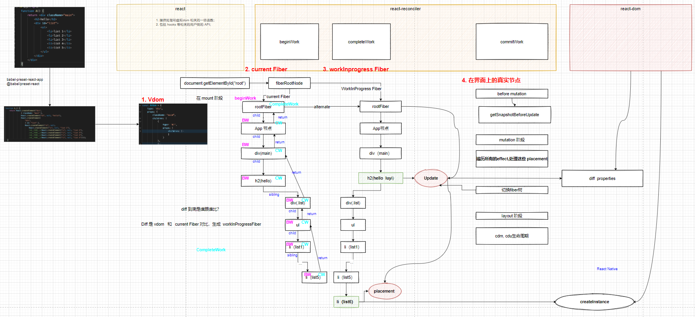
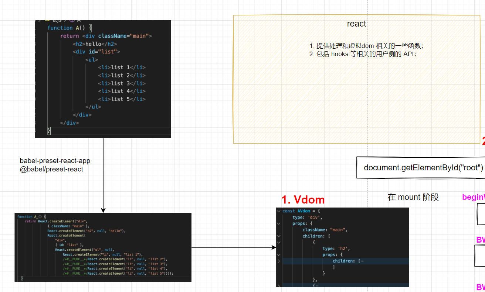
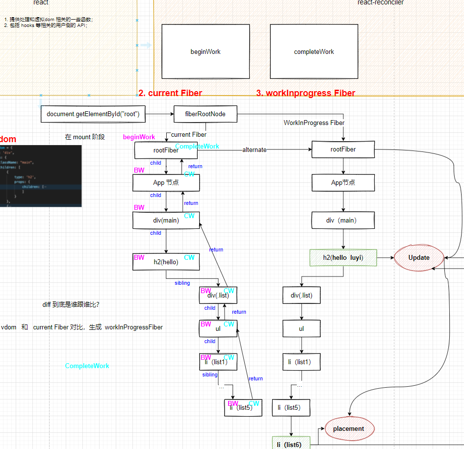
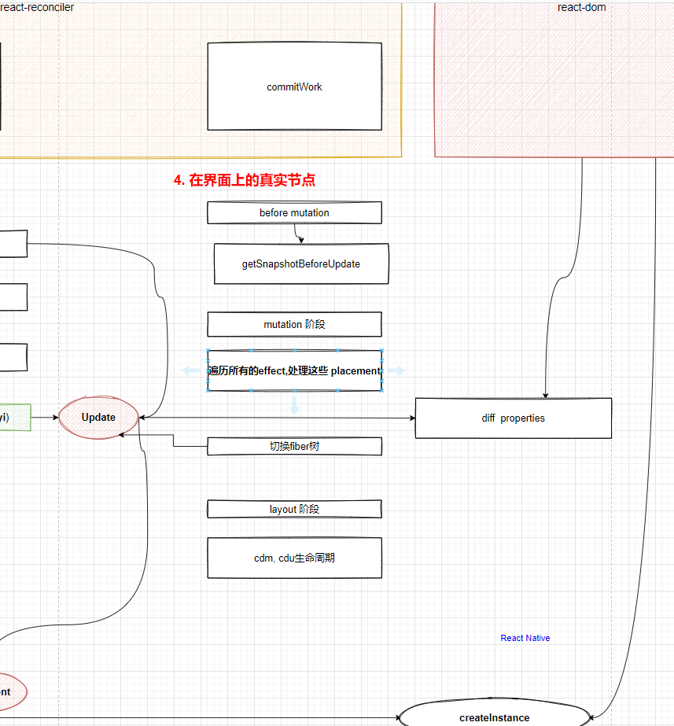

# 课程目标

p6：

* 知道react大致实现思路，能对比react和js控制原生dom的差异，能口喷一个简化版的react
* 知道diff算法大致实现思路
* 对state和props有自己的使用心得，结合受控组件、hoc等特性描述，需要说明各种方案的适用场景

p6+~p7：

* 能说明白为什么要实现fiber
* 能说明白为什么要实现hook
* 知道react不常用的特性、比如context、portal、errorBoundry

# 知识要点

## 课程大纲与背景

如何最快速地掌握`react`，并且让自己成为一个`react`的高手。

几个问题：

* 为什么要读源码？怎么读源码？需不需要读源码？
  * 跟着一起去调试一下；
  * 读了源码，加分项；
  * 面试官想要招什么样的人？
* 怎么学`react`？
  * 第一个官方文档：
  * 第二个了解`react`/`preact`这样的库的一个主要实现思路；（vdom，diff）
  * 熟悉源码框架、实现流程、机制

## 虚拟dom

不管是react还是vue，都有虚拟dom？虚拟dom一定快吗？

为什么要用虚拟dom？

* 某种程度上，保证性能的一个下限；
* 中间层，vdom -> fiber对象 -> 真实dom

react核心的几个包：

* react
* react-dom
* react-recociler

（分解一）通过babel转译代码并执行生成vdom：

（分解二）fiber对象：（环状链表）

（分解三）真实dom：

## 源码跟踪

* `render`
* `legacyRenderSubtreeIntoContainer`
  * 创建`fiberroot`的根节点
* `updateContainer`
* **`scheduleUpdateOnFiber`**
* `ensureRootIsScheduled`
* `performSyncWorkOnRoot`
* `renderRootSync`
* `workLoopSync`
* `performUnitOfWork`
* `beginWork`
* `completeWork`

# 补充知识点

## 关于项目上的亮点的事情

什么是亮点？

* 前提1：一定是有思考的；熵减。
  * （Bad！）使用Vue、Vuex、Vue-router、elementUI和设计师对接、和后端接口对接，实现xxx功能
  * （Good！）根据设计师的设计风格和设计理念跟设计师对接设计概念模型，然后选择跟这种概念模型类似的组件库，抹平设计和第三方组件库之间的差异，让开发基于设计师设计重写某个主题
  * 如果用了emotion，为什么用emotion（一种css module方案）？
* 前提2：一定是有创造性的；
  * a -> b，提升了什么？
* 前提3：一定是有复杂度的；
  * 项目不复杂就功能复杂，功能不复杂就项目复杂。

xxx项目：

A：负责公司的前端工作，使用webpack打包代码并发布上线，使用webpack对整体性能优化，用happyPack优化打包速度；

B：完善公司内部构建、部署流程一体化，根据业务xx特点，通过热切换部署实现。

B：建设内部云构建体系，产出通用命令行指令工具，将发布、环境切换、快速回滚能力平台化，保证线上高稳定性，同时管控研发流程，定期产出研发报告。