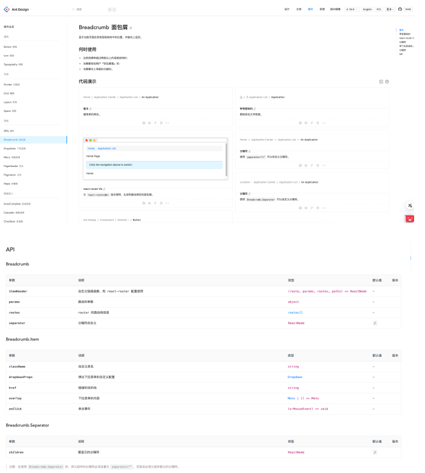
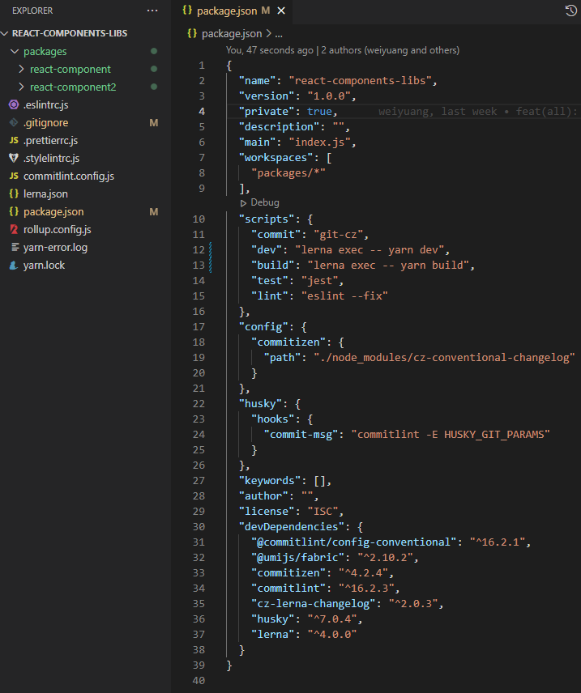
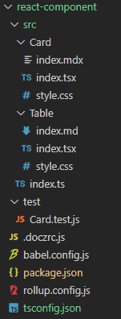

# 课程目标

p6：

* 掌握可复用的react组件设计思路和原则
* 能够基于业界成熟方案搭建一个react组件库
* 能够编写高质量的组件文档

p6+~p7：

* 能够不使用脚手架从0-1搭建一个react组件库
* 能够理解不同组件库架构的差异和各自使用场景
* 能够指定标准的代码规范和提交规范
* 能够掌握组件单元测试的编写
* 了解组件库发布流程

# 知识要点

## react组件的设计原则

### 有意义

* 命名准确，充分表意。
* 参数准确，必要的类型检查。
* 适当的注释。

### 通用性

* 不要耦合特殊的业务功能。
* 不要包含特定的代码处理逻辑。

```tsx
// Bad case
import React from 'react'

interface CardProps {
    title: string;
    children: React.ReactNode;
    install: boolean; // 某业务参数
}
function Card(props: CardProps) {
    return (
        <div className="card">
            <div className="card-title">{props.title}</div>
            <div className="card-content">{props.children}</div>
            {
                props.install ?
                    <span className="card-tag">已安装</span> :
                    <span className="card-tag">未安装</span>
            }
        </div> 
    )
}
```

```tsx
// Good case
import React from 'react'

interface CardProps {
    title: string;
    children: React.ReactNode;
    tag: string | null;
}
function Card(props: CardProps) {
    return (
        <div className="card">
            <div className="card-title">{props.title}</div>
            <div className="card-content">{props.children}</div>
            {props.tag && <span className="card-tag">{props.tag}</span>}
        </div> 
    )
}
```

### 无状态，无副作用

* 状态向上层提取，尽量少用内部状态。
* 解耦IO操作。

### 避免过度封装

* 合理冗余。
* 避免过度抽象。

### 单一职责

* 一个组件只能完成一个功能。
* 尽量避免不同组件间相互依赖、循环依赖。

### 易于测试

* 更容易的单元测试覆盖。

## 组件文档编写

### 文档结构

* 组件描述
* 使用示例及代码演示
* 组件入参描述

**例子：**

antdesign的文档：



## 业界成熟的组件库脚手架

随着前端技术发展，组件库已经成为前端必要的基础设施之一，业界也涌现了一些成熟的组件库脚手架，下面介绍两个生态完善，开箱即用的脚手架：

### Storybook


### Dumi

dumi由蚂蚁金服的umi团队开源，广泛应用于阿里生态的各开源前端仓库，其特点是构建部署方便、能够快速生成界面美观的文档，配套生态完善。且有中文文档，排查问题方便。


以上内容是react组件库的基本篇，结合以上内容我们就可以搭建出一个基本的react组件库了。接下来我们深入组件库细节，从0到1搭建我们组件的组件库。

## 组件库架构差异及各自使用场景

### Multirepo

一个仓库内只一个项目，以一个npm包发布，适用于基础组件库。

**优点**

* 项目简单，调试安装比较方便。

**缺点**

* 项目庞大时构建和发布耗时长。
* 组件库使用时需整体引入，造成一定的资源浪费。（可通过es module方式解决）

**典型案例**

* [antdesign](https://github.com/ant-design/ant-design)

### Monorepo

一个仓库内管理多个项目，以多个npm包方式发布，依赖集中管理，npm包版本可以集中管理，也可以单独管理。通常适用于有一定关联的组件，但各组件需要支持单独的npm包发布和安装。

**优点**

* 共同依赖统一管理，版本控制更加容易，依赖管理会变的方便。
* 支持组件的单独发布和单独构建。
* 使用时可以单独引入。

**缺点**

* 项目搭建复杂度稿。

**典型案例**

* [react](https://github.com/facebook/react)

### Monorepo管理工具

* lerna
* yarn workspace
* pnpm

接下来，我们开始基于lerna，0到1搭建一个组件库：



最外层不需要上传npm，在package.json中设置`private: true`

其中单个包：



构建工具用`rollup`

打包命令：`rollup -c`

配置文件：`rollup.config.js`

```js
import resolve from '@rollup/plugin-node-resolve';
import commonjs from '@rollup/plugin-commonjs';
import typescript from '@rollup/plugin-typescript';
import babel, { getBabelOutputPlugin } from '@rollup/plugin-babel';
import postcss from 'rollup-plugin-postcss'
import jsx from 'acorn-jsx';

export default {
    input: "./src/index.ts",
    acornInjectPlugins: [jsx()],
    plugins: [
        resolve(),
        commonjs(),
        postcss({
            extract: true,
            modules: true,
        }),
        typescript({ jsx: 'preserve' }),
        babel({ 
            presets: ['@babel/preset-react'], 
            babelHelpers: 'bundled',
            extensions: ['.ts', '.tsx']  
        })
    ],
    output: [{
        file: 'dist/index.js',
        format: 'cjs',
        plugins: [
            getBabelOutputPlugin({
                presets: ['@babel/preset-env'],
            })
        ]
    }]
}
```

案例文件：`src\Card\index.tsx`

```tsx
function Card () {
    return (
        <div>Card</div>
    )
}

export default Card;
```

文档工具用`docz	`

搭建命令：`docz build && docz serve`

案例文档：`src\Card\index.mdx`

```mdx
---
name: Card
route: /
---

import { Playground, Props } from 'docz'
import Card from './'

# Card

<Props of={Card} />

## Basic usage

<Playground>
	<Card>Click me</Card>
</Playground>
```

配置文件：`.doczrc.js`

```js
export default {
    typescript: true,
}
```

测试工具用`jest`

测试命令：`jest`

案例测试：`test\Card.test.js`

```js
/**
 * @jest-environment jsdom
 */
const { render, screen } = require('@testing-library/react');
const Card = require('../src/Card').default;

describe('react-components', () => {
    test('test Card include card', () => {
        render(Card());
        const cardFont = screen.getByText(/Card/i);
        expect(cardFont).toBeTruthy();
    })
})
```

## 引入代码规范和提交规范

### Eslint & Prettier

一个高质量的组件库，eslint和prettier是必须的，能够帮助我们统一整个仓库的代码规范。

常用的eslint配置：

```tsx
"eslint:recommended",
"plugin:react/recommended",
"plugin:react-hooks/recommended",
// 如果使⽤ts
"plugin:@typescript-eslint/eslint-recommended",
"plugin:@typescript-eslint/recommended",
"prettier"
```

也可以使用业界成熟的eslint配置：

* [@umijs/fabric](https://github.com/umijs/fabric)

```tsx
// .eslinrc.js
module.exports = {
    extends: [require.resolve('@umijs/fabric/dist/eslint')],
};
```

```tsx
// .stylelintrc.js
module.exports = {
    extends: [require.resolve('@umijs/fabric/dist/stylelint')],
};
```

```tsx
// .prettierrc.js
const fabric = require('@umijs/fabric');

module.exports = {
    ...fabric.prettier,
};

```

以上是eslint的配置，需要靠我们手动执行，万一我们忘记手动执行怎么办？

我们可以使用lin-stased：

staged是Git里的概念，表示暂存区，lint-staged表示只检查并矫正暂存区中的文件。一来提高校验效率，二来可以为老项目带去巨大的方便。

```js
// package.json
"lint-staged": {
    "*.{ts,tsx}": [
        "eslint --fix",
        "prettier --write",
        "git add"
    ],
    "*.{css,less}": [
        "stylelint --fix",
        "prettier --write",
        "git add"
    ]
},
```

### Typescipt

推荐大家在项目中使用typescript，良好的类型定义也是一个必须标准。

以下是一份常用的tsconfig.json配置：

```tsx
// tsconfig.json
{
    "compilerOptions": {
        "outDir": "dist",
        "module": "commonjs",
        "target": "es5",
        "lib": ["esnext", "dom"],
        "baseUrl": ".",
        "jsx": "react",
        "resolveJsonModule": true,
        "allowSyntheticDefaultImports": true,
        "moduleResolution": "node",
        "forceConsistentCasingInFileNames": true,
        "noImplicitReturns": true,
        "suppressImplicitAnyIndexErrors": true,
        "noUnusedLocals": true,
        "experimentalDecorators": true,
        "strict": true,
        "skipLibCheck": true,
        "declaration": true
    },
    "exclude": [
        "node_modules",
        "build",
        "dist",
    ],  
    "include": ["src/**/*.ts"]
}
```

### commitizen & commitlint & husky

commitizen帮助我们自动生成统一格式的提交前缀，能够在多人协作开发时，保持统一格式的提交记录。

commitizen有很多提交规则，由于我们使用lerna搭建项目。所以使用cz-lerna-changelog规则：

```shell
// package.json
"scripts": {
	"c": "git-cz"
},
"config": {
	"commitizen": {
    	"path": "./node_modules/cz-lerna-changelog"
    }
},
```

commitlint能够帮助我们检查错误格式的commit提交。

```js
// commitlint.config.js
module.exports = { extends: ['@commitlint/config-conventional'] }
```

husky能够拦截格式错误的commit提交。

```shell
// package.json
{
	"husky": {
    	"hooks": {
        	"commit-msg": "commitlint -E HUSKY_GIT_PARAMS"
        }
    }
}
```

## 组件库文档

### Docz

docz的使用方法很简单，在安装完后，我们在package.json中加入如下命令，就可以使用了。

```shell
// package.json
"scripts": {
	"docz:dev": "docz dev",
    "docz:build": "docz build",
    "docz:serve": "docz build && docz serve"
},
```

## 构建工具的选择

### Rollup vs Webpack

**Webpack**

* **代码分割**：Webpack可以将你的app分割成许多个容易管理的分块，这些分块能够在用户使用你的app时按需加载。这意味着你的用户可以有更快的交互体验
* **静态资源导入**：图片、CSS等静态资源可以直接导入到你的app中，就和其它的模块、节点一样能够进行依赖管理。

**Rollup**

* Tree Shaking：是rollup提出的一个特性，利用的es6模块的静态特性对导入的模块进行分析，只抽取使用到的方法，从而减小打包体积。
* 配置使用简便，生成的代码相对于Webpack更简洁。
* 可以指定生成生产中使用的各种不同的模块（amd, commonjs, es, umd）。

### @umi/father

基于rollup，配置简单，支持多种架构的组件库打包。

最简单的配置：

```js
// .fatherrc.js
export default {
    entry: 'src/index.js',
}
```

Monorepo配置：

```js
import { readdirSync } from 'fs';
import { join } from 'path';

const pkgs = readdirSync(join(__dirname, 'packages')).filter(
    pkg => pkg.charAt(0) !== '.' && ![].includes(pkg),
);

export default {
    target: 'node',
    cjs: { type: 'babel', lazy: true },
    pkgs: [...pkgs],
};
```

## 编写单元测试

jest是我们常用的单元测试框架。

test-library专注于测试react组件，与之配套的还有[react-hooks-testin-library](https://github.com/testing-library/react-hooks-testing-library)，专门用来测试react-hooks。

### 使用jest

**结构**

编写单元测试所涉及的文件应存放于以下两个目录：

* mocks/：模拟文件目录
* [name].mock.json：【例】单个模拟文件
* tests/：单元测试目录
* [target].test.js：【例】单个单元测试文件，[target]与目标文件名保持一致，当目标文件名为index时，采用其上层目录或模块名。

**[target].test.js文件常见格式**

```js
const thirdPartyModule = require('thrid-party-module')

describe('@fe/module-name' () => {
    const mocks = {}
  
    beforeAll(() => {})
  
    beforeEach(() => {})
  
    test('描述⾏为', () => {
        mocks.fake.mockReturnValue('控制模拟⾏为的代码置于最上⽅')
    
        const target = require('../target.js')
        const result = target.foo('执⾏⽬标待测功能')
    
        expcet(result).toBe('断⾔置于最下⽅')
    })
})
```

保证每个describe内部只有mock对象、生命周期钩子函数和test函数，将模拟对象都添加到mocks对象的适当位置，将初始化操作都添加到适当的生命周期函数中。

### 使用test-library

React测试库是一组能让你不依赖React组件具体实现对他们进行测试的辅助工具。它让重构工作变得轻而易举，还会推动你拥抱有关无障碍的最佳实现。React测试库并不是Jest的替代方案，因为他们需要彼此，并且有不同的分工。

1. 利用react测试库渲染APP组件
2. 利用react测试库获取元素
3. 利用Jest来进行写测试用例和断言

```ts
import { render, screen } from '@testing-library/react';
import App from './App';
test('renders learn react link', () => {
    render(<App />);
    const linkElement = screen.getByText(/learn react/i);
    expect(linkElement).toBeInTheDocument();
});
```

**获取元素**

* getByRole: <div role="alert"></div>
* getByLabelText: <label for="search" />
* getByPlaceholderText: <input laceolder="Search" />
* getByAltText: 
* getByDisplayValue: <input value="JavaScript" />
* getByTestId: <any data-testid="xxx" />

除此之外，还有queryByxxx和findByxxx的查询函数，什么时候用get/query/find?，需要了解它们的不同。getBy返回元素或者错误。getBy在查询不到元素时返回错误，这是非常方便的，有助于我们在开发的过程中尽早的发现自己的用例发生了错误。findBy用于查询一个在异步之后会被最终渲染的元素。

* queryByText/findByText
* queryByRole/findByRole
* queryByLabelText/findByLabelText
* queryByPlaceholderText/findByPlaceholderText
* queryByAltText/findByAltText
* queryByDisplayValue/findByDisplayValue

**断言函数**

正常情况下，这些断言函数来自Jest，但是React测试库拓展类，加入了一些自己的断言函数。

* toBeDisabled
* toBeEnabled
* toBeEmpty
* toBeEmptyDOMElement
* toBeInTheDocument
* toBeInvalid
* toBeRequired
* toBeValid
* toBeVisible
* toContanElement
* toContainHTML
* oHaveAttribute
* toHaveClass
* oHaveFocus
* toHaveFormValues
* toHaveStyle
* toHaveTextContent
* toHaveValue
* toHaveDisplayValue
* toBeChecked
* toBePartiallyChecked
* toHaveDescription

**事件触发/回调处理**

我们可以通过React测试库的fireEvent去模拟用户交互行为：（输入文字到Input框内）

Search组件：

```tsx
function Search({ value, onChange, children }) {
    return (
        <div>
            <label htmlFor="search">{children}</label>
            <input
                id="search"
                type="text"
                role="textbox"
                value={value}
                onChange={onChange}
             />
        </div>
    );
}
```

我们想要测试当我们在Search的Input框内输入值时，onChange是否有按预期的被调用，则需要通过jest给我们提供的fn函数：

```tsx
describe('Search', () => {
    test('calls the onChange callback handler', () => {
        const onChange = jest.fn();
        
        render(
            <Search value="" onChange={onChange}>
            </Search>
        );
        
        fireEvent.change(screen.getByRole('textbox'), {
            target: { value: 'Javascript' },
        });
        
        expecet(onChange).toHaveBeenCalledTimes(1);
    })
})
```

可以看到onChange通过fireEvent触发的情况下，只调用了一次，这个时候，我们可以使用userEvent去替代fireEvent，比起fireEvent，userEvent更加的贴近人类的交互行为，在输入文字的时候，可以看到onChange会被调用多次（这是因为userEvent更加模拟了人类的键盘输入，keyDown等）

```tsx
describe('Search', async () => {
    test('calls the onChange callback handler', async () => {
        const onChange = jest.fn();
        
        render(
            <Search value="" onChange={onChange}>
                Search:
            </Search>
        );
        
        await userEvent.type(screen.getByRole('textbox'), 'JavaScript');
    
        expect(onChange).toHaveBeenCalledTimes(10);
    })
})
```

**react-hooks-testing-library**

[react-hooks-testing-library](https://github.com/testing-library/react-hooks-testing-library)，是一个专门用来测试React hook的库。我们知道虽然hook是一个函数，可是我们却不能用测试普通函数的方法来测试它们，因为它们的实际运行会涉及到很多React运行时（runtime）的东西，react-hooks-testing-library的库来允许我们像测试普通函数一样测试我们定义的hook，这个库其实背后也是将我们定义的hook运行在一个TestComponent里面，只不过它封装了一些简易的API来简化我们的测试。

**renderHook**

* renderHook用来渲染hook的，它会在调用的时候渲染一个专门用来测试TestComponent来使用我们的hook。renderHook的函数签名是enderHook(callback, options?)，它的第一个参数是一个callback函数，这个函数会在TestComponent每次被重新渲染的时候调用，因此我们可以在这个函数里面调用我们想要测试的hook。
* renderHook的返回值是RenderHookResult对象，这个对象会有下面这些属性：
  * result：result是一个对象，它包含两个属性，一个是current，它保存的是renderHookcallback的返回值，另外一个属性是error，它用来存储hook在render过程中出现的任何错误。
  * rerender：rerender函数是用来重新渲染TestComponent的，它可以接收一个newProps作为参数，这个参数会作为组件重新渲染时的props值，同样renderHook的callback函数也会使用这个新的props来重新调用。
  * unmount：unmount函数是用来卸载TestComponent的，它主要用来覆盖一些useEffect cleanup函数的场景。

**act**

我们知道组件状态更新的时候（setState），组件需要被重新渲染，而则重渲染是需要React进行调度的，因此是个异步的过程，我们可以通过使用act函数将所有会更新到组件状态的操作封装在它的callback里面来保证act函数执行完之后我们定义的组件已经完成了重新渲染。

```tsx
// somewhere/useCounter.js
import { useState, useCallback } from 'react'

function useCounter() {
    const [count, setCount] = useState(0)
    
    const increment = useCallback(() => setCount(x => x + 1), [])
    const decrement = useCallback(() => setCount(x => x - 1), [])
    
    return {count, increment, decrease}
}

describe('decrement', () => {
    it('decrease counter by 1', () => {
        const { result } = renderHook(() => useCounter())
        
        act(() => {
            result.current.decrement()
        })
        
        expect(result.current.count).toBe(-1)
    })
})
```

### 单元测试编写原则

* 每个单元测试应该有个好名字
* 将内部逻辑与外部请求分开测试
* 要保证单元测试的外部环境尽量和实际使用时是一致的
* 对服务边界（Interface）的输入和输出进行严格验证
* 用断言来代替原生的报错函数
* 避免随机结果
* 尽量避免断言时间的结果
* 测试用例之间相互隔离，不要相互影响
* 原子性，所有的测试只有两种结果：成功和失败
* 避免测试中的逻辑，即不该包含if、switch、for、while等
* 不要保护起来，try...catch...
* 每个用例只测试一个关注点
* 3A策略：arrange，action，assert

## 版本号管理

我们的组件库使用npm发布，版本号规范也使用npm标准的semver规范。

> 版本格式：主版本号.次版本号.修订号，版本号递增规则如下：
>
> 1. 主版本号：当你做了不兼容的API修改，
> 2. 次版本号：当你做了向下兼容的功能性新增，
> 3. 修订号：当你做了向下兼容的问题修正。

可以使用lerna version交互式的选择你的版本号。
