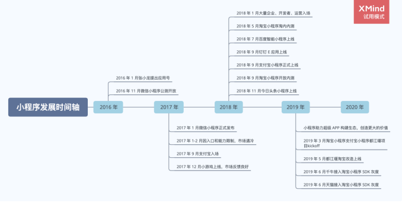
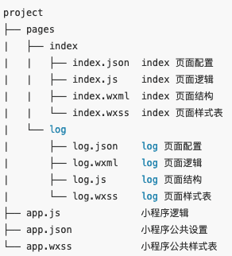
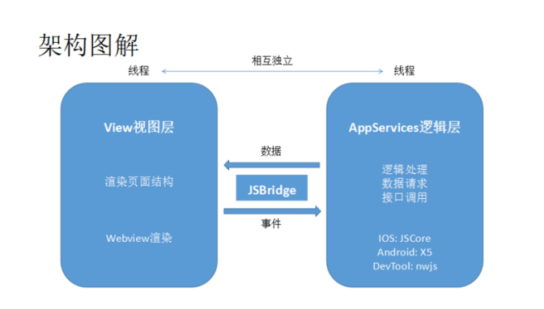
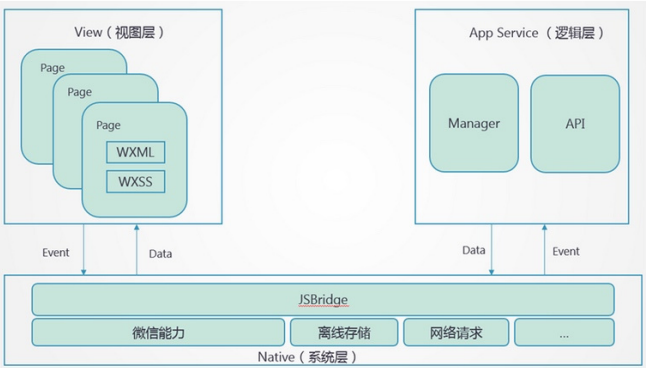
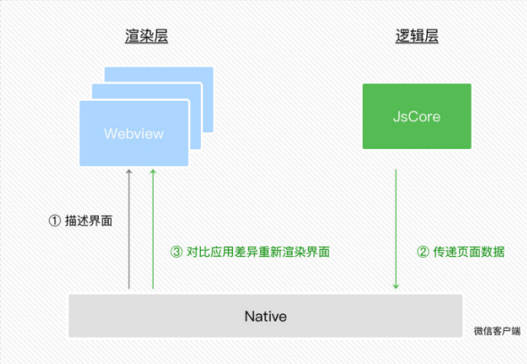
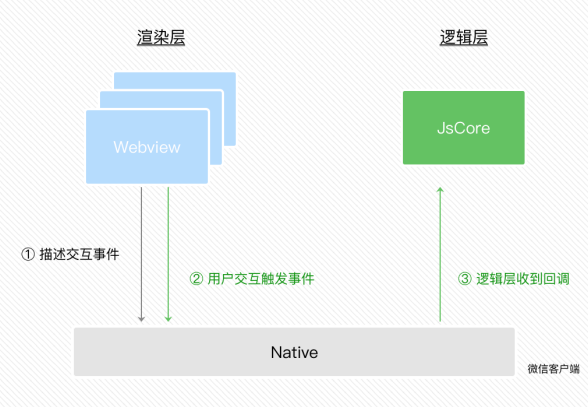
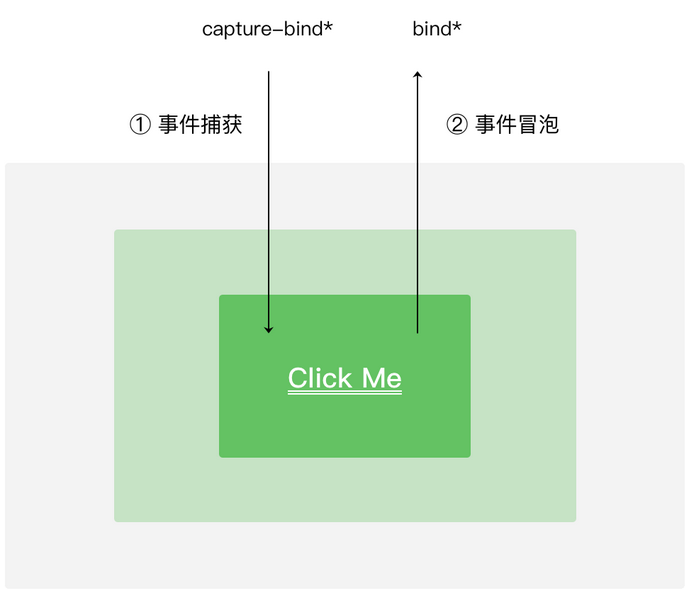
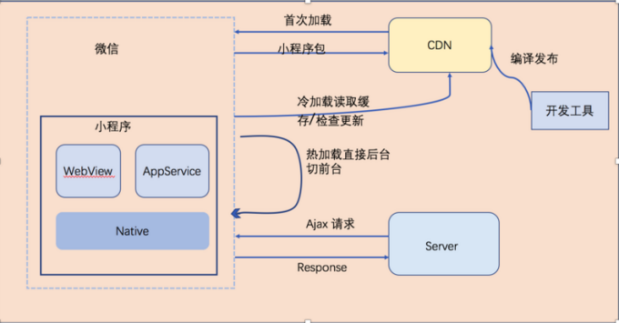
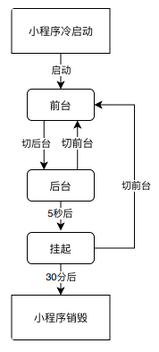
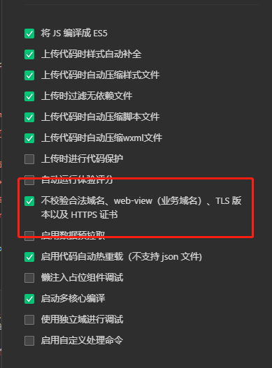

# 课程目标

* 学习小程序基本原理，对目前行业内小程序有基本理解
* 掌握微信小程序基本API
* 掌握微信小程序发布流程

# 知识要点

## 小程序机制介绍

### 什么是小程序

小程序页面本质上是网页：

1. 使用技术栈与网页开发是一致的，都用到HTML、CSS和JS
2. 区别：不支持浏览器API，只能用微信提供的API

外部代码通过小程序这种形式，在手机App里面运行：微信、支付宝，小程序可以视为只能用微信等APP作为载体打开和浏览的网站。

### 小程序的发展历程



1. 微信小程序形态：

   a. 小程序从业务形式上更像是公众号开发的演变产物

   b. 早期微信通过sdk的形式，增强了开发者开发公众号网页的能力

   c. 小程序的诞生是微信本身迈向平台化超级App的业务行为，并且帮助用户更好地实现了「轻量级Web App」

2. 开发标准：

   a. 最初微信小程序自己定义了一套“标准”，最开始的框架甚至没有组件、没有npm，和Web生态严重脱节

   b. 由于特殊的双线程模型与四不像的语法，开发者苦不堪言，小程序的开放只是对三方业务的开放而已

3. 商家涌入：

   a. 小程序业务的开放性->平台型App

   b. 比如：支付宝小程序、百度小程序、淘宝小程序、360小程序、快应用……

   c. 小程序设计目的：大多数选择了和微信类似的架构、框架，更多不是从技术角度考虑，而是想尽可能蹭微信小程序的福利，让开发者可以更快地投放到自己的平台

### 原生微信小程序框架介绍

#### 小程序的目录结构

工程的工作目录中包含以下文件：



#### 技术选型

渲染界面的技术方案：

1. 用纯客户端原生技术渲染
2. 用纯Web技术渲染
3. 用客户端原生技术与Web技术结合的混合技术（简称Hybrid技术）渲染

方案对比：

1. 开发门槛：Web门槛低，Native也有像RN这样的框架支持
2. 体验：Native体验比Web要好太多，Hybrid在一定程度上比Web接近原生体验
3. 版本更新：Web支持在线更新，Native则需要打包到微信一起审核发布
4. 管控和安全：Web可跳转或是改变页面内容，存在一些不可控因素和安全风险

方案确定：

1. 小程序的宿主环境是微信等手机APP，用纯客户端原生技术来编写小程序，那么小程序代码每次都需要与手机APP代码一起发版（×）

2. Web支持有一份副本资源包放在云端，通过下载到本地，动态执行后即可渲染出界面，但纯Web技术在一些复杂的交互上可能会面临一些性能问题（×）

   a. 在Web技术中，UI渲染跟脚本执行都在一个单线程中执行，这就容易导致一些逻辑任务抢占UI渲染的资源

3. 两者结合起来的Hybrid技术来渲染小程序，用一种近似Web的方式来开发，并且可以实现在线更新代码（√）

   a. 扩展Web的能力。比如像输入框组件（input，textarea）有更好的控制键盘的能力

   b.  体验更好，同时也减轻WebView的渲染工作

   c. 用客户端原生渲染内置一些复杂组件，可以提供更好的性能

#### 双线程模型

小程序的渲染层和逻辑层分别由2个线程管理

1. 视图层 -> WebView进行渲染
2. 逻辑层 -> JsCore线程运行JS脚本





设计目的：为了管控和安全等问题，阻止开发者使用一些，例如浏览器的window对象，跳转页面、操作DOM、动态执行脚本的开放性接口

使用沙箱环境提供纯JavaScript的解释执行环境

1. 客户端系统：JavaScript引擎
2. iOS：JavaScriptCore框架
3. 安卓：腾讯x5内核提供的JsCore

小程序双线程模型：

* 逻辑层：创建一个单独的线程去执行JavaScript，在这里执行的都是有关小程序业务逻辑的代码，负责逻辑处理、数据请求、接口调用等
* 视图层：界面渲染相关的任务全都在WebView线程里执行，通过逻辑层代码去控制渲染哪些界面。一个小程序存在多个界面，所以视图层存在多个WebView线程
* JSBridge起到架起上层开发与Native（系统层）的桥梁，使得小程序可通过API使用原生的功能，且部分组件为原生组件实现，从而有良好体验

#### 数据驱动视图变化

问题：JS逻辑代码放到单独的线程去运行，在Webview线程里没法直接操作DOM。开发者如何实现动态更改界面呢？

DOM的更新通过简单的数据通信来实现

逻辑层和视图层的通信会由Native（微信客户端）做中转，逻辑层发送网络请求也经由Native转发。

JS对象模拟DOM树 -> 比较两棵虚拟DOM树的差异 -> 把差异应用到真正的DOM树上。



1. 在渲染层把WXML转化成对应的JS对象
2. 在逻辑层发生数据变更的时候，通过宿主环境提供的setData方法把数据从逻辑层传递到Native，再转发到渲染层
3. 经过对比前后差异，把差异应用在原来的DOM树上，更新界面

#### 事件的处理

视图层需要进行交互，这类反馈应该通知给开发者的逻辑层，需要将对应的处理状态呈现给用户。

视图层的功能只是进行渲染，因此对于事件的分发处理，微信进行了特殊的处理，将所有的事件拦截后，丢到逻辑层交给JS处理。



事件的派发处理包括事件捕获和冒泡两种：

通过native传递给JSCore，通过JS来响应响应的事件之后，对Dom进行修改，改动会体现在虚拟Dom上，然后再进行真实的渲染。



#### 运行机制

小程序启动机制：

1. 冷启动：用户首次打开或小程序被微信主动销毁后再次打开的情况，此时小程序需要重新加载启动。
2. 热启动：假如用户已经打开过某小程序，然后在一定时间内再次打开该小程序，此时无需重新启动，只需将后台状态的小程序切换到前台

注意：

* 小程序没有重启的概念
* 当小程序进入后台，客户端会维持一段时间的运行状态，超过一定时间（目前是5分钟）会被微信主动销毁
* 当短时间内（5s）连续收到两次以上系统内存告警，会进行小程序的销毁



### 小程序框架对比

#### 小程序原生语法

1. 目前小程序生态支持开发者利用前端部分生态开发应用的
2. 目前小程序已经能够做到前端工程化，并且植入前端生态中已有的一些理念，例如状态管理、CLI工程化等等，与早期npm能力的缺失、只能通过模板渲染实现组件化不可同日而语
3. 当业务的需求只有投放到微信或者支付宝小程序时，原生语法可以成为前端程序员的一个选择；前端能力基本都可以在小程序上复用（如状态管理库颗粒化管理组件状态、TS等）

#### 增强型框架

指小程序引入npm之后，有了更加开放的能力所带来的收益

以小程序原生语法为主，在逻辑层引入了增强语法来优化应用性能或者提供更便捷的使用方法

Example：腾讯开源的[omix](https://github.com/Tencent/omi/tree/master/packages/omi)框架为例：

```js
// 逻辑层
create.Page(store, {
    // 声明依赖
    use: ['logs'],
    computed: {
        logsLength() {
            return this.logs.length
        }
    },
    onLoad: function () {
        //响应式，⾃动更新视图
        this.store.data.logs = (wx.getStorageSync('logs') || []).map(log => {
            return util.formatTime(new Date(log))
        })
        setTimeout(() => {
            //响应式，⾃动更新视图
            this.store.data.logs[0] = 'Changed!'
        }, 1000)
    }
})

//视图层
<view class="container log-list">
    <block wx:for="{{logs}}" wx:for-item="log">
    	<text class="log-item">{{index + 1}}. {{log}}</text>
	</block>
</view>
```

1. 整体保留小程序已有的语法，但在此基础之上，对它进行了扩充和增强
2. 比如引入了Vue中比较有代表性的computed，比如能够直接通过this.store.data.logs[0] = 'Changed'修改状态。可以说是在小程序原生半Vue半React的语法背景下，彻底将其Vue化的一种方案

使用增强型框架优势：

1. 可以在只引入极少依赖，并且保留对小程序认知的情况下，用更加舒爽的语法来写代码
2. 对于目标只投放到特定平台小程序的开发者或者非专业前端而言是比较好的选择之一；因为你只需要关注很少的新增文档和小程序自身的文档就足够了，底层不需要考虑

#### 转换类框架

目的：让开发者几乎不用感受小程序原生语法，更大程序对接前端已有生态，并且可以实现「一码多端」的业务诉求，只是最后的构建产物为小程序代码。

##### 编译时

通过编译分析的方式，将开发者写的代码转换成小程序原生语法。

以Rax编译时和Taro 2.0为例，面向开发者的语法是类React语法，开发者通过写有一定语法限制的React代码，最后转换产物1:1转换成对应的小程序代码。


以一段简单的代码为例：

```js
// rax
import { createElement, useEffect, useState } from 'rax';
import View from 'rax-view';

export default function Home() {
    const [name, setName] = useState('world');
    useEffect(() => {
        console.log('Here is effect.');
    }, [])
    return <View>Hello {name}</View>;
}

// 转为⼩程序后的代码
// 逻辑层
import { __create_component__, useEffect, useState } from 'jsx2mpruntime/dist/ali.esm.js'

function Home() {
    const [name, setName] = useState('world');
    useEffect(() => {
        console.log('Here is effect.');
    }, []);
    this._updateData({
        _d0: name
    });
}

Component(__create_component__(Home));
// 视图层
<block a:if="{{$ready}}">
    <view class="__rax-view">{{_d0}}</view>
</block>
```

1. 开发者虽然写的是类React语法，但是转换后的代码和渐进增强型框架非常类似
2. 开发者可以比较清晰的看出编译前后代码的对应关系

编译时方案会通过AST分析，将开发者写的JSX中return的模板部分构建到视图层，剩余部分代码保留，然后通过运行时垫片模拟React接口的表现。

优势：

1. 运行时性能损耗低
2. 目标代码明确，开发者所写及所得
3. 运行时，编译时优化：比如框架会给予开发者更多的语法支持以及默认的性能优化处理，比如避免多次setData，亦或是长列表优化等等

劣势：

1. 语法限制高：需要完全命中开发者在模板部分所用到的所有语法，语法受限，如由于是1:1编译转换，开发者在开发的时候还是不得不去遵循小程序的开发规范，比如一个文件中只能定义一个组件之类的

##### 运行时

相比于上面的编译时，最大的优势是可以几乎没有任何语法约束地去完成代码编写。

通过在逻辑层模拟DOM/BOM API，将这些创建视图的方法转换为维护一棵VDOM tree，再将其转换成对应setData的数据，最后通过预置好的模板递归渲染出实际视图。

优势：没有语法限制

劣势：以一定的性能损耗来换取更为全面的Web端特性支持

## 微信小程序

### 微信小程序基本内容

代码github地址：https://github.com/wechat-miniprogram/miniprogram-demo

#### 基础

官方文档：https://developers.weixin.qq.com/miniprogram/dev/framework/

小程序代码组成：

* WXML：（WeiXin Markup Language）
* WXSS：（WeiXin Style Sheets）
* WXS：（WeiXin Script）

小程序框架：

1. 逻辑层

   a. 官方文档：https://developers.weixin.qq.com/miniprogram/dev/framework/app-service/

   b. 使用JavaScript引擎为小程序提供开发者JavaScript代码的运行环境以及微信小程序的特有功能

   c. 开发者写的所有代码最终将会打包成一份JavaScript文件，并在小程序启动的时候运行，知道小程序销毁。这一行为类似[ServiceWorker](https://developer.mozilla.org/en-US/docs/Web/API/Service_Worker_API)，所以逻辑层也称之为App Service

   d. 增加App和Page方法，进行[程序注册](https://developers.weixin.qq.com/miniprogram/dev/framework/app-service/app.html)和[页面注册](https://developers.weixin.qq.com/miniprogram/dev/framework/app-service/page.html)

   e. 增加getApp和getCurrentPages方法，分别用来获取App实例和当前页面栈

   f. 提供丰富的[API](https://developers.weixin.qq.com/miniprogram/dev/framework/app-service/api.html)，如微信用户数据，扫一扫，支付等微信特有能力

   g. 提供[模块化](https://developers.weixin.qq.com/miniprogram/dev/framework/app-service/module.html#%E6%A8%A1%E5%9D%97%E5%8C%96)能力，每个页面有独立的[作用域](https://developers.weixin.qq.com/miniprogram/dev/framework/app-service/module.html#%E6%96%87%E4%BB%B6%E4%BD%9C%E7%94%A8%E5%9F%9F)

   h. 小程序框架的逻辑层并非运行在浏览器中，因此JavaScript在web中一些能力都无法使用，如window，docuent等

2. 视图层

   a. 官方文档：https://developers.weixin.qq.com/miniprogram/dev/framework/view/

基础核心

1. 小程序运行时

   a. 小程序生命周期：热启动 == 后台切前台

   

   b. 更新机制

   ​	i. 启动时同步更新

   ​		1. 定期检查小程序版本

   ​		2. 长时间未使用小程序

   ​	ii. 启动时异步更新

   ​		1. 打开发现有新版本，异步下载，下次冷启动时加载新版本

   ​	iii开发者手动更新

   ​		1. [wx.getUpdateManager](https://developers.weixin.qq.com/miniprogram/dev/api/base/update/wx.getUpdateManager.html)

2. 自定义组件

3. 代码注入

   a. 按需注入："lazyCodeLoading": "requiredComponents"；小程序仅注入当前页面需要的自定义组件和页面代码，在页面中必然不会用到的自定义组件不会被加载和初始化

   b. 用时注入：在开启「按需注入」特性的前提下，指定一部分自定义组件不在小程序启动时注入，而是在真正渲染的时候才进行注入，使用占位组件在需要渲染但注入完成前展示

4. 分包加载

   a. 原则

   ​	i. 声明subpackages后，将按subpackages配置路径进行打包，subpackages配置路径外的目录将被打包到app（主包）中

   ​	ii. app（主包）也可以有自己的pages（即最外层的pages字段）

   ​	iii. subpackage的根目录不能是另外一个subpackage内的子目录

   ​	iv. tabBar页面必须在app（主包）内

   b. 独立分包

   ​	i. 开发者可以按需将某些具有一定功能独立性的页面配置到独立分包中。当小程序从普通的分包页面启动时，需要首先下载主包

   ​	ii. 独立分包运行时，App并不一定被注册，因此getApp()也不一定可以获得App对象；基础库[2.2.4](https://developers.weixin.qq.com/miniprogram/dev/framework/compatibility.html)版本开始getApp支持[allowDefault]参数，在App未定义时返回一个默认实现。当主包加载，App被注册时，默认实现中定义的属性会被覆盖合并到真正的App中

5. 小程序如何调试？

   a. vconsole

   b. sourceMap

   c. 实时日志：重写log，使用wx.getRealtimeLogManager封装，在运营后台“开发 -> 开发管理 -> 运维中心 -> 实时日志”查看

   d. errno：针对API的cb err进行状态码的判断，便于针对业务场景语义化展示

6. 小程序如何兼容版本？

```js
// 1. 版本号⽐较
const version = wx.getSystemInfoSync().SDKVersion

if (compareVersion(version, '1.1.0') >= 0) {
    wx.openBluetoothAdapter()
} else {
    // 如果希望⽤户在最新版本的客户端上体验您的⼩程序，可以这样⼦提示
    wx.showModal({
        title: '提示',
        content: '当前微信版本过低，⽆法使⽤该功能，请升级到最新微信版本后重试。'
    })
}

// 2. API是否存在
if (wx.openBluetoothAdapter) {
    wx.openBluetoothAdapter()
} else {
    // 如果希望⽤户在最新版本的客户端上体验您的⼩程序，可以这样⼦提示
    wx.showModal({
        title: '提示',
        content: '当前微信版本过低，⽆法使⽤该功能，请升级到最新微信版本后重试。'
    })
}

// 3. wx.canIUse
wx.showModal({
    success: function(res) {
        if (wx.canIUse('showModal.success.cancel')) {
            console.log(res.cancel)
        }
    }
})

// 4. 设置最低基础库版本
运营后台设置最低基础库版本
```

#### 框架

官方文档：https://developers.weixin.qq.com/miniprogram/dev/reference/

1. 小程序配置

   a. 全局配置

   ​	i. 根目录下app.json

   b. 页面配置

   ​	i. 在page页面中对应的json文件，权重最高

   ​	ii. 原先在根目录下的app.json中window内属性，在页面json中无需添加window

   c. sitemap配置

   ​	i. 根目录下sitemap.json

2. 框架接口

   a. 小程序App

   ​	i. App：必须在app.js中调用，必须调用且只能调用一次

   ​		1. onLaunch

   ​		2. onShow

   ​		3. onHide

   ​		4. onError

   ​		5. onPageNotFound

   ​		6. onUnhandledRejection

   ​		7. onThemeChange

   ​		8. 其他：可以添加任意的函数或数据变量到Object参数中，app.js中用this可以访问

   ​		（Tips：非原生事件最好不要用on开头）

   ​	ii. getApp：外部访问App中数据的方式

   b. 页面

   ​	i. Page：在页面级别中的“app.js”

   ​		1. data

   ​		2. 生命周期事件

   ​			a. onLoad：加载时触发

   ​			b. onReady：渲染完成触发

   ​			c. onShow

   ​			d. onHide

   ​			e. onUnload

   ​		3. 页面事件处理事件

   ​			a. onPullDownRefresh

   ​			b. onReachBottom

   ​			c. onPageScroll：监听页面滚动

   ​			d. onAddToFavorites：添加到收藏并自定义收藏内容

   ​			e. onShareAppMessage：转发事件

   ​			f. onShareTimeline：转发朋友圈

   ​			g. onResize

   ​			h. onTabItemTap

   ​			i. onSaveExitState：页面销毁前

   ​		4. 组件事件处理

   ​			a. wxml中绑定的自定义事件

   ​			b. Page.route

   ​			c. Page.prototype.setData

   ​				i. 注意：可以以数据路径来改变数组中的某一项或对象的某个属性，如array[2].message，a.b.c.d，并且不需要在this.data中预先定义。

   ​		5. 页面间通信

   ​			使用[wx.navigateTo](https://developers.weixin.qq.com/miniprogram/dev/api/route/wx.navigateTo.html)打开，这两个页面间将建立一条数据通道：

   ​			a. 被打开的页面可以通过this.getOpenerEventChannel()方法来获得一个EventChannel对象

   ​			b. wx.navigateTo的success回调中也包含一个EventChannel对象

   ​			c. 这两个EventChannel对象间可以使用emit和on方法相互发送、监听事件

   ​	ii. getCurrentPage

   ​		1. 获取当前页面栈，数组中第一个元素为首页，最后一个元素为当前页面

   ​		2. 场景：

   ```js
   // 1. 进⼊⼩程序⾮默认⾸⻚时，需要执⾏对应操作
   onShow() {
       let pages = getCurrentPages(); // 当前⻚⾯栈
       if (pages.length == 1) {
           //todo
       }
   }
   
   // 2. 跨⻚⾯赋值
   let pages = getCurrentPages();// 当前⻚⾯栈
   let prevPage = pages[pages.length - 2];// 上⼀⻚⾯
   prevPage.setData({
       // 直接给上移⻚⾯赋值
   });
   
   // 3. ⻚⾯跳转后⾃动刷新
   wx.switchTab({
       url: '../index/index',
       success: function (e) {
           const page = getCurrentPages().pop(); // 当前⻚⾯
           if (page == undefined || page == null) return;
           page.onLoad(); //或者其它操作
       }
   })
   
   // 4. 获取当前⻚⾯相关信息
   let pages = getCurrentPages(); // 当前⻚⾯栈
   // 当前⻚⾯为⻚⾯栈的最后⼀个元素
   let prevPage = pages[pages.length - 1];// 当前⻚⾯
     
   console.log( prevPage.route) //举例：输出为‘pages/index/index’
   ```

   c. 自定义组件（参考上文）

   ​	i. Component

   ​	ii. Behavior

   d. 模块化

   ​	i. require

   ​		1. 引入module.export或者export暴露出的接口，需要引入模块文件相当于当前文件的相对路径，或npm模块名，或npm模块路径。不支持绝对路径

   ​	ii. module：当前模块对象

   ​	iii. export：module.export的引用

   ​	iv. requirePlugin：引用插件

   ​	v. requireMiniProgram：引用当前小程序

   e. 基础功能

   ​	i. console

   ​		1. console.debug

   ​		2. console.error

   ​		3. console.log

   ​		4. console.info

   ​		5. console.warn

   ​		6. console.group

   ​		7. console.groupEnd

   ​	ii. 定时器

   ​		1. setTimeout

   ​		2. clearTimeout

   ​		3. setInterval

   ​		4. clearInterval

3. WXML

   a. 数据绑定

   ​	i. 使用Mustache语法（双大括号）包起来，与Page里data变量绑定起来

   ​	ii. 支持类型

   ​		1. 变量：\<view>{{ message }}\</view>

   ​		2. 属性：\<view id="item-{{id}}">\</view>

   ​		3. 控制属性：\<view wx:if="{{condition}}">\</view>

   ​		4. 关键字（在双括号间）：\<checkbox checked="{{false}}">\</checkbox>

   ​		5. 运算：\<view>{{ a + b }} + {{c}} + d\</view>

   ​		6. 逻辑：\<view wx:if="{{length > 5}}">\</view>

   ​		7. etc……

   b. 列表渲染

   ```js
   // 默认数组的当前项的下标变量名默认为 index，数组当前项的变量名默认为 item
   <view wx:for="{{array}}">
       {{index}}: {{item.message}}
   </view>
   
   Page({
       data: {
           array: [{
               message: 'foo',
           }, {
               message: 'bar'
           }]
       }
   })
   
   // ⼿动指定
   <view wx:for="{{array}}" wx:for-index="idx" wx:for-item="itemName">
       {{idx}}: {{itemName.message}}
   </view>
   
   // 重复渲染代码块
   <block wx:for="{{[1, 2, 3]}}">
       <view> {{index}}: </view>
   	<view> {{item}} </view>
   </block>
   ```

   c. 条件渲染

   ```js
   <view wx:if="{{length > 5}}"> 1 </view>
   <view wx:elif="{{length > 2}}"> 2 </view>
   <view wx:else> 3 </view>
   
   // block
   <block wx:if="{{true}}">
       <view> view1 </view>
   	<view> view2 </view>
   </block>
   
   // wx:if vs hidden
   // wx:if 有更⾼的切换消耗⽽ hidden 有更⾼的初始渲染消耗。
   // 因此，如果需要频繁切换的情景下，⽤ hidden 更好，如果在运⾏时条件不⼤可能改变则 wx:if 较好。
   ```

   d. 模板

   ```js
   // 定义模板
   <!--
   	index: int
       msg: string
       time: string
   -->
   <template name="msgItem">
       <view>
       	<text> {{index}}: {{msg}} </text>
   		<text> Time: {{time}} </text>
   	</view>
   </template>
   
   // 使⽤模板
   <template is="msgItem" data="{{...item}}"/>
     
   Page({
       data: {
           item: {
               index: 0,
               msg: 'this is a template',
               time: '2016-09-15'
           }
       }
   }
   ```

   e. 引用

   ```js
   // import
   // 只会 import ⽬标⽂件中定义的 template，⽽不会 import ⽬标⽂件 import 的 template。
   <!-- item.wxml -->
   <template name="item">
       <text>{{text}}</text>
   </template>
   
   <import src="item.wxml"/>
   <template is="item" data="{{text: 'forbar'}}"/>
     
   // include
   // include 可以将⽬标⽂件除了 <template/> <wxs/> 外的整个代码引⼊
     
   <!-- index.wxml -->
   <include src="header.wxml"/>
   <view> body </view>
   <include src="footer.wxml"/>
     
   <!-- header.wxml -->
   <view> header </view>
   <!-- footer.wxml -->
   <view> footer </view>
   ```

4. WXS

   a. 模块

   ​	i. 可以编写在wxml文件中的\<wxs>标签内，或以.wxs为后缀名的文件内

   ​	ii. wxs支持module、src标签，src为相对路径

   ​	iii. 每个wxs模块均有一个内置的module对象

   ​	iv. 在wxs中，可以引入新的wxs，或者使用require引入

   ```js
   // /pages/tools.wxs
   
   var foo = "'hello world' from tools.wxs";
   var bar = function (d) {
       return d;
   }
   module.exports = {
       FOO: foo,
       bar: bar,
   };
   module.exports.msg = "some msg";
   
   <!-- page/index/index.wxml -->
   
   <wxs src="./../tools.wxs" module="tools" />
   var tools = require("./tools.wxs");
     
   <view> {{tools.msg}} </view>
   <view> {{tools.bar(tools.FOO)}} </view>
   ```

   b. 变量

   ​	i. WXS中的变量均为值的引用

   ​	ii. 没有声明的变量直接赋值使用，会被定义为全局变量

   ​	iii. 如果只声明变量而不赋值，则默认值为undefined

   ​	iv. var表现与javascript一致，会有变量提升

   c. 注释

   ```js
   <!-- wxml -->
   <wxs module="sample">
   // ⽅法⼀：单⾏注释
       
   /*
   ⽅法⼆：多⾏注释
   */
       
   /*
   ⽅法三：结尾注释。即从 /* 开始往后的所有 WXS 代码均被注释
   
   var a = 1;
   var b = 2;
   var c = "fake";
   
   </wxs>
   ```

   d. 运算符

   ​	i. 同JS一致

   e. 语句

   ​	i. 同JS一致，支持if else if else、switch、for、while

   f. 数据类型

   ​	i. number：数值

   ​	ii. string：字符串

   ​	iii. boolean：布尔值

   ​	iv. object：对象

   ​	v. function：函数

   ​	vi. array：数组

   ​	vii. date：日期

   ​	viii. regexp：正则

   ```js
   // 如何区分数据类型
   // 1. constructor可以区分所有类型
   var number = 10;
   console.log( "Number" === number.constructor );
   
   var string = "str";
   console.log( "String" === string.constructor );
   
   var boolean = true;
   console.log( "Boolean" === boolean.constructor );
   
   var object = {};
   console.log( "Object" === object.constructor );
   
   var func = function(){};
   console.log( "Function" === func.constructor );
   
   var array = [];
   console.log( "Array" === array.constructor );
   
   var date = getDate();
   console.log( "Date" === date.constructor );
   
   var regexp = getRegExp();
   console.log( "RegExp" === regexp.constructor );
   
   // 2. typeof可以判断部分类型
   var number = 10;
   var boolean = true;
   var object = {};
   var func = function(){};
   var array = [];
   var date = getDate();
   var regexp = getRegExp();
   
   console.log( 'number' === typeof number );
   console.log( 'boolean' === typeof boolean );
   console.log( 'object' === typeof object );
   console.log( 'function' === typeof func );
   console.log( 'object' === typeof array );
   console.log( 'object' === typeof date );
   console.log( 'object' === typeof regexp );
   
   console.log( 'undefined' === typeof undefined );
   console.log( 'object' === typeof null );
   ```


   #### 组件

   官方文档：https://developers.weixin.qq.com/miniprogram/dev/component/

   参考代码内容实践基础组件及扩展能力

   #### API

   官方文档：https://developers.weixin.qq.com/miniprogram/dev/api/

   参考代码内容接口部分

   业务中常用：

   * 基础：小程序应用级事件
   * 页面交互：路由、跳转、转发
   * 样式：导航栏、背景、tabBar
   * 操作：下拉刷新、滚动、动画
   * 其他：支付、LBS、设备、开放接口

#### 面试常见问题

1. 框架相关

   a. 为什么要分包？

   ​	i. 目前小程序分包大小有以下限制：

   ​		1. 整个小程序所有分包大小不超过20M

   ​		2. 单个分包/主包大小不能超过2M

   ​	ii. 对小程序进行分包，可以优化小程序首次启动的下载时间，以及在多团队共同开发时可以更好地解耦协作

   b. 如何提升小程序SEO？

   ​	i. 官方文档：https://developers.weixin.qq.com/miniprogram/dev/framework/search/seo.html

   ​	ii. 小程序里跳转的页面（url）可被直接打开

   ​	iii. 页面跳转优先采用navigator组件

   ​	iv. 清晰简洁的页面参数

   ​	v. 配置小程序sitemap

   ​	vi. 必要的时候才请求用户进行授权、登录、绑定手机号等

   ​	vii. 我们不收录web-view中的任何内容

   ​	viii. 设置一个清晰的标题和页面缩略图

   c. 如何进行页面间通信？

   ​	i. 使用[wx.navigateTo](https://developers.weixin.qq.com/miniprogram/dev/api/route/wx.navigateTo.html)打开，这两个页面间将建立一条数据通道：

   ​		1. 被打开的页面可以通过this.getOpenerEventChannel()方法来获得一个EventChannel对象

   ​		2. wx.navigateTo的success回调中也包含一个EventChannel对象

   ​		3. 这两个EventChannel对象间可以使用emit和on方法相互发送、监听事件

2. 性能相关

   a. 小程序启动流程

   ​	官方文档：https://developers.weixin.qq.com/miniprogram/dev/framework/performance/tips/start_process.html

   b. 小程序切换页面流程

   ​	官方文档：https://developers.weixin.qq.com/miniprogram/dev/framework/performance/tips/runtime_nav.html

   c. 如何提升小程序性能

   ​	i. 启动时性能优化

   ​		1. [代码包体积优化](https://developers.weixin.qq.com/miniprogram/dev/framework/performance/tips/start_optimizeA.html)

   ​		2. [代码注入优化](https://developers.weixin.qq.com/miniprogram/dev/framework/performance/tips/start_optimizeB.html)

   ​		3. [首屏渲染优化](https://developers.weixin.qq.com/miniprogram/dev/framework/performance/tips/start_optimizeC.html)

   ​		4. [其他优化](https://developers.weixin.qq.com/miniprogram/dev/framework/performance/tips/start_optimizeD.html)

   ​	ii. 运行时性能优化

   ​		1. [合理使用setData](https://developers.weixin.qq.com/miniprogram/dev/framework/performance/tips/runtime_setData.html)

   ​		2. [渲染性能优化](https://developers.weixin.qq.com/miniprogram/dev/framework/performance/tips/runtime_render.html)

   ​		3. [页面切换优化](https://developers.weixin.qq.com/miniprogram/dev/framework/performance/tips/runtime_nav.html)

   ​		4. [资源加载优化](https://developers.weixin.qq.com/miniprogram/dev/framework/performance/tips/runtime_resource.html)

   ​		5. [内存优化](https://developers.weixin.qq.com/miniprogram/dev/framework/performance/tips/runtime_memory.html)

### 微信小程序发布、上线流程&devTools

#### 协同工作

参考官网：https://developers.weixin.qq.com/miniprogram/dev/framework/quickstart/release.html#协同工作

#### dev tools

强烈建议阅读官网devtools，掌握基本的IDE操作

https://developers.weixin.qq.com/miniprogram/dev/devtools/devtools.html

#### 面试常见问题

1. 域名相关

   a. 本地开发如何不校验域名，web-view（业务域名）、TLS版本以及HTTPS证书？

   

   b. 如何配置开发域名？

   ​	小程序的安全域名信息，合法域名可在[mp管理后台](https://mp.weixin.qq.com/) 开发-开发管理-开发设置 中进行设置

2. 如何提升开发效率

   a. 开发环境：

   ​	i. 开启热重载

   ​	ii. 开发环境下关闭域名校验

   ​	iii. 请求开启Mock

   ​	iv. 局部编译

   b. 账号

   ​	i. 申请测试号，只需访问[申请地址](https://mp.weixin.qq.com/wxamp/sandbox?doc=1)，就可以开发调试

3. 如何分析小程序性能？

   a. 真机：使用微信安卓客户端（开发者），具体操作：https://developers.weixin.qq.com/miniprogram/dev/devtools/performancetool.html

   b. devTools：调试器中audits，类似于chrome中的lighthouse

   c. 分析包依赖：删除无依赖的文件

4. 如何进行埋点？

   a. 开发者工具上可以编辑和调试[自定义分析](https://developers.weixin.qq.com/miniprogram/analysis/custom/)的数据上报功能，点击菜单栏中的“工具-自定义分析”即可弹窗打开自定义分析

5. 如何进行小程序上传、发布及自动化测试？

   a. devTools：自带发布集成

   b. 使用[miniprogram-cli](https://www.npmjs.com/package/miniprogram-ci)（除非集成进自动化部署外，其余不建议使用，记得打开安全设置CLI/HTTP调用功能）：https://developers.weixin.qq.com/miniprogram/dev/devtools/ci.html
