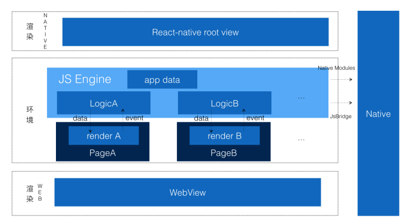
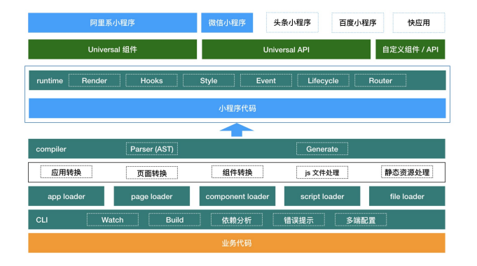
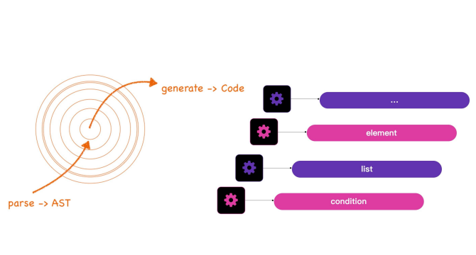
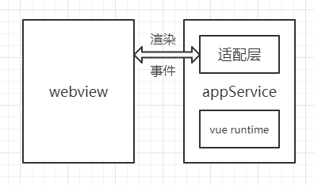
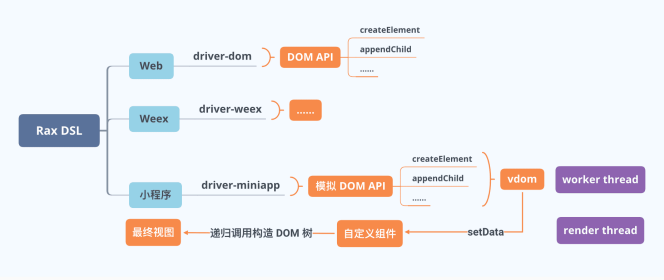
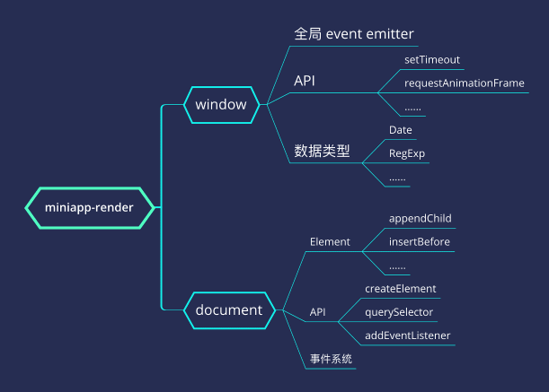
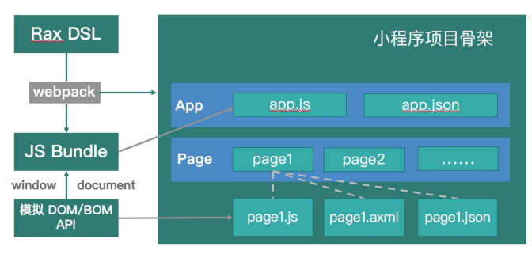
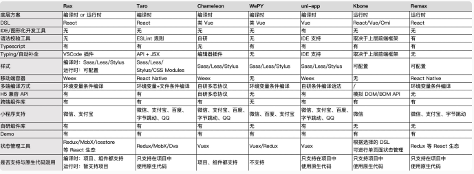

# 课程目标

* 小程序原生开发对比，了解行业小程序开发支撑现状
* 掌握多端小程序开发框架，配置开发环境

# 知识要点

## 行业小程序对比

### 产品及定位

1. 微信：在微信内被便捷地获取和传播的连接用户与服务的方式，同时具有出色的使用体验
2. 支付宝：运行在支付宝客户端，可以被便捷地获取和传播，为终端用户提供更优的用户体验
3. 淘宝：服务移动开发者的平台，帮助开发者构建自己的业务阵地，并提供良好的用户体验
4. 百度：依托以百度App为代表的全域流量，通过百度AI开放式赋能，精准连接用户，业界首家开放生态，让开发者重回业务理解和创意赛道

总结：

1. 小程序的目的是万事万物皆可小程序
2. 超级APP的崛起为小程序提供生存土壤->圈地运营
3. 云计算发展，Saas标准化服务输出，降低了品牌建站的成本->FaaS

### 官方文档

1. 微信：[微信公众平台-小程序](https://developers.weixin.qq.com/miniprogram/introduction/index.html?t=18092610)——[文档](https://developers.weixin.qq.com/miniprogram/dev/framework/)
2. 支付宝：[蚂蚁金服开发平台-小程序](https://mini.open.alipay.com/channel/miniIndex.htm)——[文档](https://opendocs.alipay.com/mini/developer/getting-started)
3. 淘宝：[淘宝开发者平台](https://open.taobao.com/?spm=a219a.14658873.1.1.3d0e4dc1qltrH6)——[文档](https://open.taobao.com/doc.htm?docId=73&docType=1)
4. 百度：[智能小程序](https://smartprogram.baidu.com/developer/index.html)——[文档](https://smartprogram.baidu.com/docs/introduction/enter_application/)

### IDE

1. [微信IDE](https://developers.weixin.qq.com/miniprogram/dev/devtools/download.html)
2. [支付宝IDE](https://opendocs.alipay.com/mini/ide/download)
3. [淘宝IDE](https://miniapp.open.taobao.com/docV3.htm?spm=a219a.15212435.0.0.4a78669aoT4coY&docId=119188&docType=1)
4. [百度IDE](https://smartprogram.baidu.com/docs/introduction/register_prepare/)

### 文件结构

1. 微信小程序

```js
## 微信⼩程序
- pages/               ⻚⾯⽬录
  - page1/
    - index.wxml  // 必须，⻚⾯结构
    - index.js  // 必须，⻚⾯逻辑
    - index.wxss  // ⾮必须，⻚⾯样式表
    - index.json  // ⾮必须，⻚⾯配置
- app.js  // 必须，⼩程序逻辑
- app.json  // 必须，⼩程序公共配置
- app.wxss  // ⾮必须，⼩程序公共样式表
```

2. 支付宝小程序

```js
## ⽀付宝⼩程序
- pages/          
  - page1/
    - index.axml  // 必须，⻚⾯结构    
    - index.js  // 必须，⻚⾯逻辑    
    - index.acss  // ⾮必须，⻚⾯样式表
    - index.json  // ⾮必须，⻚⾯配置    
- app.json  // 必须，⼩程序公共设置  
- app.js  // 必须，⼩程序逻辑    
- app.acss  // ⾮必须，⼩程序公共样式表
```

3. 手淘小程序

```js
## ⼿淘⼩程序：基于轻框架
- src/
  - components/          组件⽬录，可以没有
    - component1.html    组件⽂件
    - component2.html
  - pages/               ⻚⾯⽬录
    - page1/
      - index.html       ⻚⾯⼊⼝
    - page2/
      - index.html
    - index/
      - index.html
- manifest.json        描述项⽬基本信息，包括⻚⾯、tabBar等
- app.js               程序级应⽤⼊⼝
- package.json           项⽬⼯程⽂件

## ⼿淘⼩程序：不基于轻框架完全同⽀付宝⼩程序
```

4. 百度小程序

```js
## 百度⼩程序
- pages/              
  - page1/
    - index.swan  // 模板⽂件
    - index.js  // ⻚⾯逻辑
    - index.css // ⻚⾯样式
- app.js        
- app.json  // 配置⽂件  
- app.css
- project.swan.json  
```

### 生命周期

1. 微信小程序

```js
//index.js
Page({
    
    // {Object}：⻚⾯的初始数据
    data: {
        text: "This is page data."
    },
  
    // {Function}：⽣命周期回调—监听⻚⾯加载
    onLoad: function(options) {
        // Do some initialize when page load.
    },
  
    // {Function}：⽣命周期回调—监听⻚⾯初次渲染完成
    onReady: function() {
        // Do something when page ready.
    },
  
    // {Function}：⽣命周期回调—监听⻚⾯显示
    onShow: function() {
        // Do something when page show.
    },
  
    // {Function}：⽣命周期回调—监听⻚⾯隐藏
    onHide: function() {
        // Do something when page hide.
    },
  
    // {Function}：⽣命周期回调—监听⻚⾯卸载
    onUnload: function() {
        // Do something when page close.
    },
  
    // {Function}：监听⽤户下拉动作
    onPullDownRefresh: function() {
        // Do something when pull down.
    },
  
    // {Function}：⻚⾯上拉触底事件的处理函数
    onReachBottom: function() {
        // Do something when page reach bottom.
    },
  
    // {Function}：⽤户点击右上⻆转发
    onShareAppMessage: function () {
        // return custom share data when user share.
    },
  
    // {Function}：⻚⾯滚动触发事件的处理函数
    onPageScroll: function() {
        // Do something when page scroll
    },
  
    // {Function}：当前是 tab ⻚时，点击 tab 时触发
    onTabItemTap(item) {
        console.log(item.index)
        console.log(item.pagePath)
        console.log(item.text)
    },
    // Event handler 其他：开发者可以添加任意的函数或数据到 Object 参数中，在⻚⾯的函数中⽤ this 可以访问
    viewTap: function() {
        this.setData({
            text: 'Set some data for updating view.'
        }, function() {
            // this is setData callback
        })
    },
    customData: {
        hi: 'MINA'
    }
})
```

2. 支付宝小程序

```js
//index.js
Page({
    data: {
        title: "Alipay"
    },
    onLoad(query) {
        // ⻚⾯加载
    },
    onReady() {
        // ⻚⾯加载完成
    },
    onShow() {
        // ⻚⾯显示
    },
    onHide() {
        // ⻚⾯隐藏
    },
    onUnload() {
        // ⻚⾯被关闭
    },
  
    // {Function}：点击标题触发
    onTitleClick() {
        // 标题被点击
    },
    onPullDownRefresh() {
        // ⻚⾯被下拉
    },
    onReachBottom() {
        // ⻚⾯被拉到底部
    },
    onShareAppMessage() {
        // 返回⾃定义分享信息
    },
    viewTap() {
        // 事件处理
        this.setData({
            text: 'Set data for updat.'
        })
    },
  
    // 其他：开发者可以添加任意的函数或属性到 object 参数中，在⻚⾯的函数中可以⽤ this 来访问
    go() {
        // 带参数的跳转，从 page/index 的 onLoad 函数的 query 中读取 xx
        my.navigateTo({url:'/page/index?xx=1'})
    },
    customData: {
        hi: 'alipay'
    }
})
```

3. 淘宝小程序

```js
// 不基于框架：跟⽀付宝⼩程序语法⼏乎完全⼀样
//index.js
Page({
    data: {
        title: "Alipay"
    },
    onLoad(query) {
        // ⻚⾯加载
    },
    onReady() {
        // ⻚⾯加载完成
    },
    onShow() {
        // ⻚⾯显示
    },
    onHide() {
        // ⻚⾯隐藏
    },
    onUnload() {
        // ⻚⾯被关闭
    },
  
    viewTap() {
        // 事件处理
        this.setData({
            text: 'Set data for updat.'
        })
    },
    go() {
        // 带参数的跳转，从 page/index 的 onLoad 函数的 query 中读取 xx
        my.navigateTo('/page/index?xx=1')
    },
    customData: {
        hi: 'alipay'
    }
})

// 基于框架，类Rax框架，html、js、css在同⼀⽂件中，通过sfc2mp转为⽀付宝⼩程序
<template>
    <view class="demo-page">
        <text class="title">欢迎来到{{title}}</text>
		<button :class="btn" @click="goto">开启未来</button>
	</view>
</template>

<style>
	.demo-page {
        flex-direction: column;
        justify-content: center;
        align-items: center;
    }

	.title {
        font-size: 40px;
        text-align: center;
    }

	.btn {
        width: 550px;
        height: 86px;
        margin-top: 75px;
        border-radius: 43px;
        background-color: #09ba07;
        font-size: 30px;
        color: #ffffff;
    }

	.clickedBtn {
        width: 550px;
        height: 86px;
        margin-top: 75px;
        border-radius: 43px;
        background-color: #09ba07;
        font-size: 30px;
        color: red;
    } 
</style> 

<script>
    import page from '@core/page';

	export default {
        data: {
            title: '示例⻚⾯',
            btn: 'btn',
        },
        methods: {
            goto () {
                this.btn = 'clickedBtn';
                
                my.navigateTo({
                    url: 'test?id=1'
                });
            }
        },
        beforeCreate() {
            page.on('show', () => {});
            page.on('hide', () => {});
        },
        created (){
        
        },
        updated () {
        
        },
        destroyed () {
        
        },
    }
</script>
```

4. 百度小程序

```js
Page({
    data: {
        name: 'swan'
    },
    onLoad: function () {
        
    },
    onReady: function() {
        // Do something when page ready.
    },
    onShow: function() {
        // Do something when page show.
    },
    onHide: function() {
        // Do something when page hide.
    },
    onUnload: function() {
        // Do something when page close.
    },
    onPullDownRefresh: function() {
        // Do something when pull down.
    },
    onReachBottom: function() {
        // Do something when page reach bottom.
    },
    onShareAppMessage: function () {
        // return custom share data when user share.
    },
    // {Function}：错误监听函数
    onError: function (e) {
        // return error info : e
    },
    
    // 其他：开发者可以添加任意的函数或数据到 object 参数中，在⻚⾯的函数中⽤ this 可以访问
    any: function () {
        // return custom data
    }
});
```

### 视图层

#### 数据绑定

1. 微信：指令以wx:开头

```js
<view wx:if="{{condition}}"> </view>
```

2. 支付宝：指令以a:开头

```js
<view a:if="{{view == 'WEBVIEW'}}"> WEBVIEW </view>
<view a:elif="{{view == 'APP'}}"> APP </view> 
<view a:else> alipay </view>
```

3. 淘宝：完全同支付宝

4. 百度

```js
Page({
    data: {
        person: {name: 'Lebron James', pos: 'SF', age: 33},
        teams: ['Cleveland Cavaliers', 'Miami Heat', 'Los Angeles Lakers'],
        tag: 'basketball',
        flag: true
    }
});

<view s-if="flag"></view> // 1.`s-` 开头 2.`flag`没有{{}}
<template is="team-card" data="{{ {teams} }}" /> // {{ {items} }}
```

#### 样式支持

全部支持rpx逻辑单位

### 组件

目前以微信小程序支持最为完善

1. 微信小程序
   * [picker-view](https://developers.weixin.qq.com/miniprogram/dev/component/picker-view.html)：滚动选择器
   * [functional-page-navigator](https://developers.weixin.qq.com/miniprogram/dev/component/functional-page-navigator.html)：跳转至插件功能页
   * [live-push](https://developers.weixin.qq.com/miniprogram/dev/component/live-pusher.html)：实时音视频录制
   * [ad](https://developers.weixin.qq.com/miniprogram/dev/component/ad.html)：banner广告
   * [official-account](https://developers.weixin.qq.com/miniprogram/dev/component/official-account.html)：公众号关注组件
2. 支付宝小程序
   * 缺少movable-area
   * 缺少cover-view
   * 缺少rich-text
   * 缺少audio
   * 缺少video
   * 缺少camera
   * 缺少live-player
   * 缺少live-pusher
   * 缺少ad
   * 缺少open-data
3. 淘宝
   * 缺少movable-area
   * 缺少cover-view
   * 缺少rich-text
   * 缺少camera
   * 缺少live-player
   * 缺少live-pusher
   * 缺少canvas
   * 缺少web-view
   * 缺少ad
   * 缺少open-data
   * 缺少offical-account
4. 百度
   * [animation-view](https://smartprogram.baidu.com/docs/develop/component/animation-view-Lottie/)：动画组件
   * 缺少live-pusher

### 总结

小程序底层方案都是一致的，只不过在支持程度等有所不同。

以支付宝小程序为例：

1. 小程序分别运行在worker(JSEngine)以及render渲染层中，render可以有多个，worker只有一个，方便app数据在页面间的共享和交互（渲染层&逻辑层）
2. worker运行小程序的逻辑处理代码，包括事件处理，api调用以及框架的生命周期管理（逻辑层功能）
3. render运行小程序的渲染代码，主要包括模板/样式和框架的跨终端的js组件或native组件，获取逻辑层的数据进行渲染（渲染层功能）
4. worker和所有的render都建立连接，将需要渲染的数据传递给对应的render进行渲染，worker也会将api调用转给native SDK处理（Hybrid通信）
5. render则将组件的触发事件送到对应的worker处理，同时接受worker的setData调用React重新渲染。render可以看作一个无状态的渲染终端，状态统统保留在app级别的worker里面（渲染层&逻辑层交互）



## 小程序跨端框架介绍

### 原生小程序开发

原生小程序适用于：需求明确只在指定小程序一端进行，保证最大程度地避免多端框架兼容带来的莫名bug。

### 多端小程序开发

Tips：只介绍React语言的跨端框架

#### 编译时

用户编写的业务代码解析成AST树然后通过语法分析强行将用户写的类React代码转换为可运行的小程序代码。代表：京东的Taro1/2、去哪儿的Nanachi，淘宝的Rax。

以下以Rax为例

##### 概览



编译时链路主要分为五个模块：

1. CLI：整个链路的入口，用户编写的所有业务代码都经由CLI读取、处理和输出
2. loader：webpack loader，用于处理各种类型的文件，包括app、page、component、script以及静态资源等
3. compiler：用于进行AST转换并生成对应的小程序代码
4. runtime：为生成的js代码提供了运行时的垫片支持
5. universal：多端统一的universal组件以及API的基础服务支持

###### CLI

> 从命令行读取各种必要参数，然后传入webpack执行。利用webpack的依赖分析能力，遍历到所有有效代码并交由对应的loader进行处理。

具体用途：

1. CLI依赖webpack对项目进行依赖分析，然后调用loader对对应类型的文件进行处理

2. CLI对外提供watch和build两个指令

   a. watch：监听代码变动并实时编译

   b. build：剔除部分调试用的代码（如source map）并压缩代码，完成编译打包

```js
/**
 * watch and copy constant dir file change
 * @param {array} dirs
 * @param {string} distDirectory
 */
function watch(options = {}) {
    const {
        afterCompiled,
        type = DEFAULT_TYPE,
        entry = DEFAULT_ENTRY,
        platform = DEFAULT_PLATFORM,
        workDirectory = cwd,
        distDirectory = join(cwd, DEFAULT_DIST),
        skipClearStdout = false,
        constantDir = DEFAULT_CONSTANT_DIR_ARR,
        disableCopyNpm = false,
        turnOffSourceMap = false,
        turnOffCheckUpdate = false
    } = options;
    
    watchConstantDir(constantDir, distDirectory);
    
    const needUpdate = checkNeedUpdate(turnOffCheckUpdate);
    
    let config = getWebpackConfig({
        mode: 'watch',
        entryPath: entry,
        type,
        workDirectory,
        platform,
        distDirectory,
        constantDir,
        disableCopyNpm,
        turnOffSourceMap
    });
    
    if (options.webpackConfig) {
        config = mergeWebpack(config, options.webpackConfig);
    }
    spinner.shouldClear = !skipClearStdout;
    
    const compiler = webpack(config);
    
    const watchOpts = {
        aggregateTimeout: 600
    };
    compiler.outputFileSystem = new MemFs();
    compiler.watch(watchOpts, (err, stats) => {
        handleCompiled(err, stats, { skipClearStdout });
        afterCompiled && afterCompiled(err, stats);
        if (needUpdate) {
            console.log(chalk.black.bgYellow.bold('Update for miniapp related packages available, please reinstall dependencies.'));
        }
        console.log('Watching for changes...');
    });
}

/**
 * watch and copy constant dir file change
 * @param {array} dirs
 * @param {string} distDirectory
 */
function watchConstantDir(dirs, distDirectory) {
    const watcher = chokidar.watch(dirs);
    watcher.on('all', (event, path) => {
        copyConstantDir(path, distDirectory);
    });
}

/**
 * copy constant path to dist
 * @param {string} path
 * @param {string} distDirectory
 */
function copyConstantDir(path, distDirectory) {
    if (!path) {
        return;
    }
    if (!existsSync(path)) {
        mkdirSync(path);
    }
    copySync(path, join(distDirectory, getCurrentDirectoryPath(path, 'src')), {
        filter: (filename) => !/\.ts$/.test(filename),
    });
}

function handleCompiled(err, stats, { skipClearStdout }) {
    if (err) {
        console.error(err.stack || err);
        if (err.details) {
            console.error(err.details);
        }
        return;
    }
    if (stats.hasErrors()) {
        const errors = stats.compilation.errors;
        if (!skipClearStdout) consoleClear(true);
        spinner.fail('Failed to compile.\n');
        for (let e of errors) {
            console.log(chalk.red(`   ${errors.indexOf(e) + 1}.${e.error.message} \n`));
            if (process.env.DEBUG === 'true') {
                console.log(e.error.stack);
            }
        }
        console.log(chalk.yellow('Set environment `DEBUG=true` to see detail error stacks.'));
    }
}
```

```js
/**
 * Start jsx2mp build.
 * @param options
 */
function build(options = {}) {
    const {
        afterCompiled,
        type = DEFAULT_TYPE,
        entry = DEFAULT_ENTRY,
        platform = DEFAULT_PLATFORM,
        workDirectory = cwd,
        distDirectory = join(cwd, DEFAULT_DIST),
        skipClearStdout = false,
        constantDir = DEFAULT_CONSTANT_DIR_ARR,
        disableCopyNpm = false,
        turnOffCheckUpdate = false
    } = options;
    
    // Clean the dist dir before generating
    if (existsSync(distDirectory)) {
        del.sync(distDirectory + '/**');
    }
    
    constantDir.forEach(dir => copyConstantDir(dir, distDirectory));
    
    const needUpdate = checkNeedUpdate(turnOffCheckUpdate);
    
    let config = getWebpackConfig({
        mode: 'build',
        entryPath: entry,
        platform,
        type,
        workDirectory,
        distDirectory,
        constantDir,
        disableCopyNpm
    });
    
    if (options.webpackConfig) {
        config = mergeWebpack(config, options.webpackConfig);
    }
    spinner.shouldClear = !skipClearStdout;
    
    const compiler = webpack(config);
    compiler.outputFileSystem = new MemFs();
    compiler.run((err, stats) => {
        handleCompiled(err, stats, { skipClearStdout });
        afterCompiled && afterCompiled(err, stats);
        if (needUpdate) {
            console.log(chalk.black.bgYellow.bold('Update for miniapp related packages available, please reinstall dependencies.'));
        }
    });
}
```

```js
// 依赖 webpack 对项⽬进⾏依赖分析，然后调⽤ loader对对应类型的⽂件进⾏处理

const AppLoader = require.resolve('jsx2mp-loader/src/app-loader');
const PageLoader = require.resolve('jsx2mp-loader/src/page-loader');
const ComponentLoader = require.resolve('jsx2mp-loader/src/component-loader');
const ScriptLoader = require.resolve('jsx2mp-loader/src/script-loader');
const FileLoader = require.resolve('jsx2mp-loader/src/file-loader');

function getEntry(type, cwd, entryFilePath, options) {
    const entryPath = dirname(entryFilePath);
    const entry = {};
    const { platform = 'ali', constantDir, mode, disableCopyNpm, turnOffSourceMap } = options;
    
    const loaderParams = {
        platform: platformConfig[platform],
        entryPath: entryFilePath,
        constantDir,
        mode,
        disableCopyNpm,
        turnOffSourceMap
    };
    
    if (type === 'project') {
        // ....
        entry.app = AppLoader + '?' + JSON.stringify({ entryPath, platform: platformConfig[platform], mode, disableCopyNpm, turnOffSourceMap }) + '!./' + entryFilePath;
        if (Array.isArray(appConfig.routes)) {
            appConfig.routes.filter(({ targets }) => {
                return !Array.isArray(targets) || targets.indexOf('miniapp') > -1;
            }).forEach(({ source, component, window = {} }) => {
                component = source || component;
                entry['page@' + component] = PageLoader + '?' + JSON.stringify(Object.assign({ pageConfig: window }, loaderParams)) + '!' + getDepPath(component, entryPath);
            });
        } else if (Array.isArray(appConfig.pages)) {
            // Compatible with pages.
            appConfig.pages.forEach((pagePath) => {
                entry['page@' + pagePath] = PageLoader + '?' + JSON.stringify(loaderParams) + '!' + getDepPath(pagePath, entryPath);
            });
        }
    }
    if (type === 'component') {
        entry.component = ComponentLoader + '?' + JSON.stringify(loaderParams) + '!' + entryFilePath;
    }
    return entry;
}

module.exports = (options = {}) => {
    
    const config = {
        mode: 'production', // Will be fast
        entry: getEntry(type, workDirectory, relativeEntryFilePath, options),
        output: {
            path: distDirectory
        },
        target: 'node',
        context: workDirectory,
        module: {
            rules: [
                {
                    test: /\.t|jsx?$/,
                    use: [
                        {
                            loader: ScriptLoader,
                            options: {
                                mode: options.mode,
                                entryPath: relativeEntryFilePath,
                                platform: platformConfig[platform],
                                constantDir,
                                disableCopyNpm,
                                turnOffSourceMap
                            },
                        },
                        {
                            loader: BabelLoader,
                            options: getBabelConfig(),
                        }
                    ]
                },
                {
                    test: [/\.bmp$/, /\.gif$/, /\.jpe?g$/, /\.png$/, /\.webp$/],
                    loader: FileLoader,
                    options: {
                        entryPath: relativeEntryFilePath
                    },
                },
                {
                    test: /\.json$/,
                    use: [{
                        loader: ScriptLoader,
                        options: {
                            mode: options.mode,
                            entryPath: relativeEntryFilePath,
                            platform: platformConfig[platform],
                            constantDir,
                            disableCopyNpm,
                            turnOffSourceMap
                        },
                    }]
                }
            ],
        },
        resolve: {
            extensions: getPlatformExtensions(platform, ['.js', '.jsx', '.ts', '.tsx', '.json']),
            mainFields: ['main', 'module']
        },
    };
    
    return config;
};
```

Q：在小程序原生开发框架中，入口文件app.js并没有声明依赖，而pages是在app.json中注册的，Rax入口文件是什么样的，它又是如何声明依赖的？

A：为了保持多端统一，Rax采用同一套工程目录

```js
├── README.md                  # 项⽬说明
├── build.json                 # 项⽬构建配置
├── package.json
└── src                        # 源码⽬录
    ├── app.js                 # 应⽤⼊⼝⽂件
    ├── app.json               # 应⽤配置，包括路由配置，⼩程序 window 配置等
    ├── components             # 应⽤的公共组件
    │   └── Logo               # 组件
    │       ├── index.css      # Logo 组件的样式⽂件
    │       └── index.jsx      # Logo 组件 JSX 源码
    ├── document               # ⻚⾯的 HTML 模板
    │   └── index.jsx      
    └── pages                  # ⻚⾯
        └── Home               # home ⻚⾯
            └── index.jsx
```

app.json内容

```js
{
    "routes": [
        {
            "path": "/",
            "source": "pages/Home/index"
        }
    ],
    "window": {
        "defaultTitle": "Rax App 1.0"
    }
}
```

CLI读取其中的routes并将所有引用到的pages文件以及app.js作为entry，以pages文件为入口，所有依赖文件将依次被遍历并交由对应loader进行处理。loader处理完毕后最终的编译代码将生成到目的目录。

###### loader

Rax转小程序的loader统称为：jsx2mp-loader

1. app-loader

   a. 处理rax源码中的app.js

   b. 处理app.json中`window`属性并作支付宝/微信两端的配置抹平

   ```js
   module.exports = async function appLoader(content) {
       const query = parse(this.request);
       // Only handle app role file
       if (query.role !== 'app') {
           return content;
       }
       
       if (!existsSync(outputPath)) mkdirpSync(outputPath);
       
       const compilerOptions = Object.assign({}, compiler.baseOptions, {
           // ...options,
       });
       
       const rawContentAfterDCE = eliminateDeadCode(rawContent);
       
       let transformed;
       try {
           transformed = compiler(rawContentAfterDCE, compilerOptions);
       } catch (e) {
           console.log(chalk.red(`\n[${platform.name}] Error occured when handling App ${this.resourcePath}`));
           if (process.env.DEBUG === 'true') {
               throw new Error(e);
           } else {
               const errMsg = e.node ? `${e.message}\nat ${this.resourcePath}` : `Unknown compile error! please check your code at ${this.resourcePath}`;
               throw new Error(errMsg);
           }
       }
       
       const { style, assets } = await processCSS(transformed.cssFiles, sourcePath);
       transformed.style = style;
       transformed.assets = assets;
       
       const outputContent = {
           code: transformed.code,
           map: transformed.map,
           css: transformed.style ? defaultStyle + transformed.style : defaultStyle,
       };
       const outputOption = {
           outputPath: {
               code: join(outputPath, platform.type === QUICKAPP ? 'app.ux' : 'app.js'),
               css: join(outputPath, 'app' + platform.extension.css),
           },
           mode,
           isTypescriptFile: isTypescriptFile(this.resourcePath),
           type: 'app',
           platform,
           rootDir,
       };
       
       output(outputContent, rawContent, outputOption);
       
       return [
           `/* Generated by JSX2MP AppLoader, sourceFile: ${this.resourcePath}.*/`,
           generateDependencies(transformed.imported),
       ].join('\n');
   };
   ```

2. page-loader

   a. 处理定义在app.json中routes属性内的page类型组件

   b. 根据jsx-compiler中解析到的该组件所引用组件的信息，写入json文件中的usingComponents，并将这些组件加入webpack依赖分析链并交由component-oader处理

   c. 处理用户定义在app.json中routes数组内每一个页面的配置（即window配置项）并输出至对应页面的json文件中

   ```js
   module.exports = async function pageLoader(content) {
       const query = parse(this.request);
       // Only handle page role file
       if (query.role !== 'page') {
           return content;
       }
       
       const compilerOptions = Object.assign({}, compiler.baseOptions, {
           // ...options
       });
       const rawContentAfterDCE = eliminateDeadCode(content);
       
       let transformed;
       try {
           transformed = compiler(rawContentAfterDCE, compilerOptions);
       } catch (e) {
           console.log(chalk.red(`\n[${platform.name}] Error occured when handling Page ${this.resourcePath}`));
           if (process.env.DEBUG === 'true') {
               throw new Error(e);
           } else {
               const errMsg = e.node ? `${e.message}\nat ${this.resourcePath}` : `Unknown compile error! please check your code at ${this.resourcePath}`;
               throw new Error(errMsg);
           }
       }
       
       const { style, assets } = await processCSS(transformed.cssFiles, sourcePath);
       transformed.style = style;
       transformed.assets = assets;
       
       if (!existsSync(pageDistDir)) mkdirpSync(pageDistDir);
       
       // ...
     
       let config = {
           ...transformed.config
       };
       if (existsSync(pageConfigPath)) {
           const pageConfig = readJSONSync(pageConfigPath);
           delete pageConfig.usingComponents;
           Object.assign(config, pageConfig);
       }
       
       // ...
       
       if (config.usingComponents) {
           const usingComponents = {};
           Object.keys(config.usingComponents).forEach(key => {
               const value = config.usingComponents[key];
               if (/^c-/.test(key)) {
                   const result = MINIAPP_PLUGIN_COMPONENTS_REG.test(value) ? value : removeExt(addRelativePathPrefix(relative(dirname(this.resourcePath), value)));
                   usingComponents[key] = normalizeOutputFilePath(result);
               } else {
                   usingComponents[key] = normalizeOutputFilePath(value);
               }
           });
           config.usingComponents = usingComponents;
       }
     
       output(outputContent, content, outputOption);
       
       // ...
       
       return [
           `/* Generated by JSX2MP PageLoader, sourceFile: ${this.resourcePath}.*/`,
           generateDependencies(dependencies),
       ].join('\n');
   };
   ```

3. component-loader

   a. 处理component类型组件并交由jsx-compiler处理然后产出编译后代码，并写入至指定目标文件夹位置

   b. 根据jsx-compiler中解析到的该组件所引用组件的信息，写入json文件的usingComponents属性中，并将这些组件加入webpack依赖分析链并交由component-loader处理

   ```js
   module.exports = async function componentLoader(content) {
       const query = parse(this.request);
       // Only handle component role file
       if (query.role !== 'component') {
           return content;
       }
       
       const compilerOptions = Object.assign({}, compiler.baseOptions, {
           // ...options,
       });
       
       let transformed;
       try {
           const rawContentAfterDCE = eliminateDeadCode(content);
           transformed = compiler(rawContentAfterDCE, compilerOptions);
       } catch (e) {
           console.log(chalk.red(`\n[${platform.name}] Error occured when handling Component ${this.resourcePath}`));
           if (process.env.DEBUG === 'true') {
               throw new Error(e);
           } else {
               const errMsg = e.node ? `${e.message}\nat ${this.resourcePath}` : `Unknown compile error! please check your code at ${this.resourcePath}`;
               throw new Error(errMsg);
           }
       }
       
       const { style, assets } = await processCSS(transformed.cssFiles, sourcePath);
       transformed.style = style;
       transformed.assets = assets;
       
       const config = Object.assign({}, transformed.config);
     
       if (config.usingComponents) {
           const usingComponents = {};
           Object.keys(config.usingComponents).forEach(key => {
               const value = config.usingComponents[key];
               
               usingComponents[key] = normalizeOutputFilePath(value);
           });
           config.usingComponents = usingComponents;
       }
       
       const distFileDir = dirname(distFileWithoutExt);
       if (!existsSync(distFileDir)) mkdirpSync(distFileDir);
       
       output(outputContent, content, outputOption);
       
       function isCustomComponent(name, usingComponents = {}) {
           const matchingPath = join(dirname(resourcePath), name);
           for (let key in usingComponents) {
               if (
                   usingComponents.hasOwnProperty(key)
                   && usingComponents[key]
                   && usingComponents[key].indexOf(matchingPath) === 0
               ) {
                   return true;
               }
           }
           return false;
       }
   };
   ```

4. file loader

   a. 处理图片等静态文件资源，将其拷贝至指定目标文件夹

   ```js
   const { join, relative, dirname } = require('path');
   const { copySync } = require('fs-extra');
   
   const loaderUtils = require('loader-utils');
   
   module.exports = function fileLoader(content) {
       const { entryPath, outputPath } = loaderUtils.getOptions(this) || {};
       const rootContext = this.rootContext;
       
       const relativeFilePath = relative(
           join(rootContext, dirname(entryPath)),
           this.resourcePath
       );
       const distSourcePath = join(outputPath, relativeFilePath);
       copySync(this.resourcePath, distSourcePath);
       return '';
   };
   ```

5. script loader：负责依赖路径处理

   a. npm包：搜集代码中使用到的npm依赖，获取npm包的真实地址=>路径处理=>babel编译=>输出代码至目标文件夹

   b. 来自npm包的第三方原生小程序库：用户使用绝对路径去使用第三方原生小程序库时，script-loader需要读取js文件同目录下同名的json文件中的usingComponents字段并将其加入webpack的依赖分析链

   ```js
   module.exports = function scriptLoader(content) {
       const query = parse(this.request);
       if (query.role) {
           return content;
       }
       
       // ...
     
       if (isFromNodeModule(this.resourcePath)) {
           if (disableCopyNpm) {
               return isCommonJSON ? '{}' : content;
     
               const pkg = readJSONSync(sourcePackageJSONPath);
               const npmName = pkg.name; // Update to real npm name, for that tnpm will create like `_rax-view@1.0.2@rax-view` folders.
               const npmMainPath = join(sourcePackagePath, pkg.main || '');
               
               const isUsingMainMiniappComponent = pkg.hasOwnProperty(MINIAPP_CONFIG_FIELD) && this.resourcePath === npmMainPath;
               // Is miniapp compatible component.
               if (isUsingMainMiniappComponent || isRelativeMiniappComponent || isThirdMiniappComponent) {
                   // ...
         
                   if (isThirdMiniappComponent) {
                       const source = dirname(this.resourcePath);
                       const target = dirname(normalizeNpmFileName(join(outputPath, 'npm', relative(rootNodeModulePath, this.resourcePath))));
                       outputDir(source, target);
                       outputFile(rawContent);
                   }
                   
                   return [
                       `/* Generated by JSX2MP ScriptLoader, sourceFile: ${this.resourcePath}. */`,
                       generateDependencies(dependencies),
                       content
                   ].join('\n');
               }
           } else {
               outputFile(rawContent);
           }
       } else if (isFromConstantDir(this.resourcePath) && isThirdMiniappComponent) {
           const dependencies = [];
           outputFile(rawContent, false);
           
           // Find dependencies according to usingComponents config
           const componentConfigPath = removeExt(this.resourcePath) + '.json';
           const componentConfig = readJSONSync(componentConfigPath);
           for (let key in componentConfig.usingComponents) {
               const componentPath = componentConfig.usingComponents[key];     
               const absComponentPath = resolve(dirname(this.resourcePath), componentPath);
               dependencies.push({
                   name: absComponentPath,
                   options: loaderOptions
               });
           }
           return [
               `/* Generated by JSX2MP ScriptLoader, sourceFile: ${this.resourcePath}. */`,
               generateDependencies(dependencies),
               content
           ].join('\n');
       } else if (!isAppJSon) {
           outputFile(rawContent, false);
       }
              
       return isJSON ? '{}' : transformCode(
           content, mode,
           [ require('@babel/plugin-proposal-class-properties') ]
       ).code; // For normal js file, syntax like class properties can't be parsed without babel plugins
   };
   ```

###### compiler

编译：是一种利用编译程序从源语言编写的源程序产生目标程序的过程或者动作，完整的流程是从高级语言转换成计算机可以理解的二进制语言的过程：Rax->小程序DSL

编译在rax主要是jsx-compiler：

1. 词法分析（tokenizing）
2. 语法分析（parsing）
3. 代码生成（generate）



Example：

1. input

```js
import { Component } from 'rax';

export default class extends Component {
    render() {
        return (<view>hello world</view>);
	}  
}
```

jsx compiler执行

* type // app, page, component
* outputPath
* sourcePath
* resourcePath

```js
const compile = require('jsx-compiler');
const { baseOptions } = compile;

const output = compile(code, { ...baseOptions, type: 'component' });
```

2. output

* ast：Babel 7格式的AST
* imported：引入的模块和本地定义变量
* exported：导出变量
* template：miniapp识别模板
* code：转义后的代码
* map：source map
* config：小程序配置
* style：样式
* usingComponents

```js
{
    ast: ASTNodeTree,
    imported: {
        rax: [
            {
                local: "Component",
                default: false,
                importFrom: "Component",
                name: "rax",
                external: true
            }
        ]
    },
    exported: ["default"],
    code: 'import { createComponent as __create_component__, Component as __component__ } from "jsx2mp-runtime";\n\nconst __def__ = class extends __component__ {\n render() {\n   return {};\n }\n\n};\n\nComponent(__create_component__(__def__, {\n events: []\n}));',
    map: null,
    config: {
        component: true
    },
    style: "",
    usingComponents: {},
    template: "<view>hello world</view>"
}
```

###### runtime

提供垫片，小程序Page/Component与原生Rax支持还是有区别，使用jsx2mp-runtime来作了二者的桥接

参考：https://github.com/raxjs/miniapp/tree/master/packages/jsx2mp-runtime/src

###### univeral

支持生态

#### 运行时

代表：有蚂蚁的Remax，京东的Taro 3，淘宝的Rax。

小程序运行时起点：[Kbone](https://wechat-miniprogram.github.io/kbone/docs/?spm=ata.13261165.0.0.24bd6f229wae2I)

1. 小程序的技术底层依托于web技术，由于多线程架构的限制，对于有多端需求的项目来说，加一个功能或者改一个样式都可能需要改动两套代码（DOM、BOM API无法打平）

目的：

1. 为了更好地复用组件，尽可能完整地支持Web端的特性
2. 在小程序端的渲染结果要尽可能接近Web端h5页面

方案：

Web组件转小程序

​	a. 限制大部分Web端特性，兼容性差，需要将Web端框架（比如vue、react等）给完整引进来

​	b. Web框架（vue、react）底层依赖DOM、BOM，需要提供适配



适配器：

1. 在appService端运行的轻型DOM树
2. 提供基础的DOM/BOM API
3. appService端和WebView端的交互通过适配器来进行

Rax类似Kbone：

1. 采用driver，小程序的driver只需复用web端的driver-dom，因为底层的document和window变量都已经模拟好
2. 为开发者提供更贴近web的开发体验。这套方案意味着开发者除了使用JSX之外，也是支持直接使用DOM/BOM API创建视图，driver的API操作是可以引用的

* driver-miniapp



* Rax事件系统：miniapp-render

> miniapp-render is DOM simulator designed for MiniApp which can provides DOM-related API for developers.
>
> You can think of it as a lightweight jsDom running on appService.

Rax小程序运行时中，模拟DOM/BOM API的库为miniapp-render，其支持的API如下：



* 工程设计

Rax小程序运行时follow了Rax Web的设计，Web端Webpack打包出的JS Bundle可以在小程序运行时中复用。我们通过插件将miniapp-render模拟出的window和document变量注入该bundle，再生成一个固定的小程序项目骨架，在app.js中加载JS Bundle即可。



miniapp-render源码：https://github.com/raxjs/miniapp/tree/master/packages/miniapp-render

### 框架选择

#### API设计与性能

* API设计

1. 小程序端总会存在无法抹平以及需要单独处理的地方
2. 每个端独立的属性不应该入侵基础框架本身，保证基础框架的纯净有利于做更多的扩展

```js
// Taro
import Taro, { Component } from '@tarojs/taro'
import { View, Text } from '@tarojs/components'

export default class Index extends Component {
    config = {
        navigationBarTitleText: '⾸⻚'
    }
    
    componentWillMount () { }
    
    componentDidMount () { }
    
    componentWillUnmount () { }
    
    componentDidShow () { }
    
    componentDidHide () { }
    render () {
        return (
            <View>
            	<Text>1</Text>
            </View>
        )
    }
}

// Rax
import { createElement, Component } from 'rax';
import View from 'rax-view';
import Text from 'rax-text';
import { isMiniApp } from 'universal-api';
import { registerNativeListeners, addNativeEventListener, removeNativeEventListener } from 'rax-app';

function handlePageShow() {}

class Index extends Component {
    componentWillMount () { }
    
    componentDidMount () {
        if (isMiniApp) {
            addNativeEventListener('onShow', handlePageShow);
        }
    }
    
    componentWillUnmount () {
        if (isMiniApp) {
            removeNativeEventListener('onShow', handlePageShow);
        }
    }
    
    render () {
        return (
            <View>
            	<Text>1</Text>
            </View>
        )
    }
}

if (isMiniApp) {
    registerNativeListeners(Index, ['onShow']);
}

export default Index;
```

1. Rax没有ComponentDidShow ComponentDidHide的概念，新增了和W3C标准类似的addNativeEventLisenter removeEventListener等API
2. 组件实例上没有一个叫做config的静态属性用来设置页面的title等配置

react本身是没有这些生命周期和配置的：Rax此处优势更明显

* 性能

```js
// ⼩程序本身需要预置⽣命周期，⽽不能动态注册：
Page({
    onShow() {}
});

// 不⽣效
const config = {}
Page(config);
setTimeout(() => {
    config.onShow = () => {};
}, 1000);
```

* Taro：不知道是否需要注册onShow，将所有的原生事件全部注册监听
* Rax：引入了registerNativeListeners，需要先注册，才能监听

#### 多端组件协议设计

1. Taro：将组件统一在项目中进行编译产出为小程序代码不同
2. Rax：支持在Rax小程序项目和原生小程序项目中都能正常使用Rax小程序组件

* 支持渐进式接入或迁移至Rax：
  * Rax小程序组件工程的构建产物符合小程序语法，可以直接在原生小程序项目中使用
  * 如果想渐进式地使用Rax来开发小程序，可以以组件或者页面为单位迁移到Rax
* 多端统一的组件使用体验

```js
// Wrong
import CustomComponent from 'custom-component/miniapp/index'

// Correct，⽀持miniapp、web、weex等保持⼀致
import CustomComponent from 'custom-component'
```

#### 基于webpack构建

1. 基于插件体系，可定制扩展：Rax工程以[build-script](https://github.com/ice-lab/build-scripts)为基础，通过插件体系支持各个场景；基于webpack-chain提供了灵活的webpack配置能力，用户可以通过组合各种插件实现工程需求
2. 命令简介，体验统一：Rax小程序的编译时方案通过webpack loader来处理自身逻辑。以app/page/component等文件角色分类的webpack loader会调用jsx-compiler进行代码的AST分析及处理，再将处理完的代码交由loader生成对应的小程序文件；运行时方案直接复用Web端的编译配置，再通过额外的webpack插件生成具体的小程序代码。

# 补充知识点

主流小程序框架对比：

