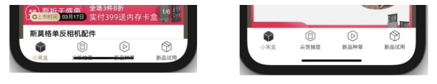
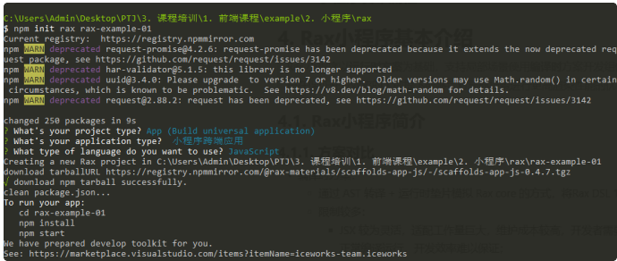

# 课程目标

* 学习Rax小程序的基本语法、API及组件的使用
* 掌握Rax小程序的高阶用法

# 知识要点

## Rax基本使用

> * Rax 语法层面以 React 为标准，可以使用 Hooks、Context 等80% 以上支持度的 React API
> * 官方配套的研发框架 Rax App，支持 TypeScript、Less/Sass 等基础工程能力，同时支持 MPA、SPA、SSR
> * 支持通过完整订单 Rax 语法开发跨支付宝/微信/字节等不同厂商的小程序，同时可降级到 Web
> * 基于 Web 标准支持跨多容器的跨端应用，包含 Web 应用、Flutter 应用（Kraken）、Weex应用
> * 丰富的跨端生态，比如跨端组件 Fusion Mobile、跨端 API Uni API

* Rax 与 React 的区别是什么？
  * Rax面向多端设计的，从最初始就引入了 Driver 机制来适配不同端，相比 React 更加轻量，gzip 之后只有6KB
* Rax 对于 React 的 API 支持度是怎样的？
  * 不支持 Suspense、lazy API，其他诸如 Hooks、Component 等 API 都支持

### 目录结构

```js
├── .rax/                          // 运⾏时⽣成的临时⽬录,git不要提交
├── build/                         // 构建产物⽬录，npm run build 后产物
├── public                         // 本地静态资源
│   └── favicon.png
├── src
│   ├── app.json                   // 路由及⻚⾯配置, routes、window等
│   ├── app.ts                     // [⼩程序|SPA]应⽤⼊⼝
│   ├── miniapp-native/            // [⼩程序]⼩程序原⽣代码
│   ├── components/                // ⾃定义业务组件
│   ├── pages/                     // ⻚⾯
│   ├── models/                    // 应⽤级数据状态
├── build.json                     // ⼯程配置
├── package.json
└── tsconfig.json
```

### 环境配置

```js
// 获取不同环境的配置
// src/config.ts
export default {
    // 默认配置
    default: {
        appId: '123',
        baseURL: '/api'
    },
    local: {
        appId: '456',
    },
    daily: {
        appId: '789',
    },
    prod: {
        appId: '101',
    }
}

import { config } from 'rax-app';

console.log(config.appId);
```

### 编写组件

支持

* Function Component
* Class Component

```js
// function component
import { createElement } from 'rax';

function Welcome(props) {
    return <h1>Hello, {props.name}</h1>;
}

// class component
import { createElement, Component } from 'rax';

class Welcome extends Component {
    render() {
        return <h1>Hello, {this.props.name}</h1>;
    }
}
```

支持类型：

* props
* state
* Fragment
* Hooks：常用Hooks：useState、useEffect etc，具体看下文
* JSX
* JSX+
  * 条件判断：x-if、x-elseif、x-else
  * 循环列表：x-for
  * 单次渲染：x-memo：首次拟render后值不变不会render
  * 插槽：x-slot
  * 类名绑定：x-class

```js
// 条件判断
<View x-if={condition}>Hello</View>
<View x-elseif={anotherCondition}></View>
<View x-else>NothingElse</View>

// x-for
{/* Array or Plain Object*/}
<tag x-for={item in foo}>{item}</tag>
  
<tag x-for={(item, key) in foo}>{key}: {item}</tag>

// x-memo
<p x-memo>this paragragh {mesasge} content will not change.</p>

// x-slot
<Waterfall>
  <view x-slot:header>header</view>
  <view x-slot:item="props">{props.index}: {props.item}</view>
  <view x-slot:footer>footer</view>
</Waterfall>

<slot name="header" /> // 槽位
    
// x-class
<div x-class={{ item: true, active: val }} />
```

### 样式方案

* 全局样式

统一定义在 src/global.[css|less|scss]，框架会自动引入

* 组件样式

文件名定义：xxx.module.[css|less|scss]，使用CSS Modules，避免全局污染

```js
/** ./pages/Home/index.module.css */
.container {
    background: #fff;
    width: 750rpx;
}

/* 也可通过 CSS Modules 的 :global 语法定义全局样式 */
:global {
    body {
        a {
            color: blue;
        }
    }
}

// ./pages/Home/index.tsx
import styles from './index.module.css';

function Home() {
    return (
        <View className={styles.container}>
        	<View>CSS Modules</View>
		</View>
	);
}

// 编译后
<View class="container--1DTudAN">title</View>
```

* 内联样式

在 build.json 里配置了 inlineStyle: true 则说明整个项目使用内联样式

```js
const myStyle = {
    fontSize: '24px',
    color: '#FF0000'
};

const element = <View style={myStyle}>Hello Rax</View>;
```

支持在使用内联样式方案的项目中局部支持非内联形式

在 build.json 中将 inlineStyle 设置为 { forceEnableCSS: true }

```js
import cssModule from './index.module.css';
import styles from './index.css';

function App() {
    // CSS Modules 以 className 的形式使⽤
    // inlineStyle 以 style 的形式使⽤
    return <div className={cssModule.header} style={styles.header} />;
}
```

### 框架API

通过 rax-app 中引入

> import { runApp } from 'rax-app';

* runApp
* APP_MODE
* ErrorBoundary
* store
* getHistory：获取history实例
* getSearchParams：获取参数
* history：路由实例

```js
import { history } from 'rax-app';

// ⽤于获取 history 栈⾥的实体个数
console.log(history.length);

// ⽤于获取 history 跳转的动作，包含 PUSH、REPLACE 和 POP 三种类型
console.log(history.action);

// ⽤于获取 location 对象，包含 pathname、search 和 hash
console.log(history.location);

// ⽤于路由跳转
history.push('/home');

// ⽤于路由替换
history.replace('/home');

// ⽤于跳转到上⼀个路由
history.goBack();
```

### 安全区域适配

* 刘海屏适配

为了使页面顶部内容不被刘海遮挡，可以通过设置容器节点的 padding-top 值来实现，使核心内容整体下移


获取刘海高度，首先需要设置 viewport-fit，调整可视窗口的布局方式。当且仅当 viewport-fit 设置为 cover 时，可以进一步设置页面的安全区域范围。

> <meta name="viewport" content="width=device-width, viewport-fit=cover">

然后，结合 env() 方法，可以获取 safe-area-inset-top 值，并将其作为容器节点的 padding-top 值。

```js
.root {
    padding-top: constant(safe-area-inset-top); /* 兼容 iOS < 11.2 */
    padding-top: env(safe-area-inset-top); // /* iOS > 11.2 */
}
// 注意： 在 iOS 11.2 之前的版本，需使⽤ constant() ⽅法
```

* 底部小黑条适配

有 tabbar 的应用，iPhone 底部的小黑条常常会挡住 tabbar，影响其可操作区域。和刘海屏适配的原理一致，以 tabbar 为例，小黑条适配可以通过调整 tabbar 的 padding-bottom 值，增加空白区域来实现。



使用示例：

```js
.tabbar {
    padding-bottom: 0; /* ⽆⼩⿊条的情况下，⽆需额外设置 */
    padding-bottom: constant(safe-area-inset-bottom); /* 兼容 iOS < 11.2 */
    padding-bottom: env(safe-area-inset-bottom); // /* iOS > 11.2 */
}
```

### 静态资源使用

将文件放入 public 文件夹，webpack不会处理它。而是它将被复制到构建文件夹中

要引用 public 文件夹中的资源，需要使用名为 process.env.PUBLIC_URL 的特殊变量，这个值会根据工程配中的 publicPath 变化

```js
render() {
    // 注意：这是⼀个 escape hatch，应该谨慎使⽤！
    // 通常我们建议使⽤`import`来获取资源的 URL
    return ;
}
```

通常我们建议从 JS 导入 stylesheets，图片和字体存入 public 文件夹中

* 你需要在构建输出中具有特定名称的文件，例如 manifest.json
* 你有数千张图片，需要动态引用它们的路径
* 你希望在打包代码之外包含一个无需走构建逻辑的小脚本
* 某些库可能与 webpack 不兼容，只能将其放在 public 中引入

### 代码切割

* dynamic import

使用 import()，webpack 会在编译阶段对引入的资源进行代码切割，即只有当运行时逻辑执行到import() 调用点时才会加载对应的资源，该函数返回值是 Promise

```js
import { isWeb } from '@uni/env';

if (isWeb) {
    import('./fetch').then(fetch => {
        fetch('m.taobao.com');
    }).catch(err => {
        console.error('模块引⼊失败！');
    });
}
```

* rax-use-import

函数式组件提供的 Hooks

```js
import { createElement } from 'rax';
+import useImport from 'rax-use-import';

export default function App() {
    +  const [Bar, error] = useImport(() => import(/* webpackChunkName: "bar" */ './Bar'));
    if (error) {
        return <p>error</p>;
    } else if (Bar) {
        return <Bar />
    } else {
        return <p>loading</p>;  
    }
}
```

## Rax小程序基本介绍

> Rax 小程序以运行时方案为基础，支持局部场景使用编译时方案开发组件，充分结合了二者的优势特点，让用户在保证开发效率的大前提下能够针对局部场景进行更高渲染性能的优化。

### Rax小程序简介

#### 方案对比

* 编译时方案：
  * 通过 AST 转译 + 运行时垫片模拟 Rax core 的方式，将 Rax DSL 1:1 输出为原生小程序代码
  * 限制较多
    * JSX 较为灵活，适配工作量巨大，维护成功较高，开发者需要遵循大量的语法约束，否则代码就不能正常编译运行，开发效率难以保证
    * 需要配合 runtime垫片来模拟 Rax 运行 --> Rax 有功能更新时，编译无法得到同步
    * DOM 和 BOM API 的缺失，Web 上积累的各种前端生态无法复用
  * 性能较好
* 运行时方案：
  * 通过底层模拟 DOM 和 BOM API，使开发者可以使用 Rax DSL 开发
  * 性能较差，但基本对齐web端生态

### Rax运行

> npm init rax rax-example



项目中 build.json 中的 targets

```json
{
    "targets": [
        "miniapp",             // ⽀付宝⼩程序
        "wechat-miniprogram",  // 微信⼩程序
        "bytedance-microapp",  // 字节跳动⼩程序
        "baidu-smartprogram",  // 百度智能⼩程序
        "kuaishou-miniprogram" // 快⼿⼩程序
    ]
}
```

package.json

* start：rax-app start
  * 保留日志
  * 保留 source map
* build：rax-app build
  * 不保留注释
  * 去除 source map
  * 去除开发工具

rax-app webpack config github地址：

https://github.com/raxjs/rax-app/tree/master/packages/rax-webpack-config/src

```js
// index
export default (options: IOptions) => {
    const config = getBaseConfig(options);
    if (options.mode === 'development') {
        configDev(config);
    } else {
        configBuild(config);
    }
    return config;
};


// webpack.base.ts
export default (options: IOptions) => {
    const config = new Config(); // webpack-chain: 链式配置webpack
    config.mode(options.mode);
  
    // 尝试按顺序解析这些后缀名。如果有多个⽂件有相同的名字，但后缀名不同，
    // webpack 会解析列在数组⾸位的后缀的⽂件 并跳过其余的后缀
    config.resolve.extensions
        .merge(['.js', '.json', '.jsx', '.ts', '.tsx', '.html']); //
    // webpack loaders
    setWebpackLoaders(config, options);
    // webpack plugins
    setWebpackPlugins(config);
    
    return config;
};


// webpack.dev.ts
import * as TimeFixPlugin from 'time-fix-plugin';

export default (config) => {
    // custom stat output by stats.toJson() calls
    // 在使⽤ Node.js API 时，此选项⽆效;
    // 你需要将统计配置项传递给 stats.toString() 和 stats.toJson() 调⽤;
    // state: none 不输出bundle信息
    config.stats('none');
    
    // set source map, https://webpack.js.org/configuration/devtool/#devtool
    // build速度: ok，rebuild速度： slow，且sourcemap为转移后的sourcemap
    config.devtool('cheap-module-source-map');
  
    // fix: https://github.com/webpack/watchpack/issues/25
    // 解决某些bug
    config.plugin('TimeFixPlugin').use(TimeFixPlugin);
};


// webpack.build.ts
import * as TerserPlugin from '@builder/pack/deps/terser-webpack-plugin';
import isWebpack4 from './isWebpack4';

export default (config) => {
    // disable devtool of mode prod build
    config.devtool(false);
  
    // 压缩JS⽂件 terser
  let terserPluginOptions = {
      parallel: true, // 使⽤多进程并发运⾏以提⾼构建速度
      extractComments: false, // 是否将注释剥离到单独的⽂件中, boolean是否启动
      terserOptions: {
          output: {
              // 只有ascII码⽣效，转义字符串和正则表达式中的 Unicode 字符，
              // ⾮ascII码指令⽆效
              ascii_only: true,  
              // 保留包含 "@license", "@copyright", "@preserve 等关键字的JSDoc的
              comments;
              comments: 'some',
              // 优化output的样式
              beautify: false,
          },
          mangle: true, // 压缩变量名
      },
  };
    
  let safeParser;
  let CssMinimizerPlugin;
  
  if (isWebpack4) {
      terserPluginOptions = {
          ...terserPluginOptions,
          // @ts-ignore
          cache: true, // 缓存地址：node_modules/.cache/terser-webpack-plugin
      };
      // Safe parser
      safeParser = require('@builder/rax-pack/deps/postcss-safe-parser');
      // css minimizer plugin
      CssMinimizerPlugin = require('@builder/rax-pack/deps/css-minimizerwebpack-plugin');
  } else {
      // Safe parser
      safeParser = require('@builder/pack/deps/postcss-safe-parser');
      // css minimizer plugin
      CssMinimizerPlugin = require('@builder/pack/deps/css-minimizer-webpack-plugin');
  }
    
  // uglify js file
  config.optimization
      .minimizer('TerserPlugin')
      .use(TerserPlugin, [terserPluginOptions]);
  
  // optimize css file
  config.optimization
      .minimizer('CssMinimizerPlugin')
      .use(CssMinimizerPlugin, [{
          parallel: false, // 使⽤多进程并发执⾏，提升构建速度
          minimizerOptions: {
              preset: [ // 移除所有注释
                  'default',
                  {
                      discardComments: { removeAll: true },
                  },
              ],
              processorOptions: {
                  parser: safeParser,  // 配置cssnano的processorOptions属性， 压缩postCSS
              },
          },
      }]);
};
```

### 入口文件

src/app.js（TS为app.tsx）为文件入口

```js
import { runApp } from 'rax-app';

const appConfig = {
    app: {
        // 可选，⾃定义添加 Provider
        addProvider: ({ children }) => {
            return <ConfigProvider>{children}</ConfigProvider>;
        },
        
        // 可选，开启默认的 ErrorBoundary ⾏为，默认值为 false
        errorBoundary: true,
        
        // 可选，⾃定义错误边界的 fallback UI
        ErrorBoundaryFallback: <div>渲染错误</div>,
        
        // 可选，⾃定义错误的处理事件
        onErrorBoundaryHandler: (error, componentStack) {
    		// Do something with the error
		},
      
      	// 可选，⼩程序应⽤⽣命周期
      	onLaunch() {},
        onShow() {},
        onHide() {},
        onError() {},
        onShareAppMessage() {},
        ......
	},
    // 不建议在此创建store的getInitialStates
    store: {
        initialStates: {},
        getInitialStates: (initialData) => {}
    }
};

runApp(appConfig);
```

### 应用配置

在 src/app.json 中，对 window，tabbar 配置，且小程序中的路由存在于 routes 中

* path：指定页面对应的路由地址
* source：指定页面组件地址，必须写成 pages/[PAGE_NAME]/index 格式，暂不支持嵌套式路由
* targets：指定页面需要构建的端，默认为 build.json 所配置的 targets 的值
* window：指定该页面的窗体表现，可以覆盖全局的窗口设置
* tabBar：如果应用是一个多tab应用（底部栏可以切换页面），可以指定 tab 栏及切换时显示的对应页面

```json
{
    "routes": [
        {
            "path": "/",
            "source": "pages/Home/index",
            "window": {
                "barButtonTheme": "default"
            }
        },
        {
            "path": "/about",
            "source": "pages/About/index",
            "window": {
                "barButtonTheme": "light"
            }
        }
    ],
    "window": {
        "title": "Rax App 1.0",
    }，
    "tabBar": {
    	"textColor": "#999",
    	"selectedColor": "#666",
    	"backgroundColor": "#f8f8f8",
    	"items": [
    		{
    			"text": "home",
    			"pageName": "/",
    			"icon": "https://gw.alicdn.com/tfs/TB1ypSMTcfpK1RjSZFOXXa6nFXa144-144.png",
    			"activeIcon": "https://gw.alicdn.com/tfs/TB1NBiCTgHqK1RjSZFPXXcwapXa-144-144.png"
			}
		]
	}
}
```

Tips：原生小程序中，app.json（debug、networkTimeout）的其他字段都可以在此配置

### 工程配置

在 build.json 中，其中可以指定小程序的配置项

* buildType：小程序引擎，默认位运行时，编译时为 compile
* nativeConfig：即微信小程序的 project.config.json
* subPackages：是否分包加载
* runtimeDependencies：在运行时引擎下，使用 rax 工程的多包 npm 时，使用编译时还是运行时实现
* nativePackage：配置原生小程序自定义组件及原生页面所用到的 npm 依赖

```json
{
    "targets": ["miniapp", "wechat-miniprogram"],
    "miniapp": {}, // ⽀付宝⼩程序语法配置
    // 微信⼩程序语法配置
    "wechat-miniprogram": {
        "nativeConfig": {
            "appId": YOUR_APP_ID,
            "miniprogramRoot": "build/wechat-miniprogram"
        },
        "subPackages": {
            "shareMemory": true // 共享运⾏时内存
        },
        "nativePackage": {
            // ⾃动安装 Rax 项⽬中的原⽣⼩程序⾃定义组件及原⽣⻚⾯所⽤到的 npm 依赖
            // 不配置dependencies 字段且 autoInstall 未设置为 false时
            // 会默认安装所有依赖，可作为性能优化
            "autoInstall": true,
            "dependencies": {
                // 指定安装依赖，格式同package.json 中的 dependencies 字段⼀致
                "mini-ali-ui": "^1.3.4"
            } 
        }
    }
}
```

Tips：

* 当运行时项目中使用到由 Rax 组件工程产出的多端组件 npm 包时，不配置 runtimeDependencies，默认采用其编译时的代码实现。此时需要将其配置到 nativePackage.dependencies，否则产物中将报找不到该组件的问题
* nativePackage.dependencies 中配置的原生小程序 npm 依赖依然需要在 Rax 项目根目录的 package.json 中配置并安装

### 页面生命周期及事件处理

移除了部分原生小程序事件相关Hooks：

1. useHistory、useReachBottom等只能作为单纯 API 而不是 Hooks 使用
2. 性能与可扩展性较弱，每当小程序新支持一个事件，都需要去开发一个对应功能的API，并且在页面初始化之初就监听所有事件 --> 不合理的

新增API：

| API                                                     | 功能                                                 |
| ------------------------------------------------------- | ---------------------------------------------------- |
| registerNativeEventListeners(Component, [...eventName]) | 注册该页面需要监听的所有事件，第⼀个参数为页面级组件 |
| addNativeEventListener(eventName, callback)             | 开始监听某个事件并执行回调函数                       |
| removeNativeEventListener(eventName, callback)          | 移除某个事件的回调函数                               |

```js
import { createElement, useEffect } from 'rax';
import View from 'rax-view';
import Text from 'rax-text';
import { isMiniApp } from 'universal-env';
import { registerNativeEventListeners, addNativeEventListener, removeNativeEventListener } from 'rax-app';

function Index() {
    function handlePageReachBottom() {}
    useEffect(() => {
        if(isMiniApp) {
            // 开始监听 onReachBottom 事件
            addNativeEventListener('onReachBottom', handlePageReachBottom);
        }
        return () => {
            if (isMiniApp) {
                // 移除onReachBottom 事件的监听器
                removeNativeEventListener('onReachBottom', handlePageReachBottom);
            }
        }
    }, []);
    
    return (
        <View>
        	<Text>1</Text>
        </View>
    );
}

if (isMiniApp) {
    registerNativeEventListeners(Index, ['onReachBottom']);
}

export default Index;
```

注意：

1. onShow事件建议：

   a. Function component：使用usePageShow(cb)，cb在渲染后执行

   b. Class component：使用onShow()，会在constructor后调用

   c. addNativeEventListener监听需要在useEffect外调用，也要在useEffect cb清除监听

```js
import { createElement, useEffect } from 'rax';
import View from 'rax-view';
import Text from 'rax-text';
import { registerNativeEventListeners, addNativeEventListener, removeNativeEventListener } from 'rax-app';

function Index() {
    function handlePageShow() {}
    addNativeEventListener('onShow', handlePageShow);
    useEffect(() => {
        return () => {
            removeNativeEventListener('onShow', handlePageShow);
        }
    });
    return (
        <View>
        	<Text>1</Text>
        </View>
    );
}

registerNativeEventListeners(Index, ['onShow']);

export default Index;
```

### 组件

在微信等小程序端通过 bind 前缀绑定事件，在 JSX 中需要处理为 on 前缀，并遵循驼峰式命名规则，如上面 bindgetphonenumber 处理为 onGetPhoneNumber

使用小程序原生组件

1. npm安装

   a. 配置 nativePackage 的 dependencies，不然会安装所有依赖

   b. 开发者个人npm包

   ​	i. 配置在 package.json 中的 miniappConfig，main指向原生小程序入口

   ```js
   ├── README.md
   ├── lib
      └── miniapp
          ├── index.acss
          ├── index.axml
          ├── index.js
          ├── index.json
   ├── package.json // miniappConfig 字段的值为 { "main": "lib/miniapp/index" }
   
   // 引⼊⽅式：import Button from 'your-custom-component'
   ```

   c. 第三方npm包

   ​	i. 不使用miniappConfig，使用 `import Title from 'mini-ali-ui/es/title/index'`方式引入

2. 源码拷贝到本地

   a. 拷贝到`src/miniapp-native`下，使用`import Button from '../..miniapp-native/Button/index'`（而非`import Button from '@src/miniapp-native'`）

### API

支持直接在对应环境下使用对应api

```js
import { isMiniApp, isWeChatMiniProgram } from '@uni/env';

function scan() {
    if (isWeChatMiniProgram) {
        wx.scanCode();
    } else if (isMiniApp) {
        my.scan();
    }
}
```

### 状态管理

全局状态管理：

* useReducer.useContext etc --> 不建议
* 提供store

```js
src
├── models               // 全局状态
|   ├── counter.ts
│   └── user.ts
├── app.tsx
└── store.ts

// src/models/user.ts
export const delay = (time) => new Promise((resolve) => setTimeout(() => resolve(), time));

export default {
    // 定义 model 的初始 state
    state: {
        name: '',
        id: ''
    },
    
    // 定义改变该模型状态的纯函数
    reducers: {
        update (prevState, payload) {
            return {
                ...prevState,
                ...payload,
            };
        },
    },
    
    // 定义处理该模型副作⽤的函数
    effects: (dispatch) => ({
        async updateUserInfo () {
            await delay(1000);
            dispatch.user.update({
                name: 'taobao',
                id: '123',
            });
        },
    }),
};


// src/store.ts
import { createStore } from 'rax-app';
import user from './models/user';

const store = createStore({ user });

export default store;


// 引⽤全局状态
import store from '@/store';

const HomePage = () => {
    const [userState, userDispatchers] = store.useModel('user');
    
    return (
        <>
        	<span>{userState.id}</span>
        	<span>{userState.name}</span>
        </>
    );
}
```

### 使用编译时组件

1. 源码方式开发

   a. npm init 运行时，npm 安装 jsx2mp-runtime

   b. src 下创建 miniapp-compiled，此目录下使用编译时编译

   c. 在 src/miniapp-compiled 下新建 index.jsx 文件，将所有编译时组件引入后进行导出

   d. 引入时使用相对路径，不要用解构

   e. 限制：

   ​	i. 无法使用全局状态管理方案，其只拥有从父组件获取 props 执行渲染，并通过事件与父组件通信的能力

   ​	ii. 编译时组件在形态上等同于原生自定义组件，其依赖的npm包建议用户配置在 nativePackage 中，必须将 jsx2mp-runtime 加入 nativePackage.dependencies 中

   ```js
   ├── src
   │   ├── miniapp-compiled
   │   │   ├── CompiledComp1.jsx
   │   │   ├── CompiledComp2.jsx
   │   │   ├── CompiledComp3
   │   │   │   └── index.jsx
   │   │   └── index.jsx
   │   └── pages
   │       └── Home
   │           ├── index.css
   │           └── index.jsx
   
   
   // src/miniapp-compiled/index.jsx
   import CompiledComp1 from './CompiledComp1';
   import CompiledComp2 from './CompiledComp2';
   import CompiledComp3 from './CompiledComp3';
   
   export {
   	CompiledComp1,
       CompiledComp2,
       CompiledComp3
   }
   
   // 引⼊时
   import CompiledComp1 from '../miniapp-compiled/CompiledComp1';  // 正确
   import { CompiledComp1 } from '../miniapp-compiled'; // 错误
   ```

2. npm方式开发

   a. Rax组件方式开发小程序默认采用编译时编译组件，可以直接在运行时项目中使用

   b. 需要将该组件添加到 package.json 依赖中，还需要将其添加到build.json中 nativePackage.dependencies 字段内

   c. 在微信小程序中使用：

   ​	i. 需要在 Rax 组件的 package.json 中加入 "miniprogram": "." 兼容 npm 构建机制

   ​	ii. 在运行时项目中将 jsx2mp-runtime 添加到 package.json 和 build.json 里的 nativePackage.dependencies 字段内

   ​	iii. 编译完成后，用户需要在微信 IDE 中进行构建 npm 的操作

   d. 可以参考Rax小程序组件开发：https://rax.js.org/docs/guide/miniapp-com-dev

### 引用小程序原生页面

```json
// 目录
├── build.json
├── package.json
└── src
    ├── app.js
    ├── app.json
    ├── components
    │   └── Logo
    │       ├── index.css
    │       └── index.jsx
    ├── pages
    │   ├── About // 小程序原生
    │   │   ├── index.axml
    │   │   ├── index.css
    │   │   ├── index.js
    │   │   └── index.json
    │   └── Home
    │       ├── index.css
    │       └── index.jsx
    └── miniapp-native // 小程序原生
        └── List
            ├── index.axml
            ├── index.css
            ├── index.js
            └── index.json 


// 小程序src/app.json
{
    "routes": [
        {
            "path": "/",
            "source": "pages/Home/index"
        },
        {
            "path": "/about",
            "source": "pages/About/index",
            "targets" ["miniapp"] // 声明
		}
	],
	"window": {
        "title": "Rax App"
    } 
}
```

Tips：

* 原生页面使用到的原生自定义组件（如上面项目中的 List 组件）必须放置于 src/miniapp-native 文件夹中，否则无法使用
* 原生小程序页面建议放在 src/miniapp-native 文件夹中，而不是上面 src/pages/About 的做法

### 编写原生app.js

```js
// ⾃ miniapp-render v2.7.0 开始，⽤户在 runApp 中编写的 app 的⽣命周期
// 将全部与⼩程序原⽣的 App ⽣命周期对⻬

// src/app.ts
import { runApp } from 'rax-app';
runApp({
    // 可以在此处实现对应声明周期
    app: {
        onLaunch() {
            this.__age = 20; // this 即为 app 实例，可直接挂载变量
            console.log('on launch');
        },
        onShow() {
            console.log('on show');
        }
    }
})

// src/miniapp-native 新建app.js，必须module.export出app.js
// src/miniapp-native/app.js
console.log('我是⾃主编写的业务逻辑');
const originalPage = Page;
Page = function(options) {
    console.log('Page 已被劫持');
    originalPage(options);
}

const nativeAppConfig = {
    __age: 20,
    onLaunch() {
        console.log('on launch');
    },
    onShow() {
        console.log('on show');
    }
};
module.exports = nativeAppConfig;
```

### 分包加载

```js
// ⽬录结构
src
  └── pages
  │   ├── Home               // 主包
  │   │   ├── Foo
  │   │   ├── Bar
  │   │   ├── models
  │   │   │   ├── Foo.ts
  │   │   │   └── Bar.ts
  │   │   ├── store.ts
  │   │   ├── app.json
  │   │   └── app.ts
  │   ├── About             // ⼦包
  │   │   ├── pages/index.ts
  │   │   └── app.ts
  │   │   └── app.json
  │----app.json
  │----app.js  
```

1. 在 build.json 中配置

   ```json
   {
       "targets": ["miniapp"],
       "miniapp": {
           "subPackages": true
       }
   }
   ```

2. 分包入口设置

   设置分包后，src/app.js 失效， src/app.json routes 设置为分包入口

   ```json
   {
       "routes": [
           {
               "source": "pages/Home/app",
               "miniappMain": true // 主包入口
           },
           {
               "source": "pages/About/app"
           }
       ],
       "window": {
           "title": "Rax app"
       },
       "tabBar": {
           "textColor": "#999",
           "selectedColor": "#666",
           "backgroundColor": "#f8f8f8",
           "items": [
               {
                   "text": "⾸⻚",
                   "pagePath": "pages/Home/models/Foo", // 路径修改为具体路径
                   "icon": "https://gw.alicdn.com/tfs/TB1vGsVqiDsXe8jSZR0XXXK6FXa200-200.png",
                   "activeIcon": "https://gw.alicdn.com/tfs/TB1EBamvz39YK4jSZPcXXXrUFXa-200-200.png"
               },
               {
                   "text": "关于",
                   "pagePath": "pages/Home/models/Bar",
                   "icon": "https://gw.alicdn.com/tfs/TB1PceUq5pE_u4jSZKbXXbCUVXa200-200.png",
                   "activeIcon": "https://gw.alicdn.com/tfs/TB1BZTsqmslXu8jSZFuXXXg7FXa-200-200.png"
               },
           ]
       }
   }
   ```

3. 分包入口代码

   在分包下创建 app.js 作为入口，必须引入 app.json 并执行 runApp

   ```js
   import { runApp } from 'rax-app';
   // 引⼊ app.json
   import staticConfig from './app.json';
   
   runApp({
       app: {
           onShow() {
               console.log('app show...');
           },
           onHide() {
               console.log('app hide...');
           },
       }
   }, staticConfig);
   ```

4. 分包配置

   ```json
   {
       "routes": [{
           "path": "/about",
           "source": "pages/index",
           "miniappPreloadRule": {
               "network": "wifi",
               "packages": ["pages/About"]
           }
       }]
   }
   ```

5. 分包间共享内存

   公共模块变为单例共享同一引用

   ```json
   {
       "targets": ["miniapp"],
       "miniapp": {
           "subPackages": {
               "shareMemory": true
           }
       }
   }
   ```

### 原生小程序工程配置

在 build.json 中的 nativeConfig 配置

```json
{
    "targets": ["miniapp", "wechat-miniprogram"],
    "wechat-miniprogram": {
        "nativeConfig": {
            "appId": YOUR_APP_ID, // 微信⼩程序必须要appId
            "miniprogramRoot": "build/wechat-miniprogram"
        },
        "subPackages": {
            "shareMemory": true
        },
        "runtimeDependencies": ["@ali/comp1", "/^raxcomp/"],
        "nativePackage": {
            "autoInstall": true,
            "dependencies": {
                "mini-ali-ui": "^1.3.4"
            }
        }
    }
}
```

### 性能优化

1. 局部场景引入编译时组件（双引擎结合）

   a. 在局部性能要求较高的场景下（例如长列表），将部分组件（例如长列表中的循环项）采用编译时方案开发

2. 代码逻辑优化

   a. 多使用 memo 等以减少不必要的子组件的重复渲染

3. 高频组件分级

   a. 针对 view/image/text 等高频使用的组件，Rax 会运行时根据其是否绑定 props、events 为其自动分级，以映射到对应的模板上，减少无用的 props、events 绑定，提升交互性能。因此，在编写代码时请注意只为该类组件绑定必需的 props 和 events

4. 模板属性及事件配置

   a. 运行时方案中，我们会遍历所有内置组件，并将其输出至模板文件中，在小程序运行起来后根据实时的 setData 的数据递归迭代模板以生成完整的 DOM 结构。因此组件的 template 会预先绑定上所有的事件和属性，根据运行时的数据来进行属性传递和事件触发

   b. 删除属性及事件：支持删除 props 和 events

   ```json
   {
       "targets": [
           "wechat-miniprogram"
       ],
       "wechat-miniprogram": {
           "template": {
               "view": {
                   "delete": {
                       "props": ["hover-class", "role"],
                       "events": ["TransitionEnd", "FirstAppear", "TouchMove"]
                   }
               },
               "cover-view": {
                   "delete": {
                       "props": ["scroll-top"]
                   }
               }
           }
       }
   }
   ```

   c. 添加组件属性：只支持属性

   ```json
   {
       "targets": [
           "miniapp"
       ],
       "miniapp": {
           "template": {
               "cover-view": {
                   "add": {
                       "props": [
                           { "name": "test1", "default": "123" },
                           { "name": "test2", "default": 123 },
                           { "name": "test3", "default": false }
                       ]
                   }
               }
           }
       }
   }
   ```

   d. 删除无用 template：针对不同的原生内置组件

   ```json
   {
       "targets": [
           "miniapp"
       ],
       "miniapp": {
           "template": {
               "delete": ["canvas", "progress"]
           }
       }
   }
   ```

## Rax小程序API

### 核心API

#### DOM

1. render

> 在 container 里通过指定的 Driver，渲染一个 Rax 元素，并返回该根组件的实例
>
> 如果提供了可选的回调函数，该回调将在组件被渲染或更新之后被执行

* element：任意需要渲染的 Rax 组件或字符串
* container：任意指定 DOM 渲染 容器
* options：
  * driver：指定 Driver，包含：DriverDom、DriverWeex、DriverUniversal
  * hydrate：指定是否开启 hydrate 渲染模式，默认为 false
    * 最大程度地复用容器节点中已有的元素：SEO、SSR
* callback：传入回调函数，将在组件被渲染或更新之后被执行

```js
render(element, container, options, [callback])

import { render } from 'rax';
import DriverDom from 'driver-dom';

const HelloMessage = function (props) {
    return <h1>{props.name}</h1>
};

render(<HelloMessage name="world" />, document.body, { driver: DriverDom })
```

2. hydrate

> 最大程度地复用容器节点中已有的元素

* element：任意需要渲染的 Rax 组件或字符串
* container：为任意指定 DOM 渲染容器
* callback：传入回调函数，将在组件被渲染或更新之后被执行

```js
hydrate(element, container, [callback])

import hydrate from 'rax-hydrate';

// MyComponent.jsx
function MyComponent(props) {
    return <h1>Hello world</h1>;
}

hydrate(<MyComponent />, document.body);
```

3. createPotal

> 提供了一种将子元素渲染到存在于 DOM 组件层次结构之外的 DOM 节点中

* child 是任何可渲染的 Rax 子元素，例如一个元素，字符串或 Fragment
* container 是一个 DOM 元素

```js
import createPortal from 'rax-create-portal';

const Portal = ({ children }) => {
    const el = useRef(document.createElement('div'));
    useEffect(() => {
        document.body.appendChild(el.current);
        return () => {
            el.current.parentElement.removeChild(el.current);
        };
    }, []);
  
    // ⽆须再创建⼀个新的节点，它只是把 children 组件渲染到 `el.current` 中。
    return createPortal(children, el.current);
};

function App() {
    return <div>
        <Portal>
        	<text>Hello Rax</text>
    	</Portal>
    </div>
}
```

4. unmountComponentAtNode

> 卸载通过 render 函数渲染的组件

* container 为需要卸载的 DOM 元素

```js
unmountComponentAtNode(container)

import {createElement, render, useRef, useEffect } from 'rax';
import unmountComponentAtNode from 'rax-unmount-component-at-node';
import View from 'rax-view';
import Text from 'rax-text';

function App() {
    const ref = useRef(null);
    useEffect(() => {
        const result = unmountComponentAtNode(ref.current);
    });
    return <View>
        <Text ref={ref}>Hello Rax!</Text>
    </View>;
}
```

5. findDOMNode

> 通过ref获取真正的 DOM 元素，以便对 DOM 节点进行操作

* component 参数可以是 Rax 元素或者 DOM，均可返回真实 DOM 节点

```js
findDOMNode(component)

import {createElement, render, useRef, useEffect } from 'rax';
import findDOMNode from 'rax-find-dom-node';
import View from 'rax-view';

function App() {
    const ref = useRef(null);
    useEffect(() => {
        const dom = findDOMNode(ref.current);
    });
    return <View ref={ref} ></View>;
}
```

6. sestNativeProps

> 通过 setNativeProps 可以直接更改原生组件的属性来更新组件状态，避免多次render

```js
setNativeProps(node, props?)
               
import { createElement, Component, render, useRef } from 'rax';
import View from 'rax-view';
import Text from 'rax-text';
import setNativeProps from 'rax-set-native-props';
               
function App() {
    const textRef = useRef(null);
    function updateStyle() {
        setNativeProps(textRef.current, {
            style: {
                color: '#dddddd'
            }
        });
    }
  
    return <View>
        <Text ref={textRef} >setNativeProps</Text>
    	<View onClick={updateStyle}>
            <Text >修改⽂字样式</Text>
    	</View>
    </View>
}
```

7. getElementById

> 高效查找特定元素的方法

* id：为指定id

```js
getElementById(id)

import { createElement, Component, render } from 'rax';
import View from 'rax-view';
import Text from 'rax-text';
import getElementById from 'rax-get-element-by-id';

function App() {    
    function focus() {
        getElementById('input').focus();
    }
    
    return <View>
        <Input id="input" />
        <Text onClick={focus}>input focus</Text>
    </View>
}
```

#### Element


# 补充知识点