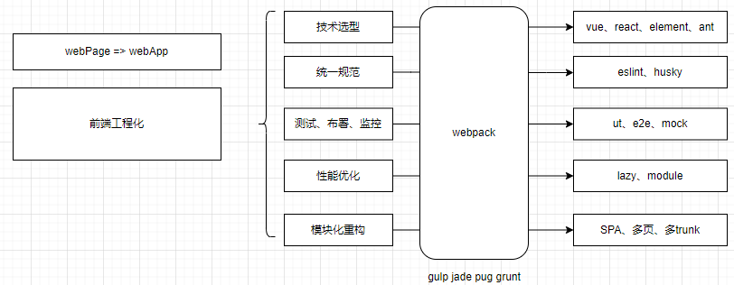
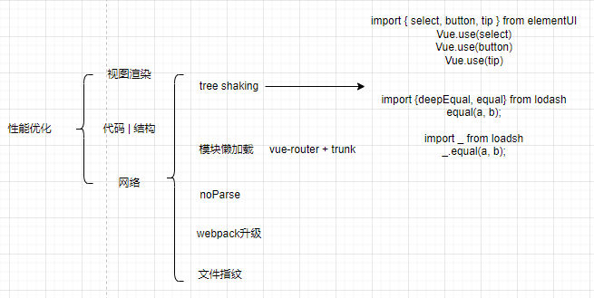

# 课程目标

- 了解前端工程化的内容以及包含模块
- 项目中webpack的配置层级
- 详细了解webpack中几大配置模块的功能以及配置项
- 能够根据场景判断如何对webpack进行配置从而实现预设目标

# 知识要点

## 前端工程化



## webpack配置

loader: module - solve

plugin: 额外功能的拓展

思考：

- 如何本地项目去做一些多端口服务的代理转发

  devServer.proxy 配置

  ```js
  proxy: {
     '/api':{ // 这个是你要替换的位置
     target: 'http://www.baidu.com',//这个是被替换的目标地址
     secure:true ,//接受对方是https的接口
     changeOrigin:true ,// 是否需要跨域
     pathRewrite: {'^/api' : ''}
  }
  ```

- 如何利用webpack去做依赖锁定

  插件**html-webpack-plugin**锁依赖固定板本 script

  ```js
  const HtmlWebpackPlugin = require('html-webpack-plugin')
  
  new HtmlWebpackPlugin({
  	filename: 'index.html',
  	template: 'index.html',
  	inject: true
  })
  ```

- 静态文件的移动&赋值

  插件**copy-webpack-plugin**

  ```js
  const CopyWebpackPlugin = require('copy-webpack-plugin')
  
  new CopyWebpackPlugin([
  	{
  		from: path.resolve(__dirname, '../static'),
          to: config.dev.assetsSubDirectory,
          ignore: ['.*']
  	}
  ])
  ```

## JS函数式编程

### 特点

1. Vue3 React16.8 全面化函数式的推动
2. 函数式编程可以使得代码单元相对更加独立 - tree shaking过程更顺畅，更方便做UT
3. 减少了对this的依赖，减轻了开发人员对于指向问题的困惑
4. js天生友好函数式：ramda、loadsh

### 概念

1. 一种抽象运算过程
2. 函数式的函数并非对于过程运算，函数的映射
3. 幂等 - 相同的输入始终得到相同的输出

### 纯函数

```js
let arr = [1, 2, 3, 4, 5];

arr.slice(0, 3); // [1, 2, 3]
arr.slice(0, 3); // [1, 2, 3]

arr.splice(0, 3); // [1, 2, 3]
arr.splice(0, 3); // [4, 5]
```

对于系统的改造

```js
// 不纯的
let min = 18;
let limit = age => age > min;

// 纯纯的
let limit = age => age > 18;
```

对于大型系统来说，对于外部状态的依赖，会大大地提高系统复杂性

* 问题：18被硬编码到了函数内部的，造成了功能拓展的局限

### 高阶函数HOC

定义：

1. 函数作为参数被传递到另一个函数中
2. 函数作为返回值被另外一个函数返回

```js
let fn = arg => {
	let outer = "outer";
	let innerFn = () => {
		console.log(outer);
		console.log(arg);
	}
	return innerFn;
}

let closure = fn(18);	// 闭包
```

### 函数柯里化

> 传递给函数一部分参数用于功能调用，让他返回一个函数去处理剩下的参数

```js
let add = (x, y) => x + y;

// 柯里化后
let add = x => (y => x + y);

let add2 = add(2);
let add200 = add(200);

add2(2); // 2 + 2 add(2)(2)
add200(50); // 200 + 50

// 回到上面的limit， 纯函数化
let limit = min => (age => age > min);
let limit18 = limit(18);
limit18(20); // true
```

> 是一种预加载方式

* 问题：包心菜代码的产生h(g(f(x)));

### 组合

> 通过更优雅的方式实现纯函数的解耦

```js
let compose = (f, g) => (x => f(g(x)));

let add1 = x => x + 1;
let mul5 = x => x * 5;

compose(mul5, add1)(2); // 15

// 面试题 - 数组长度未知的情况下，拿到最后一项
let first = arr => arr[0];
let reverse = arr => arr.reverse();

let last = compose(first, reverse);

last([1, 2, 3, 4, 5]); // 5
```

## webpack扩展开发

### loader

```js
// webpack 文件配置module.rules 数组元素
rules: [
    ...,    
	{
    	test: /.js$/,
    	loader: path.resolve(__dirname, 'loaders', 'loaderA')
	}
]

/*
* loaders/loaderA.js 文件
*/
module.exports = function(content, map, meta) {
    console.log('im loaderA');

    return content;
}
```


```js
// webpack 文件配置 module.rules 数组元素
rules: [
    ...,    
	{
    	test: /.js$/,
    	loader: path.resolve(__dirname, 'loaders', 'loaderA')
	},          
	{
    	test: /.js$/,
    	loader: path.resolve(__dirname, 'loaders', 'loaderB')
	},          
	{
    	test: /.js$/,
    	// loader: path.resolve(__dirname, 'loaders', 'loaderC')
        use: [
          {
            loader: 'loaderC',
            options: {
              name: 'loaderKing',
              size: 1000
            }
          }
        ]
	}
]

/*
* loaders/loaderA.js 文件
*/
// pitch: 顺序执行loader
module.exports.pitch = function () {
    console.log('pitch A');
}
// 同步方式
module.exports = function(content, map, meta) {
    console.log('im loaderA');
    // ……
    this.callback(null, content, map, meta);
}


/*
* loaders/loaderB.js 文件
*/
module.exports.pitch = function () {
    console.log('pitch B');
}
// 异步方式
module.exports = function(content, map, meta) {
    console.log('im loaderB');
    
    const callback = this.async();

    setTimeout(() => {
        callback(null, content);
    }, 1000);
}

/*
* loaders/loaderC.js 文件
*/
// 获取loader参数
const { getOptions } = require('loader-utils');
module.exports = function(content, map, meta) {
    const options = getOptions(this);

    console.log('im' + options.name);

    return content;
}
module.exports.pitch = function () {
    console.log('pitch C');
}
```

```js
// loader路径统一管理
module: {
    rules: [
        ...,        
      	{
        	test: /\.js$/,
        	// loader: path.resolve(__dirname, 'loaders', 'loaderC'),
        	use: [
          		{
            		loader: 'loaderC',
            		options: {
              			name: 'loaderKing',
              			size: 1000
            		}
          		}
        	]
      	},
    ]
}
resolveLoader: {
    modules: [
      'node_modules',
      path.resolve(__dirname, 'loaders')
    ]
}
```

### plugins

```js
class Plugin1 {
    apply(compiler) {
        console.log(compiler.hooks);
        // 不同的声明周期
        compiler.hooks.emit.tap('Plugin1', Compilation => {
            console.log('hooks.emit.tap');
        })
        compiler.hooks.afterEmit.tap('Plugin1', Compilation => {
            console.log('hooks.afterEmit.tap');
        })
        // 不同的函数
        // 处理异步函数
        compiler.hooks.emit.tap('Plugin1', (Compilation, cb) => {
            setTimeout(() => {
                console.log('hooks.emit ASYNC');
                cb();
            }, 1000)
        })
        // 处理promise
        compiler.hooks.emit.tap('Plugin1', Compilation => {
            return new Promise(resolve => {
                setTimeout(() => {
                    console.log('hooks.emit ASYNC');
                    resolve();
                }, 1000)
            })
        })
    }
}
```

[compiler钩子](https://webpack.docschina.org/api/compiler-hooks/)

# 补充知识点

## 检测node和npm版本方法

```js
'use strict'
const chalk = require('chalk')
const semver = require('semver')
const packageConfig = require('../package.json')
const shell = require('shelljs')

// 开辟子进程执行cmd指令，并且返回
function exec (cmd) {
  return require('child_process').execSync(cmd).toString().trim()
}


// node和npm版本需求
const versionRequirements = [
  {
    name: 'node',
    currentVersion: semver.clean(process.version),
    versionRequirement: packageConfig.engines.node
  }
]

if (shell.which('npm')) {
  versionRequirements.push({
    name: 'npm',
    currentVersion: exec('npm --version'),
    versionRequirement: packageConfig.engines.npm
  })
}

module.exports = function () {
  const warnings = []

  // 依次判断版本是否符合要求
  for (let i = 0; i < versionRequirements.length; i++) {
    const mod = versionRequirements[i]

    if (!semver.satisfies(mod.currentVersion, mod.versionRequirement)) {
      warnings.push(mod.name + ': ' +
        chalk.red(mod.currentVersion) + ' should be ' +
        chalk.green(mod.versionRequirement)
      )
    }
  }

  if (warnings.length) {
    console.log('')
    // 警告输出
    console.log(chalk.yellow('To use this template, you must update following to modules:'))
    console.log()

    for (let i = 0; i < warnings.length; i++) {
      const warning = warnings[i]
      console.log('  ' + warning)
    }

    console.log()
    process.exit(1)
  }
}
```

## 性能优化



